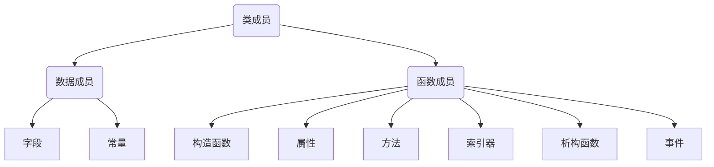
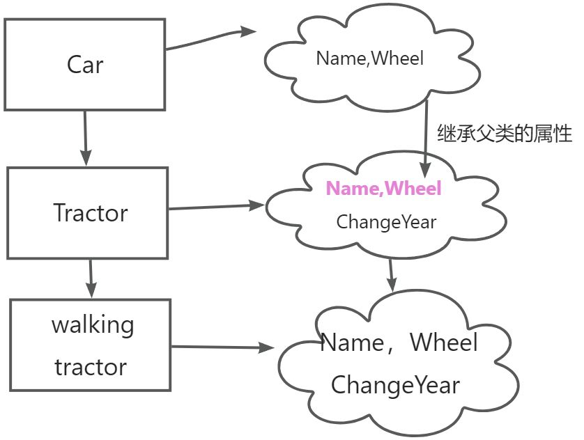
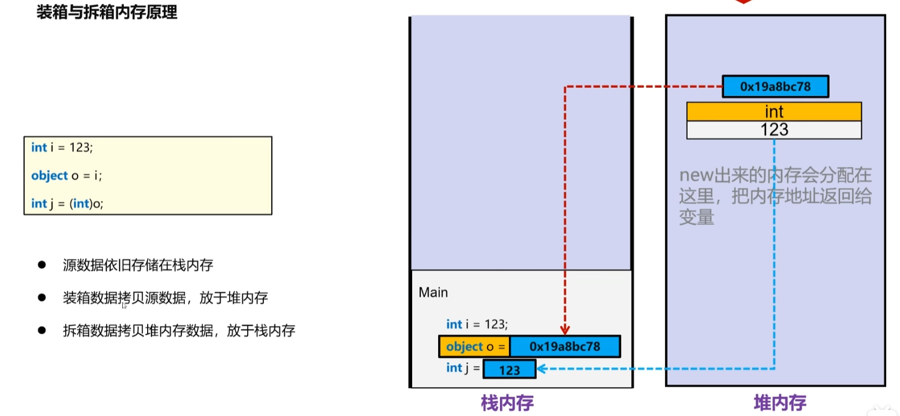

# 面向对象基本概述

面向过程：面向的是完成这件事的过程，强调的是完成这件事的动作。

如把大象关进冰箱：`1.`打开冰箱门`2.`把大象塞进去`3.`关闭冰箱门

面向对象思想：找个对象帮你做事（强调对象，意在写出通用代码，屏蔽差异）。

将冰箱作为对象，把大象关进冰箱（可以屏蔽所有人的差异）。

1. 冰箱门可以被打开
2. 大象可以塞进冰箱
3. 冰箱门可以被关闭

也可以把大象放在柜子里，柜子也可以被打开，塞东西，被关闭。

对象必须是看的见，摸得着的实物。我们在代码中描述对象，通过描述这个对象的属性和方法，如：

| 电风扇的属性 | 电风扇的方法 |
| ------------ | ------------ |
| 外形         | 转动         |
| 颜色         | 扇风         |

我们把这些具有相同属性和方法的对象进行封装，抽象出类这个概念。（类相当于模子，确定了对象应该具有的属性和方法。）对象就是类创建出来的。

1. 创建一个things类，功能是可以打开，装东西，关闭。
2. 创建任意对象都有这个功能。

## 类的基本语法

> 类的声明，即定义实例的模板(公有的属性和功能)。类包含数据成员和函数成员。



:bookmark:语法规范

```csharp
[public] class 类名//类名符合Pascal规范
{
    //类的成员
    构造函数：依次为对象的属性赋值（实例化类以后）;
    字段：存储数据；
    属性：保护字段，对字段的赋值和取值进行限定；
    方法：描述对象的行为；
    索引器;
    析构函数：主要是在程序结束时立即释放内存；
    事件
}
//写好一个类，我们需要使用关键字new创建这个类的对象。这个过程叫类的实例化
```

:red_circle:类的内部成员可以互相访问，要想被外界访问，需使用`public`修饰符。

## 实例成员与静态成员

默认情况下，每个类实例都会保存一份成员的副本，这些成员统称为实例成员；而有的成员被类的所有实例共享，统称为静态成员，在静态存储区域存储，且只有一份拷贝。

1. 在外部调用实例成员的时候，需要使用`对象名.实例成员`。
2. 在外部调用静态成员时，使用`类名.静态成员`。

```csharp
public static void Main(string[] args)
{
    D._num = 1;//静态成员直接调用
    D d = new D();
    d._age = 20;//实例成员：对象名.实例成员名
}
public  class D 
{
    public int _age;
    public static int _num;
}
```

## 字段

### 实例字段

字段可以有初始化值，若没有创建对象时编译器会自动给字段赋予初值（初值由类型决定,值类型为`0`，引用类型为`null`，布尔值为`false`）。

使用类类型步骤：声明类型，创建实例(类的实例化)，初始化对象。

:one:声明一个`Car`类。

```csharp
internal class Car
{
    public string _type;//类型
    public int _wheel=4;//轮子数量，字段初始化值
    public int _maxSpeed;//最高速度
    public void Action() 
    {
        //this指的是这个类的实例
        Console.WriteLine("汽车类型{0},有{1}个轮子,最高速度{2}Km/h",
                          this._type,this._wheel,_maxSpeed);
    }
}
```

:two:创建类的实例：如果字段没有初始化值，编译器会自动给字段赋予初值

```csharp
//Main函数入口
static void Main(string[] args)
{
    //2.创建类的实例
    Car car = new Car();
    //字段_wheel有用户定义的字段初始化值
}
```


:red_circle:`new`运算符作用：为指定类型的实例分配并初始化内存(换句话说类是不占内存的，而创建的对象是占内存的)。

:three:对象的初始化：依次给对象的字段赋值。

```c#
//Main函数入口
static void Main(string[] args)
{
    //2.创建类的实例
    Car car = new Car();
    //3 . 给字段赋值叫做对象的初始化
    car._type = "轿车";
    car._wheel = 4;
    car._maxSpeed = 200;
}
```

对于实例成员改变其值不会影响到其他实例成员的值。

```c#
Car c1 = new Car();
c1._type = "拖拉机";
Car car2 = new Car();
car2._type = "飞机";
Console.WriteLine(c1._type);//拖拉机
Console.WriteLine(car2._type);//飞机
//两个对象在内部中分别开辟了空间
```

### 静态字段

静态字段被类的所有实例共享，所有实例都访问内存的同一位置。

```c#
 public static void Main(string[] args)
 {
     //即使类为实例化，可直接访问静态字段
     Console.WriteLine(D._num);
 }
 public  class D 
 {
     public static int _num;
 }
```

:red_circle:与实例成员不同的是，只有在实例创建后才会产生实例成员，实例销毁后实例成员也不存在；对于静态成员即使不存在类实例，可以直接使用。

## 成员常量

成员常量：编译期进行初始化，声明时必须初始化，值不作更改。

```c#
 public static void Main(string[] args)
 {
     Console.WriteLine(MyClass.age);
     //编译时MyClass.age替换为20
 }
 public class MyClass 
 {
     //声明时必须初始化
     public const int age = 20;
 }
```

与静态字段类似，对于每个类实例都是可见的，直接使用`类名.成员名`调用；不同的是，常量在内存没有位置，在编译时变量名被替换为具体值。

## 静态函数与实例函数

静态成员在类型首次调用前加载，即类未实例化前就可以直接访问，而实例成员在实例化后才会分配初始化内存，因此在静态方法中不能访问实例成员。

在内存方面：静态成员在静态存储区域中只有一份拷贝（如静态字段模拟全局变量），而实例成员每个实例都有自己的拷贝。

注意一下两点：

1. 静态方法中，能直接访问静态成员，不能直接访问实例成员。
2. 实例方法中，既可以使用静态成员，也可以访问实例成员。

```csharp
public class Car 
{
    int _type;
    static int _wheel;
    //实例方法
    public void Show() 
    {
        Console.WriteLine($"type:{_type},wheel{_wheel}");
    }
    public static void Des() 
    {
        //静态方法无法访问实例成员
        //Console.WriteLine(_type);
    }
}
```

## readonly修饰符

> `readonly`修饰符可作用与字段，作用同`Const`，不同的是`readonly`修饰符作用的变量，其值在程序运行时决定(有内存位置)。

:one:`readonly`字段可以在声明时直接赋值，或者在构造函数中赋值，不能在其他地方对只读字段赋值。

:two:`readonly`静态字段声明时未初始化，初始化必须在静态构造函数中完成。

```c#
internal  static class Test
{
    //只读字段声明时可直接初始化
    public readonly static double Pi = 3.14;
    //未在声明时初始化，则字段需要在对应构造函数中初始化。
    public readonly static double radius;
}
```

## 属性

属性的作用是保护字段，对后备字段的赋值和取值进行限定。

属性的本质是两个方法，一个是`get`，一个是`set`。

1. 给属性赋值会执行`set`方法，将值`value`赋值给字段(value是set方法的隐式参数)；
2. 读取属性的值时会执行`get`方法，取字段的值。

在类中，为保护字段存储的数据，应该设置为私有访问修饰符`private`，通过中间商属性去读取字段。

| 属性中的方法 | 类型         |
| ------------ | ------------ |
| 有get也有set | 可读可写属性 |
| 仅get        | 只读属性     |
| 仅set        | 只写属性     |

```csharp
internal class Car
{
    private string _name;
    //private私有访问权限，仅本类中能访问
    public string Name 
    {
        //获取属性值执行get方法
        get { return _name; }
        //设置属性值执行set方法
        set { _name = value; }
    }
    private int _speed;
    //若给属性赋值的速度小于0，则返回默认值0
    public int Speed 
    {
        get { return _speed; }
        set 
        {
            if(value < 0) return; 
            _speed = value;
        }
    }
    ///品牌，自动属性，详见自动实现属性章节
    public string Brand { set; get; }
    public void Show() 
    {
        Console.WriteLine("品牌{3},车类型{0},速度{1}Km/h,",
                          this.Name,this.Speed,this.Brand);
    }
}
static void Main(string[] args)
{
    //创建一个对象后字段会有初始值
    Car car = new Car();
    //对象的初始化，给属性赋值会执行set方法
    //注意给字段赋值不会执行set方法
    car.Name = "卡车";
    car.Speed = -1;//执行set方法，返回字段默认值0
    car.Brand = "*";
    //Show法会打印对象的属性，此时执行get方法
    car.Show();
}
```

执行过程：

1. 实例化一个`car`对象，字段会有初始值(用户定义的默认值或者自动初始化的值)。
2. 对象的初始化，给属性赋值会执行`set`方法，给字段赋值。
3. 调用对象的`Show`方法，内部会访问对象的属性，此时调用属性的`get`方法，取得字段存储的值。

:red_circle:关于调试方面的问题：

调试时属性的值可能与预设想的不一致，是因为查看属性时调试器隐式调用了`get`方法，执行了其中的逻辑，所以在调试时应注意到此问题，尽可能用字段去调试。

```csharp
public int Speed 
{
    get 
    {
        _speed = -100;
        return _speed; 
    }
    set 
    {
        if(value < 0) { return; }
        _speed = value;
    }
}
```

将上述的`Speed`属性做这样的更改，且在`set`方法上打上断点，给属性赋值时（`car.Speed = -1`），按原逻辑返回的是默认值0;

我们在执行`set`方法即将结束时查看`Speed`属性，则会隐式调用`get`方法，将字段_`speed`值更改为`-100`.

### 只读属性

只读属性通常用一个`get`访问器实现 或者将`set`访问器私有化来实现，可在构造函数中初始化字段值。

:red_circle:私有化set访问器，外部无法访问，但类内部可以访问。

```csharp
internal class Car
{
    public Car(int wheel,string type) 
    {
        _wheel = wheel;
        _type = type;
    }

    private int _wheel;

    public int Wheel
    {
        //私有化set访问器
        get { return _wheel; }
        private set { _wheel = value; }
    }

    private string _type;

    public string Type
    {
        //仅有get访问器
        get { return _type; }
    }

    //set访问器私有化仍在在类内部进行访问
    private void Change() 
    {
        Wheel = 10;
    }

}
//Main函数中调用
 public static void Main(string[] args)
 {
     Car car = new Car(4, "轿车");
     car.Wheel = 5;//set访问器外部无法访问，不可赋值
 }
```

### 自动属性与只读自动属性

不需要显示声明一个私有变量，编译器会自动生成一个私有后备字段存储值（必须有`get`方法），适合不需要复杂逻辑处理的属性。

1. 自动属性访问器后可赋一个默认值，用以初始化字段。
2. 自动属性必须要有`get`访问器。
3. 只读自动属性也是用一个`get`访问器 或者将`set`访问器私有化来实现，可在声明时初始化或者在构造函数中初始化字段。

```csharp
internal class Tractor
{
    public string Name { get; } = "Tractor";//声明时直接初始化
    public string Color { private set; get; }//私有化访问器
    public int Wheel { get; }//默认值0

    public void Show() 
    {
        Console.WriteLine($"名称{Name},颜色{Color},轮子数量{Wheel}");
    }
}
//创建对象后，若未给属性赋值，则调用Show方法，读取字段默认值
```

外部调用:

```c#
public static void Main(string[] args)
{
    Tractor tractor = new Tractor();
    tractor.Color = "红";//set访问器外部无法访问，不可赋值
    tractor.Name = "Test";//无法在外部为自动只读属性赋值
    tractor.Show();
}
```

## 实例构造函数

帮助我们初始化对象，通过属性给给私有字段依次赋值。

1. 构造函数没有返回值，连void都没有
2. 构造函数的名称必须跟类名一致。
3. 实例化对象时会自动执行构造函数。

------

:red_circle:类当中会有一个默认的无参的构造函数，当你写了一个新的构造函数之后，不论是否有参数，原默认无参构造函数都会被代替。

```csharp
internal class Student
{
    public Student(string name,char gender,int age,int math,int english,int chinese) 
    {
        this.Name = name;
        this._gender = gender;//Gender属性只读
        this.Age = age;
        //只读自动属性:直接给属性赋值
        this.Math = math;
        this.English = english;
        this.Chinese = chinese;
    }
    /// <summary>
    /// 自动实现属性，编译器隐式声明变量存储值
    /// </summary>
    public string Name { get; set; }
    private char _gender;
    public char Gender
    {
        get { return _gender; }
    }
    private int _age;
    public int Age 
    {
        get { return _age; }
        set
        {
            if(value < 0) 
            {
                value = 0;
            }
            _age = value;
        }
    }
    public int Math { get; }
    public int English { get; }
    public int Chinese {  get; }
}
```

在Main函数中初始化对象。注意此时`new`关键字的作用：

1. 在堆中开辟一个空间
2. 在空间中创建一个对象，字段的初始化器执行。
3. 调用对象的构造函数进行初始化。

```csharp
internal class Program
{ 
    static void Main(string[] args)
    {
        //类实例化后通过构造函数进行对象的初始化
        Student st = new Student("占山",'女',13,120,100,100);
    }
}
```

写一个`Ticket`类，有一个距离属性（只读，在构造函数中赋值且不能为负数），有价格属性，只读，且根据距离计算价格。

```csharp
internal class Ticket
{
    public Ticket(double distance) 
    {
        if (distance < 0) 
        {
            distance = 0;
        }
        this.Distance = distance;
    }
    public double Distance { get; }//只读自动实现属性
    private double _price;
    public double Price //逻辑代码
    {
        get 
        {
            if (this.Distance <= 100)
            {
                //100公里原价
                _price = this.Distance * 1;
            }
            else if (this.Distance <= 200)
            {//95折
                _price = this.Distance * 0.95;
            }
            else if (this.Distance <= 300)
            {//9折
                _price = this.Distance * 0.9;
            }
            else 
            {
                _price = this.Distance*0.85;
            }
            return _price; 
        }
    }
}
```

## 静态构造函数

:red_circle:静态构造函数通常用来初始化类的静态字段；静态构造函数不得有修饰符，有`static`关键字，不得带参数。

```c#
static Ticket() 
{
	//在构造函数中初始化静态成员
    //在类实例化前或调用静态成员之前自动调用
}
```

C# 中成员的初始化顺序如下：

1. **静态字段初始化**：在类型首次被使用（如调用静态方法、访问静态成员或创建实例）时，静态字段的初始化器会优先执行。
2. **静态构造函数**：静态字段初始化完成后，静态构造函数（如果存在）会被调用。
3. **实例字段初始化**：在创建类的实例时，实例字段的初始化器会执行。
4. **实例构造函数**：实例字段初始化完成后，实例构造函数才会执行。

:bookmark:静态成员初始化只发生一次。

```c#
//测试代码
static Car() 
{
    Console.WriteLine("静态构造函数");
}
public Car() { Console.WriteLine("实例构造函数"); }
public string _name = Test("实例字段");
public static string _brand = Test("静态字段");

public static string Test(string value) 
{
    Console.WriteLine(value);
    return "";
}
```


## 对象初始化器

对象初始化时可以由`new`关键字后跟构造函数及参数列表，同时也可以放置一组初始化语句。

``` c#
public static void Main(string[] args)
{
    MyClass myClass = new MyClass()
    {
        //初始化语句
        _x = 10,
        _y = 20
    };
    //简化了手动为字段赋值，相当于
    myClass._x = 10;
    myClass._y =20;
}
public class MyClass
{
    public int _x;
    public int _y;
}
```

:red_circle:对象初始化器实质上是简化了手动给字段或属性赋值。

:one:字段或属性须是外部可访问的；

:two:在构造函数之后执行，可能会重置某些数据成员。

## this关键字

:one:this代表当前类的对象，主要用来**区分属性与形参或方法中的局部变量。**

:two:在类当中显式调用本类的构造函数。先执行调用的构造函数，再执行本身的构造函数。

:three:用于静态类中的拓展方法，像实例一样去调用方法，也可以用类名.方法去调用。

:four:声明索引器。

```csharp
internal class Ticket
{
    public Ticket(int distance)
    {
        //对参数进行判断，将值赋给字段_distance
        if(distance < 0) 
        {
            this._distance = 0;
        }
        else 
        {
            this._distance = distance;
        }
    }
    //this()中的传递的参数要与其声明的形参一致，意及交给其初始化对象。
    public Ticket(int distance , int hour):this(distance) 
    { 
        this.Hour = hour;
    }
    private int _distance;
    public int distance
    {
        //只读
        get { return _distance; }
    }
    private double _price;
    public double Price 
    {
        get 
        { 
            if(this.distance <= 100) 
            {
                _price = this.distance * 1;
            }
            else if(this.distance <= 200) 
            {
                _price = this.distance * 0.95;
            }
            else if(this.distance <= 300) 
            {
                _price = this.distance * 0.9;
            }
            else 
            {
                _price = this._distance * 0.85;
            }
            return _price; 
        }
    }
    public int Hour { get; }
}
```

拓展方法：

```csharp
//拓展方法必须存在静态类中
public static class ExtenSion
{
    public static void Print(this string name) 
    {
        Console.WriteLine("用户{0}定义的拓展方法",name);
    }
}
//Main函数中调用
static void Main(string[] args)
{
    string name = "lzb";
    ExtenSion.Print("张三");//类名.方法调用
    name.Print();//变量.方法调用
}
```

## 索引器

> 索引器类似于属性，有`get`和`set`访问器，可访问多个数据成员。
>
> 索引器没有名称，用`this`去指代当前名称。
>

```c#
public struct Color
{
    public static readonly int _red = 1;
    public static readonly int _green = 2;
    public static readonly int _blue = 3;
}

internal class IndexDemo
{
    private string _color;
    //索引器没有名称，用this指代
    //[]中可是是任何类型
    public string this[int index]
    {
        get
        {
            switch (index)
            {
                case 1:
                    _color = "red";
                    break;
                case 2:
                    _color = "green";
                    break;
                case 3:
                    _color = "blue";
                    break;
            }
            return _color;
        }
    }
}
//主函数中调用
static void Main(string[] args)
{
    IndexDemo demo = new IndexDemo();
    Console.WriteLine(demo[Color._red]);
}
```

## 析构函数

程序结束的时候，析构函数才会被执行，意在帮助我们释放资源。

如果希望程序立即释放内存资源，就使用析构函数，不需要则通过GC(Garbage Collection-垃圾回收装置)自动释放资源

```csharp
~类名()
{
    //代码区域
}
//示例
 ~Student() 
 {
     Console.WriteLine("程序结束才会执行，无需在Main函数中调用");
 }
```

## 命名空间

命名空间用于解决类的重名问题，相当于`类的文件夹`,类是属于命名空间，如果当前项目没有这个类的命名空间，我们需要导入类的命名空间。

导入命名空间快捷键：`ALT+Enter`，然后选择需要的命名空间。

在一个项目中引用另一个项目的类：

1. 添加引用
2. 引用命名空间

## 部分类

适用于多人开发时，同时存在同一个类，在类前加`partial`关键字，则代表一个完整的类被分给为几块，各个部分可以访问相关成员，本质就是一个整体。


```csharp
public abstract partial class Animal
{

    public abstract void Bark();
}
//部分类二
public abstract partial class Animal
{
    //代码体
}
```

# 面向对象之继承

>  把重复的成员单独封装到一个类中来作为父类，子类便可继承公有的父类成员。
>
> 没有继承父类的构造函数，但是子类会默认调用父类无参的构造函数，目 的是初始化父类成员，让创建的子类对象包含父类的成员。
>
> 继承的特性：
>
> 1. 单根性：只能由一个父类
>2. 传递性：最上层的父类的成员会传递到最下层的子类。



## 认识继承

:one:定义父类`Car`

```csharp
public class Car 
{
    private string _name;
    public string Name
    {
        set {  _name = value; }
        get { return _name; }
    }
    private int _wheel;
    public int Wheel 
    {
        set { _wheel = value; }
        get { return _wheel; }
    }
    public void Show() 
    {
        Console.WriteLine("车类型{0},轮子数量{1}",this.Name,this.Wheel);
    }
}
```

:two:定义子类`Tractor`

```csharp
public class Tractor:Car 
{
    public Tractor(string name,int wheel) 
    {
        this.Name = name;
        this.Wheel = wheel;
    }
}
```

:three:`Main`函数中调用

```csharp
static void Main(string[] args)
{
    Tractor tc = new Tractor("tractor", 4);
    tc.Show();
    //先调用父类的构造函数，给父类成员赋值
    //再执行自己的构造函数
}
```

:four:继承的传递性：C继承B,B继承A，C具有B和A的公有属性和方法；先执行最上层的父类构造函数，依次向下执行构造函数，最后才执行自己的构造函数。

```csharp
public class Car
{
    public string Name { get; set; }
    public int Wheel {  get; set; }
}

public class Tractor : Car
{
    public int ChangeYear { get; set; }
}
public class WalkingTractor:Tractor
{
    //声明构造函数，初始化对象
    public WalkingTractor(string name,int wheel,int changeYear,int speed ) 
    { 
        this.Name = name;
        this.Wheel = wheel;
        this.ChangeYear = changeYear;
        this.Speed = speed;
    }
    public int Speed {  get; set; }
}
```

:bookmark:不能在子类构造函数中为父类的自动只读属性赋值，因为父类已经实现了逻辑，不希望子类破坏，除非隐藏或重写。

了解：`object`类是所有类的基类，如果一个类没有继承其他类，默认继承`object`类。

## base关键字

如果在父类中重新写了一个有参数的构造函数后，无参数的构造函数被顶替，子类调用不到会报错。

解决办法：

1. 在父类重写一个无参数的构造函数
2. 在子类中显式调用父类的构造函数，使用关键字`:base`。

```csharp
public class Car
{
    public Car(string name,int wheel) 
    {
        this.Name = name;
        this.Wheel = wheel;
    }
    public string Name { get; set; }
    public int Wheel {  get; set; }
}

public class Tractor : Car
{
    //显式调用父类的构造函数
    public Tractor(string name,int wheel,int changeYear) 
        : base(name, wheel) 
    {
        this.ChangeYear = changeYear;
    }
    public int ChangeYear { get; set; }
}
```

## 继承成员初始化顺序

:bookmark:以下为测试代码：

```c#
internal class Car
{
    public Car() 
    {
        Console.WriteLine("父类实例构造函数初始化...");
    }

    static Car() 
    {
        Console.WriteLine("父类静态构造函数初始化...");
    }
    private static int _id = Des("父类静态字段");
    private int _wheel = Des("父类实例字段");
    public static int Des(string value) 
    {
        Console.WriteLine($"{value}在初始化...");
        return 0;
    }
}

internal class Tractor:Car
{
    public Tractor()
    {
        Console.WriteLine("子类实例构造函数...");
    }
    static Tractor()
    {
        Console.WriteLine("子类静态构造函数...");
    }
    private static int _id = Des("子类静态字段");
    private int _wheel = Des("子类实例字段");
    public int ChangeYear {  get; set; }
}
```

输出结果：

```c#
父类静态字段在初始化...
父类静态构造函数初始化...
子类静态字段在初始化...
子类静态构造函数...
子类实例字段在初始化...
父类实例字段在初始化...
父类实例构造函数初始化...
子类实例构造函数...
```

## new关键字

new关键字的作用：

1. 创建对象，初始化并分配内存
2. 隐藏从父类那里继承的同名成员（即公有成员）（不写new同样会隐藏父类成员，不过编译器会进行提示），隐藏的后果是调用不到父类的成员。

   :one:数据成员：相同类型和名称

   :two:函数成员：签名相同(与返回值无关，函数名和参数列表相同)

```csharp
public class Car
{
    public Car(string name,int wheel) 
    {
        this._name = "CAR";
        this.Wheel = wheel;
    }
    private string _name;
    public string Name 
    {
        get { return _name; } 
    }
    public int Wheel {  get; set; }

    public void Show() 
    {
        Console.WriteLine("车名：{0}，轮子{1}",this.Name,this.Wheel);
    }
}

public class Tractor : Car
{
    public Tractor(string name,int wheel,int changeYear) 
        : base(name, wheel) 
    {
        this.ChangeYear = changeYear;
    }
    //隐藏父类Name属性
    private string _name;
    public  new string Name 
    { 
        get {return _name;} 
        set { _name = value;}
    }
    public int ChangeYear { get; set; }

    public new void Show() 
    {
        Console.WriteLine("车名：{0}，轮子{1},生产日期{2}", this.Name, 
                          this.Wheel,this.ChangeYear);
    }
}
```

在Main函数中调用：

```csharp
static void Main(string[] args)
{
    Tractor tr = new Tractor("拖拉机",4,2015);
    tr.Show();
}
```

在上述例子中子类隐藏了父类的`Name`属性和`Show`方法，执行过程如下：

1. 先执行父类的构造函数，初始化父类的成员，确保子类方法可以正确访问父类成员；
2. 再执行子类的构造函数，初始化子类中成员；
3. 执行方法时调用的是子类的`Show`方法，因父类的`Show`方法被隐藏。
4. 上述例子中子类构造函数并没有初始化Name属性，所以子类中的`Name`属性值为`null`。

子类中的对象有两个`Name`属性，一个是父类的`Name`,一个是自己的`Name`，方法也同样如此。

可使用`base`访问父类属性，`base.成员名`代表当前对象调用继承的父类公有成员(私有的子类访问不到)。

```csharp
public new void Show() 
{
    Console.WriteLine("车名：{0}，轮子{1},生产日期{2}", 
                      base.Name, this.Wheel,this.ChangeYear);
}
```

## 里氏转换

1. 子类可以转换为父类,此时的对象访问基类成员，除非实现了多态：

1. 子类方法override重写父类虚方法，调用子类的方法
2. 抽象，接口父类调用子类实现的方法。

1. 如果一个地方需要父类作为参数，我们可以给一个子类代替，如`string.Join(string sep,params object[] values)`
2. 如果父类中装的是子类对象，可以将父类对象强转为子类对象。

子类赋值给父类，转换为父类。父类可强转为子类。

定义一个`Car`类，`Tractor`类与`ThreeWheel`继承于`Car`类。

```csharp
public class Car
{
    public Car(int wheel, string brand)
    {
        this.Wheel = wheel;
        this.Brand = brand;
    }
    public int Wheel { get; } = 4;//默认值4
    public string Brand { get; }
}
//增加Weight属性
public class Tractor : Car
{
    public Tractor(int wheel, string brand,double weight):base(wheel,brand)
    {
        this.Weight = weight;
    }
    public double Weight { get; }
}

//与父类属性一致
public class ThreeWheel : Car
{
    public ThreeWheel(int wheel, string brand) : base(wheel, brand)
    {
    }
}
```

在Main函数中调用

```csharp
static void Main(string[] args)
{
    //把子类对象装到父类对象中
    Car trc = new Tractor(2, "拖拉机", 1000);
    //Console.WriteLine(trc.Weight);可以查看到，但无法访问
    Tractor tractor = (Tractor)trc;
    Console.WriteLine(tractor.Weight);//1000
    //属性并未丢失，只是父类对象访问不到，只能访问二者公有的成员
}
```

### 类型转换判断

#### is

如果转换成功，返回一个`true`，否则返回一个`false`。

```csharp
static void Main(string[] args)
{
    Car trc = new Tractor(2, "拖拉机", 1000);
    if (trc is Tractor)
    {
        Console.WriteLine("trc 能转成Tractor类型");
    }
    else 
    {
        Console.WriteLine("无法转换");
    }
}
```

#### as

能够转换则返回对应的对象，否则返回`Null`。

```csharp
static void Main(string[] args)
{
    Car trc = new Tractor(2, "拖拉机", 1000);
    Tractor tractor = trc as Tractor;//可以转换
    ThreeWheel thr = trc as ThreeWheel;//null
}
```

#### 练习

把子类放到父类数组中，打印子类中的方法。

```csharp
//Person类中有打招呼方法，子类各自隐藏父类打招呼方法
class Person
{
    public void SayHello() 
    {
        Console.WriteLine("大家好");
    }
}
class Chinese:Person
{
    public new void SayHello()
    {
        Console.WriteLine("安好");
    }
}
class English:Person
{
    public new void SayHello() 
    {
        Console.WriteLine("hi");
    }
}
```

在`Main`函数中执行逻辑：

```csharp
static void Main(string[] args)
{
    Person[] pers = new Person[6];
    //创建Person类型数组,值默认未null
    //即未开辟空间，不会初始化，不会执行构造函数
    Random random = new Random();//创建随机数对象
    for (int i = 0;i<pers.Length;i++)
    {
        int num = random.Next(1,4);//返回随机数1~3
        //根据随机数给数组赋值
        switch(num)
        {
            case 1:
                pers[i] = new Person();
                break;
            case 2:
                pers[i] = new Chinese();
                break;
            case 3:
                pers[i] = new English();
                break;
        }
    }
    //执行打招呼方法
    foreach (Person p in pers)
    {
        //转换类型，执行各自的打招呼方法
        if (p is Chinese)
        {
            ((Chinese)p).SayHello();
        }
        else if (p is English)
        { ((English)p).SayHello(); }
        else
        {
            //父类对象
            p.SayHello();
        }
    }
}
```

## 访问修饰符

能够修饰类的访问修饰符只有`public` 和 `internal`

在同一个项目当中，`public`和`internal`权限一样。

| 关键字             | 作用                                                       |
| ------------------ | ---------------------------------------------------------- |
| public             | 公开的                                                     |
| internal           | 只能在当前项目中访问                                       |
| protected          | 受保护的，当前类内部以及子类内部可以访问，出了类访问不到。 |
| protected internal | protected + internal                                       |
| private            | 私有的，仅当前类中能访问                                   |

可访问性不一致：

子类的访问权限不能高于父类访问权限，因为会暴露父类成员。

## 密封类

在类前加入关键字`sealed`,表示一个类是密封类，不能被继承，但能够继承它类。

```csharp
 public  sealed  class Animal
 {

     //public abstract void Bark();
 }

 public class Dog : Animal { }//无法从密封类中派生
```

## 静态类

**静态类**中只允许静态成员，不允许出现实例成员。且对于静态类，不允许实例化，也不允许继承。

1. 如果一个类作为工具类使用时，可以考虑写成静态类。
2. 静态类在整个项目中资源共享。
3. 静态成员会在首次调用前加载。
4. 之后自动执行静态构造函数。

只有在程序全部结束后，静态类才会释放资源。

```csharp
static Test()//必须无参数
{
    //相关代码
}
```

静态类可以使用this关键字拓展方法，像`对象.方法`一样去调用，见`this`章节。

```csharp
internal class Program
{
    static void Main(string[] args)
    {
        string str = "this的拓展方法";
        str.Print();
    }
} 
//this的拓展方法
internal static class Person
{
    public static void Print(this string name) 
    {
        Console.WriteLine(name);
    }
}  
```

# 面向对象之多态

通过父类调用子类对应方法的实现。实现多态方式：虚方法，抽象类，接口。

子类的实例是由基类和子类成员共同组成，若将子类实例转换为基类实例，这样只能访问基类中的成员，除了`override`方法外。

## 虚方法

:one:虚方法可提供默认实现，子类可选择是否重写。

:two:将父类的方法标记为虚方法，使用关键字`virtual`，这个函数可以被子类重写，使用`override`关键字。

:three:要求虚方法和重写方法有:red_circle:相同的签名(参数与返回类型)。

```csharp
public class Car
{
    public Car(int id,string name) 
    {
        if (id < 0) { id = 0 - id; }
        this._id = id;
        this._name = name;
    }
    private int _id;
    public int Id { get { return _id; } }
    private string _name;
    public string Name { get { return _name; } }
    public virtual void Show() 
    {
        Console.WriteLine("ID:"+this.Id);//打印ID
    }
}
public class Tractor : Car 
{
    public Tractor(int id,string name):base(id,name)  { }
    public override void Show()
    {
        Console.WriteLine("name:"+this.Name);
    }
}
```

子类对象调用`override`方法时，执行的是子类方法中的实现。

若将派生对象转换为基类对象，调用虚方法时，会检查子类的方法是否重新实现，若实现则调用派生类的方法，若派生类未重写则调用默认实现。

:red_circle:在多层覆盖中，调用对象实际类型中`override`实现的最高版本。

```csharp
static void Main(string[] args)
{
    Car car = new Tractor(20, "拖拉机");
    car.Show();//name:拖拉机，不会打印父类的方法
}
```

若在初始化子对象执行父类构造函数时遇到虚方法也一样，也会去检查子类的方法是否重新实现，了解即可,:red_circle:禁止该行为。

```csharp
public Car(int id,string name) 
{
    if (id < 0) { id = 0 - id; }
    this._id = id;
    this._name = name;
    this.Show();//name:拖拉机
}
```

重写基类`object`的`ToString`方法。

```csharp
public class OverString 
{
    //object的ToString方法本质上是一个虚方法
    public override string ToString()
    {
        return "Hello";
    }
}
```

:bookmark_tabs:属性重写(了解)

1. 基类中属性有`set`和`get`访问器，普通属性重写时覆盖基类中的一个访问器即可，

2. 自动属性必须覆盖基类中所有的访问器(若不重写`set`访问器，给属性赋值时调用的还是父类的`set`访问器，自己本身的属性永远是系统自动初始化值，这种属性无意义)

```c#
internal abstract class Animal
{
	private int _age;
	public virtual int Age
	{
		get { return _age; }
		set { _age = value; }
	}
	public virtual string Name { get; set; }
}

internal class Dog : Animal 
{
	private string _name;
	public override string Name
	{
		//可实现基类的一个访问器
		get { return _name; }
	}
    //必须实现基类的所有访问器
	public override int Age { set; get; }
}
```


:bookmark_tabs:虚方法中的多层覆盖

> 在一个继承层次结构中，多个派生类依次覆盖基类的方法

```csharp
public class Animal
{
    public virtual void Bark() 
    {
        Console.WriteLine("animal is barking");
    }
}

public class Dog:Animal
{
    public override void Bark()
    {
        Console.WriteLine("dog is bark");
    }
}

public class Labrador : Dog
{
    public override void Bark()
    {
        Console.WriteLine("Labrador is bark");
    }
}
```

1. 基类`Animal`定义一个`bark`的基方法
2. 第一层覆盖：`Dog`类重写了父类`Bark`方法
3. 第二层覆盖：Labrador类重写父类`Dog`中`Bark`方法。

```csharp
static void Main(string[] args)
{
    Animal animal = new Animal();
    Animal dog = new Dog();
    Animal labrador = new Labrador();

    animal.Bark();//animal is bark
    dog.Bark();//animal is bark
    labrador.Bark();// labrador is bark
}
```

`Labrador`类中的方法隐藏父类方法:

```c#
public class Labrador : Dog
{
    new public void Bark()
    {
        Console.WriteLine("Labrador is bark");
    }
}

//调用
public static void Main(string[] args)
{
    Animal animal = new Labrador();
    //输出的是override最高版本
    animal.Bark();//dog is bark
}
```

若`Labrador`类中的方法没有继续重写:

```c#
public class Labrador : Dog
{
    //相当于继承了Dog类中的override方法，该方法顶替掉了Animal中的虚方法
}

```


## 抽象类

当父类中的方法不知道如何实现时，可以将父类写成抽象类，将方法写成抽象方法。由子类实现，所以抽象类不能是密封类

```csharp
//抽象类与接口无法实例化
public abstract class Animal
{
    public string Name { get; set; }
    public abstract void Bark();//抽象方法不允许有方法体
}

public class Dog : Animal 
{
    //必须重写
    public override void Bark()
    {
        Console.WriteLine("呜~");
    }
}
```

抽象类不允许实例化，但可以将子类的对象转成父类对象。

```csharp
internal class Program
{
    static void Main(string[] args)
    {
        Animal a = new Dog();
        a.Bark();//执行的是子类重写的方法
    }
}
```

注意一下几点

1. 抽象类不能被实例化。
2. 抽象成员必须标记为`abstract`,并且不能有任何实现，且抽象成员必须在抽象类中
3. 子类继承抽象类，必须把所有的抽象成员重写(包括属性的访问器)，除非子类也是一个抽象类。
4. 在抽象类中不能为抽象只读属性赋值，因为此时属性逻辑尚未实现，不同的子类可能有不同的要求。
5. 抽象类中可以包含非抽象的实例成员与静态成员，如字段，构造函数等。
7. 抽象方法和派生类`override`方法返回类型和方法签名要求一致。

```csharp
//抽象类与接口无法实例化
public abstract class Animal
{
    public Animal(string name,string color) 
    { 
        this.Name = name;
        this.Color = color;
    }
    public string Name {  get;  }
    public string Color {  get; }
    public abstract void Bark();//抽象方法不允许有方法体
}
//抽象类继承抽象类
public abstract class SmallAnimal:Animal 
{
    public SmallAnimal(string name, string color) : base(name, color) { }
    public abstract int Age { get; }//抽象属性也不允许有方法体
}
public class Dog :SmallAnimal
{
    public Dog(string name,string color,int age):base(name,color) 
    {
        //子类的构造函数中写入逻辑
        if (age < 0) { age = -age; }
        this.Age = age;
    }

    //实现抽象属性
    public override int Age { get; }

    //必须重写
    public override void Bark()
    {
        Console.WriteLine("呜~");
        Console.WriteLine(this.Name);
        Console.WriteLine(this.Color);
    }
}
```

使用多态求矩形的面积和周长以及圆形的面积和周长。

定义一个`Shape`抽象类，有`Area`和`Perimeter抽象`方法。

```csharp
public abstract class Shape
{
    //面积抽象
    public abstract double Area();
    //周长抽象
    public abstract double Perimeter();
}
```

圆形子类去实现抽象方法：

```csharp
public class Circle:Shape
{
    public Circle(double r) { this.R = r; }
    public double R { get; }
    public override double Area()
    {
        double area = Math.PI * R * R;//圆面积
        return area;
    }
    public override double Perimeter()
    {
        double perimeter = 2 * Math.PI * R;
        return perimeter;
    }
}
```

矩形子类去实现抽象方法：

```csharp
public class Rectangel : Shape
{
    public Rectangel(double width,double height) 
    { 
        width = width< 0 ? 0 : width;
        height = height< 0 ? 0 : height;
        this.Width = width;
        this.Height = height;
    }
    public double Width { get; }//宽
    public double Height { get; }//高
    public override double Area()
    {
        double area = this.Width * this.Height;
        return area;
    }

    public override double Perimeter()
    {
        double perimeter = 2 * (this.Width + this.Height);
        return perimeter;
    }
}
```

:bookmark_tabs:抽象类中的多层覆盖

```csharp
public abstract class Animal
{
    public abstract void Bark();
}

public class Dog:Animal
{
    public override void Bark()
    {
        Console.WriteLine("dog is bark");
    }
}

public class Labrador : Dog
{
    public override void Bark()
    {
        Console.WriteLine("Labrador is bark");
    }
}
```

对于抽象类中的多层覆盖，将派生对象转换为父类类型变量，也会找到实际对象方法中`override`的实现的最高版本。

```csharp
static void Main(string[] args)
{
    Animal dog = new Dog();
    Animal labrador = new Labrador();
    dog.Bark();//dog is bark
    labrador.Bark();// labrador is bark
}
```

## 接口

接口就是一种规范，规定子类必须实现的方法。

```csharp
[public] interface I...able
{
    //只有函数成员
    //方法，属性，索引器
}
```

1. 接口中的成员不允许添加访问修饰符，默认就是public；
2. 不能有字段和构造函数，只能有方法且不允许有方法体，自动属性（没有方法体）可存在;
3. 接口不能被实例化
4. 接口与接口之间可以继承，并且可以多继承
5. 接口不能继承于类，类能继承接口
6. 接口的子类必须实现该接口所有的方法，包括属性的访问器。
7. 一个类既继承与接口，又继承于类，必须先继承于类（语法）

```c#
internal interface IFireable
{
    double Time { get; set; }
    void Fire();
    void MultiFire();
}

internal class Tank : IFireable
{
    private double _time;
    //错误，必须实现属性所有访问器
    //public double Time { get { return _time; } }

    public void Fire()
    {
        Console.WriteLine("开火");
    }

    public void MultiFire()
    {
        Console.WriteLine("连续开火");
    }
}
```


### 显式实现接口

解决接口与类中方法重名问题

```csharp
static void Main(string[] args)
{
    IFlyable flyable = new Bird();
    Bird bird = new Bird();
    flyable.Fly();//调用自己的fly,被子类实现
    bird.Fly();// bird is fly
}
public interface IFlyable 
{
    void Fly();
}
public class Bird:IFlyable
{
    public void Fly() 
    {
        Console.WriteLine("Bird is fly");
    }
    //不允许加修饰符，默认priavte
    void IFlyable.Fly() 
    {
        Console.WriteLine(" 接口中的方法");
    }
}
```

# string

## 字符串的不可变性

当给字符串重新赋值时，老值并没有消失，而是在堆中开辟一块空间存储新值。

```csharp
string s1 = "s1";
//s1,s2此时指向同一块内存空间
string s2 = s1;
//堆中重新开辟空间存储"ss1",s1中原引用地址被替换掉，新地址指向"ss1"
s1 = "ss1";
Console.WriteLine(s1);//ss1
Console.WriteLine(s2);//s1
```

## 字符串的数组特性

可以将`string`类型看作是一个**只读数组**，根据索引访问字符串某个元素。

```csharp
string s = "adcd";
Console.WriteLine(s[1]);//d
```

改变字符串其中某个字符：

1. 转换为char类型数组；
2. 将数组转化为字符串。

```csharp
string s = "adcd";
char[] chas = s.ToCharArray();//返回char类型数组
//第一个元素变为A
chas[0] = 'A';
s = new string(chas);//将string类实例化，将字符数组转化为字符串
Console.WriteLine(s);//Adcd
```

## StringBuilder类

由于字符串的不可变性，重新赋值需要不段开辟新空间，对于某些场合不适合

```csharp
static void Main(string[] args)
{
    Stopwatch sw = new Stopwatch();//创建一个实例
    sw.Start();//开始计时
    string s = null;
    for (int i = 0; i < 100000; i++) 
    {
        s += i;
    }
    sw.Stop();//结束计时
    Console.WriteLine(sw.Elapsed);//测量运行的总时间

}
//约10s
```

使用`StringBuilder`类

```csharp
static void Main(string[] args)
{
    Stopwatch sw =new Stopwatch();
    sw.Start();//开始计时
    StringBuilder sb = new StringBuilder();//实例化一个sb对象
    for (int i = 0; i <100000; i++) 
    {
        sb.Append(i);//追加
    }
    sw.Stop();//结束计时
    Console.WriteLine(sw.Elapsed);
}
//约0.01s
```

## 字符串方法与属性

### $_文本内使用变量

```c#
 int month = 3;
 int date = 29;
 Console.WriteLine($"0{month}月{date}日");//03月29日
```

`{}`内也可以直接写值

```c#
string name = $"{"this day is cold"}";
```

### Length属性

获取字符串的长度

```csharp
Console.WriteLine("请输入你心中所想的名字");
string s = Console.ReadLine();
Console.WriteLine(s.Length);
```

### ToUpper/ToLower

用来返回字符串的大写/小写副本。

两个学员输入喜欢的课程，相同则输出相同，不同则输出不同。

```csharp
static void Main(string[] args)
{
    Console.WriteLine("请输入喜欢的课程");
    string classOne = Console.ReadLine();
    //转换大写
    classOne = classOne.ToUpper();
    Console.WriteLine("请下一个学员");
    string classTwo = Console.ReadLine();
    //转换大写，返回一个字符串
    classTwo = classTwo.ToUpper();
    if (classOne == classTwo)
    {
        Console.WriteLine("相同");
    }
    else 
    {
        Console.WriteLine("不同");
    }
}
```

使用`Equals(与**相等)`方法，比较两个字符串是否相同，返回`bool`值。参数1待比较字符串，参数2枚举类型`StringComParison`，如何进行比较。

```csharp
static void Main(string[] args)
{
    Console.WriteLine("请输入喜欢的课程");
    string classOne = Console.ReadLine();
    Console.WriteLine("请下一个学员");
    string classTwo = Console.ReadLine();
    if (classOne.Equals(classTwo, StringComparison.InvariantCultureIgnoreCase)
        //忽略大小写进行比较
    {
        Console.WriteLine("相同");
    }
    else 
    {
        Console.WriteLine("不同");
    }
}
```

### Split()_分隔字符串

基于字符数组或字符串数组，将原字符串进行分隔，返回一个string数组。

重载:one:`str.Split(params char[] separator)`,

参数为分隔数组，`char[]`类型

重载:two:`str.Split(char[]/string[] separator,StringSplitOptions options)`

参数1分隔符数组，有字串或字符类型，参数2是`StringSplitOptions`枚举类型，可用来判断是否需要空字符串。

```csharp
//分隔原理：依次将分隔符替换为|，若|在最前端或最后端，将""添加到最前端或最后端
//若存在||，中间有""
string str = "a cs adb";
// ||cs||db
//即"",",cs"db
 string[] s = str.Split(new char[] { 'a',' '});
```

从字符串2008-08-08分隔出年月日。

```csharp
string s = "2008-08-08";
string[] strArr = s.Split(new string[] { "-" }, StringSplitOptions.RemoveEmptyEntries);
Console.WriteLine("{0}年{1}月{2}日", strArr[0], strArr[1], strArr[2]);
//2008年08月08日
```

### Replace()_替换

用新值替换旧值

```csharp
static void Main(string[] args)
{
    //Replace(string oldValue,string newValue)
    string str = "国家关键人物老宁";
    if (str.Contains("老宁"))//判断是否包含该字符串，返回bool
    {
        str = str.Replace("老宁", "**");
    }
    Console.WriteLine(str);
}
```

### SubString()_截取字符串

1. `SubString(int startIndex)`，从指定索引开始截取（包含指定索引），直到最后
2. `SubString(int startIndex，int length)`,从指定索引开始截取指定长度，且长度不能超出索引。

```csharp
string str = "艳阳天那么风光好";
str = str.Substring(3);//从指定索引开始截取，直到最后
Console.WriteLine(str);//那么风光好

//重载，参数2截取长度
string str = "艳阳天那么风光好";
str = str.Substring(3,2);
Console.WriteLine(str);//那么
```

### StartWith()_判断是否以指定字符串开头

返回Bool值，对应的方法是`EndWith()`.

```csharp
string str = "艳阳天那么风光好";
if (str.StartsWith("艳阳") )
{
    Console.WriteLine("是的");
}
```

### IndexOf()_查找字符/字符串的位置

返回int类型，找不到返回`-1`。

1. `IndexOf(string value)`,`value`要查找的字符或字符串，从前往后查找
2. `IndexOf(string value,int startIndex)`,`stringValue`要查找的字符，`startIndex`指定位置，从前往后查找

`LastIndexOf`同理，不过是从后往前查找。

```csharp
 string str = "天,今天天气真好";
 int num = str.IndexOf('天');//传入字符
 int num2 = str.IndexOf("天", 5);
 Console.WriteLine(num);//0
 Console.WriteLine(num2);//-1
```

截取文件名练习

```csharp
string path = @"C:\Users\Administrator\Desktop\学习资源";//@取消转义
int index = path.LastIndexOf('\\');//注意此处是\\。获取\的索引
string name = path.Substring(index + 1);
Console.WriteLine(name);//学习资源
```

### Trim()_去除空格

返回字符串，Trim()去除字符串前后空格。

1. `TrimStart()`,去除前空格
2. `TrimEnd()`去除后空格

```csharp
string str = "   学校      ";
str = str.Trim();
Console.Write(str);
Console.Write(1); //学校1
//去除前空格
string str = "   学校      ";
str = str.TrimStart();
Console.Write(str);
Console.Write(1); //学校   1
```

### string.Format()_格式化字符串

与占位符相同。

```c#
string str =  string.Format("{0},{1}", "A", "B");
```

### string.IsNullOrEmpty(string str)

判断字符串是`null`或者`""`，是则返回True.

```csharp
string str = "   学校      ";
if(!string.IsNullOrEmpty(str))
{
    Console.WriteLine('N');
}
```

### string.Join()_插入分隔符

在每个元素之间插入分隔符，返回`string`值。

```csharp
string[] name = { "张三", "李四", "王五", "马六" };
string str = string.Join("|", name);
Console.WriteLine(str);//张三|李四|王五|马六
```

## 练习

1. 读取文件，以`书名|作者名`形式打印到控制台，要求书名长度超过8个以后用`...`代替。

```csharp
明朝那些事儿            当前明月
坏蛋是怎样练成的怎样炼成的       六道
西游记                             吴承恩
水浒         施耐庵
static void Main(string[] args)
{
    string path = @"C:\Users\Administrator\Desktop\1.txt";
    string[] bookNames = File.ReadAllLines(path,Encoding.UTF8);
    //使用UTF8编码，每行内容是一个数组元素
    for (int i = 0; i < bookNames.Length; i++)
    {
        string[] temp = bookNames[i].Split(new string[] { " "}, StringSplitOptions.RemoveEmptyEntries);
        //此处可以使用三元表达式，但是难看
        if (temp[0].Length <= 8)
        {
            Console.WriteLine(string.Join("|",temp));
        }
        else 
        {
            string name = temp[0].Substring(0, 8) + "..." + "|" + temp[1];
            Console.WriteLine(name);
        }
    }
}
```

1. 接收用户输入的字符串，将其中的字符以相反顺序输出，`abc→cba`。

```csharp
//方法一不改变数组元素顺序
static void Main(string[] args)
{
    Console.WriteLine("请输入...");
    string input = Console.ReadLine();
    char[] chars = input.ToCharArray();
    for (int i = 0; i < chars.Length; i++)
    {
        Console.Write(chars[chars.Length-1-i]);
    }
}
//方法二改变数组元素顺序
static void Main(string[] args)
{
    Console.WriteLine("请输入...");
    string input = Console.ReadLine();
    char[] chars = input.ToCharArray();
    for (int i = 0; i < chars.Length/2; i++)
    {
        char cha = chars[i];
        chars[i] = chars[chars.Length-1-i];
        chars[chars.Length - 1-i] = cha;
    }
}
```

1. `hellp c sharp` →` sharp c hello`。

```csharp
static void Main(string[] args)
{
    string value = "hello c sharp";
    string[] values = value.Split(new char[] { ' '}, 
                                  StringSplitOptions.RemoveEmptyEntries);
    //Array.Reverse(values);直接使用reverse方法
    for (int i = 0; i < values.Length/2; i++)
    {
        string temp = values[i];
        values[i] = values[values.Length-1-i];
        values[values.Length-1-i] = temp;
    }
    value = string.Join(" ", values);
    Console.WriteLine(value);//sharp c hello
}
```

1. 从`email`中提取`QQ号`和`域名`。

```csharp
static void Main(string[] args)
{
    //471457680@qq.com
    string email = "471457680@qq.com";
    int index = email.IndexOf("@");
    string qqName = email.Substring(0, index);
    string yuName = email.Substring(index + 1);
    Console.WriteLine(qqName);
    Console.WriteLine(yuName);
}
//也可使用split方法
```

1. 让用户输入内容，显示所有`e`的位置。

```csharp
static void Main(string[] args)
{
    string value = "aewsewdasde";
    int index = value.IndexOf('e');
    int i = 1;
    while(index <= value.Length)
    {
        if (index != -1)
        {
            Console.WriteLine("第{0}个e，索引{1}", i, index);
            i++;
            index = value.IndexOf('e', index + 1);
        }
        else { break; }//搜索不到退出循环
    }
}
//也可以遍历字符串数组，判断是否==e，弊端只能用于字符
```

# Object

`object`类是所有类的基类。

:one:`string ToString()`：将当前对象转换为字符串，默认打印当前对象的全名(`namespace+类型全名`)

```c#
int[] arr = { 1, 2 };
Console.WriteLine(arr.ToString());//System.Int32[]
```

可进行重写（快捷键：`CTRL+.`）,用途：调试时打印对象信息。

:two:`System.Type GetType()`:用于获取当前对象的类型信息

`Type`类型常用属性

1. `string FullName`,获取`namespace+类型`
2. `string Name`，获取类型
3. ` bool IsValueType`,是否时值类型
4. `bool IsClass`,是否是引用类型

```c#
string s = "";
Console.WriteLine(s.GetType().FullName);
Console.WriteLine(s.GetType().Name);
Console.WriteLine(s.GetType().IsValueType);
Console.WriteLine(s.GetType().IsClass);
```

:three:`bool Equals()`,用于判断两个对象是否相等，与`==`一致。

比较原则：值类型比较值，引用类型比较地址，字符串比较字符；可对`Equal()`方法进行重写。

```c#
public override bool Equals(object obj)
{
    Car other = obj as Car;
    if(other == null) return false;
    return other.Id == Id && other.Name == Name;
}
```


# 集合

## ArrayList集合

数组弊端：相同类型数据的集合，类型单一，长度不变。

集合：长度任意改变，类型随便。

### list.Add( )

`list.Add(object value)`,添加单个元素，接受一切参数，将子类转化为object类。

```csharp
    static void Main(string[] args)
    {
        //创建一个集合对象
        ArrayList list = new ArrayList();
        list.Add(1);
        list.Add(true);
        list.Add("str");
        list.Add(123m);
        //添加数组
        list.Add(new int[] { 1, 2, 3, 4, 5 });
        RePerson p = new RePerson();
        //添加对象
        list.Add(p);
        for (int i = 0;i<list.Count; i++)
        {
            Console.WriteLine(list[i]);
            //对于实例会调用ToString()方法打印其命名空间.类名，
            //数组返回System.Int32[]，对象p返回study.RePerson
        }
    }
}
public class RePerson 
{
    public void Print() { Console.WriteLine("人类"); }
}
```

我们将对象输出到控制台，默认调用`ToString()方法`，打印这个对象所在类的命名空间。

使用里氏转换，进行输出。

```csharp
    static void Main(string[] args)
    {
        //创建一个集合对象
        ArrayList list = new ArrayList();
        list.Add(1);
        list.Add(true);
        list.Add("str");
        list.Add(123m);
        //添加数组
        list.Add(new int[] { 1, 2, 3, 4, 5 });
        RePerson p = new RePerson();
        //添加对象
        list.Add(p);
        for (int i = 0;i<list.Count; i++)
        {
            //里氏转换:obj转换为int[]
            if (list[i] is int[])
            {
                int[] arr = (int[])list[i];
                for (int j = 0; j < arr.Length; j++)
                {
                    Console.WriteLine(arr[j]);
                }
            }
            else if (list[i] is RePerson)
            {
                //里式转换 object 转换为RePerson
                ((RePerson)list[i]).Print();
            }
            else 
            {
                Console.WriteLine(list[i]);
            }
        }
    }
}
public class RePerson 
{
    public void Print() { Console.WriteLine("人类"); }
}
```

### list.AddRange( )

添加集合使用`AddRange()`方法。

```csharp
internal class Program
{
    static void Main(string[] args)
    {
        ArrayList list = new ArrayList();
        list.AddRange(new int[] { 1, 23, 3, 3 });
        list.Add(new RePerson());//study.RePerson
        for (int i = 0; i < list.Count; i++)
        {
            Console.WriteLine(list[i]);
        }
    }
}
public class RePerson 
{
    public void RePrint() { Console.WriteLine('P'); }
}
```

### 其他方法

| 增       | 删                    | 改          | 查       |
| -------- | --------------------- | ----------- | -------- |
| Add      | clear,Remove,RemoveAt | insert      | Contains |
| AddRange | RemoveRange           | insertRange |          |

```csharp
internal class Program
{
    static void Main(string[] args)
    {
        ArrayList list = new ArrayList();
        list.Add(true);
        list.AddRange(new int[] { 1, 23, 3, 3 });
        //list.Clear(); 移除所有元素
        //list.Remove(true);移除单个元素，写谁删谁
        //list.RemoveAt(1);根据索引删除元素
        //list.RemoveRange(0, 2);根据下标移除一定范围的元素
        //list.Sort();升序排列
        //list.Reverse();反转元素
        // list.Insert(1, '男');指定位置插入元素
        //list.InsertRange(0, new int[] { 10, 8 });指定位置插入集合
        // bool b = list.Contains(true);判断是否包含某该元素

        for (int i = 0; i < list.Count; i++)
        {
            Console.WriteLine(list[i]);
        }
    }
}
```

### ArrayList集合长度问题

#### Add( )与AddRange( )长度

`Add`方法是将数组作为一个元素添加，而`AddRange`方法式将数组元素依次加入到`List`对象中

```csharp
static void Main(string[] args)
{
    ArrayList list = new ArrayList();
    list.Add(true);
    Console.WriteLine(list.Count);//1
    list.AddRange(new int[] { 1, 23, 3, 3 });
    Console.WriteLine(list.Count);//5
    list.Add(new int[] { 1, 2 });//6
    Console.WriteLine(list.Count); 
}
```

#### 长度可变原理

每次集合 中实际包含的元素个数（`count`）超过了可以包含元素的个数（capacity）时，集合就会向内存申请多一倍空间，保证集合长度够用。

### 练习

1. 创建一个集合，里面添加一些数字，求平均值与和。

```csharp
static void Main(string[] args)
{
    ArrayList list = new ArrayList();
    list.Add(1.0);
    list.AddRange(new int[] {1,23,4,4 });
    double sum = 0;
    for (int i = 0; i < list.Count; i++)
    {
        if (list[i] is int)
        {
            sum += (int)list[i];
            //转化为double类型
            //double类是Object类的子类，强制转换
        }
        else if (list[i] is double)
        {
            //转化为double
            sum += (double)list[i];
        }
    }
    Console.WriteLine(sum);
    Console.WriteLine(sum/list.Count);
}
```

1. 写一个长度为10的集合，要求在里面存放10个数字（0-9），但是要求所有数字不重复。

```csharp
static void Main(string[] args)
{
    Random r = new Random();
    ArrayList list = new ArrayList();
    for (int i = 0; i < 10; i++)
    {
        int num = r.Next(0,10);//0-9
        if (!list.Contains(num)) 
        {
            list.Add(num);
        }
        else 
        {
            //这里是重复的入口，i-1去除无用的次数
            i--;
        }
    }
}
```

## Hashtable集合

键值对集合,根据键找值。`键值对对象 [键] = [值]`，键必须唯一，值可以重复。

```csharp
ht.Add(object key,object value)
```

向键值对中添加数据一：

```csharp
static void Main(string[] args)
{
    Hashtable ht = new Hashtable();
    ht.Add(1, 2);
    ht.Add(2, 3);
    ht.Add(false, 3);
    ht.Add("name", "占山");
    foreach (var item in ht.Keys)//键集合
    {
        Console.WriteLine("键是--{0},值是--{1}", item, ht[item]);
    }
}
```

方式二：

```csharp
Hashtable ht = new Hashtable();
ht.Add("name", "占山");
ht[6] = true;//另一种添加数据方式
ht["name"] = "替换占山";
//判断内部如果没有该键，即添加，若有则替换值
```

### 方法

```csharp
ht.Add(object key , object value);//添加
ht.ContainsKey(object key);//判断是否包含，返回布尔值
ht.Clear();//清空集合所有键值
ht.Remove(object key)//根据键去移除
Hashtable ht = new Hashtable();
ht.Add("name", "占山");
ht[6] = true;//另一种添加数据方式
ht[1] = 2;
if (!ht.Contains(1))
{
    ht.Add(1, 3);
}
else 
{
    Console.WriteLine("包含了1键");
}
```

## 泛型集合

指定类型的ArrayList集合。`List<T> list = new List<T>();`类型固定，长度任意。

```csharp
static void Main(string[] args)
{
    //泛型集合
    List <int> list = new List<int>();
    //方法与ArraryList一致
    list.Add(0);
    list.AddRange(new int[] { 2, 3, 4 });
    list.Insert(0, 10);
    list.InsertRange(1, new int[] { 2, 4 });
    list.RemoveRange(0, 1);
}
```

泛型集合可以转换为数组，数组也可以转换为泛型集合。

```csharp
//泛型集合转数组
List <int> list = new List<int>();
int[] arr = list.ToArray();
//数组转泛型集合
int[] arr = new int[2];
List<int> list = arr.ToList();
```

## 装箱与拆箱

装箱：将值类型转换为引用类型。

拆箱：将引用类型转换为值类型。

```csharp
static void Main(string[] args)
{
    int num = 10;//值类型
    object obj = num;//装箱，把值类型转换为引用类型
    num = (int)obj;//拆箱
}
```



区别：

```csharp
static void Main(string[] args)
{
    Stopwatch sw = new Stopwatch();
    sw.Start();
    ArrayList list = new ArrayList();
    for (int i = 0; i <= 10000000; i++) 
    {
        list.Add(i);
        //list.Add(object value),存在装箱
    }
    sw.Stop();
    Console.WriteLine(sw.Elapsed);//总时间1.28s
}

static void Main(string[] args)
{
    Stopwatch sw = new Stopwatch();
    sw.Start();
    List <int>  list = new List <int>();
    for (int i = 0; i <= 10000000; i++) 
    {
        list.Add(i);//不存在装箱
    }
    sw.Stop();
    Console.WriteLine(sw.Elapsed);//总时间0.09s
}
```

装箱拆箱会损耗内存，代码中应避免装箱与拆箱。

发生装箱与装箱：看这两种类型是否存在继承关系，没有继承关系，不会有装箱与拆箱操作，有继承关系才有可能发生装箱与拆箱。

```csharp
static void Main(string[] args)
{
    string str = "123";//引用类型
    int num = int.Parse(str);//引用类型转值类型
}
```

## Dictionary字典集合


