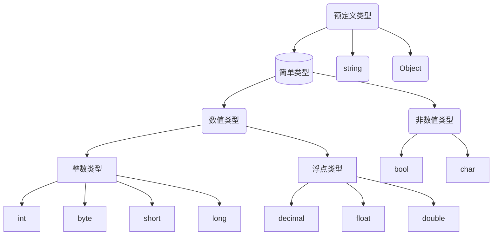

# 初识

`.NetFramWork `框架是`.Net `平台不可或缺的一部分，提供了稳定的运行环境保证我们基`.Net` 平台开发的应用能够稳定运行。


## VS快捷键

1. 快速对齐代码：鼠标点中某行，`Ctrl+K+D`，要求代码中不能有错误。
2. 转到帮助文档：`F1`
3. 保存`Ctrl+S`
4. 撤销：`Ctrl+Z`
5. 选中整行代码：SHIFT+END（往后选）,SHIFT+HOME（往前选）

## VS的基本操作

### 调整字体

`Ctrl+滚轮`调整字体大小。

### 设置行号

在工具>>选项卡中：


### 设置字体

在工具>>选项卡中：


### 主题颜色设置


### 恢复原设置


### 检查语法

运行代码`F5`前应先进行语法检查`F6`.


## 第一个示例

标点符号用英文，简单语句结束用分号。`{}`包围起来的语句叫块，块后面不能跟分号。

```csharp
using System;
//工作空间 ，门牌号
namespace worklzb
{
    //类型
    class lzb
    {
        /// 应用程序的主入口点。 <summary>
        /// 函数方法
        /// </summary>
        static void Main()
        {
            Console.WriteLine("我的世界");//向屏幕输出文字我的世界
            string str = Console.ReadLine();//存储用户输入的值
            Console.WriteLine(str);//输出用户输入的值
        }
    }
}
```

| Console类常用方法    | 作用                                                         |
| -------------------- | ------------------------------------------------------------ |
| Console.WriteLine( ) | 将字符串打印到屏幕，结尾跟一个换行符                         |
| Console.Write( )     | 将字符串打印到屏幕                                           |
| Console.ReadLine( )  | 返回用户输入的**内容 ，string类型**                          |
| Console.ReadKey( )   | 暂停窗口，直到用户输入内容。参数为true时，不显示用户输入内容。 |

## 注释

注释作用`解释代码`或`注销代码`。

### 单行注释

在代码前面加上`//`。


### 多行注释

用`/**/`将代码包含起来。


### 文档注释

多用来解释书写的类以及方法，使用`///`表示。


# 变量与常量

变量与常量是用来在计算机中存储数据。变量需先声明后赋值最后参与运算。

## 变量类型

变量类型包括预定义类型和自定义类型。



:book:变量类型详解

:one:整数类型

:red_circle:有符号指的是可存放正负数；位数指的是存放二进制数字长度；不能赋值小数。

| 整数类型    | 备注           |
| ----------- | -------------- |
| long        | 64位有符号整数 |
| int         | 32位有符号整数 |
| short       | 16位有符号整数 |
| `byte`      | 8位无符号整数  |
| :two:浮点数 |                |

| 类型         | 关键字  | 备注                                                         |
| ------------ | ------- | ------------------------------------------------------------ |
| 单精度浮点数 | float   | 精度大约 6-9 位，4字节,数字后面+f/F，可赋值**整数以及小数**  |
| 双精度浮点数 | double  | 精度15-17 位，8字节,可赋值**整数以及小数**                   |
| 十进制货币数 | decimal | 位数更小，适合储存货币值，16字节，数字后面+m/M，可赋值**整数以及小数** |

:three:其他

| 类型   | 关键字 | 备注                                     |
| ------ | ------ | ---------------------------------------- |
| 字符串 | string | 存放0~多个字符文本，用双引号包裹起来     |
| 单字符 | char   | 仅能存放一个字符，不能为空，用单引号包裹 |
| 布尔值 | bool   | true或false                              |
| 枚举   | enum   | 用户自定义的数据类型,默认用Int数据存储。 |

```csharp
byte a = 255;//最大255，2的8次方-1
short b = 266;
long c = 5666000000;
//小数类型变量可以直接赋值整数
float a = 1;
decimal b = 11;
double c = 10;
//小数类型变量赋值为小数时需要注意后缀
//无后缀为double类型
float num1 = 1.0f;//使用f强制转换为float
decimal num2 = 10.0m;//使用m强制转换为decimal
double num3 = 10.0;//不加后缀默认为double
char cha = 'a';//单引号，且不能为空
//错误示范
char cha = ''//空字符
```

## 命名规范

:one: 变量名称要有意义

:two: 不能与关键字冲突。

:three:以字母，`_`,`@`开头，后面跟任意`数字`，`字母`，`下划线_`。

```csharp
string 1num = 1; //错误
string num_1 = 2; //正确
string a = 2;//无意义
```

:four:大小写敏感

```csharp
int num = 0;
int Num = 1;//二者不一致
```

:five:不能重复声明

:six:变量，字段推荐`Camel(骆驼)`命名规范：首单词字母小写，其余单词首字母大写。

* `highSchool`

* `dark_Key`

:seven:类，方法，枚举名推荐`Pascal`命名规范：所有单词首字母大写

## 变量的声明与初始化


声明变量：意在指定数据类型以及名称，告诉编译器它的数据类型，给它分配多大的内存空间，以及存放怎样的数据。

```csharp
// 数据类型 变量名
int a;//默认 0
string str; //默认 null，不在内存中开辟空间
bool b;//默认false
int d, e, f, g;//连续声明变量
```

变量的初始化及在声明变量的同时进行赋值。

```csharp
int a = 100, b = 0, c = 20;
//连续声明以及赋值
```

声明变量`a`（默认0）,并将值100赋值给`a`。底层是在内存中开辟一个存储整数的空间，并将100存放其中。

## var推断类型

C#是一门强类型语言，在代码中必须对每一个变量的类型有个明确的定义，`var`是推断类型（匿名类型），根据值推断变量类型。

```csharp
var a = "das";
var num = 12;
var doubleNum = 12.0;
//GetType()获取当前实例的类型
Console.WriteLine(a.GetType());
Console.WriteLine(num.GetType());
Console.WriteLine(doubleNum.GetType());
```

:red_circle:缺陷：必须初始化

```csharp
var a;错误
//声明时必须赋值
var a = 1;
a = "";//错误，类型确定后不再改变
```

## 变量作用域

### 局部变量

在方法体`形参`、以及在块`{}`之间声明的变量称为局部变量。

:one:从声明的大括弧开始到对应的括弧结束，这整个范围内可以访问使用，超出则无法使用。

```csharp
static void Main(string[] args)
{
    { int a = 1; }
    Console.WriteLine(a);//超出范围，无法访问
}
```

:two:方法的参数也属于局部变量（方法调用结束后，会释放局部变量占用的内存空间，销毁局部变量）

```csharp
static void Main(string[] args)
{
    int a = 1;
    int b = 2;
    Range(a, b);
    Console.WriteLine(a);//1，只能访问到本方法中的a
    Console.WriteLine(b);//2
}
public static void Range(int a, int b)
{
    a++;
    b++;
}

```

:red_circle:注意引用传递参数

```csharp
//在ChangeArr()方法中形参存储的是引用地址，形参与实参指向同一个地址
//方法结束后堆中的数据被更改了
static void Main(string[] args)
{
    int[] arr = { 1, 2, 4 };
    ChangeArr(arr);//将引用地址传给方法中的局部变量
    Console.WriteLine(arr[0]);
}
static void ChangeArr(int[] arr) 
{
    arr[0] = 100;
}
```

### 静态字段模拟全局变量

Main函数中声明的变量只能在Main函数中使用，自定义函数是无法访问到。我们可以通过声明静态字段来模拟全局变量，该类中所有方法都可以访问到，且结束后不会销毁变量。

```csharp
internal class Program
{
    public static int _number;
    static void Main(string[] args)
    {
        //Main函数中调用Print
        Print();
    }
    //自定义方法
    public static void Print()
    {
        _number = 2025;//在本类中调用，类名可省略
        Console.WriteLine("{0}年大吉大利",_number);
    }
}
```

## 常量

不可以多次赋值的变量。

```csharp
const 变量类型 变量名 = 值
const int num = 10;
//常量不能重新赋值
num = 20;//错误，赋值号左边必须是变量...
```

# 运算符

## 赋值运算符

`=`，把等号右边的值赋值给左边变量，即将值存储在内存中。

由=连接的表达式叫做赋值表达式。

:one:简单运算符

| 简单赋值运算符 | 描述                   | 实例                            |
| -------------- | ---------------------- | ------------------------------- |
| =              | 把右边的值赋给左边变量 | C = A + B 将把 A + B 的值赋给 C |

:two:复合赋值运算符

变量在使用复合赋值运算符之前要初始化。

| 复合赋值运算符 | 实例                    |
| -------------- | ----------------------- |
| +=             | C += 2 相当于 C = C + 2 |
| -=             | C -= 2相当于 C = C - 2  |
| *=             | C *= 2相当于 C = C * 2  |
| /=             | C /= 2 相当于 C = C / 2 |
| %=             | C %= 2 相当于 C = C % 2 |

```csharp
int number = 10; //number的值是10。
```

变量可以重新赋值，取而代之的是新值。

```csharp
int number = 10; // number值是10
number = 20;//重新赋值后number值是20
```

下面是复合运算符示例：

```csharp
 int num = 10;
 num += 5;//15，num = num + 5
 num *= 2;//30,num = num * 2
 num %= 4;//余2,num = num % 4
//=后面可视为一个整体
int n = 0;
n += 5 + 3 * 2 + 6;
// n =17
```

## 算数运算符

假设变量 **A** 的值为 `10`，变量 **B** 的值为 `20`，则：

| 运算符 | 描述                                     | 实例             |
| ------ | ---------------------------------------- | ---------------- |
| +      | 把两个操作数相加                         | A + B 将得到 30  |
| -      | 从第一个操作数中减去第二个操作数         | A - B 将得到 -10 |
| *      | 把两个操作数相乘                         | A * B 将得到 200 |
| /      | 分子除以分母                             | B / A 将得到 2   |
| %      | 取余运算符，整除后的余数                 | B % A 将得到 0   |
| ++     | 自增运算符，整数值增加 1（操作数是变量） | A++ 将得到 11    |
| --     | 自减运算符，整数值减少 1（操作数是变量） | A-- 将得到 9     |

:red_circle:整数类型相除，若不能整除，返回值仍是整型。

:red_circle:模`%`与`/`优先级相同。

:red_circle:对于像`++`，`--`只需要一个操作数完成的运算叫一元运算符，对于`+`，`-`，`*`,`/`,`%`需要两个操作数完成的运算叫做二元运算符。一元运算符的优先级比二元运算符级别要高。

C#没有提供幂次方的运算符，可通过`Math.Pow()`计算一个数的幂次方，此方法返回一个`double`值。

```csharp
int num = 2;
int bigNum = Convert.ToInt32(Math.Pow(num, 3));
Console.WriteLine(bigNum);
```

:one:求和取余

```csharp
int smallNum = 3;
int bigNum = 7;
Console.Write("7与3的和是{0}", smallNum+bigNum);//10
Console.Write("\n7与3的余数是{0}",bigNum%smallNum);//1
Console.Write("\n7与3的商是{0}",bigNum/smallNum);//2
```

:two:计算R=5圆面积。

```csharp
//方法一：
do
{
    try //try—catch捕获异常
    {
        Console.WriteLine("请输入圆面积");
        //将用户输入的文本转换为double类型
        double r = double.Parse(Console.ReadLine());
        double area = _pi * r * r;//计算圆面积
        string str = area.ToString("0.00");
        //0.00为format参数，要求保留两个小数点
        area = double.Parse(str);
        Console.WriteLine("圆的面积是{0}", area);
        return;
    }
    catch 
    {
        Console.WriteLine("输入非法字符，请重新输入");
        continue;
    }
    
} 
while (true);
//方法二：平方公式计算
int r = 5;
double area = Math.Pow(r, 2) * 3.14;//pi*r^2
Console.WriteLine("半径为5的圆面积是：{0}",area);
```

:three:价格计算

```csharp
int shirt = 35 , trousers = 120;//T恤单价35,裤子单价120
int price = shirt * 3 + trousers * 2;//总价格
double discount = price * 0.88; //打折后价格，隐式类型转换
Console.WriteLine("总价格是{0},\n打折后的价格是{1}",price,discount);
```

:four:计算`107653秒`是几天几小时几分钟几秒？(利用`int/int`,数字类型仍是`int`)

```csharp
int days = 107653 / 86400;//总天数，一天96400秒
int seconds = 107653 % 86400;//剩余不足整数天秒数
int hours = seconds / 3600;//整小时,1h =3600s
seconds = seconds % 3600;//剩余不足整小时秒数
int minutes = seconds / 60;//整分钟,1min = 60s
seconds = seconds % 60;//剩余不足整分钟秒数
Console.WriteLine("107653秒是{0}天{1}小时{2}分钟{3}秒",days,hours,minutes,seconds);
//107653秒是1天5小时54分钟13秒
```

:five:交换变量

```csharp
int a = 3;
int b = 5;
a = b-a;//利用二者差值
b = b - a;
a = a + b;
Console.Write("a={0},b={1}",a,b);
//output a=5,b=3
```

:six:前++与后++

```csharp
int a = 10;
int b = 10 + a++;//b=20,a =11
int c = 10;
int d = 10 + ++c;//d = 21,c =11
int e = 5;
Console.WriteLine(e++);//5
Console.WriteLine(++e);//7
```

不论`前++`或`后++`，变量自身都会+1，区别在于，参与运算时，`前++`会先进行自增，后参与运算；而`后++`会先运算，然后进行自增运算。

:seven:一元运算符优先级

```csharp
int a = 10;
int num = a++ + a * 10 + ++a + a--;
         // 10 + 12 + 12 +11*10,a = 11
Console.WriteLine(num);//144
Console.WriteLine(a);//a=11
```

## 关系运算符

关系运算符时描述两个事物之间的关系，返回一个Bool值，`True`或`False`。由关系运算符连接的表达式叫做关系表达式。

| 运算符 | 描述                                                         | 实例              |
| ------ | ------------------------------------------------------------ | ----------------- |
| ==     | 检查两个操作数的值是否相等，如果相等则条件为真。             | (A == B) 不为真。 |
| !=     | 检查两个操作数的值是否相等，如果不相等则条件为真。           | (A != B) 为真。   |
| >      | 检查左操作数的值是否大于右操作数的值，如果是则条件为真。     | (A > B) 不为真。  |
| <      | 检查左操作数的值是否小于右操作数的值，如果是则条件为真。     | (A < B) 为真。    |
| >=     | 检查左操作数的值是否大于或等于右操作数的值，如果是则条件为真。 | (A >= B) 不为真。 |
| <=     | 检查左操作数的值是否小于或等于右操作数的值，如果是则条件为真。 | (A <= B) 为真。   |

## 逻辑运算符

由逻辑运算符连接的表达式叫做逻辑表达式。在逻辑表达式两边一般放的时关系表达式或布尔值，结果仍是布尔值。

假设A为真，B为假

| 运算符 | 描述                                                         | 实例              |
| ------ | ------------------------------------------------------------ | ----------------- |
| &&     | 逻辑与运算符。如果两个操作数都真，则条件为真。               | (A && B) 为假。   |
| \|\|   | 逻辑或运算符。如果两个操作数中有任意一个为真，则条件为真。   | (A \|\| B) 为真。 |
| !      | 逻辑非运算符。用来逆转操作数的逻辑状态。如果条件为真则逻辑非运算符将使其为假。 | !(A && B) 为真。  |

:one:简单示例

```csharp
bool a = 2 > 1; //true
bool b = 1 == 2;//false
Console.WriteLine(a && b);//false
Console.WriteLine(a || b);//true
Console.WriteLine(!(a && b));//true
```

:two:判断是否为闰年（`逻辑与`优先级比`逻辑或`优先级高）

```csharp
Console.WriteLine("请输入一个年份");
int year = Convert.ToInt32(Console.ReadLine());
//能被400整除或能被4整除而不能被100整除
bool isRun = year % 400 == 0 || (year % 4 == 0 && year % 100 != 0);
//不加括弧不出错，为了美观，易识别 我们要添加括弧
Console.WriteLine("{0}年是不是闰年-{1}",year,isRun);
```

## 其他运算符

### 连字符`+`

`+`只要一边是字符串，便可以起连接作用，表达式返回一个字符串。

```csharp
string name = "Limou";
int number = 10;
Console.Write("你好, "+ name+"你的工号是"+number);//你好, Limou你的工号是10
```

### 占位符

使用连接符繁琐时使用占位符，先挖坑再填坑。`{}`中填的是参数列表的索引值，且要求索引值不能溢出。

`Console.Write(stringFormat,params object[] args);`

```csharp
int a = 1;
int b = 2;
int c = 3;
Console.WriteLine("第一个数字是{1},第二份数字是{2},第三个数字是{2}",a,b,c);
//output 第一个数字是2,第二份数字是3,第三个数字是3
//a,b,c索引值分别为0，1，2。
string name = "张三";
string sex = "男";
int age = 26;
string telNumber = "001-12345";
Console.Write("我叫{1},我今年{2}岁了，性别{3},电话号码{0}",telNumber,name,age,sex);
```

格式化保留2位小数，按照`{索引:0.00}`格式写即可。

```csharp
double bigNum = 7;
int smallNum = 3;
Console.WriteLine("大数是{0},小数是{1:0.00}",bigNum,smallNum);
//大数是7,小数是3.00
```

### 转义符

转义符是指`\`后跟一个字符，组成一个特殊意义的字符，但`\`不是跟任意字符连接都有意义。

| 转义符     | 作用                                       |
| ---------- | ------------------------------------------ |
| \n——换行符 | 换行，\n要占满一行，把后面的内容挤到下一行 |
| \\"        | 表示英文半角双引号                         |
| \t——制表符 | 用来对齐                                   |
| \b——退格键 | 删除前一位字符，放到字符串两边无效         |
| \\\        | 单纯表示\                                  |

:one:换行符

```csharp
Console.WriteLine("艳阳天那么风光好，\n红的花儿是绿的草,\n乐乐呵呵向前跑，\n踏遍青山人未老");
/*艳阳天那么风光好，
红的花儿是绿的草,
乐乐呵呵向前跑，
踏遍青山人未老*/
```

:two:制表符

```csharp
 Console.WriteLine("张三，\t李四");
 Console.WriteLine("王五，\t赵六");
//张三，  李四
//王五，  赵六
```

:three:退格符

```csharp
Console.WriteLine("AB\bF\b"); //AF
//对于中文似有BUG
```

### @符号

1. 取消`\`的转移作用，让`\`单纯表示`\`。

```csharp
Console.WriteLine(@"C:\Users\Administrator\Desktop");
```

1. 将字符串按照编辑的原格式输出。

```csharp
Console.WriteLine(@"白日依山尽，
黄河入海流");
//白日依山尽，
//黄河入海流
```