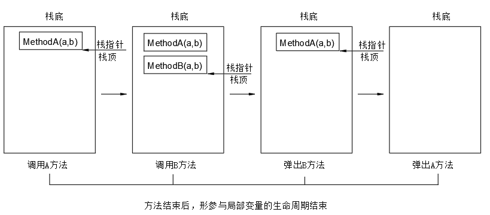

本文档只讨论基础概念，其余部分点击跳转。

:one: [面向对象篇章](面向对象.md)

:two:[高级特性](高级特性.md)（完成,反射特性未作深究）

:three: [WPF](WPF.md)（未更新完成）

# 初识

`.NetFramWork `框架是`.Net `平台不可或缺的一部分，提供了稳定的运行环境保证我们基`.Net` 平台开发的应用能够稳定运行；

与`.NetCore`的区别在于后者可以跨平台。


:bookmark:强类型语言与弱类型语言：

1. 强类型语言：`Java`,`c#`,`c++`

2. 弱类型语言：`php`,`python`,`javascript`

   强类型语言是使用变量之前必须声明其类型的语言.

   ```c#
   int a = 0;//int整数类型
   ```

`C#`程序执行机制分为编译期和运行期两个阶段。

:one:编译期：编译器将源代码转换为CIL中间语言(`.dll`或`.exe`)。

* 检查语法
* 常量确定:使用`const`声明的常量在编译期完全确定，在执行期代码会跳过常量的声明与初始化。

:two:运行期:将`CIL`语言转换为机器码，并执行。

以下为编译→运行期的详细示意图（了解即可）。

```mermaid
flowchart TD
    subgraph 运行期
        A[加载程序集] --> B[解析元数据]
        B --> C{首次调用方法？}
        C -->|是| D[JIT编译：CIL→机器码]
        D --> E[缓存机器码至内存]
        E --> F[执行机器码]
        F --> G[方法调用]
        G --> H[分配栈帧]
        H --> I[确定局部变量地址]
        I --> J1[值类型：栈分配]
        I --> J2[引用类型：栈存引用]
        J2 --> J3[new操作：托管堆分配对象]
        J3 --> K[GC自动管理堆内存]
        
        B --> L{首次访问静态类型？}
        L -->|是| M[分配静态字段内存]
        M --> N[置默认值（清零）]
        N --> O[执行字段初始化器（按声明顺序）]
        O --> P[执行静态构造函数]
    end

    subgraph 编译期
        Q[源代码] --> R[语法/语义检查]
        R --> S[常量确定：const替换为字面量]
        S --> T[生成CIL指令与元数据]
        T --> U[生成CIL程序集.dll/.exe]
    end
```


## VS快捷键

1. 快速对齐代码：鼠标点中某行，`Ctrl+K+D`，要求代码中不能有错误。
2. 转到帮助文档：`F1`
3. 查看内部类`F12`
4. 保存`Ctrl+S`
5. 撤销：`Ctrl+Z`
6. 选中整行代码：`SHIFT+END`（往后选）,`SHIFT+HOME`（往前选）
7. `Ctrl+End`快速跳转到最后一行,`Ctrl+Home`快速跳转到首行。

## VS的基本操作

### 调整字体

`Ctrl+滚轮`调整字体大小。

### 设置行号

在工具>>选项卡中：


### 设置字体

在工具>>选项卡中：


### 主题颜色设置


### 恢复原设置


### 检查语法

运行代码`F5`前应先进行语法检查`F6`.


## 第一个示例

标点符号用英文，简单语句结束用分号。`{}`包围起来的`0`条或`n`条语句叫块。

```csharp
using System;
//工作空间 ，相当于文件夹
namespace worklzb
{
    //类型
    class lzb
    {
        /// 应用程序的主入口点，必须存在
        static void Main()
        {
            Console.WriteLine("我的世界");//向屏幕输出文字我的世界
            string str = Console.ReadLine();//存储用户输入的值
            Console.WriteLine(str);//输出用户输入的值
        }
    }
}
```

| Console类常用方法    | 作用                                                         |
| -------------------- | ------------------------------------------------------------ |
| Console.WriteLine( ) | 将字符串打印到屏幕，结尾跟一个换行符                         |
| Console.Write( )     | 将字符串打印到屏幕                                           |
| Console.ReadLine( )  | 返回用户输入的内容 ，string类型                              |
| Console.ReadKey( )   | 暂停窗口，直到用户输入内容。参数为true时，不显示用户输入内容。 |

:bookmark:空格，换行符，`Tab`，都被编译器忽略。

```c#
Console.   WriteLine();//空格
```

## 注释

注释作用`解释代码`或`注销代码`。

### 单行注释

在代码前面加上`//`。


### 多行注释

用`/**/`将代码包含起来。


### 文档注释

多用来解释书写的类以及方法，使用`///`表示。


# 变量与常量

变量与常量是用来在计算机中存储数据。

## 变量类型

变量类型包括预定义类型和自定义类型，`Object`类型是所有类型的基类。

```mermaid
flowchart TD
A(Object)--> B[预定义类型]
A --> C(自定义类型)
```




:one:预定义类型:微软内部定义好的类型，可直接进行实例化。

```mermaid
flowchart TD
A(预定义类型)--> B[(简单类型)]
A --> C(string)
B-->E(数值类型)
E --> 整数类型
E --> 浮点类型
整数类型 -->int
整数类型 -->byte
整数类型 -->short
整数类型 -->long
浮点类型 --> decimal
浮点类型 --> float
浮点类型 --> double
B-->F(非数值类型)
F-->bool
F --> char
```

:two:自定义类型：需要用户定义类型的结构，先声明类型然后实例化(分配内存空间)，最后初始化(存放数据)。

```mermaid
flowchart TD
A(自定义类型)--> 结构struct
A --> 枚举enum
A --> 数组array
A --> 类类型calss
A --> 接口interface
A--> 委托delegate
```

:book:变量类型详解

:one:整数类型

:red_circle:有符号指的是可存放正负数；无符号指无负数；位数指的是存放二进制数字长度；

:red_circle: 整数类型不能赋值小数。

:red_circle:有符号类型位数第一位表示数字的正负性，如`int a = -1`，二进制为`1000 0000 0000 0000 0000 0000 0000 0001` 。

| 整数类型 | 备注           | 整数类型 | 备注           |
| -------- | -------------- | -------- | -------------- |
| long     | 64位有符号整数 | `ulong`  | 64位无符号整数 |
| int      | 32位有符号整数 | `uint`   | 32位无符号整数 |
| short    | 16位有符号整数 | `ushort` | 16位无符号整数 |
| `sbyte`  | 8位有符号整数  | `byte`   | 8位无符号整数  |

:two:浮点数

| 类型         | 关键字  | 备注                                                         |
| ------------ | ------- | ------------------------------------------------------------ |
| 单精度浮点数 | float   | 精度大约 6-9 位，4字节,数字后面+f/F，可赋值**整数以及小数**  |
| 双精度浮点数 | double  | 精度15-17 位，8字节,可赋值**整数以及小数**                   |
| 十进制货币数 | decimal | 适合储存货币值，16字节，数字后面+m/M，可赋值**整数以及小数** |

:bookmark:进制与转换

二进制是逢2进位的进位制，0,1是基本运算符。 

二进制转10进制使用除2取余法。


二进制转十进制需要按位求幂相加。


二进制`1000`表示的十进制8，则四位二进制表示的最大十进制数为`2的5次方-1` .

:three:其他

| 类型   | 关键字 | 备注                                                         |
| ------ | ------ | ------------------------------------------------------------ |
| 字符串 | string | 存放0~多个字符文本，用双引号包裹起来                         |
| 单字符 | char   | 仅能存放一个字符，不能为空，用单引号包裹,本质上是 16 位 Unicode 整数值 |
| 布尔值 | bool   | true或false                                                  |
| 枚举   | enum   | 用户自定义的数据类型,默认用Int数据存储。                     |

```csharp
byte a = 255;//最大255，2的8次方-1
short b = 266;
long c = 5666000000;
//小数类型变量可以直接赋值整数，内部会进行隐式转换
float a = 1;
decimal b = 11;
double c = 10;
//小数类型变量赋值为小数时需要注意后缀
//无后缀为double类型
float num1 = 1.0f;//使用f强制转换为float
decimal num2 = 10.0m;//使用m强制转换为decimal
double num3 = 10.0;//不加后缀默认为double
char cha = 'a';//单引号，且不能为空
//错误示范
char cha = ''//空字符,错误
```

## 引用类型与值类型

内存中存储数据内存分为三块，`GC`堆，栈，静态存储区域,三者都是用来存储数据。

静态存储区域是一个逻辑上的概念，在`C#`中由高频堆实现，后文中我们用`GC`堆，栈，静态存储区域内存模型分析变量的行为。

```mermaid
flowchart TD
    %% 栈内存部分（线程私有）
    S[栈内存 Stack] --> S1[值类型数据]
    S --> S2[引用类型变量（指针）]
    S2 -.-> B1

    %% 托管堆（进程共享）
    subgraph 托管堆 [广义托管堆 Managed Heap]
        direction TB
        %% GC 堆（对象实例）
        subgraph GC堆 [GC 堆]
            B1[对象实例数据]
            B2[装箱的值类型]
        end

        %% Loader 堆（静态存储区）
        subgraph Loader堆 [Loader 堆]
            direction LR
            D[高频堆_高频访问的数据] -->D2[静态值类型字段]
            D --> D3[静态引用字段]
            D --> 其他
            D3 --> B1

            E[低频堆_低频访问的数据] --> E2[异常表、反射元数据等]
        end
    end

    %% 标注说明
    N1["静态存储区（由高频堆实现）"] ~~~ D
    N2["线程栈（每个线程独立）"] ~~~ S
    classDef note fill:#f9f9f9,stroke:#ddd;
    class N1,N2 note;
```


1. 栈的空间小，读取速度最快，由操作系统与CLR管理；
2. 静态存储区域访问速度极快，接近栈，数据常驻内存，适合存储 长期不变的高频访问数据，过度使用可能导致 内存占用增加。
3. GC堆的空间大，小对象分配速度快，大对象分配速度较慢，释放速度慢，由垃圾回收机制`GC`管理；

```mermaid
flowchart TD
A(变量类型) --> B[(值类型)]
A --> C[(引用类型)]
B --> 简单类型
B --> struct
B --> enum
C --> deleagte
C --> denamic
C --> 类类型
C-->string
C-->interface
C-->Object
```

:bookmark:按`F12`查看类的内部，如果是`struct`是值类型，`class`为引用类型。

值类型作为局部变量只需要一段单独的内存，值是存储在内存的栈(`stack`)中；而引用类型则需要两段内存，第一段存储实际的数据，在内存的堆中存储，第二段是一个引用（内存地址），指向GC堆中的位置。


:red_circle:无论值类型，引用类型变量作为成员使用数据存放在GC堆中。

### 值类型

创建一个值类型时，变量直接包含数据值。当值类型变量赋值给另一个变量时，会创建一个独立的副本。

修改另一个变量并不会影响原变量。

```csharp
int a = 10;
int b = a;
b = 20;//将原栈中存储的值用20替换掉
Console.WriteLine(a);//10
```


### 引用类型

引用类型变量存储的是对象的引用（内存地址），而对象实际的数据存储在GC堆内存中。堆内存的管理是通过GC完成，当对象不在被任何变量引用，垃圾回收器会在条件满足时回收其占用的内存。


`MyType`实例有`A`值类型变量与`B`引用类型变量。`A`存储实际数据；`B`储存实际数据的引用，该引用才指向数据。

引用类型的复制行为（因字符串的不可变性，不在此类）：引用类型变量赋值给另一个变量，只是复制了引用地址，两个变量指向同一个对象，修改一个会影响另一个。

```csharp
int[] arr1 = { 1, 2, 3 };
int[] arr2 = arr1;//变量中存储的是引用地址
arr2[0] = 100;
Console.WriteLine(arr1[0]);//100
```

### 静态类型字段


静态类型变量存储在静态存储区域（广义托管堆的特殊区域）中，在访问所在类成员时便被初始化，整个程序结束时才会销毁变量。

值类型直接嵌入在`静存储态区域`中，若是引用类型则在`静态存储区域`中存储对象的引用，该引用指向GC堆中的实际数据。

## 命名规范

:one: 变量名称(标识符)要有意义

:two: 不能与关键字冲突，微软内部定义的有特殊意义的:large_blue_diamond: 单词。

:three:以字母，`_`,`@`开头，后面跟任意`数字`，`字母`，`下划线_`;`@`符号的作用是转义关键字。

```csharp
string 1num = 1; //错误
string num_1 = 2; //正确
string a = 2;//无意义
int @int = 0;//@符号转义关键字，了解，不推荐
```

:four:大小写敏感

```csharp
int num = 0;
int Num = 1;//二者不一致
```

:five:不能重复声明

:six:变量，字段推荐`Camel(骆驼)`命名规范：首单词字母小写，其余单词首字母大写。

* `highSchool`

* `dark_Key`

:seven:类，结构，方法，枚举,属性名推荐`Pascal`命名规范：所有单词首字母大写

:eight:常量所有字母大写，如`PI`

## 变量的声明与初始化


声明变量：意在指定数据类型以及名称(内存地址别名)，告诉编译器它的数据类型，在何处分配空间，给它分配多大的空间。

```csharp
// 数据类型 变量名
int a;//,已在栈分配空间，内存中的值未定义(可能是残留数据)，不能直接使用
string str; //栈中分配空间(值未定义)，堆中未分配内存，不能直接使用
bool b = false;//声明且初始化
int d, e, f, g;//连续声明变量,要求变量类型一致
```

在声明变量的同时进行初始化:

```csharp
int a = 100, b = 0, c = 20,d;
//连续声明以及赋值,要求变量类型一致
```

声明变量`a`,并将值100赋值给`a`。本质是在内存中申请一个存储整数的空间，随后将100存放其中。

:red_circle:自动初始化:定义在某些位置的变量未进行初始化，但系统会提供默认值(引用类型为`null`,值类型为`0`,布尔类型为`false`)，某些则不会提供默认值(即未定义，使用该变量前必须显示初始化)。

* 类、结构字段以及数组元素会自动初始化
* 函数中的局部变量，形参不会自动初始化。

## var推断类型

C#是一门强类型语言，在代码中必须对每一个变量的类型有个明确的定义，`var`是推断类型（匿名类型），根据值推断变量类型。

* 只能用于局部变量，不能用于字段，形参
* 类型确定后不能更改

```csharp
var a = "das";
var num = 12;
var doubleNum = 12.0;
//GetType()获取当前实例的类型
Console.WriteLine(a.GetType());
Console.WriteLine(num.GetType());
Console.WriteLine(doubleNum.GetType());
```

:red_circle:缺陷：必须初始化

```csharp
var a;//错误,声明时必须赋值
var a = 1;
a = "";//错误，类型确定后不再改变
```

## 变量作用域

### 局部变量与参数

在方法体块`{}`之间声明的变量称为局部变量,用以保存临时的计算数据。

值类型局部变量的作用域:从声明那一点开始，到块结束。出了块外界访问不到,内存并未销毁，只有弹出整个栈帧时占用的内存一次性回收)。

引用类型局部变量稍有不同，弹栈时只有栈中的内存被回收，而`GC`堆中存储的数据会在某一时刻被GC回收。

:one:在块`{}`之间可随时访问。

```csharp
static void Main(string[] args)
{
    { int a = 1; }
    Console.WriteLine(a);//超出范围，无法访问
}
```

:two:方法的参数仅此方法的函数体可访问

```csharp
static void Main(string[] args)
{
    int a = 1;
    int b = 2;
    //将Main函数中的a，b储存的值赋值形参a,b，变量名虽相同但不冲突
    Range(a, b);
    //方法结束后，内部的变量占用的空间回收
    Console.WriteLine(a);//1，只能访问到本方法中的a
    Console.WriteLine(b);//2
}
public static void Range(int a, int b)
{
    a++;
    b++;
}

```

:three: 特殊的闭包:延长变量生命周期

```c#
Action action;
{
    int i = 12;
    action = () => Console.WriteLine(i);
}
action();
//原变量i提升为闭包对象的字段，具体在lambda表达式中讲述
```


### 静态字段模拟全局变量

Main函数中声明的变量只能在Main函数中使用，自定义函数是无法访问到。我们可以在类中通过声明静态字段来模拟全局变量，该类中所有方法都可以访问到，只有在程序结束后才会销毁静态字段。

```csharp
internal class Program
{
    public static int _number;//自动初始化，默认值0
    static void Main(string[] args)
    {
        //Main函数中调用Print
        Print();
    }
    //自定义方法
    public static void Print()
    {
        _number = 2025;//在本类中调用，类名可省略
        Console.WriteLine("{0}年大吉大利",_number);
    }
}
```

## 常量

常量是不可以多次赋值的变量，要求声明时必须初始化（`Const`常量的值是在编译期决定的）。

```csharp
const 变量类型 变量名 = 值
const int num = 10;//程序运行时会跳过常量声明部分
//常量不能重新赋值
num = 20;//错误，赋值号左边必须是变量...
```

常量的类型可以是预定义的简单类型，`string`类型，枚举，不能是其他引用类型和结构体，后者需要在运行期才能确定（因为构造函数执行在运行期）。

常量在内存中没有存储位置，编译时编译器会将常量替换为具体的值。

## 可空类型`Nullable<T>`

> 将可以将值类型赋值为`null`，表示无效数据。

```c#
int? num = null;
//内部编译为 Nullable<int> x = new Nullable<int>()的结构体
//HasValue属性判断是否有值
//null代表无效数据
if (num.HasValue) 
{
    //执行相关
}
```

:bookmark: 可空类型内存结构：


- 有两个只读属性：`bool HasValue` 和 `T Value`。

- 当赋值为 `null` 时：`HasValue = false`，`Value` 被设为 `default(T)`（如 `int` 的 `0`）但**不可访问**（访问会抛异常)

  ```c#
  int? p= null;
  Console.WriteLine(p.Value);//报错：可空类型变量必须要有一个值
  ```

:red_circle:注意与引用类型中`null`引用的区别：引用类型赋值为 `null` 表示未引用任何内存对象。

:bookmark: 可空类型与值类型间存在转换。

```c#
int? p= 2;
p += 2;//数字2隐式转换为int?类型
Console.WriteLine(p == 4);////数字4隐式转换为int?类型
int num = (int)p;//强制转换
```

如果某个操作数为空，则返回值为空.

```c#
int? p= null;
p += 2;
Console.WriteLine(p == null);//True
```

:bookmark:安全获取数据

| 签名                                           | 释义                                               |
| ---------------------------------------------- | -------------------------------------------------- |
| `public T  GetValueOrDefault()`                | 检索当前 `Nullable `对象的值，或基础类型的默认值。 |
| `public T GetValueOrDefault (T defaultValue);` | 检索当前对象的值或指定的默认值                     |

```c#
int? p= null;
Console.WriteLine(p.GetValueOrDefault());//默认值0
p = 20;
Console.WriteLine(p.GetValueOrDefault());//对象的值20
Console.WriteLine(num.GetValueOrDefault(14));//20，对象有值，输出的还是对象的值，优先级高
```

# 运算符

## 赋值运算符

`=`，把等号右边的值赋值给左边变量，即将值存储在内存中。

由=连接的表达式叫做赋值表达式。

:one:简单运算符

| 简单赋值运算符 | 描述                   | 实例                            |
| -------------- | ---------------------- | ------------------------------- |
| =              | 把右边的值赋给左边变量 | C = A + B 将把 A + B 的值赋给 C |

:two:复合赋值运算符

变量在使用复合赋值运算符之前要初始化。

| 复合赋值运算符 | 实例                    |
| -------------- | ----------------------- |
| +=             | C += 2 相当于 C = C + 2 |
| -=             | C -= 2相当于 C = C - 2  |
| *=             | C *= 2相当于 C = C * 2  |
| /=             | C /= 2 相当于 C = C / 2 |
| %=             | C %= 2 相当于 C = C % 2 |

```csharp
int number = 10; //number的值是10。
```

变量可以重新赋值，取而代之的是新值。

```csharp
int number = 10; // number值是10
number = 20;//重新赋值后number值是20
```

下面是复合运算符示例：

```csharp
 int num = 10;
 num += 5;//15，num = num + 5
 num *= 2;//30,num = num * 2
 num %= 4;//余2,num = num % 4
//=后面可视为一个整体
int n = 0;
n += 5 + 3 * 2 + 6;
// n =17
```

## 算数运算符

假设变量 **A** 的值为 `10`，变量 **B** 的值为 `20`，则：

| 运算符 | 描述                                     | 实例             |
| ------ | ---------------------------------------- | ---------------- |
| +      | 把两个操作数相加                         | A + B 将得到 30  |
| -      | 从第一个操作数中减去第二个操作数         | A - B 将得到 -10 |
| *      | 把两个操作数相乘                         | A * B 将得到 200 |
| /      | 分子除以分母                             | B / A 将得到 2   |
| %      | 取余运算符，整除后的余数                 | B % A 将得到 0   |
| ++     | 自增运算符，整数值增加 1（操作数是变量） | A++ 将得到 11    |
| --     | 自减运算符，整数值减少 1（操作数是变量） | A-- 将得到 9     |

:bookmark:运算符优先级问题

| 优先级 | 运算符类型 | 示例                                                         |
| :----- | :--------- | :----------------------------------------------------------- |
| 1      | 括号 `()`  | `(2 + 3)`,括弧`()`可以改变优先级，先计算括弧内的内容，多层括弧先计算内层括弧 |
| 2      | `* / %`    | `2 * 3`,模`%`与`/`以及`*`优先级相同                          |
| 3      | `+ -`      | `2 + 3`                                                      |
| 4      | =          | `x = y`                                                      |

:red_circle:整数类型相除，若不能整除，返回值仍是整型。

:red_circle:对于像`++`，`--`只需要一个操作数完成的运算叫一元运算符，对于`+`，`-`，`*`,`/`,`%`需要两个操作数完成的运算叫做二元运算符。不论何种运算符，参与运算时，先从左至右确定操作数的值，最后执行计算；`()`只影响运算顺序，不影响操作数求值顺序。

```c#
 int i = 11;
 int a = i++ + (i * 6);
 // 11 + 12*6
 Console.WriteLine(a);//83
```

C#没有提供幂次方的运算符，可通过`Math.Pow()`计算一个数的幂次方，此方法返回一个`double`值。

```csharp
int num = 2;
int bigNum = Convert.ToInt32(Math.Pow(num, 3));
Console.WriteLine(bigNum);
```

:one:求和取余

```csharp
int smallNum = 3;
int bigNum = 7;
Console.Write("7与3的和是{0}", smallNum+bigNum);//10
Console.Write("\n7与3的余数是{0}",bigNum%smallNum);//1
Console.Write("\n7与3的商是{0}",bigNum/smallNum);//2
```

:two:计算圆面积。

```csharp
//方法一：
do
{
    try //try—catch捕获异常
    {
        Console.WriteLine("请输入圆面积");
        //将用户输入的文本转换为double类型
        double r = double.Parse(Console.ReadLine());
        double area = _pi * r * r;//计算圆面积
        string str = area.ToString("0.00");
        //0.00为format参数，要求保留两个小数点
        area = double.Parse(str);
        Console.WriteLine("圆的面积是{0}", area);
        return;
    }
    catch 
    {
        Console.WriteLine("输入非法字符，请重新输入");
        continue;
    }
    
} 
while (true);
//方法二：平方公式计算
int r = 5;
double area = Math.Pow(r, 2) * 3.14;//pi*r^2
Console.WriteLine("半径为5的圆面积是：{0}",area);
```

:three:价格计算

```csharp
int shirt = 35 , trousers = 120;//T恤单价35,裤子单价120
int price = shirt * 3 + trousers * 2;//总价格
double discount = price * 0.88; //打折后价格，隐式类型转换
Console.WriteLine("总价格是{0},\n打折后的价格是{1}",price,discount);
```

:four:计算`107653秒`是几天几小时几分钟几秒？(利用`int/int`,数字类型仍是`int`)

```csharp
int days = 107653 / 86400;//总天数，一天96400秒
int seconds = 107653 % 86400;//剩余不足整数天秒数
int hours = seconds / 3600;//整小时,1h =3600s
seconds = seconds % 3600;//剩余不足整小时秒数
int minutes = seconds / 60;//整分钟,1min = 60s
seconds = seconds % 60;//剩余不足整分钟秒数
Console.WriteLine("107653秒是{0}天{1}小时{2}分钟{3}秒",days,hours,minutes,seconds);
//107653秒是1天5小时54分钟13秒
```

:five:交换变量

```csharp
int a = 3;
int b = 5;
a = b-a;//利用二者差值或者和（和相对容易理解）
b = b - a;
a = a + b;
Console.Write("a={0},b={1}",a,b);
//output a=5,b=3
```

:six:前++与后++

```csharp
int a = 10;
int b = 10 + a++;//b=20,a =11
int c = 10;
int d = 10 + ++c;//d = 21,c =11
int e = 5;
Console.WriteLine(e++);//5
Console.WriteLine(++e);//7
```

不论`前++`或`后++`，变量自身都会+1，区别在于，参与运算时，`前++`会先进行自增，后参与运算；而`后++`会先运算，然后进行自增运算。

| 区别  |          |
| ----- | -------- |
| `++a` | 先加后用 |
| `a++` | 先用后加 |

:seven:混合运算

```csharp
int a = 10;
int num = a++ + a * 10 + ++a + a--;
         // 10 + 11*10+12 + 12,a = 11
		// 先从左至右确定变量的值，最后执行计算
Console.WriteLine(num);//144
Console.WriteLine(a);//a=11
```

## 关系运算符

关系运算符时描述两个事物之间的关系，返回一个`bool`值，`True`或`False`。由关系运算符连接的表达式叫做关系表达式。

| 运算符 | 描述                                                         | 实例              |
| ------ | ------------------------------------------------------------ | ----------------- |
| ==     | 检查两个操作数的值是否相等，如果相等则条件为真。             | (A == B) 不为真。 |
| !=     | 检查两个操作数的值是否相等，如果不相等则条件为真。           | (A != B) 为真。   |
| >      | 检查左操作数的值是否大于右操作数的值，如果是则条件为真。     | (A > B) 不为真。  |
| <      | 检查左操作数的值是否小于右操作数的值，如果是则条件为真。     | (A < B) 为真。    |
| >=     | 检查左操作数的值是否大于或等于右操作数的值，如果是则条件为真。 | (A >= B) 不为真。 |
| <=     | 检查左操作数的值是否小于或等于右操作数的值，如果是则条件为真。 | (A <= B) 为真。   |

## 逻辑运算符

由逻辑运算符连接的表达式叫做逻辑表达式。在逻辑表达式两边一般放的时关系表达式或布尔值，结果仍是布尔值。

假设A为真，B为假

| 运算符 | 描述                                                         | 实例              |
| ------ | ------------------------------------------------------------ | ----------------- |
| &&     | 逻辑与运算符。如果两个操作数都真，则条件为真。               | (A && B) 为假。   |
| \|\|   | 逻辑或运算符。如果两个操作数中有任意一个为真，则条件为真。   | (A \|\| B) 为真。 |
| !      | 逻辑非运算符。用来逆转操作数的逻辑状态。如果条件为真则逻辑非运算符将使其为假。 | !(A && B) 为真。  |

:red_circle:注意逻辑或的短路特性

:one:简单示例

```csharp
bool a = 2 > 1; //true
bool b = 1 == 2;//false
Console.WriteLine(a && b);//false
Console.WriteLine(a || b);//true
Console.WriteLine(!(a && b));//true
```

:two:判断是否为闰年（`逻辑与`优先级比`逻辑或`优先级高）

```csharp
Console.WriteLine("请输入一个年份");
int year = Convert.ToInt32(Console.ReadLine());
//能被400整除或能被4整除而不能被100整除
bool isRun = year % 400 == 0 || (year % 4 == 0 && year % 100 != 0);
//不加括弧不出错，为了美观，易识别 我们要添加括弧
Console.WriteLine("{0}年是不是闰年-{1}",year,isRun);
```

## 位运算符

> 位运算用于操作整型数字的二进制，将整型数值转换为2进制，在进行位运算。

### 位与&

对位运算，有0则0

```c#
int a = 1;//001
int b = 5;//101
Console.WriteLine(a & b);//1
```

使用`&`运算符判断是否为偶数

```c#
int num = Convert.ToInt32(Console.ReadLine());
if((num & 1) == 0) Console.WriteLine("偶数");
```

### 位或|

对位运算，有1则1.

```c#
int a = 1;//001
int b = 3;//011
Console.WriteLine(a|b);//011,3
```

可将`0`看作`false`,1看作`true`,用逻辑关系来理解。

### 异或^

对位运算，相同为0，不同为1.

```c#
int a = 1;//001
int b = 5;//101
Console.WriteLine(a ^ b);//100,4
```

### 位取反

对位运算，0变1，1变0

```c#
int b = 5;//0000 0000 0000 00000 0000 0000 0000 0101
Console.WriteLine(~b);
//1111 1111 1111 1111 1111 1111 1111 1010,符号为1，代表负数
//负数二进制转换为10进制，涉及反码补码，了解
```

### 左移`<<`与右移`>>`

让一个数的2进制进行左移和右移，左移几位，右侧加几个0.

```c#
int a = int.MaxValue;
int b = a << 2;
int c = (byte)a << 2;
Console.WriteLine(Convert.ToString(b,2));
//11111111111111111111111111111100
Console.WriteLine(Convert.ToString(c, 2));
//1111111100
```

右移几位，右侧去掉几个数。

```c#
byte a = 5;//101
Console.WriteLine(a>>2);//1
```

## 其他运算符

### 连字符`+`

`+`只要一边是字符串，便可以起连接作用，表达式返回一个字符串。

```csharp
string name = "Limou";
int number = 10;
Console.Write("你好, "+ name+"你的工号是"+number);//你好, Limou你的工号是10
```

### 占位符

使用连接符繁琐时可使用占位符，先挖坑再填坑。`{}`中填的是参数列表的索引值，且要求索引值不能溢出。

`Console.Write(stringFormat,params object[] args);`

```csharp
int a = 1;
int b = 2;
int c = 3;
Console.WriteLine("第一个数字是{1},第二份数字是{2},第三个数字是{2}",a,b,c);
//output 第一个数字是2,第二份数字是3,第三个数字是3
//a,b,c索引值分别为0，1，2。
string name = "张三";
string sex = "男";
int age = 26;
string telNumber = "001-12345";
Console.Write("我叫{1},我今年{2}岁了，性别{3},电话号码{0}",telNumber,name,age,sex);
```

:bookmark:格式化数字字符串：`{索引:字符}`

```c#
Console.WriteLine("{0:c}", 10);
Console.WriteLine("{1:f}",5,6);//默认两位小数
```

### 转义符

转义符是指`\`后跟一个字符，组成一个特殊意义的字符，但`\`不是跟任意字符连接都有意义。

| 转义符     | 作用                                       |
| ---------- | ------------------------------------------ |
| \n——换行符 | 换行，\n要占满一行，把后面的内容挤到下一行 |
| \\"        | 表示英文半角双引号                         |
| \t——制表符 | 用来对齐                                   |
| \b——退格键 | 删除前一位字符，放到字符串两边无效         |
| \\\        | 单纯表示\                                  |

:one:换行符

```csharp
Console.WriteLine("艳阳天那么风光好，\n红的花儿是绿的草,\n乐乐呵呵向前跑，\n踏遍青山人未老");
/*艳阳天那么风光好，
红的花儿是绿的草,
乐乐呵呵向前跑，
踏遍青山人未老*/
```

:two:制表符

```csharp
 Console.WriteLine("张三，\t李四");
 Console.WriteLine("王五，\t赵六");
//张三，  李四
//王五，  赵六
```

:three:退格符

```csharp
Console.WriteLine("AB\bF\b"); //AF
//对于中文似有BUG
```

### @符号

1. 取消`\`的转移作用，让`\`单纯表示`\`。

```csharp
Console.WriteLine(@"C:\Users\Administrator\Desktop");
```

1. 将字符串按照编辑的原格式输出。

```csharp
Console.WriteLine(@"白日依山尽，
黄河入海流");
//白日依山尽，
//黄河入海流
```

### 空值运算符？

> 判断一个引用类型是否为空，不为空则执行相关代码，为空则不执行。

```c#
string s = "dsa sda";
s?.Split(' ');//分隔字符串
//相当于👇
if(s != null)
{
    s.Split();//执行相关代码
}
```

数组也可以使用空值运算符

```c#
int[] arr = null;
//arr?[0]返回null
Console.WriteLine(arr?[0]);
```

### 空值合并符??

如果`??`左操作数的值不为 `null`，则 返回该值；否则会计算右操作数并返回其结果（三目运算符的简写）。

```c#
string s = null;
string s1 = (s ?? "str");
Console.WriteLine(s1);
//可空类型
int? p= 2;
int num = p ?? 4;//通过访问 p.Value 直接获取 int 值
Console.WriteLine(num);//2
```

### $_插值运算符

```c#
 int month = 3;
 int date = 29;
 Console.WriteLine($"0{month}月{date}日");//03月29日
```

`{}`内也可以直接写值

```c#
string name = $"{"this day is cold"}";
```

格式化字符串:

```c#
Console.WriteLine($"{500:c}");//金额
Console.WriteLine($"{500:f}");//默认两位小数
Console.WriteLine($"{500:0.00}");//两位小数
Console.WriteLine($"{500:f1}");//一位，f2两位，以此类推
```


# 枚举

用户定义的有限的常量集合，用来规范开发。

1. 对于同一有意义的值，在协作开发中，不同的人定义不同的类型，在后续传参过程中，可能会导致变量类型或值不匹配，增大开发难度
2. 给不同的数字赋予不同的名称，使得代码可读性高

一般声明在在命名空间与类之间，该命名空间所有的类都可以使用枚举。

```csharp
//声明一个枚举类型，名称为用户赋予常量的别名
[public] enum 枚举名
{
   	枚举成员1，
    枚举成员2，
    枚举成员3，
    ...
    枚举成员n
}
```

:one:`[public]`:访问修饰符，表示访问权限等级，`public`访问权限最高，哪都可以访问，`[]`代表访问修饰符可省略。

:two:`enum`声明枚举类型关键字

:three:枚举名符合`Pascal`命名规范。

枚举本质是命名的整数值常量，默认为`int`类型。

:one:系统会从0开始，依次为枚举成员赋予一个整数值常量； 

:two:枚举成员名即是整数常量名称,只是在使用枚举变量前，要求先声明枚举类型。

## 枚举类型的声明与枚举变量声明

```csharp
namespace cad
{
    //声明Weather枚举类型
    public enum Weather 
    {
        rain,
        snow,
        sun
    }
    internal class Program
    {
        static void Main(string[] args)
        {
            //声明Weather类型枚举变量
            Weather weather = (Weather)0;//将int0转换为枚举类型
            //打印常量0别名
            Console.WriteLine(weather);//rain
            Weather sunWeather = Weather.sun;//采用Weather.别名方式赋值
            //打印常量2别名
            Console.WriteLine(sunWeather);//sun
        }
    }
}
namespace study
{
    //声明枚举类型QQState
    public enum QQState 
    {
        OnLine,
        //对应常量0,OnLine为常量0的别名
        OffLine,//对应常量1
        Leave,//对应常量2
        Busy,//对应常量3
        QMe,//对应常量4
    }
    //枚举变量也可以是中文
    public enum Sex {男,女 }
    internal class Program
    {
        static void Main(string[] args)
        {
            //声明QQstate枚举变量并赋值。
            QQState state = QQState.Busy;
            Console.WriteLine(state);
            //输出Busy常量名
        }
    }
}
```

只有当枚举值作为**编译时常量**（使用`const`声明）或在编译时被直接替换为字面量使用时，才不会占用运行时内存。而普通枚举变量与其他值类型变量一样，需要正常的内存空间。

## 设置底层类型和显示值

枚举类型可以是任何整数类型，使用`:底层类型`，可以设置枚举的底层类型。

```c#
enum MyColor:byte
 {
     red,
     green,
     blue
 }
```

:book:设置显示值(枚举成员名称不能重复，但是可以有重复值)

```c#
enum MyColor
 {
     red =8,//显示设置值
     green,//9
     blue,//10
     pink =9//可重复
 }
```


## 枚举类型的转换

### `enum`与`Int`转换

因枚举是一组带名字的常量组成的集合，在内存中默认存储为Int型，可以跟Int互相转换（相兼容）。当转换一个枚举中不存的的值时，不会抛异常，而是将数字显示出来。

```csharp
namespace study
{
    //声明枚举类型QQState
    public enum QQState 
    {
        OnLine,
        //对应常量0,OnLine为常量0的别名
        OffLine,//对应常量1
        Leave,//对应常量2
        Busy,//对应常量3
        QMe,//对应常量4
    }
    public enum Sex {男,女 }
    internal class Program
    {
        static void Main(string[] args)
        {
            //声明枚举变量并赋值。
            QQState state = QQState.Busy;
            //将枚举类型转为Int型
            int numState = (int)state;
            Console.WriteLine(numState);//3

            //将Int 2 转为枚举 2
            int num = 2;
            QQState leaState = (QQState)num;//使用强转语法
            Console.WriteLine(leaState);//Leave
        }
    }
}
```

### enum与`string`转换

所有的类型都可以调用`ToString()`转化为`string`类型。

将字符串数字或文本转换为枚举类型，需要调用调用`Enum`类的`Parse`方法，如果转换的字符串是数字，枚举中没有也不会抛异常，若是文本，枚举中没有则会抛异常。

`Enum.Parse()`方法返回一个`object`类型，需要进行里氏转换。

```csharp
QQState onState = QQState.OnLine;
//string strOnLine = Convert.ToString(onState);
//可以调用Convert类中的ToString方法

//调用数据类型中ToString方法
string strOnLine = onState.ToString();
Console.WriteLine(strOnLine == "OnLine");//true
string strOnLine = "0";
//调用Enum对象的Parse方法，将数字字符串或枚举字符串转换为枚举类型
QQState onLine = (QQState)Enum.Parse(typeof(QQState), strOnLine);
Console.WriteLine(onLine == QQState.OnLine);//True
```

:arrow_down_small:转换练习

提示用户选择一个在线状态，接受并转换为枚举类型，再次打印到控制台中。

```csharp
Console.WriteLine("请输入在线状态，0---OnLine,1--OffLine," +
    "2--Leave,3--Busy,4--Qme");
string strState = Console.ReadLine();
switch (strState)
{
    case "0":
    case "1":
    case "3":
    case "2":
    case "4":
        QQState state = (QQState)Enum.Parse(typeof(QQState), strState);
        Console.WriteLine("你输入的状态是{0}", state);
        break;
}
```

# 类型转换

## 类型兼容

### 隐式类型转换

要求转换的变量类型兼容，且是小类型转大类型，如Int转double,`char`转int。

:one:如果一个操作数是`double`类型，则表达式值自动转换为`double`类型。

```csharp
int a = 35; 
double b = 1.2222;
Console.WriteLine(a*b);//42.777
int a = 35;
int b = 1;
double num = a * b * 1.000;
Console.WriteLine(num);//double类型，输出35
Console.WriteLine("{0:0.00}",num);//保留两位小数输出35.00
int a = '1';
Console.WriteLine(a);//49
//char转int
int a = 'a' + 'v';//隐式转换
```

:two:将整数赋值给`double`类型，float`类型，或者将`float` 类型赋值给 `double`类型，会进行隐式转换。

### 显示类型转换

类型兼容，可强制进行类型转换。语法：在括弧中写入要转换的类型。

1. `double`与`int`等类型兼容
2. `int`与`enum`类型兼容，详见枚举章节

:one:`double`类型转`Int`类型.

```csharp
 double a = 2.000;
 int b = (int)a;//强制将小数2.000转换为整数2，a仍为double类型
 Console.WriteLine(b);//2
```

:two:`Int`类型转`double`类型.

```csharp
int num = 3;//int 类型
double doNum = (double)num;
Console.WriteLine("{0:0.00}",doNum);//3.00
```

## 类型不兼容

### Convert.To...类型转换

类型不兼容，如`string value`可通过Convert工厂进行转换。

1. `Convert.ToInt32(value)`:将指定值转化为整数。
2. `Convert.ToDouble(value)`:将指定值转换为小数。
3. `Convert.ToString(value)`：一切类型都可以转换为string类型

```csharp
string str = "123";
double num = Convert.ToDouble(str);
Console.WriteLine("{0:0.00}",num);//123.00
```

让用户输入语文，数学，英文三科分数，并将名字，总分，平均分打印出来。

```csharp
Console.WriteLine("请输入你的姓名");
string name = Console.ReadLine();//记录用户姓名
Console.WriteLine("请输入你的语文成绩");
double chinese = Convert.ToDouble(Console.ReadLine());//记录语文成绩
Console.WriteLine("请输入你的数学成绩");
double math = Convert.ToDouble(Console.ReadLine());//记录数学成绩
Console.WriteLine("请输入你的英语成绩");
double english = Convert.ToDouble(Console.ReadLine());//记录英语成绩
double num = chinese + math + english;//总分
double ave = num / 3;//平均分
Console.WriteLine("{0}，你的总分是{1},你的平均分是{2}",name,num,ave);
```

进一步判断用户输入的字符串是否能传唤为数字，封装成一个方法。

```csharp
static void Main(string[] args)
{
    //类型不兼容
    Console.WriteLine("请输入你的数学成绩");
    double math = InputScore(Console.ReadLine());
    Console.WriteLine("请输入你的语文成绩");
    double chinese = InputScore(Console.ReadLine());
    Console.WriteLine("请输入你的英语成绩");
    double english = InputScore(Console.ReadLine());
    int sum = (int)(math + chinese + english);
    double avg = sum / 3;
    Console.WriteLine("总分数{0}，平均分是{1}",sum,avg);
}
/// <summary>
/// 将用户输入的数字文本转换为数字
/// </summary>
/// <param name="str">数字型文本</param>
/// <returns>返回一个double类型的数字</returns>
public static int InputScore(string str)
{
    int? num = null;//可空类型
    bool b = true;
    while (b)
    {
        try
        {
            num = int.Parse(str);
            b =false;
        }
        catch (Exception)
        {
            Console.WriteLine("无效数据，请重新输入");
            str = Console.ReadLine();
        }
    }
    return num.GetValueOrDefault();//安全获取其值
}
```

### Parse( )方法

1. `int.Parse(string value)`方法将数字字符串转化为`int`类型
2. `double.Parse(string value)`方法将字数字符串转换为`double`类型
3. `Enum.Parse(type EnumType,string value)`方法将枚举常数名称或数字字符串转化为枚举类型，返回`object`。

```csharp
int num = int.Parse("123");
Console.WriteLine(num);//123
```

使用`convert.ToInt32( )`本质上调用的是`Int.Parse( )`。

### TryParse( )方法

1. `int.TryParse(string value,out int result )`接受两个参数，参数1，要转换的字符串，参数2为多余返回参数。如果方法正常运行，则方法返回布尔值True，参数2接收转换后的值，否则返回`false`,`result`值为0.
2. `double.TryParse()`
3. `Enum.TryParse()`，返回`object`,详见枚举。

```csharp
int num;
bool b = int.TryParse("123", out num);
Console.WriteLine("b = {0}，num = {1}", b, num);
//b = True，num = 123
```

# 异常捕获

异常：程序没有编译错误，但在运行过程中，由于某些原因导致程序不能正常运行。为了避免这些错误，我们要经常用`try-catch`进行异常捕获。哪来代码容易出现异常，就在在`try{}`里面。

```csharp
try
{
    //可能出现异常的代码
}
catch
{
    //出现异常后执行此处代码
}
finally
{
    //最后执行的代码，不管有没有错，都会执行其中的代码
    //通常用于处置资源
}
```

如果`try`中代码没有出现异常，则不会执行`catch`中的代码；如果`try`中出现异常，则出现异常后面的语句都不会执行，而是直接跳转到`catch`中执行代码,`finally`语句，最后执行的代码，不管有没有错，都会执行其中的代码。

例_用户输入某个数字，返回数字的2倍。

```csharp
do 
{
    Console.WriteLine("请输入一个数字");
    try 
    {
        //可能出现异常的代码
        double num = Convert.ToDouble(Console.ReadLine());
        Console.WriteLine(num * 2);
        break;
        //退出当前循环
    }
    catch 
    { //出现异常后转到此处执行代码
        Console.WriteLine("输入非法数字，请重新输入");

    }
} 
while (true);
```

:red_circle:`try-catch`之间不能有其他代码。

# 条件语句

## if语句

if语句中的条件一般是关系表达式，返回一个布尔值。条件成立，表达式值为true，则执行相关代码。

```csharp
//if语句，只能判断一种情况
if(条件){
    //条件成立则执行括弧内代码，不成立跳过if语句
}


// if else语句，判断两种情况
if(条件)
{
    //条件成立则执行括弧内代码，执行完成后，跳出if-else语句
}else
{
    //条件不成立不会执行if括弧中的语句，会执行else的代码    
}


// if  else-if 语句:用来处理多条件，区间性的判断
if(条件)
{
    //条件成立则执行括弧内代码，执行完成后，跳出if-else if结构
}
else if(条件)
{      
    //如果if中的条件不成立，则向下依次执行else if，
    //若条件成立则执行，然后跳出if-else if结构。
    //不成立则继续向下执行代码
}
//...多个else if语句
else
{
    //条件都不成立，执行else中的代码
}
```

:one:如果用户输入用户名为`admin`，密码为`mypass`,则提示登录成功。

```csharp
Console.WriteLine("请输入你的用户名");
string name = Console.ReadLine();
Console.WriteLine("请输入你的密码");
string password = Console.ReadLine();
bool b = (name == "admin") && (password == "mypass");//逻辑与构成的逻辑表达式
if (b) 
{
    Console.WriteLine("登录成功");
}
```

:two:年龄大于等于23岁，打印到了结婚年龄。

```csharp
 Console.WriteLine("请输入你的年龄？");
 int age = Convert.ToInt32 (Console.ReadLine());
 if (age >= 23)
 {		//条件成立执行if中的代码，完成后跳出if-else语句
     Console.WriteLine("你到了结婚年龄");
 }
 else
 {	//条件不成立执行else中的语句
     Console.WriteLine("未到结婚年龄");   
 }
```

:three:学员结业成绩测评：

| 成绩        | 评测 |
| ----------- | ---- |
| >=90        | A    |
| 90>成绩>=80 | B    |
| 80>成绩>=70 | C    |
| 70>成绩>=60 | D    |
| <60         | E    |

```c#
//if-else语句嵌套
 if (score >= 90)
 {
     Console.WriteLine("A");
 }
 else 
 {
     if (score >= 80)
     {
         Console.WriteLine("B");
     }
     else {
         if (score >= 70)
         {
             Console.WriteLine("C");
         }
         else {
             if (score >= 60)
             {
                 Console.WriteLine("D");
             }
             else { 
                 Console.WriteLine("E");
             }
         }
     }
 }
```

`if else-if语句`：结构清晰，适合**多条件，区间性**判断。

```csharp
 Console.WriteLine("请输入你的成绩");
 int score = Convert.ToInt32(Console.ReadLine());
 if (score >= 90)
 {//若条件成立，if中的代码，完成后退出if- else if 语句
     Console.WriteLine("A");
 }
 else if (score >= 80)
 {
     // 若if中条件不成立，则向下判断else-if中的条件，
     //满足则执行其中的代码，然后退出if-elseif语句
     Console.WriteLine("B");
 }
 else if (score >= 70)
 {
     Console.WriteLine("C");
 }
 else if (score >= 60)
 {
     Console.WriteLine("D");
 }
 else {
     Console.WriteLine("E");
 }
```

:four:输入三个数字比较大小，不考虑相等

```csharp
/*
*if(数字1>数字2且数字1>数字3)
*else if (数字2>数字1 && 数字2>数字3)
*else,都不符合条件，则数字3大
*/
Console.WriteLine("请输入第一个数字");
 int num1 = Convert.ToInt32(Console.ReadLine());
 Console.WriteLine("请输入第二个数字");
 int num2 = Convert.ToInt32(Console.ReadLine());
 Console.WriteLine("请输入第三个数字");
 int num3 = Convert.ToInt32(Console.ReadLine());
 // 数字1>数字2且 数字1>数字3，则数1最大
 if (num1 > num2 && num1 > num3)
 {
     Console.WriteLine("数字{0}最大", num1);
 }
 // 数字2>数字1且 数字2>数字3，则数2最大
 else if (num2 > num1 && num2 > num3)
 {
     Console.WriteLine("数字{0}最大", num2);
 }
 // 数字3>数字1且 数字3>数字2，则数3最大
 else
 {
     Console.WriteLine("数字{0}最大",num3);
 }
/*先比较数字1与数字2，
 *若数字1大则，用数字1与数字3进行比较
 */
Console.WriteLine("请输入第一个数字");
int numOne = int.Parse(Console.ReadLine());
Console.WriteLine("请输入第二个数字");
int numTwo = int.Parse(Console.ReadLine());
Console.WriteLine("请输入第三个数字");
int numThr = int.Parse(Console.ReadLine());
if (numOne > numTwo)
{//数字1大于数字2，比较数字1与数字3
    if (numOne > numThr)
    {
        Console.WriteLine("最大的数字是{0}", numOne);
    }
    else
    {
        Console.WriteLine("最大的数字是{0}", numThr);
    }
}//外层if
else //数字1实际小于数字2
//比较数字2与数字3
{
    if (numTwo > numThr)
    {
        Console.WriteLine("最大的数字是{0}", numTwo);
    }
    else 
    {
        Console.WriteLine("最大的数字是{0}",numThr);
    }
}
```

## switch-case

用来处理`多条件`，`定值`判断。

```csharp
swicth(变量或表达式的值)
{
    case 值1 :
        要执行的代码;
        break;
    case 值2 ：
        要执行的代码;
        break;
    case 值3：
        要执行的代码;
        break;
    ...
    default：
        要执行的代码;
        break;
}

//若连续两处执行代码相同可使用简写
swicth(变量或表达式的值)
{
    case 值1
    case 值2 ：
        要执行的代码;
        break;   
    ...
}
```

`switch-case`执行过程：

1. 首先计算`switch`括弧内的变量或表达式的值

2. 用括弧内的值与case后面的值进行匹配，如果匹配成功，则执行相关`case`后面的语句，执行到`break`后跳出`switch-case`语句。

3. 如果都不匹配，则不执行`switch-case`中的语句（无`default`语句）；若存在`default`语句，则执行此处代码，然后跳出循环。

   :red_circle:`switch括弧`内的值类型要求与`case`中的值类型一致。

:arrow_down_small:`switch-case`语句练习：

:one:绩效评定，A级员工转正工资涨500，B级涨200元，C级工资不变，D级工资降200元，E级降500元。设实习工资5000元，请输入员工评级，显示该员工工资。

```csharp
int salary = 5000;
bool b = true; 
// 同来判断是否打印转正工资或提示用户输入正确等级
Console.WriteLine("请输入评定等级");
string str = Console.ReadLine();
switch (str) //用户输入的变量与case值进行匹配
{
    case "A": 
        alary += 500; //复合赋值运算符
        break;
    case "B": 
        salary += 200;
        break;
    case "C": 
        break;
    case "D": 
        salary -= 200;
        break;
    case "E":
        salary -= 500;
        break;
    default : 
        Console.WriteLine("请输入正确等级");
        b = false;
        break;
}
if (b)
{
    Console.WriteLine("转正工资{0}", salary);
}
```

:two:将`多条件区间判断转化`为`多条件定值`判断。

```csharp
 Console.WriteLine("请输入你的成绩");
 int score = Convert.ToInt32(Console.ReadLine());
 switch (score/10) //多条件区间判断转化为定值
 {
     case 10://case10要执行的代码需与case9一致，才可省略
     case 9 :
         Console.WriteLine("A级");
         break;
     case 8://注意此处值类型应与switch()内的值类型相同
         Console.WriteLine("B级");
         break;
     case 7:
         Console.WriteLine("C级");
         break;
     case 6:
         Console.WriteLine("D级");
         break;
     default:
         Console.WriteLine("E级");
         break;
 }
```

:four:请用户输入年份，再输入月份，输出该月的天数（注意2月与平年闰年有关）。

```csharp
 try //处理年份非法输入
 {
     Console.WriteLine("请输入年份");
     int year = Convert.ToInt32(Console.ReadLine());
     try//处理含字符的月份
     {
         Console.WriteLine("请输入月份");
         int month = Convert.ToInt32(Console.ReadLine());
         if (month >= 1 && month <= 12)//判断月份
         {
             switch (month)
             {
                 case 1:
                 case 3:
                 case 5:
                 case 7:
                 case 8:
                 case 10:
                 case 12:
                     Console.WriteLine("{0}年{1}月共31天", year, month);
                     break;
                 case 2:
                     if (year % 400 == 0 || (year % 4 == 0 && year % 100 != 0))
                     //整除则余数等于0
                     {
                         Console.WriteLine("{0}年{1}月共29天", year, month);
                     }
                     else
                     {
                         Console.WriteLine("{0}年{1}月共28天", year, month);
                     }
                     break;
                 default://将4，6，9，11月
                     Console.WriteLine("{0}年{1}月共30天", year, month);
                     break;
             }
         }
         else //非法月份处理
         {
             Console.WriteLine("请输入正确月份，程序退出");
         }
     }//第二层try结束
     catch 
     {
         Console.WriteLine("请输入正确月份");
     }
 }//第一层try结束
 catch 
 {
     Console.WriteLine("请输入正确年份");
 }
```

## 三元表达式

`if-else`的简化写法。

```csharp
表达式1 ? 表达式2 ： 表达式3
 int sum = 2 > 1 ? 1 : 2;
```

表达式1一般为一个关系表达式，值为true，则`三元表达式的值` =` 表达式2的值`，为false，`三元表达式的值` = `表达式3的值`。

表达式2的值类型需要与表达式3的值类型相同，且与三元表达式的值类型相同。

:one:判断数字大小

```csharp
Console.WriteLine("请输入一个数字");
int numOne = Convert.ToInt32(Console.ReadLine());
Console.WriteLine("请输入另一个数字");
int numTwo = Convert.ToInt32(Console.ReadLine());

int bigNum = numOne > numTwo ? numOne : numTwo;
//数字1大于数字2，则返回数字1，否则返回数字2

Console.WriteLine(bigNum);
```

# 循环语句

## while循环

```csharp
while(循环条件)
{
    循环体
}
```

* `while`循环会先判断循环条件（循环条件会返回一个布尔值），若为`true`,则执行循环体代码；
* 继续判断循环条件，若符合继续执行循环体条件，直到循环条件为`false`时退出循环。

:red_circle:若条件一直成立，则称该循环为`死循环`。

```csharp
int i = 0;
while(i < 2)
{
    循环体
}
```

`while`循环中，一般总会有一行代码，能够改变循环条件，使循环条件在某一时刻不在成立，从而退出循环。

```csharp
//向控制台打印十遍语句
int i = 0;//循环变量
while (i< 10)//循环条件i<10
{ 
    Console.WriteLine("一定会胜利");//循环体
    i++;//使循环条件某时刻为false
}
```

## break关键字

break可以跳出switch-case循环，也可以跳出循环（仅跳出当前循环）。

break语句通常与if语句连用。

:one:要求用户输入用户名`admin`和密码`888888`，只要一个不正确，要求重复输入。

```csharp
//方法1
string name = "", password = "";
//提前声明两个变量，扩大变量作用域
while (true)//一个死循环
{
    Console.WriteLine("请输入用户名");
    name = Console.ReadLine();
    Console.WriteLine("请输入密码");
    password = Console.ReadLine();
    if (name == "admin" && password == "888888")
    {
        Console.WriteLine("用户名及密码正确，登录成功");
        break;//跳出当前循环
    }
    else
    {
        Console.WriteLine("用户名或密码错误，请重新输入");
    }
}

//方法2

string name = "", password = "";
while (name != "admin" || password != "888888") 
    //用户名和密码正确时跳出循环
{
    if (name == "") 
    {
        Console.WriteLine("请输入用户名");
        name = Console.ReadLine();
        Console.WriteLine("请输入密码");
        password = Console.ReadLine();
    }
    else
    {
        //此处代码可以封装到一个方法里面
        Console.WriteLine("用户名密码错误，请重新输入");
        Console.WriteLine("请输入用户名");
        name = Console.ReadLine();
        Console.WriteLine("请输入密码");
        password = Console.ReadLine();
    }
}
Console.WriteLine("登录成功");
```

:two:输入班级人数，依次输入学员成绩，计算班级学员平均成绩和总成绩。

```csharp
  int sum = 0, i = 1,j=0; //定义总量以及循环变量
  bool b = false;//作为判断条件使用
  Console.WriteLine("请输入班级人数");
  try //输入人数判断
  {
      //错误后面代码不再执行
      j = Convert.ToInt32(Console.ReadLine());
      while (i <= j)
      {
          try
          {
              Console.WriteLine("请输入第{0}学员成绩", i);
              int score = Convert.ToInt32(Console.ReadLine());
              sum += score;
              i++;//循环变量自增
          }
          catch
          {
              b = true;
              break;
          }
      }//while结束括弧
      if (b)
      {
          Console.WriteLine("请正确输入学员成绩，程序退出");
      }
      else
      {
          Console.WriteLine("全班总成绩{0},平均成绩{1}", sum, sum / j);
      }

  }
  catch 
  {
      Console.WriteLine("程序退出，请输入正确人数");
  }
```

:three:老师讲题，询问学生会不会，若会直接放学，不会则继续讲解，直到讲10次仍不会直接放学。

```csharp
int i = 1;//循环条件
string answer = "";
bool b = false;//判断条件
while (i <= 10) 
{
    Console.WriteLine("这道题你会做了吗");
    answer = Console.ReadLine();
    if (answer == "Y")
    {
        Console.WriteLine("放学");
        break;//跳出循环
    }
    else
    {
        if (i == 10)
        {//第十次仍不会直接放学
            b = true;
            break;
        }
        else 
        {//1-9次回答否输出正在讲解
            Console.WriteLine("讲解中...");
        }
    }
    i++;//循环变量自增
}//while循环结束
if (b) 
{
    Console.WriteLine("今天就到这里，回去好好复习吧");
}
   int i = 1;
   string answer = "";
   bool b = true;//判断条件
   Console.WriteLine("这道题你会做了吗？Yes/No");
   answer = Console.ReadLine();
   while (answer != "Yes") 
   {//while开始
       Console.WriteLine("讲解中(第{0}次)...",i);
       Console.WriteLine("会了吗");
       answer = Console.ReadLine();
     if (i ==10 && answer != "Yes")//第10次仍然不会
       {
           Console.WriteLine("回去好好复习,放学");
           b = false;
           break;
       }
       i++;
   }//while结束
   if (b) //回答会了在此处放学
   {
       Console.WriteLine("放学");
   }
```

:four:2006年培养学员8000人，增长率25%，按此增长速度，哪一年培养总人数达到20万人？

```csharp
double student = 8000,i=0;
while (student <=200000) 
{
    student *= 1.25;
    i++;
}
Console.WriteLine("在{0}年，人数首次大于20万人,共{1:0.00}",2006+i,student/10000);
//在2021年，人数首次大于20万人,共22.74
```

:five:提示用户输入yes/y，如果不是，重复提示，直到输入正确。

```csharp
Console.WriteLine("请输入yes/y");
string answer = Console.ReadLine();
while (true)
{
    if (answer == "yes" || answer == "y")
    {
        Console.WriteLine("输入正确，程序退出");
        break;
    }
    else 
    {
        Console.WriteLine("请重新输入yes/y");
        answer = Console.ReadLine();
    }
}
```

:six:提示用户输入用户名和密码，要求用户名为admin，密码为888888，只要用户名和密码错误要求重新输入，不能超过3次。

```csharp
int i = 1;
string name = "", password = "";
bool b = name != "admin" || password != "888888";
//false || false时，b为false,即输入正确的用户名和密码时b为false
while (i<= 3 && b) 
{
    i++;
    Console.WriteLine("请输入你的用户名");
    name = Console.ReadLine();
    Console.WriteLine("请输入你的密码");
    password = Console.ReadLine();
}
if (!b)//用户名和密码正确
{
    Console.WriteLine("登录成功");
}
else //超过3次仍未成功
{
    Console.WriteLine("输入超过3次，程序退出");
}
```

## do-while循环

`do-while`循环会先执行一次循环体，然后再去判断`while`中的条件，若为`true`,则继续执行，直到条件为`false`时结束。

:red_circle:与`while`循环的区别：`while`循环会先判断循环条件，若为true，才执行循环体，`do-while`则相反，至少会执行一次循环体。

```csharp
do
{
    //循环体
}while(循环条件);
```

:one:小兰唱歌，直到老师满意为止。

```csharp
string answer = "";//声明赋值为空
bool b = true;//用来条件判断
do//先去执行一次循环体
{
    if (b)
    {//第一次询问
        b = false;
        Console.WriteLine("唱的可以吗Yes/No");
        answer = Console.ReadLine();
    }
    else
    {//后面的询问
        Console.WriteLine("复唱中...\n");
        Console.WriteLine("这次可以吗");
        answer = Console.ReadLine();
    }
}
while (answer != "Yes");//循环体执行完成后判断循环条件
Console.WriteLine("可以，放学");
```

:two:要求用户输入用户名`admin`和密码`888888`，只要一个不正确，要求重复输入。

```csharp
string name = "", password = "";
bool b = true;
do
{
    if (b)
    {
        //待封装
        Console.WriteLine("\n请输入你的用户名");
        name = Console.ReadLine();
        Console.WriteLine("\n请输入你的用户密码");
        password = Console.ReadLine();
        b = false;
    }
    else
    {
        Console.WriteLine("用户名或密码错误，请重新输入");
        Console.WriteLine("\n请输入你的用户名");
        name = Console.ReadLine();
        Console.WriteLine("\n请输入你的用户密码");
        password = Console.ReadLine();
    }
}
while (name != "admin" || password != "888888");//或关系
Console.WriteLine("用户名及密码正确，登录成功");
```

:three:不断要求用户输入学生姓名，按q结束。

```csharp
 string name = "";
 do
 {
     Console.WriteLine("请输入学生姓名,按q结束");
     name = Console.ReadLine();
     if (name == "q")
     {
         Console.WriteLine("程序退出");
     }
     else 
     {
         Console.WriteLine("你输入的名称是{0}",name);
     }
 } while (name != "q");//输入q时条件返回false,退出循环
```

:four:不断要求用户输入一个数字，打印该数字的2倍，当用户输入`q`时程序退出。

```csharp
 string strNum = "";
 do
 {
     Console.WriteLine("请输入一个数字，按q退出");
     strNum = Console.ReadLine();
     try//异常处理
     {
         double num = Convert.ToDouble(strNum);//输入可以转成数字的字符串在此处处理
         num *= 2;
         Console.WriteLine("{0}的2倍是{1}", strNum, num);//打印输入的2倍
     }
     catch {
         if (strNum == "q")
         {
             Console.WriteLine("程序退出");
         }
         else
         {
             Console.WriteLine("数字应不含字符，请重新输入\n");
         }
     }
   
 }
 while (strNum != "q");//不等于q（逻辑true）时程序继续执行
```

:five:不断要求用户输入数字（假定都是正整数），当用户输入`End`时，显示已输入的最大数字。

```csharp
  string strNum = "";
  int bigNum = 0, smallNum = 0;
  do
  {
      Console.WriteLine("请输入一个正整数，End退出");
      strNum = Console.ReadLine();
      try //异常处理
      {//数字型字符串转化为int型，并赋值给大数
          smallNum = Convert.ToInt32(strNum);
          if (bigNum >= smallNum)
          {

          }
          else
          {
              bigNum = smallNum;
          }
      }
      catch 
      {
          if (strNum == "End") //输入End正确退出
          {
              Console.WriteLine("程序退出，将返回最大数值\n");
          }
          else 
          {
              Console.WriteLine("输入错误字符，将返回已输入最大数值，或默认数值0");
              strNum = "End";//终止循环
          }
      }
  }
  while (strNum != "End");
  Console.WriteLine("最大数字为{0}",bigNum);
```

## for循环

已知循环次数，推荐用`for`循环。

:bookmark:快捷键：写上`for`,按`table`键。逆向for循环，写入`forr`，按`table`键

```csharp
for(表达式1，表达式2，表达式3)
{
    循环体
}
表达式1：声明循环变量，记录循环次数 int i =0
表达式2：循环条件 i<10
表达式3：改变循环条件，i++
//示意代码
  for (int i = 0; i<10;i++) 
  {
      Console.WriteLine("欢迎来到C#");
  }
```

执行过程：

1. 先执行变量声明
2. 判断循环条件
3. 执行循环体
4. 执行表达式3(自增或自减)
5. 判断循环条件，`true`则执行循环体，`false`退出循环。

### for循环练习

:one:打印1\~10，10\~1。

```csharp
  for (int i = 1; i <=10 ; i++) 
  {
      Console.WriteLine(i);//打印1~10
      //Console.WriteLine(11-i);打印10~1另一种写法
  }
//打印10~1
 for (int i =10; i >= 1; i--)
 {
     Console.WriteLine(i);
 }
```

:two:1~100所有整数和，所有偶数和，所有奇数和

```csharp
 int sum = 0, doubleSum = 0, angelSum = 0;
 for (int i = 1; i <= 100; i++)
 {
     sum += i;//所有整数和
     if (i % 2 == 0)
     {
         //所有偶数和
         doubleSum += i;
     }
     else 
     {
         angelSum += i;
     }
 }//for循环结束
 Console.WriteLine("1~100整数和为{0}，偶数和为{1}，奇数和为{2}",sum,doubleSum,angelSum);
//偶数另一种写法
 int sum = 0;
 for (int i = 2; i <= 100; i += 2)
 {
     sum += i;
 }
```

:three:找出100~999所有水仙花数（百位的立方+十位的立方 + 个位的立方等于这个数）

```csharp
  int ge = 0, shi = 0, bai = 0, sum = 0;
  for (int i = 100; i <= 999; i++)
  {
      ge = i % 10;
      shi = i % 100 / 10;
      //模与乘除同等级
      bai = i / 100;
      sum = ge * ge * ge + shi * shi * shi + bai * bai * bai;
      //学习一下立方写法
      if (sum == i)
      {
          Console.WriteLine("水仙花数有{0}", i);
      }
  }
```

:four:当做一遍A，要循环N次B，则使用for循环嵌套。

```csharp
 for (int i = 1; i <=  9; i++)
 {
     for (int j = 1;  j <= 9;  j++)
     {
         Console.Write("{0}*{1}={2}\t",i,j,i*j);//console.write并不会独占一行
     }
     Console.WriteLine();//单独输出空行，console.write输出的内容会占满此行
 }
/*输出形式
1*1=1   1*2=2   1*3=3   1*4=4   1*5=5   1*6=6   1*7=7   1*8=8   1*9=9
2*1=2   2*2=4   2*3=6   2*4=8   2*5=10  2*6=12  2*7=14  2*8=16  2*9=18
3*1=3   3*2=6   3*3=9   3*4=12  3*5=15  3*6=18  3*7=21  3*8=24  3*9=27
4*1=4   4*2=8   4*3=12  4*4=16  4*5=20  4*6=24  4*7=28  4*8=32  4*9=36
5*1=5   5*2=10  5*3=15  5*4=20  5*5=25  5*6=30  5*7=35  5*8=40  5*9=45
6*1=6   6*2=12  6*3=18  6*4=24  6*5=30  6*6=36  6*7=42  6*8=48  6*9=54
7*1=7   7*2=14  7*3=21  7*4=28  7*5=35  7*6=42  7*7=49  7*8=56  7*9=63
8*1=8   8*2=16  8*3=24  8*4=32  8*5=40  8*6=48  8*7=56  8*8=64  8*9=72
9*1=9   9*2=18  9*3=27  9*4=36  9*5=45  9*6=54  9*7=63  9*8=72  9*9=81
*/
/*输出形式
1*1=1
2*1=2   2*2=4
3*1=3   3*2=6   3*3=9
4*1=4   4*2=8   4*3=12  4*4=16
5*1=5   5*2=10  5*3=15  5*4=20  5*5=25
6*1=6   6*2=12  6*3=18  6*4=24  6*5=30  6*6=36
7*1=7   7*2=14  7*3=21  7*4=28  7*5=35  7*6=42  7*7=49
8*1=8   8*2=16  8*3=24  8*4=32  8*5=40  8*6=48  8*7=56  8*8=64
9*1=9   9*2=18  9*3=27  9*4=36  9*5=45  9*6=54  9*7=63  9*8=72  9*9=81
*/
for (int i = 1; i <=  9; i++)
   {
       for (int j = 1;  j <= i;  j++)
       {
           Console.Write("{0}*{1}={2}\t",i,j,i*j);//console.write并不会独占一行
       }
       Console.WriteLine();//单独输出空行，console.write输出的内容会占满此行
   }
```

:five:输入一个数字，按照指定格式输出。

```csharp
/*指定格式
0+3=3
1+2=3
2+1=3
3+0=3
*/
int num = 0;
Console.WriteLine("请输入一个数字");
num = Convert.ToInt32(Console.ReadLine());
for (int i = 0; i <= num; i++)
{
    Console.WriteLine("{0}+{1}={2}",i,num-i,num);
}
```

:six:1~100整数相加，得到累加值大于20时，把循环变量i打印出来。（`1+2+3+4+5+6=21`）打印`6`

```csharp
int sum = 0;
for (int i = 1; i <=100; i++)
{
    sum += i;
    if (sum >= 20) 
    {
        Console.WriteLine("总和等于{0},i等于{1}",sum,i);
        break;//退出循环
    }
}
```

:seven:循环录入5个人的年龄并计算平均年龄，如果录入非法数字请停止循环并报错。

```csharp
 int sumAge = 0 ,age = 0;
 //存储总年龄，以及个人年龄
 bool b = true;//存储Int.TryParse返回的布尔值，用来进行条件判断
 for (int i = 1; i <= 5; i++)
 {
     Console.WriteLine("请输入第{0}个人的年龄",i);
     b = int.TryParse(Console.ReadLine(), out age);
     if (b && age >= 0 && age <= 100)
     {
         sumAge += age;
     }
     else if (b)//超出范围数字的入口
     {
         Console.WriteLine("输入超出范围的年龄，程序退出");
         b = false;
         //b若为超出范围的数字，手动赋值为false
         break;//退出循环
     }
     else//含字母数字的入口
     {
         Console.WriteLine("输入非法数字，程序退出");
         break;//退出循环
     }
 }//for循环结束
 if (b) 
 {
     Console.WriteLine("5人的平均年龄是{0}",sumAge/5);
 }
```

## foreach循环

> 意在循环数组中的每一项`item`,只读，不能对`item`进行更改。
>
> `item`类型如果和`collection`类型相互兼容或存在继承关系，内部可进行类型强转或者里氏转换。

```c#
//语法规范
foreach (var item in collection)
{
    //item 元素
    //collection集合，该对象实现了迭代器
    //遍历集合中的每一项
}
//item的类型
```

:bookmark:示例

```csharp

int[] nums = { 1, 2, 4, 2, 4423, 23, 3, 32, 1, 23 };
foreach (int i in nums)
{
    Console.WriteLine(i);
}
```

## Continue关键字

> 条件符合时，跳出此次循环，继续下个循环，直到循环条件为`false`。

:one:用while与continue实现1~100之间除了被7整除之外的所有整数和。

```csharp
int sum = 0, i =1;//存储总和
while ( i <= 100 )
{
    if (i % 7 == 0)
    {
        i++;
        continue;//跳出此次循环，继续下个循环
        //后面代码不再执行
    }
    sum += i;
    i++;
}
Console.WriteLine("总和为{0}",sum);//4315
```

:two:找出100之内所有素数（能被1和它本身整除，`1`不是质数，最小的质数是`2`）

```csharp
//找出100之内的所有素数
//i%j，j是从2到i-1,i是2到100
for (int i = 2; i <=100; i++)
{
    bool b = true;//假设是质数
    for (int j = 2; j <= i-1; j++)
    {
        if (i % j == 0) 
        {
            b = false;//实际不是质数
            break;//退出当前循环
        }
    }
    if (b) { Console.WriteLine("{0}是质数",i); }
}
//此种方法，质数2未参与判断
```

## 循环体中的变量声明

```c#
for (...) 
{
    // 值类型声明
    int num = 0; 
    DateTime time = DateTime.Now;
    LargeStruct s = new LargeStruct();
}
//注意其等价于
{
    int i = 0;
    while (i < 10)
    {
        ...
        i++;
    }
}
```

头部变量`i`仅声明一次，每次循环时，会替换变量`i`存储的旧值，到循环结束后，变量`i`的声明周期结束，无法访问；其栈内存**延迟至方法执行完毕时**，随整个栈帧弹栈统一回收。（不考虑闭包）

循环体内部声明的变量，每次迭代都会重新声明一个新变量，会复用上一次的内存地址，覆盖写入，替换原来的旧值。


内部值是类型变量，非极端情况下(递归，过大数据)不会造成栈溢出。

```c#
//引用类型迭代
for (...) 
{
    // 引用类型声明
    var obj = new MyClass(); 
    byte[] buffer = new byte[1024];
}
```

引用类型，每次迭代都会产生垃圾，过多时会引起`GC`,需注意。

# using语句

`using`语句是为了管理非托管资源，该资源实现了`IDisposable`接口中的`Dispose`方法。

管理资源流程:

:one:分配括弧内的资源，并隐式生成一个`try-finally`结构

:two:资源放在`try`结构中

:three:`finally`块中调用资源的`Dispose`方法，用以块退出时结束资源。


# 数组

## 基本用法

数组相当于一个容器，可存储多个相同类型的变量。

数组的声明与初始化方式：

:one:静态初始化:使用已知数据对数组进行初始化。

:two:动态初始化:在数组元素未知的情况下，事先分配好内存空间，等待装入。

```c#
//动态初始化，数组类型[] 数组名 = new 数组类型[数组长度];声明数组并由系统进行自动初始化，值与类型相关
int[] arr = new int[4];
//静态初始化
int[] arr = new int[4] { 1,2,34,4};
int[] ar = new int[] { 1, 2, 34, 4 };
int[] arrat = { 1, 3 };
```

数组的使用:

```csharp
int[] arr = new int[10];
//在内存中开辟了10块空间，这些空间称为数组的元素，初始值为0
arr[3] = 10;
//根据索引给元素赋值
//通过循环给数组赋值 arr.length表示数组的长度，int类型
for (int i = 0; i < arr.Length; i++)
{
    arr[i] = i;
}
```

:bookmark:练习

:one:从一个整数数组中取出最大的整数，最小的整数，总和以及平均值。

```csharp
int[] arr = { 1, 3, 4, 5, 6 };
int sum= 0, averge = 0,bigNum = 0,smallNum = arr[2];
for (int i = 0; i < arr.Length; i++)
{
    sum += arr[i];//sum累加
    //假定最大值与数组每个元素进行比较，
    //若最大值<=元素时成立，则将元素值赋值给bigNum
    if (bigNum <= arr[i])
    {
        bigNum = arr[i];
    }
    //假定最小值与数组每个元素进行比较
    if (smallNum >= arr[i]) 
    {
        smallNum = arr[i];
    }
}//循环结束
averge = sum / arr.Length;
Console.WriteLine("合计{0},平均值{1},最大数{2},最小数{3}",sum,averge,bigNum,smallNum);
```

:two:把数组的所有元素用字符串表示，用`|`分隔。

```csharp
 //定义一个string数组
 string[] strName = { "老杨","老苏","老邹","老虎","老牛","老王","小马" };
 string mergeName = null;//未分配空间
 for (int i = 0;i<strName.Length; i++) 
 {
     //循环合并
     mergeName += //复合赋值运算符
         i < strName.Length - 1 ? strName[i] + "|" :strName[i];
 }
 Console.WriteLine(mergeName);
```

:three:把一个整数数组进行如下处理：如果元素时正数，元素值+1，如果时负数，元素值-1元素值为0保持不变

```csharp
int[] intArr = { 1, 3, 4, 5, 0, -22, -5, -23 };
for(int i = 0;i<intArr.Length; i++) 
{
    if (intArr[i] >= 1)
    {
        //正数元素值+1
        intArr[i]++;
    }
    else if (intArr[i] < 0)
    {
        //小于0元素值-1
        --intArr[i];
    }
    Console.WriteLine(intArr[i]);//打印数组元素
}//for循环遍历结束
```

:four:数组元素顺序进行反转。`{"我","是","T0"}`反转成`{"T0","是","我"}`。

```csharp
 string[] strArr = { "我", "是", "T0" };
 string temp = null;
 for (int i = 0; i < strArr.Length/2; i++) 
 {
     //下标小的元素赋值给临时变量
     temp = strArr[i];
     strArr[i] = strArr[strArr.Length-1-i];
     //索引相互对应，如长度10的数组，0-9,1-8
     strArr[strArr.Length-1-i] = temp;
 }
 for (int i = 0; i < strArr.Length; i++) 
 {
     Console.WriteLine(strArr[i]);//依次打印数组元素
 }
```

## 动态数组初始化的默认值

> 动态初始化数组时，会在`GC`堆分配空间，同时整个内存块清零，元素获得其类型的默认值。

```mermaid
graph LR
    A[分配内存] --> B[内存清零]
    B --> C[数值：设为0]
    B-->C1[bool:设置false]
    B-->F[char:'\0'，空字符]
    B --> D[引用类型元素：设为null]
    B --> E[结构体元素：所有字段归零]
```




```c#
public struct Point
{
    public int X;
    public int Y;
    public bool isExit;
}
static void Main()
{
    //string[]
	string[] strArr = new string[10];
	//默认为null，null != ""，没有开空间
	//bool[],默认为false
 	bool[]  boArr = new bool[4];
	//Point结构体，所有字段归零
 	Point[] points = new Point[2];
}

```


## 数组的栈内存分配与堆内存


内存代码区存储着我们定义好的方法，从`Main`函数开始执行，`Main`函数的栈帧压入栈内存，内部存储着相关变量。`arr`变量存储引用地址，指向堆中的数据。`Main`函数内部定义的方法执行时，也会生成一个独立的栈帧，执行完毕后弹栈。

## 二维数组

> 二维数组采用行+列的形式存放，可通过[行标,列标]的形式访问数组元素，常用来创建矩阵。


```c#
//定义一个n行m列的二维数组
int[,] arr = new int[2, 3];//动态初始化 ，默认数据填充
//静态初始化
int[,] arrs = new int[,] { { 1, 2 }, 
                          { 3, 4 } };//2行2列
int[,] arrs1 = new int[2, 4] { {1,2,4,5 },
                              {5,6,6,7 } };//2行4列
int[,] arrs2 = {{1,2},
                {3,4}};
```

`arr.GetLength(int index)`获取当前数组的行与列；`GetLength(0)`代表第一个维度，获取行数量；`GetLength(1)`代表第二个维度，获取列数量。

```c#
int[,] arrs = { { 1, 2, 4 }, 
               { 4, 5, 6 } ,
               { 66,77,0} };

for (int i = 0; i < arrs.GetLength(0); i++)
{
    //迭代列
    for (int j = 0; j < arrs.GetLength(1); j++)
    {
        Console.WriteLine(arrs[i,j]);//按照内存中的顺序依次打印
    }
}
```

也可通过`foreach`进行循环迭代:

```c#
public static void Main(string[] args)
{
    int[,] arrs = { { 1, 2, 4 }, { 4, 5, 6 } ,{ 66,77,0} };

    foreach (int a in arrs) 
    {
        Console.WriteLine(a);//结果同上
    }
}
```

创建一个二维数组，元素为0或1，要求将含有1的行列中的元素全部置为1.


```c#
public static void Main(string[] args)
{
    int[,] arr = new int[,] { { 0, 0, 0, 0, 0 },
                             { 0, 0, 0, 0, 0 },
                             { 0, 0, 1, 0, 0 },
                             { 0, 0, 0, 0, 0 },
                             { 0, 0, 0, 0, 0 }
    };
    //用bool数组记录行列中是否含1
    bool[] hang = new bool[5];
    bool[] lie = new bool[5];
    for (int i = 0; i < arr.GetLength(0); i++)
    {
        for (int j = 0; j < arr.GetLength(1); j++)
        {
            if (arr[i,j] ==1  && hang[i] == false ) hang[i] = true;
            if (arr[i,j] == 1 && lie[j] == false) lie[j] = true;
            Console.Write(arr[i,j]+"\t");
        }
        Console.WriteLine("");
    }
    Console.WriteLine("********************************************");
    for (int i = 0;i < arr.GetLength(0);i++)
    {
        for(int j = 0;j < arr.GetLength(1);j++)
        {
            if (hang[i] == true || lie[j] == true) arr[i, j] = 1;
            Console.Write(arr[i,j]+"\t");
        }
        Console.WriteLine("");
    }
}
```

## 锯齿数组（非重点）

锯齿数组：数组内部存储数组，类型要求一致。

```c#
public static void Main(string[] args)
{
    //装有两个string类型数组的数组
    string[][] strArrs = new string[2][];
    strArrs[0] = new string[] { "s" };
    strArrs[1] = new string[] { "a", "b" };
    //装有二维数组的数组
    int[][,] arrs = new int[3][,];
    arrs[0] = new int[,] 
    { 
        { 1, 2 }, 
        { 3, 4 } 
    };
}
```


## 冒泡排序

将数组中的元素按照从大到小或者从小到大的顺序进行排列。

```csharp
 int[] arr = new int[] { 8, 7, 1, 5, 4, 2, 6, 3, 9 };
 //轮数
 for (int i = 0; i < arr.Length-1; i++)
 {
     bool judge = true;
     //每轮进行比较
     for (int j = 0; j < arr.Length - 1-i; j++) 
     {
         if (arr[j] > arr[j+1])
         {
             //大数往后调
             int temp = arr[j];
             arr[j] = arr[j + 1];
             arr[j+1] = temp;
             judge = false;
         }
     }
     if (judge) return;//当每轮不进行比较时，此时已经排好序
 }
```

数组中内置的排序函数:

```csharp
int[] numArr = { 1, 3, 2, 34, 15, 6, 7 };
Array.Sort(numArr);//sort针对数组进行升序排列
Array.Reverse(numArr);//对数组进行反转
```

## 选择排序

在每轮中找出极值，然后插入到目标位置。

```c#
int[] arr = { 9, 5, 4, 6, 1, 3, 8 };
//比较arr.Length-1轮
for (int i = 0; i < arr.Length-1; i++)
{
    //每轮开始假定最大索引为0
    int maxIndex = 0;
    for (int j = 0;j<arr.Length-1-i;j++)
    {
        if (arr[maxIndex] < arr[j + 1]) maxIndex = j + 1;
    }
    if(maxIndex != arr.Length-1-i)
    {
        //最大值不在目标位置，在每轮结束时交换
        int temp = arr[maxIndex];
        arr[maxIndex] = arr[arr.Length - 1 - i];
        arr[arr.Length - 1 - i] = temp;
    }
}
```

# 程序调试

调试时机：

1. 写完程序后，想了解程序的执行过程
2. 程序并没有按照预想的方式执行

调试方法：

1. F11逐句调试
2. F10逐过程调试
3. 断点调试

## 单步调试

调试入口点在`main`函数里面，标记黄色表示即将被执行。


在执行过程中监视变量值与表达式。


## 断点调试

即程序在某节点停下来，然后进行逐句调试。


# 函数

## 简介

将一段功能性代码封装进行重用，可能有参数，也可能有返回值。

方法的功能一定要单一：如定义一个求取最大值方法，不能在里面添加求润年函数。

忌讳方法里面提示用户输入，因为`Conosle.WriteLine()`只有在控制台中存在，不能在其他地方使用。


```csharp
[public] static 返回值类型 方法名（[形参列表]）
{
    方法体;
}
//public 访问修饰符
//static 静态，关键字
//void代表不需要返回值
//方法名符合Pascal规范
//形参列表，可省略
```

:one:自定义一个比较数字大小的方法。

```csharp
 /// <summary>
 /// CompareNum方法用于比较两个数的大小，返回最大值
 /// </summary>
 /// <param name="a">int参数1</param>
 /// <param name="b">int参数2</param>
 /// <returns>返回最大值</returns>
 public static int CompareNum(int a, int b) 
 {//自定义方法应与Main函数处于平级关系
     int c = a >= b ? a : b;
     return c;
 }
```

在Main函数中调用方法：`类名.方法名()`

```csharp
//Main函数中调用方法
int num = Program.CompareNum(2, 3);//传递实参
Console.WriteLine(num);
```

:two:自定义一个不返回值的方法，并在`Main`函数中调用。

```csharp
/// <summary>
/// 一段封装好的歌曲函数
/// </summary>
public static void Sing() //用void关键字声明 
{
    Console.WriteLine("艳阳天那么风光好");
    Console.WriteLine("红的花儿是绿的草");
    Console.WriteLine("乐乐呵呵向前跑");
    Console.WriteLine("踏遍青山人未老");
}
//在Main函数中调用
Program.Sing()
    
```

:red_circle:调用方法的时候，某些情况下可省略类名：如果自定义方法跟Main函数在同一个类中，类名可省略，直接写方法名即可。

## return关键字

1. 在方法中返回要返回的值
2. 立即结束本次方法。

```csharp
static void Main(string[] args)
{
    while (true)
    {
        Console.WriteLine("while循环内输出");
        return;
    }
    Console.WriteLine("while循环外");//此处不会输出
}
//程序执行到return处会立即退出Main函数，while循环外的输出语句不会执行
```

## 方法调用

我们在Main函数中调用自定义函数，我们管Main函数叫`调用者`，自定义函数叫被`调用者`,若`被调用者`想获得`调用者`中声明的变量:

:one:传参（形参与实参）

1. 形参：形式上的参数，要求调用方法时传递参数的类型与数量一致，与实参互不影响。
2. 一般情况下二者都在内存内开辟空间。

:two:使用静态字段来模拟全局变量

若调用者想获得被调用者的值，需要被调用者有返回值。

```csharp
static void Main(string[] args)
{
    int number = 3;
    //调用方法
    int changeNum =  GetNumber(number);
    Console.WriteLine(changeNum); //8
    Console.WriteLine(number);//3
    //方法体参数声明的是局部变量，方法结束后就会销毁
}
//自定义方法
public static int GetNumber(int a) 
{
    return a += 5;   
}
```

## 方法的参数

### 值参数

方法的默认参数类型为值参数，系统在栈上给形参分配内存，并将实参的值复制给形参。实参为值类型，形参保存一份副本，实参为引用类型，形参保存引用，指向同一个对象。


```c#
static void Main(string[] args)
{
    int[] arr = { 1, 2 };
    int num = 3;
    //1,3
    Console.WriteLine($"arr[0]={arr[0]},num = {num}");
    Change(arr, num);//100,4
    //100,3
    Console.WriteLine($"arr[0]={arr[0]},num = {num}");

}
public static void Change(int[] arr,int num) 
{
    arr[0] = 100;
    num++;
    Console.WriteLine(arr[0]);
    Console.WriteLine(num);
    //方法结束后形参都被销毁
}
```

### 引用参数ref

`ref`参数,栈帧分配空间，存储实参变量的地址，简单理解就是将形参视为实参的别名，指向同一内存位置。


```csharp
static void Main(string[] args)
{
    int money = 5000;
    Salary(ref money);
    Console.WriteLine(money);//5500
    //方法结束后，形参虽销毁，但实参值也做改变
}
public static void Salary(ref int mon) 
{
    mon += 500;
}
```

:one:使用方法交换两个`int`类型的变量。

```csharp
static void Main(string[] args)
{
    int a = 3;
    int b = 5;
    Change(ref a, ref b);
    Console.WriteLine(a);
    Console.WriteLine(b);
}

public static void Change(ref int a,ref int b) 
{
    a = b - a;
    b = b - a;
    a += b;
}
```

:two:引用类型作为引用参数

```c#
 class Person 
 {
     //初始化20
     public int age = 20;
 }
 static void Main(string[] args)
 {
     Person p = new Person();
     int num = 0;
     ChangeAge(ref p, num);
     Console.WriteLine(p.age);//20
     Console.WriteLine(num);//0
 }
static void ChangeAge(ref Person p,int num) 
 {
     p.age = 30;
     num += 30;
    //创建新对象赋值给形参时，形参与实参指向同一对象
     p = new Person();
 }
```

### 输出参数out

与引用参数类型，输出参数也可理解为实参的别名，在方法内对形参所作的更改，通过实参都是可见的。

out参数侧重于在一个方法中返回多个不同类型的值（也可以返回多个相同类型的值）,可以不预先初始化变量。

* 如果在一个方法中，返回多个相同类型的值的时候，可以考虑返回一个数组；
* 如果返回多个不同类型的值的时候，考虑使用out参数。

`C#7.0`新增语法:显示消除变量的声明，调用完后可以直接使用变量:

```c#
//int num = 2;
//Change(out num);
//被新语法替换↓
Change(out int num);
```

:bookmark:返回多个相同类型:

```csharp
public static int[] GetMaxMinSumAvg(int[] arr)
{
    //num[0]是最大值，num[1]是最小值,num[2]是和，num[3]是平均值
    int[] num = new int[4];
    num[0] = arr[0];
    num[1] = arr[0];
    for (int i = 0; i < arr.Length; i++) 
    {
        //假定最大值小于某个元素，则将该元素赋值给num[0]
        if (num[0] < arr[i]) 
        { 
            num[0] = arr[i];
        }
        //假定最小值大于某个元素，则将该元素赋值给最小值
        if (num[1] > arr[i]) 
        {
            num[1] = arr[i];
        }
        num[2] += arr[i];//求和，num[2]默认为0
    }
    num[3] = num[2]/arr.Length;//求平均值
    return num;//返回数组
}
```

:bookmark:使用out返回多余参数。

```csharp
static void Main(string[] args)
{
    int[] arr = { 1, 3, 5, 7 ,-5};
    int max, min, sum, avg;//声明变量
    GetMaxMinSumAvg(arr, out max, out min, out sum, out avg);
    //变量在方法中赋值

    Console.WriteLine(max);
    Console.WriteLine(min);
    Console.WriteLine(sum);
}
/// <summary>
/// 求一个数组的最大值，最小值，和以及平均值
/// </summary>
/// <param name="nums">要求的数组</param>
/// <param name="max">多余返回的参数，最大值</param>
/// <param name="min">多余返回的参数，最小值</param>
/// <param name="sum">多余返回的参数，和</param>
/// <param name="avg">多余返回的参数，平均值</param>
public static void GetMaxMinSumAvg(int[] nums,out int max,
                                   out int min,out int sum,out int avg)
{
    //out参数要求内部必须赋值
    max = nums[0];
    min = nums[0];
    sum = 0;
    for (int i = 0; i < nums.Length; i++) 
    {
        if (nums[i] > max) 
        {
            max = nums[i];
        }
        if (nums[i] < min) 
        {
            min = nums[i];
        }
        sum += nums[i];
    }
    avg = sum/nums.Length;
}
```

:one:写一个方法，分别判断用户登录是否成功，并且返给用户一个登录结果`true`/`false`，还要返回一个具体的登录信息

```csharp
static void Main(string[] args)
{
    Console.WriteLine("请输入用户名");
    string name = Console.ReadLine();
    Console.WriteLine("请输入用户密码");
    string password = Console.ReadLine();
    string information;
    //调用方法，
    bool b = IsLogin(name, password, out information);
    Console.WriteLine("登录信息——{0}",information);
}
/// <summary>
/// 判断用户是否登录成功
/// </summary>
/// <param name="name">用户名参数</param>
/// <param name="password">用户密码参数</param>
/// <param name="information">
/// 多余返回的信息，告知用户是否登录成功，或用户名密码的状态
/// </param>
/// <returns>默认返回登录状态</returns>
public static bool IsLogin(string name,string password,out string information) 
{
    if (name == "admin" && password == "888888")
    {
        information = "登录成功";
        return true;
    }
    else if (name == "admin")
    {
        information = "密码错误";
        return false;
    }
    else if (password == "888888")
    {
        information = "用户名错误";
        return false;
    }
    else 
    {
        information = "用户名与密码都错误";
        return false;
    }
}//方法结束
```

:two:模仿`int.TryParse()`函数。

```csharp
static void Main(string[] args)
{
    int num;
    Console.WriteLine("请输入一个数字型文本");
    string str = Console.ReadLine();
    bool b = ImitateTryParse(str, out num);
    Console.WriteLine(b);
    Console.WriteLine(num);
}

//模仿int.TryParse(string str,out int a)方法
public static bool ImitateTryParse(string s, out int num)
{
    try
    {
        num = int.Parse(s);
        return true;
    }
    catch
    {
        num = 0;
        return false;
    }
}
```

### params_可变参数数组

将实参列表中跟可变参数数组类型一致的变量当作数组元素去处理；

:red_circle:可变参数数组必须是在形参列表最后一个参数；

:red_circle:一个参数列表中只能存在一个可变参数数组。

注意事项:

:one:如果依次传递参数，则方法内部会自行声明一个数组。如果数组元素是引用类型，在方法内部修改会影响外部的变量。

:two:如果传递的是一个一维数组，即为值参数，形参和实参指向同一对象。

```csharp
static void Main(string[] args)
{
    string name = "张三";
    int id = 2027;
    Test(name, id,99,100,90);
}
public static void Test(string name, int id,params int[] score) 
{
    int sum = 0;
    for (int i = 0; i < score.Length; i++) 
    {
        sum += score[i];
    }
    Console.WriteLine("{0},id是{1},总成绩是{2}",name,id,sum);
}
```

1. 求任意长度整数类型数组的最大值。

```csharp
static void Main(string[] args)
{
    int[] list = { 1, 2, 3, 4, 56, 7 };
    //Console.WriteLine(ArrMax(list));可以直接传递数组参数
    Console.WriteLine(ArrMax(8,9,1));
    //将实参列表中与可变参数数组类型一致的变量当作数组元素处理
}
//求任意长度整数类型数组的最大值
public static int ArrMax(params int[] arr) 
{
    int max = arr[0];
    for (int i = 0; i < arr.Length; i++) 
    {
        if (arr[i] > max) 
        {
            max = arr[i];
        }
    }
    return max;
}
```

### 命名参数

一般情况下，形参与实参的位置是一一对应的，使用命名参数可以按任意顺序填写参数，格式`形参:实参值或表达式`

```c#
 public static void Main(string[] args)
 {
     Test(c: 5, b: 2, a: 1);
 }
 public static void Test(int a, int b, int c) 
 {
     Console.WriteLine(a + b + c);
 }
```

### 可选参数

表明某个参数是可选的，需在方法声明中提供默认值。可选参数只能是值类型，字符串与默认值`=null`的引用类型，且为值参数(不能与`ref,out,params`连用)。

```c#
public static void Example(int a,int b ,int c= 2,params string[] strs){}
//声明顺序：必选，可选，params
```

参数省略顺序：

1. 应当从最后往前依次省略
2. 如果不按照顺序省略，则应与命名参数结合使用

```c#
public static void Main(string[] args)
{
    Test(1, 2, strings: "s");//省略c
}
public static void Test(int a, int b =0, int c = 0,params string[] strings) {}
```


## 方法的重载

重载指的是方法名称相同，但是参数不同（**方法返回值与重载没有关系**）。

参数不同：

1. 参数个数相同，但是类型不同；
2. 参数个数不相同；
3. 参数顺序不同
4. 数量、类型、顺序一致，但存在参数修饰符

重载的作用是把功能类似的方法整合到一起，方便使用。

`Console.WriteLine()`方法也是重载而来：


```csharp
static void Main(string[] args)
{
    //调用Connect方法，会有五种不同输入参数提示
    Connect(1, 3);
}
//构建重载方法
//整数类型，double类型相加，字符串连接
//类型1：两个int整数相加
public static int Connect(int a ,int b) 
{
    return a + b;
}
//类型2：两个double类型相加
public static double Connect(double a, double b) 
{
    return a + b;
}
//类型3：两个字符连接
public static string Connect(string a, string b) 
{
    return a + b;
}
//类型4：3个int相加
public static int Connect(int a,int b,int c) 
{ 
    return a + b + c;
}
//类型5：ref关键字
public static int Connect(int a ,ref int b)
{ 
     b = a;
     return a + b;
}
```

## 递归

> 栈分配是方法级操作，变量声明是空间使用说明。

栈帧：调用方法的时候，内存从栈顶为方法分配一块内存，其中保存方法的参数，局部变量或其他数据管理项。

方法调用时，整个栈帧都会进栈，退出方法时，整个栈帧从栈顶弹出，符合后进先出原则。

- ✅ **编译时静态分配**
  编译器在编译阶段就计算好整个方法**所需的最大栈空间**
  
- ✅ **栈空间一次性预留**
  方法开始时，整个栈帧所需空间已预留（变量内存位置已确定）
  
  ```mermaid
  flowchart TB
      A[进入方法] --> B[栈指针一次性下移]
      B --> C[为所有局部变量分配空间，变量内存位置确定]
      C --> E1{变量是否赋值？}
      E1 -->|否| F1[标记为'未初始化'<br>禁止读取]
      E1 -->|是| G1[写入值覆盖内存]
  ```
  
  :bookmark:换句话说，进入方法时就在栈内为局部变量分配好了内存。

```c#
public static void Main(string[] args)
{
    MethodA(1, 2);
}
static void MethodA(int a,int b) 
{
    Console.WriteLine("进入方法A");
    MethodB(a,b);
    Console.WriteLine("退出方法A");

}
static void MethodB(int a,int b) 
{
    Console.WriteLine("进入B方法");
    Console.WriteLine("退出B方法");
}
```




递归：方法自己调用自己。

```c#
public static void Main(string[] args)
{
    Print(3);// 1,2,3
}
public static void Print(int num) 
{
    if (num == 0) return;
    Print(num-1);
    Console.WriteLine(num);
}
```

`Print`方法调用时会存在4个独立的栈帧，退出时，依次从栈顶弹出。

:one:：求5的阶乘

```c#
static int Fun(int num)
{
    //5 * Fun(4) = 5*4*3*2*1
    // 4 * Fun(3)
    // 3 * Fun(2)
    // 2 * Fun(1)
    // 1 
    if (num ==1 ) return 1;//进入，直接返回
    return num * Fun(num -1);
}
```

:two:求1！+2！+...+10!

```c#
static int CalFun(int num) 
{
    if (num == 1) return 1;
    return Fun(num) + CalFun(num-1);  
}
```

:three:一根竹竿100m,每天砍掉它的一半，请问第十天还剩多少米，从第0天开始算。

```c#
static void Cal(double num,int i = 0) 
{
    i++;
    if(i == 10)
    {
        Console.WriteLine(num/2);
        return;
    }
    Cal(num/2,i);
}
```

:four:使用递归加短路打印1~3;

```c#
static bool Cal(int num) 
{
    Console.WriteLine(num);
    return num == 1 || Cal(--num);//短路
     // return 3 == 1 || Cal(2)
    //return 2 == 1 || Cal(1)
    // return 1 == 1，开始返回
}
//永远不会返回false
```

## 综合练习

:one:提示用户输入两个数字，并计算两个数字之间所有整数之和

* 用户只能输入数字
* 要求第一个数字小于第二个数字

```csharp
static void Main(string[] args)
{
    Console.WriteLine("请输入第一个数字");
    string strNumOne = Console.ReadLine();
    int numOne = Num(strNumOne);//若能转化为数字，则退出方法

    Console.WriteLine("请输入第二个数字");
    string strNumTwo = Console.ReadLine();
    int numTwo = Num(strNumTwo);//若能转化为数字，则退出方法
   //调用比较方法
   Judge(ref numOne, ref numTwo);//需要将改变后的值带出方法
    //求和
    int sum;
    SumNumber(numOne,numTwo,out sum);//使用out参数返回变量值
    Console.WriteLine(sum);
}

//文本数字转换为int型数字
public static int Num(string strNum) 
{
    while (true) 
    {
        bool b = int.TryParse(strNum, out int result);

        if (b)
        {
            return result;//返回转化后的数字
        }
        else 
        {
            Console.WriteLine("输入非法数字，请重新输入");
            strNum = Console.ReadLine();
        }
    } 
}//方法结束

//比较数字1与数字2
public static void Judge(ref int a, ref int b) 
{
    while (true) 
    {
        if (a >= b)
        {
            Console.WriteLine("要求第一个数字必须小于第二个数字");
            Console.WriteLine("请重新输入第一个数字");
            string s1 = Console.ReadLine();
            //调用转换方法
            a = Num(s1);
            Console.WriteLine("请重新输入第二个数字");
            string s2 = Console.ReadLine();
            b = Num(s2);
        }
        else
        {
            //符合题意退出比较方法
            return;
        }
    }
}
//方法结束，需要将变量的值带出方法

//求和方法
public static void SumNumber(int a, int b,out int sum)
{
    sum = 0;
    for (int i =a; i <= b; i++) 
    {
        sum += i;
    }
}
```

:two:提示用户输入两个数字，并计算两个数字之间所有整数之和

```csharp
static void Main(string[] args)
{
    string[] strArr = { "格温", "米勒", "内瑟斯", "蒂姆邓肯", "科比布莱恩特" };
    string maxStr = GetIndex(strArr);
    Console.WriteLine(maxStr);
}
public static string GetIndex(string[] arr) 
{
    string maxStr = arr[0];
    for (int i = 0; i < arr.Length; i++)
    {
        if (arr[i].Length > maxStr.Length) 
        {
            //循环变量长度>假定最大元素长度，则赋值给maxStr
            maxStr = arr[i];
        }
    }
    return maxStr;
}
```

:three:计算整型数组的平均值。

```csharp
static void Main(string[] args)
{
    int[] arr = { 3, 4, 5, 67, 45 };
    double avg = CalculateAvg(arr);
    avg = Res(avg);
    Console.WriteLine(avg);
}
// 计算整型数组平均值
public static double CalculateAvg(int[] arrNums) 
{
    double sum = 0;
    for (int i = 0; i < arrNums.Length; i++) 
    {
        sum += arrNums[i];
    }
    return sum / arrNums.Length;
}
//保留两位小数
public static double Res(double num) 
{
    string s = num.ToString("0.00");
    //转化成两位小数形式的字符串
    num = double.Parse(s);
    return num;
}
```

:four:判断用户输入的数字是不是质数，要求只能输入数字，否则要求用户重复输入。

```csharp
static void Main(string[] args)
{
    Console.WriteLine("请输入一个数字");
    string strNum = Console.ReadLine();
    int num = GetNum(strNum);//拿到一个正确的数字
    Judge(num);//判断是否为质数
}
//将文本数字转化为int数字
public static int GetNum(string strNum) 
{
    while (true) 
    {
        try
        {
            int num = int.Parse(strNum);
            return num;//成功转换就退出方法
        }
        catch
        {
            Console.WriteLine("输入非法字符，请重新输入");
            strNum = Console.ReadLine();
        }
    }
}//方法结束

//判断一个数是否为质数
//只能被1和他本身整除
public static void Judge(int num) 
{
    if (num > 1)
    {
        bool b = true;
        for (int i = 2; i <= num - 1; i++)
        {
            if (num % i == 0)
            {
                b = false;//被其他数整除就不是质数
                break;
            }
        }
        if (b)
        {
            Console.WriteLine("{0}是质数", num);
        }
        else
        {
            Console.WriteLine("{0}不是质数", num);
        }
    }
    else 
    {
        Console.WriteLine("小于等于1的都不是质数");
    }
}
```

:five:接受输入后，判断其等级并显示出来。优：90 ~ 100；良：80 ~ 89；中60 ~ 69；差：0~59.

```csharp
static void Main(string[] args)
{
    Console.WriteLine("请输入你的成绩");
    int score = int.Parse(Console.ReadLine());
    string assess = Assess(score);
    Console.WriteLine(assess);
}
public static string Assess(int score)
{
    if (score >= 90)
    {
        return "优";
    }
    else if (score >= 70)
    {
        return "良";
    }
    else if (score >= 60)
    {
        return "中";
    }
    else
    {
        return "差";
    }
}
```

:six:将字符串数组`{"中","美","日","英","法"}`内容反转。数组不需要`ref`参数，会直接改变变量的值。

```csharp
static void Main(string[] args)
{
    string[] strArr = { "中", "美", "日", "英", "法" };
    RevStr(strArr);//数组不需要ref会直接改变变量的值
}

//将原数组内容反转
public static void RevStr(string[] arr) 
{
    for (int i = 0; i < arr.Length/2; i++) 
    { 
        string temp = arr[i];
        arr[i] = arr[arr.Length-1-i];
        arr[arr.Length-1-i] = temp;
    }
}
```

:seven:计算圆面积与周长的方法。

```csharp
 //静态字段模拟全局变量
 public static double _pi = 3.14;
 static void Main(string[] args)
 {
     Console.WriteLine("输入圆半径");
     double r = double.Parse(Console.ReadLine());
     double cir;
     double area = Area(r,out cir);
     Console.WriteLine("面积是{0:0.00},周长是{1}",area, cir);
 }

 //计算圆面积与圆周长
 public static double Area(double r,out double circumference) 
 {
     double area = Math.Pow(r, _pi);
     circumference = 2 * _pi * r;
     return area;
 }
```

:eight:计算任意多个数之间的最大值。

```csharp
static void Main(string[] args)
{
    int max = GetMax(1, 2, 3, 4, 56, 52, 3, -5);
    Console.WriteLine(max);
}
//计算多个数之间最大值方法
public static int GetMax(params int[] arr) 
{
    int max = arr[0];//假设最大值是数组第一个数字
    for (int i = 0; i < arr.Length; i++) 
    {
        if (arr[i] > max) 
        {
            max = arr[i];
        }
    }
    //循环结束后找出最大值，这时reurn
    return max;//返回最大值
}
```

:nine:通过冒泡排序对整数数组`{1,3,5,7,90,2,4,6,8,10}`进行升序排列

```csharp
static void Main(string[] args)
{
    int[] arr = { 1, 3, 5, 7, 90, 2, 4, 6, 8, 10 };
    Res(arr);
    for (int i = 0; i < arr.Length; i++) 
    {
        Console.WriteLine(arr[i]);
    }

}
public static void Res(int[] arr) 
{
    for (int i = 0; i < arr.Length-1; i++) 
    {
        for (int j = 0; j < arr.Length - 1 - i; j++) 
        {
            if (arr[j] > arr[j + 1]) 
            { 
                //满足条件则交换位置
                int temp = arr[j];
                arr[j] = arr[j + 1];
                arr[j + 1] = temp;
            }
        }
    }
}
```

:keycap_ten:将一个字符串数组输出为|分割形式。

```csharp
 static void Main(string[] args)
 {
     string[] names = { "易", "剑", "罗", "卡", "西" };
     string str = Change(names);
     Console.WriteLine(str);
 }
 public static string Change(string[] strs) 
 {
     string name = null;
     for (int i = 0; i < strs.Length - 1; i++)
     {
         name += strs[i] + "|";
     }
     return name += strs[strs.Length - 1];
 }
```

# 结构体

 结构体是一种轻量级的值类型复合数据类型，隐式密封.

:one:声明结构类型

```csharp
  //声明一个Perosn结构
  public struct Person 
  {
      //成员
      public string _name;
      public int _age;
      public Sex _sex;
  }
  //声明Sex类型
  public enum Sex { 男, 女 }
```

:two:创建结构实例，并访问其成员

```csharp
  Person zsPerson;//栈中分配内存，有未定义值
 Console.Write(zsPerson);//错误，使用未赋值的变量
 //给zsPerson的成员赋值
 zsPerson._name = "张三";//string
 zsPerson._age = 15;//int
Console.Write(zsPerson)//错误，使用未赋值的变量
 zsPerson._sex = Sex.男;//枚举类型
Console.Write(zsPerson)//此时才可以正常使用
```

:bookmark:`C#`9.0及之前使用构造函数：

```c#
public struct Point
{
    //不能显示声明无参构造函数。C#9.0及之前
    public Point(int x,int y)
    {
        //声明有参构造函数必须显示初始化所有字段
        this._x = x; this._y = y;
        _name = null;
    }
    static Point() 
	{ 
        
	}
    //禁用实例字段初始化器
    public int _x; 
    public int _y;
    public string _name;
    //静态字段初始化器存在
    public static bool isExit = false;
    //public Point p;错误，无法计算成员大小
}
```

:bookmark:C#10.0使用构造函数

```c#
public struct Point
{
    public Point()
    {
        Console.WriteLine($"{X},{Y}");//2,1
    }
    public int X =2; 
    public int Y =1;
}
```

:red_circle:与类不同的是，声明有参构造函数，并不会顶替无参构造函数。

:bookmark:以下是重要讨论：

1. 作为局部变量时在栈中分配空间，依据弹栈来管理内存，内部不存在析构函数。

2. 如不通过new关键字来声明结构体，栈中会预留内存空间，但内部成员未定义，不能直接使用，待设计者通过`变量.字段`的形式赋值以后，才可以使用结构体。

3. 若没有定义构造函数，则new结构体时，会将内存块直接清零，字段为默认值，然后执行无参构造。

4. 如果声明了构造函数，:red_circle: 所有字段必须显示初始化，确保字段在任何使用场景下都具有确定性的初始状态，防止因未初始化数据导致的不可预测行为。

5. `C#9.0`以及之前，结构体的实例字段不存在字段初始化器，无法直接为字段设置初始值。

6. 在`C#10.0`可以显示声明无参构造函数

7. 在C#10.0实例字段可以有初始化器,但必须显示声明构造函数。

8. 若在结构体中声明同类型的结构体字段，便无法计算结构体占用的内存大小，所以禁止该行为。

   ```mermaid
   graph TD
       A[栈帧创建] --> B[预留内存空间]
       B --> C{初始化方式}
       C --> D[new初始化] --> F1[内存清零]
       F1 --> F2{字段初始化器?}
       F2 -->|C#10+| F22[执行字段初始化]
       F22 --> F3[执行构造函数体]
       F2 -->|C#9-| F3
       C --> E[手动赋值] --> G[直接赋值字段]
       G --> H[其他字段保持未定义]
       F3 --> I[安全可用]
       H --> J[赋值后可用]
   ```


:bookmark:与类的区别

| **成员类型**         | **结构体 (`struct`)** | **类 (`class`)** | **说明**                                                     |
| :------------------- | :-------------------- | :--------------- | :----------------------------------------------------------- |
| **字段**             | ✅                     | ✅                | 结构体实例字段不可在声明时初始化（C# 10+ 允许在无参构造函数中初始化）。 |
| **属性**             | ✅                     | ✅                | 结构体的自动属性（`get; set;`）**从C# 10开始支持**（此前需手动实现字段）。 |
| **方法**             | ✅                     | ✅                | 包括实例方法和静态方法。                                     |
| **构造函数**         | ✅                     | ✅                | 结构体必须显式初始化所有字段                                 |
| **析构函数**         | ❌                     | ✅                | 结构体无析构函数                                             |
| **事件**             | ✅                     | ✅                | 结构体可定义事件（常用 `EventHandler`）。                    |
| **索引器**           | ✅                     | ✅                | 结构体可定义索引器（`this[int index]`）。                    |
| **运算符重载**       | ✅                     | ✅                | 结构体可重载运算符（如 `+`, `==`）。                         |
| **静态成员**         | ✅                     | ✅                | 静态字段/方法在结构体和类中行为一致。                        |
| **常量**             | ✅                     | ✅                | `const` 成员在两者中均支持。                                 |
| **嵌套类型**         | ✅                     | ✅                | 结构体/类内部可嵌套其他类型。                                |
| **接口实现**         | ✅                     | ✅                | 两者均可实现接口（如 `IDisposable`）。                       |
| **继承**             | ❌                     | ✅                | 结构体不可继承（隐式继承 `System.ValueType`，但**不支持用户自定义继承**）。 |
| **`readonly` 成员**  | ✅                     | ✅                | 两者均支持 `readonly` 字段/方法。                            |
| **`ref`/`out` 参数** | ✅                     | ✅                | 方法参数可标记为 `ref`/`out`。                               |

:red_circle: 结构中的静态类型，存储位置与生命周期与类类型一致。

:bookmark: ​结构体作为类成员时，会在分配内存时清零，此时结构体中的字段存储类型的默认值。

:bookmark: 结构体作为返回值时，返回的是一个副本。

```c
public struct Point
{
    public int X ; 
    public int Y;
}

public class MyClass
{
    public MyClass()
    {
        P = new Point();
    }
    private Point p;

    public Point P
    {
        //返回一个结构体
        get
        {
            return p;
        }
        set
        {
            p = value;
        }
    }
}

static void Main()
{
   MyClass myClass = new MyClass();
   //myClass.P.X = 100;//无法修改myClass的返回值，因为它不是变量
}
```

------

:bookmark:练习

:one:定义一个`MyColor`结构,成员有`int`类型的`red,green,blue`，并创建一个实例表示红色。

```csharp
//声明一个Mycolor结构
public struct MyColor 
{
    public int _red;
    public int _green;
    public int _blue;
}

//创建一个实例mycolor
MyColor myColor;
//给其成员赋值
myColor._red = 255;
myColor._green = 0;
myColor._blue = 0;
```

# 其他

## 控制台相关

:bookmark:属性

| 属性                                                  | 释义         |
| ----------------------------------------------------- | ------------ |
| `public static ConsoleColor ForegroundColor{set;get}` | 设置文字颜色 |
| `public static ConsoleColor BackgroundColor{set;get}` | 背景颜色     |
| `public static bool CursorVisible{set;get}`           | 设置光标显隐 |

| 方法                                                       | 释义                             |
| ---------------------------------------------------------- | -------------------------------- |
| ` public static void Clear()`                              | 清空                             |
| `public static void SetWindowSize(int width, int height)`  | 设置屏幕宽度                     |
| `public static void SetBufferSize(int width, int height)`  | 设置缓冲区大小，可视文本区域大小 |
| ` public static void SetCursorPosition(int left, int top)` | 设置光标位置，视觉上`1y=2x`      |

:red_circle:需先设置窗口大小，再设置缓冲区大小；缓冲区大小不能小于窗口大小；窗口大小不能大于控制台最大尺寸。

控制台坐标：


:red_circle:设置背景颜色

```c#
Console.BackgroundColor = ConsoleColor.Green;
//设置背景颜色后需要clear一次，才能将整个背景改变。
Console.Clear();
```

------


按`W,S.A,D`键，移动方块。

```c#
public class Block
{
    public Block()
    {
        //初始化
        Console.SetWindowSize(80, 20);
        Console.SetBufferSize(80, 20);
        Console.CursorVisible = false;//隐藏光标
        //设置背景
        Console.BackgroundColor = ConsoleColor.Cyan;
        Console.Clear();
        Console.ForegroundColor = ConsoleColor.Yellow;
    }
    //方块位置
    public int x = 10;
    public int y = 5;
    //更新方块位置
    public void Update()
    {
        Console.SetCursorPosition(x, y);
        Console.Write("■");
    }
    //根据用户输入，更新方块坐标
    public void ChangePosition(char c)
    {
        Console.SetCursorPosition(x, y);//重置光标位置
        Console.Write("  ");//擦除先前的方块
        switch (c)
        {
            case 'W':
                y--;
                if (y <= 0) y = 0;
                break;
            case 'S':
                y++;
                if (y >= Console.BufferHeight -1) y = Console.BufferHeight-1;
                break;
            case 'A':
                x-=2;//中文占两个字符
                if (x <= 0) x = 0;
                break;
            case 'D':
                x += 2;
                if (x >= Console.BufferWidth-2) x = Console.BufferWidth-2;
                break;
        }
    }
}
```

## 随机数

```c#
Random random = new Random();
int i = random.Next();//生成一个非负数的随机数
i = random.Next(100);//生成0~99的随机数
i = random.Next(5,100);//生成5~99的随机数
```

------

用随机数模拟打小怪的过程。

```c#
public class Program
{
    public static void Main(string[] args)
    {
        Random rnd = new Random();
        int attack = 0;
        int hp = 20;
        while (true)
        {
            attack = rnd.Next(8,12);//攻击力
            AttackMonster(attack,ref hp);
            if(hp == 0)
            {
                Console.WriteLine("怪兽死了");
                break;
            }
        }
    }
    public static void AttackMonster(int attack,ref int hp)
    {
        if(hp ==0 )
        {
            Console.WriteLine("结束");
            return;
        }
        if(attack <= 10) Console.WriteLine("怪兽不掉血");
        if(attack > 10) 
        {
            hp -= attack - 10;
            if(hp> 0) Console.WriteLine($"怪兽掉了{attack - 10}滴学，还有{hp}滴血");
            if (hp <= 0) hp = 0;
        }
    }
}
```

## 代码的省略写法

```c#
 public class Program
 {
     int _num;
     public int Num 
     {
         get => _num;//省略return,=>代表{}
         set => _num = value;
     }
     static void Main()
     {
         //仅一句代码时可省略{}
         if(true) Console.WriteLine("a");  
     }
     public void Show() => Console.WriteLine("show");//=>代表{}
     public int Add(int a, int b) => a + b;//省略return
 }
```

1
