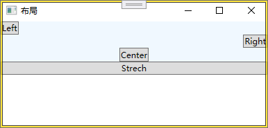
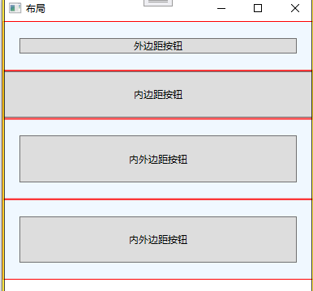
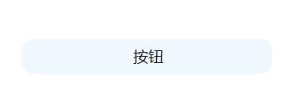

# `wpf`架构

## `DIP`

> **DPI（Dots Per Inch，每英寸点数）** 是衡量物理设备（如显示器、打印机）**输出精度**的度量单位，表示在**1英寸的长度**
>
> **内能显示或打印的点（像素）数量**
>
> 在 WPF (Windows Presentation Foundation) 中，**DIP（Device Independent Pixel，设备无关像素）** 是核心的度量单位，用
>
> 于确保应用程序在不同分辨率的显示设备上保持一致的视觉尺寸和布局。


1. **定义**：

   - **1 DIP = 1/96 英寸**（无论物理设备的分辨率或 DPI 如何）。
   - 这是一个虚拟像素单位，与物理屏幕的像素密度无关。

2. **设计目的**：

   - 解决传统像素（Physical Pixel）在不同 DPI 屏幕上显示尺寸不一致的问题。
   - 例如：
     - 在 96 DPI 的屏幕上：`96 DIP = 1 英寸`。
     - 在 192 DPI（高分辨率）的屏幕上：`96 DIP` 会自动缩放为 `192 物理像素`，**仍占 1 英寸**。

3. **工作原理**：

   - WPF 自动根据系统 DPI 缩放比例将 DIP 转换为物理像素。

     ```
     物理像素 = DIP × (系统DPI / 96)
     ```

   - 示例：

     - 系统 DPI 为 150% (144 DPI) 时：
       `96 DIP × (144/96) = 144 物理像素`。

4. **在代码中的应用**：

   - WPF 中所有控件尺寸（`Width`, `Height`）、边距（`Margin`）、字体大小（`FontSize`）默认使用 DIP 单位。

## 通过控制台创建`WPF`

创建`WPF`应用程序需要引用三个`wpf类库文件`


```c#
[STAThread]//指示单线程
static void Main()
{
    //窗体对象
    Window window = new Window();
    window.Content = "自定义界面";
    window.Title = "MyWPF";
    window.Height = 200;
    window.Width = 200;
     Application application = new Application();
    application.Run(window);
}
```


大多数功能最低的 WPF 程序都包含 Application 类的一个实例和一个或多个 Window 类的实例。可以将 WPF 程序视为单个 Application 对象和一个或多个 Window 对象

## Window类

使用派生类创建窗体,并添加一个按钮对象:

```c#
 public class MyWindow:Window
 {
     public MyWindow()
     {
         Width = 400;
         Height = 400;
         Title = "wpf";
         //声明一个Button对象
         Button btn = new Button();
         btn.Content = "click";
         btn.Width = 100;
         btn.Height = 50;
         //Set the button to be the window content. 
         Content = btn;
         //样式
         WindowStyle = WindowStyle.ThreeDBorderWindow;
     }
 }
 public class Program
 {
     [STAThread]//指示单线程
     static void Main()
     {
         //窗体对象
        MyWindow window = new MyWindow();
          Application application = new Application();
         application.Run(window);
     }
 }
```

:bookmark:`window`常用属性

| **属性类别** | **属性名称** | **取值/说明**                                                |
| :----------- | :----------- | :----------------------------------------------------------- |
| **窗口标识** | Icon         | 指定窗口的图标（图标文件路径或资源）                         |
|              | Title        | 指定窗口标题文本                                             |
| **窗口样式** | WindowStyle  | **None**：无边框（当ResizeMode=NoResize时仅剩核心） **SingleBorderWindow**：单边框 **ThreeDBorderWindow**：3D边框 **ToolWindow**：工具箱窗口 |
| **大小控制** | ResizeMode   | **NoResize**：不可调节，无最大最小按钮 **CanMinimize**：不可调节，可最小化 **CanResize**：可调节 **CanResizeWithGrip**：可调节且显示网格 |
| **窗口层级** | TopMost      | **true**：窗口始终置顶 **false**：正常层级                   |
| **设计尺寸** | Width        | 窗口宽度（单位：设备无关单位）                               |
|              | Height       | 窗口高度（单位：设备无关单位）                               |
| **尺寸限制** | MinWidth     | 窗口最小宽度                                                 |
|              | MaxWidth     | 窗口最大宽度                                                 |
|              | MinHeight    | 窗口最小高度                                                 |
|              | MaxHeight    | 窗口最大高度                                                 |
| **实际尺寸** | ActualWidth  | 窗口实际渲染宽度（运行时计算，只读）                         |
|              | ActualHeight | 窗口实际渲染高度（运行时计算，只读）                         |

## `WPF`应用程序

WPF应用程序模板生成一个包含两个类的程序——一个类继承自Application，另一个类继承自Window


### 颜色


`Brushes`（静态工具类）：

- 专门为 `SolidColorBrush` 提供预定义实例
- 包含常用颜色的静态属性（如 `Brushes.Red`, `Brushes.Blue`）
- 返回的画笔是冻结的（不可修改），优化性能

```c#
public MainWindow()
{
    InitializeComponent();
    Title = "wpf学习";
    Content = "www.ccc";
    //1.设置颜色1
    Background = Brushes.AliceBlue;
    //2设置颜色2
    Background = new SolidColorBrush(Colors.Red);
    //设置颜色3
    Color c = new Color() { A = 255, B = 255, G = 255, R = 255 };
    Background = new SolidColorBrush(c);
}
```

`Color`结构体中`A`属性即`alpha`通道，用来控制图像透明度，数字越大，透明度越低。

#### 线性渐变

`LinearGradientBrush class`有多个构造函数，每个构造函数都允许你以不同的方式指定渐变的特性。最直接的构造函数需要

两个颜色和两个点


在确定起点和终点时，线性渐变的坐标系使用一个从0到1的滑动刻度。

无论实际绘制的项目有多大：

* 高度始终被认为是一个距离为1的值。
* 宽度始终被认为是一个距离为1的值。
* 即使用户更改了窗口或对象的大小，边缘仍然被认为是一个长度为1的单位。


```c#
public MainWindow()
{
    InitializeComponent();
    Title = "wpf学习";
    Content = "www.ccc";
    Point p1 = new Point(0, 0);
    Point p2 = new Point(1, 1);
    LinearGradientBrush br = new LinearGradientBrush(Colors.White, Colors.Beige, p1, p2);
    Background = br ;
}
```


#### 径向渐变

默认情况下， `RadialGradientBrush` 总是从画布中心开始并逐渐向外扩展


```c#
 RadialGradientBrush ra = new RadialGradientBrush(Colors.White,Colors.Black);
 Background = ra ;
```


### `Application`类

每个WPF应用程序都有一个 Application class实例

* The Application 类是 System.Windows 命名空间的成员。这与WindowsForms程序的 Application 类不同，后者位于

  System.Windows.Forms 命名空间中。

* `Run `方法启动程序会调用 `OnStartup`方法。

* Current 属性是一个静态属性，它返回程序`Application `对象的引用。

* StartupUri 属性包含应用程序启动时UI的起始位置。

:bookmark: `Application`的生命周期

```c#
//被WPF框架自动调用
public partial class App : Application
{
    //应用程序启动时做一些初始化工作
    protected override void OnStartup(StartupEventArgs e)
    {
        base.OnStartup(e);
    }

    //窗口处于激活状态
    protected override void OnActivated(EventArgs e)
    {
        base.OnActivated(e);
    }
    //窗口处于非激活状态
    protected override void OnDeactivated(EventArgs e)
    {
        base.OnDeactivated(e);
    }

    //应用程序结束前，结束一些资源
    protected override void OnExit(ExitEventArgs e)
    {
        base.OnExit(e);
    }
}
```

 WPF 应用程序生命周期中**方法执行时触发的对应事件**：

| 事件名称          | 触发方法          | 事件处理器签名                                               |
| :---------------- | :---------------- | :----------------------------------------------------------- |
| **Startup**       | `OnStartup`       | `void App_Startup(object sender, StartupEventArgs e)`        |
| **Exit**          | `OnExit`          | `void App_Exit(object sender, ExitEventArgs e)`              |
| **Activated**     | `OnActivated`     | `void App_Activated(object sender, EventArgs e)`             |
| **Deactivated**   | `OnDeactivated`   | `void App_Deactivated(object sender, EventArgs e)`           |
| **SessionEnding** | `OnSessionEnding` | `void App_SessionEnding(object sender, SessionEndingEventArgs e)` |

```c#
[STAThread]//指示单线程
static void Main()
{
    //窗体对象
    MyWindow window = new MyWindow();
    Application application = new Application();
    application.Startup += Application_Startup;//订阅事件
    application.Deactivated += Application_Deactivated;//订阅事件
    application.Run(window);//调用OnStart方法，触发StartUp事件
}

private static void Application_Deactivated(object sender, EventArgs e)
{
    MessageBox.Show("隐藏到后台了");
}

private static void Application_Startup(object sender, StartupEventArgs e)
{
    MessageBox.Show("应用程序启动");
}
```

### `UI`

#### 控件的继承


:bookmark: 常见的控件


:one: `Content` 属性包含单个内容项。从 ContentControl 类派生的控件继承此属性。

:two: Items 属性是一个可以包含多个内容项的集合。从 ItemsControl 类派生的控件继承此属性。如Listbox 控件，它使用 Items 

属性来保存列表框中显示的项。

:three: Children 属性是一个UI元素的集合。 Children 属性被从 Panel 类派生的类继承。

#### `FrameWorkElelment`

控件均继承于`FrameWorkElelment`.

##### FrameworkElement 属性表

| 属性名              | 对象类型            | 作用说明                                                   |
| :------------------ | :------------------ | :--------------------------------------------------------- |
| Width               | double              | 获取或设置元素的宽度（以与设备无关的单位，1单位=1/96英寸） |
| Height              | double              | 获取或设置元素的高度（以与设备无关的单位，1单位=1/96英寸） |
| ActualWidth         | double              | 获取此元素渲染后的实际宽度（只读）                         |
| ActualHeight        | double              | 获取此元素渲染后的实际高度（只读）                         |
| Name                | string              | 获取或设置元素的标识名称，用于代码引用                     |
| Style               | Style               | 获取或设置元素渲染时使用的样式                             |
| Margin              | Thickness           | 获取或设置元素的外边距                                     |
| HorizontalAlignment | HorizontalAlignment | 获取或设置在父元素中的水平对齐方式                         |
| VerticalAlignment   | VerticalAlignment   | 获取或设置在父元素中的垂直对齐方式                         |
| FocusVisualStyle    | Style               | 获取或设置元素获得键盘焦点时的视觉样式                     |
| FlowDirection       | FlowDirection       | 获取或设置文本和UI元素的流动方向                           |
| DataContext         | object              | 获取或设置元素参与数据绑定的数据上下文                     |
| Resources           | ResourceDictionary  | 获取或设置本地定义的资源字典                               |

##### FrameworkElement 方法表

| 方法名        | 参数                 | 作用说明                                       |
| :------------ | :------------------- | :--------------------------------------------- |
| BringIntoView | 无                   | 尝试将整个元素放入可滚动区域的视图中           |
| BringIntoView | Rect targetRectangle | 尝试将元素的指定矩形区域放入可滚动区域的视图中 |
| FindName      | string name          | 通过名称查找子元素                             |
| FindResource  | object resourceKey   | 通过资源键查找资源，找不到时引发异常           |

##### FrameworkElement 事件表

| 事件名称  | 作用说明                               |
| :-------- | :------------------------------------- |
| Loaded    | 当元素完成布局、渲染并准备好交互时发生 |
| KeyDown   | 当焦点在元素上且按下键盘键时发生       |
| GotFocus  | 当元素获得逻辑焦点时发生               |
| MouseDown | 当鼠标指针在元素上并按下鼠标按钮时发生 |
| MouseMove | 当鼠标指针在元素上移动时发生           |
| Click     | 当在元素上单击鼠标时发生               |


# `XAML`

:bookmark:使用控制台应用程序创建UI面板，必须手动创建对象，且需要明确哪些对象包含哪些对象。


```c#
public class MyWindow : Window
{
    public MyWindow()
    {
        Width = 400;
        Height = 400;
        Title = "xmal";
        Background = Brushes.AntiqueWhite;
        StackPanel stackPanel = new StackPanel();
        TextBlock textBlock = new TextBlock() { Text = "textBlock",FontSize = 20,
                                               HorizontalAlignment = HorizontalAlignment.Center};
        Button btn = new Button() { Content = "Click Me" };
        //按钮文本块在StackPanel容器中
        stackPanel.Children.Add(textBlock);
        stackPanel.Children.Add(btn);
        //StackPanel容器是Window对象的内容
        Content = stackPanel;
    }
}
public class Program
{
    [STAThread]//指示单线程
    static void Main()
    {
        //窗体对象
        MyWindow window = new MyWindow();
        Application application = new Application();
        application.Run(window);
    }
}
```

在`wpf`中，用户界面是一棵WPF类对象树。这棵树有一个顶点节点，树中的每个节点可以有零个或多个子节点。

树结构正好是`XML`特点，WPF设计者利用这一事实创建了一种XML变体，称为`XAML`，用于创建WPF对象树。（`XAML`代表可扩

展应用程序标记语言。）

XAML解析器解释XAML文档并生成WPF对象树


使用`XAML`标记语言创建用户界面:

:one:  一个XAML树由元素组成.

:two: 最顶层或外层的元素是根元素，包含所有其他元素

:three: 每个元素表示一个`wpf`对象


## `App.xaml`

```
App.xaml      // 前端声明（资源/启动配置）
└── App.xaml.cs  // 后台代码（生命周期/事件处理）
    └── 继承 Application 基类
```

`App.xaml`文件关键作用

-  WPF 应用的启动入口（类似控制台程序的 `Main()` 方法）
- 系统自动从此文件开始初始化应用程序

xaml类型的文件包含两部分，一部分以.xaml扩展名结尾的前端代码，另一部分以.xaml.cs结尾的后端代码，通常我们也把后端

代码称为隐藏代码。


## 语法

元素转为为类对象的过程：

:one: 使用无参数构造函数创建对象。

:two: 使用`XAML`元素的`content`部分，设置类对象的默认内容属性。

:three: 将对象的其他属性设置为`XAML`属性中分配的值。

### 元素语法

元素的默认语法由三部分组成——起始标签、内容部分和结束标签，内容区域中的任何内容都将分配给该类的默认内容属性。


### 元素属性

设置对象的其他属性，可以通过使用属性语法来实现。


:one: 属性必须放置在开始标签内，紧随元素名称之后。它们不能出现在内容区域或结束标签中。

:two: 属性的语法由一个标识符组成，该标识符是属性名称，后面跟着一个等号，然后是一个用一对双引号或单引号括起来的字符串。

:three: 一个元素可以有任意数量的属性，这些属性必须用空格分隔——不能用逗号。

### 空元素

有时一个元素不需要内容。例如，你可能想要一个没有文字的按钮，或者上面没有其他任何东西。你可以用

两种方法指定这种元素：

:one:将结束标签立即放置在开始标签之后，或者用空白字符分隔标签.

:two:单标签


### 默认内容属性

可以包含内容WPF类都有一个特殊属性，该属性通过 `[ContentProperty]` 特性指定为其默认内容属性。

默认内容容器的声明可能不在类本身上，可能需要深入继承树才能找到它。


```xaml
<!--Stack可以包含内容，默认属性为Children-->
<StackPanel>
    <Button>按钮</Button> <!--默认内容属性-->
    <Button Content="按钮"></Button> <!--显示声明-->
</StackPanel>
```

### 属性的元素语法

若设置的属性是复杂的对象或几何，可以采用元素属性语法：


尽管它具有元素的语法，但它不会生成对象，它用来设置对象的属性，如设置一个渐变颜色的按钮。


```xaml
<StackPanel>
    <Button Height="20">
        <Button.Background>
            <LinearGradientBrush StartPoint="0,0" EndPoint="1,1">
                <!--位于渐变的开始位置-->
                <GradientStop Color ="Red" Offset="0.0"></GradientStop>
                <!--位于渐变的结束位置-->
                <GradientStop Color ="Wheat" Offset="1.0"></GradientStop>
            </LinearGradientBrush>
        </Button.Background>
    </Button>
</StackPanel>
```

### 附加属性

附加属性是一种特殊的属性类型，它在某个类中定义，但在另一个类中使用

把按钮放在`Grid`的某个单元格内，注意此时的`Row`属性是`Grid`的属性，`Button内部没有该属性`。


### 对象名称

在C#中创建的对象有名称

```c#
Button btn = new Button();
```

在`xaml`中创建的对象默认没有名称

```xaml
<Button>Hi There</Button>
```

许多类都有一个` Name `属性，如果你需要操作该对象，可以使用属性来设置它

```xaml
<Button Name="myButton">Click Me</Button>
```

然而，有些类没有` Name `属性,可以使用指令`x:Name` ,用于为 `XAML` 元素指定一个唯一的标识符名称

```xaml
<Button x:Name="myButton">Click Me</Button>
```

### 命名空间

命名空间使用 xmlns 属性分配在XAML文档根元素的开始标签中,`XAML`标签语言指定了两个标准命名空间：


`wpf`命名空间定义所有 WPF 核心控件和类，`xaml`命名空间提供 `xaml` 语言本身的特性和指令


#### 使用其他命名空间中的类

我们可能需要使用来自不同命名空间中的类型，如本项目中的命名空间定义的类型


如果命名空间位于另一个程序集中，必须还包括程序集名称——不带 .dll 扩展名


自定义一个带背景颜色的按钮类

```c#
public class MyButton :Button
{
    public MyButton()
    {
        Background = new LinearGradientBrush(Colors.Red,Colors.White,new Point(0,0),new Point(1,1));
    }
}
```

使用自定义按钮

```xaml
<StackPanel>
    <local:MyButton Height="20">按钮</local:MyButton>
</StackPanel>
```


### 标签扩展

标签扩展有两种形式，:one:构造函数与多个参数，:two:是属性 = 值形式，多个用逗号分隔。


标记扩展是第一种形式并且有n个构造函数参数，`XAML`解析器会找到具有n个参数的扩展类构造函数，并使用该构造函数来创

建扩展类对象。

如果标记扩展具有属性/值对，则会调用无参数构造函数。一旦对象被构造，其属性会根据属性/ 值对中的值进行设置。

无论哪种方式，一旦对象被构建并设置其属性，XAML解析器就会调用`ProvideValue()`方法，将返回的值赋给目标属性。

:bookmark:自定义扩展类

```c#
public class MyTime : MarkupExtension
{
    private string info;

    public MyTime()
    {
        
    }
    public MyTime(string str)
    {
        info = str;
    }
    public string Info
    {
        get { return info; }
        set { info = value; }
    }
    //主动调用将结果赋值给属性
    public override object ProvideValue(IServiceProvider serviceProvider)
    {
        return String.Format("{0}:{1}", info, DateTime.Now.ToLocalTime().ToString());
    }
}
```

:bookmark:UI界面


```xaml
<StackPanel>
    <Button Content="{local:MyTime Info=当前时间}"></Button>
    <Button Content="{local:MyTime 时间}"></Button>
</StackPanel>
```


### 空白与特殊字符

您出于某种原因需要让`XAML`解析器保留您放置的空白，可以将 xml:space 属性设置为值 preserve


某些字符——例如左尖括号(<)和右尖括号(>)——对`XAML`具有特殊含义。如果你尝试在元素的content 部分使用它们，会混淆

`XAML`解析器。对于这些字符以及其他几个字符，你必须使用特殊字符串来告诉解析器插入相应的字符。

这些特殊字符串被称为字符实体。所有字符实体都以和号字符(&)开头并以分号结束


```xaml
 <StackPanel>
     <Button xml:space="preserve">按   钮</Button>
     <Button>&amp;</Button>
     <Button>&gt;</Button>
     <Button>&quot;</Button>
 </StackPanel>
```

# 布局

## 布局过程

布局过程分为两个步骤，称为测量和排列：

 :one: 测量：在测量阶段，窗口、面板或容器会询问其子元素它们希望的大小。每个子元素通过首先询问其子元素的期望的大

小。当元素从其子元素处收到答案时，它会计算其理想大小并将其返回给其父元素。

:two: 排列：当父元素从子元素处收到所有请求的大小后，它会分配子元素占用的空间。子元素反过来排列其子元素。


:bookmark: 父容器给子元素分配的空间称之为布局槽，子元素默认会占满整个布局槽;同时子元素也会相应布局槽：

:one: 通过 `Width`/`Height` 或内容尺寸决定**实际占用大小**（但不超过布局槽）

:two: 通过 `HorizontalAlignment`/`VerticalAlignment` 决定**在槽内的对齐位置**

:bookmark:为何子元素会沾满整个容器槽?

:red_circle:默认拉伸对齐：WPF元素的默认`HorizontalAlignment`和`VerticalAlignment`值为`Stretch`。这导致子元素自动扩展以填充父级分配的空间.

如顶级容器`window`窗口有一个布局槽，其子元素如`StackPanel`会默认充满整个布局槽。


## 约束元素的大小

`Width 和 Height`:设置实际宽度或高度。

`MinWidth, MaxWidth, MinHeight和 MaxHeight`:设置一个范围，实际宽度或高度必须保持在这个范围内，而不是设置固定的宽

度或高度。

```xaml
 <StackPanel Background="AliceBlue" VerticalAlignment="Top">
     <!--约束在200-400之间，如果插槽比元素小，那么元素通常会截断以适应插槽-->
     <Button MaxWidth="400" MinWidth="200" Content="带约束的按钮" />
     <!--无约束，会随着窗口大小变化而伸缩，以匹配窗口的宽度-->
     <Button  Content="无约束按钮" Background ="Beige"/>
 </StackPanel>
```


## 对齐

> 如果布局槽比元素大，我们可以设置元素在插槽中的对齐方式，可以将值分配给`HorizontalAlignment `和 `VerticalAlignment `
>
> 属性。每个属性都有四个枚举值可供选择：
>
> `HorizontalAlignment: Left, Center, Right,或 Stretch`
>
> `VerticalAlignment: Top, Center, Bottom,或 Stretch`



```xaml
<StackPanel Background="AliceBlue" VerticalAlignment="Top">
    <Button HorizontalAlignment="Left">Left</Button>
    <Button HorizontalAlignment="Right">Right</Button>
    <Button HorizontalAlignment="Center">Center</Button>
    <!--默认行为-->
    <Button HorizontalAlignment="Stretch">Strech</Button>
</StackPanel>
```

:bookmark:内容对齐

可以使用`HorizontalContentAlignment` 或`VerticalContentAlignment `属性设置内容的位置。


```xaml
<StackPanel Background="AliceBlue" VerticalAlignment="Top">
    <Button HorizontalContentAlignment="Left">Left</Button>
    <Button HorizontalContentAlignment="Right">Right</Button>
    <Button HorizontalContentAlignment="Center">Center</Button>
    <!--默认行为-->
    <Button HorizontalContentAlignment="Stretch">Strech</Button>
</StackPanel>
```

## 可见性

可以使用`Visibility` 属性设置控件的可见性。该属性可以取三个枚举值：

:one:` Visible`：这是默认值，使元素可见。


:two:` Hidden`：此值使元素不可见——但元素仍然占用容器的布局空间。

:three: `Collapsed`：此值也使元素不可见——但在此情况下，元素不占用空间。


## 内边距和外边距

内边距是在元素内部添加的额外空间，位于内容和元素的外部边框之间。

外边距是在元素外部添加的额外空间，元素边界与其**容器布局插槽**的距离。


注意两个按钮的间距。

```xaml
<StackPanel Background="AliceBlue" VerticalAlignment="Top">
    <Border BorderBrush="Red" BorderThickness="1">
        <Button Margin="20">外边距按钮</Button>
    </Border>
    <Border BorderBrush="Red" BorderThickness="1">
        <Button Padding="20">内边距按钮</Button>
    </Border>
    <Border BorderBrush="Red" BorderThickness="1">
        <Button Padding="20" Margin="20">内外边距按钮</Button>
    </Border>
    <Border BorderBrush="Red" BorderThickness="1">
        <Button Padding="20" Margin="20">内外边距按钮</Button>
    </Border>
</StackPanel>
```



## `Panel`

> `panel`是布局的容器，可以包含多个控件对象。


不同面板的布局槽特性：

| 面板类型       | 插槽特性                   |
| :------------- | :------------------------- |
| **Grid**       | 单元格定义的精确区域       |
| **StackPanel** | 连续排列的条状区域         |
| **DockPanel**  | 根据 Dock 值划分的边缘区域 |
| **Canvas**     | 整个 Canvas 区域（无约束） |
| **WrapPanel**  | 动态计算的连续区块         |


### `StackPanel`

> 将子元素排列成水平或垂直的一行。

| 属性名          | 默认值        | 说明                                                         |
| :-------------- | :------------ | :----------------------------------------------------------- |
| `Orientation`   | `Vertical`    | 子元素排列方向： `Vertical`（垂直，默认） `Horizontal`（水平） |
| `FlowDirection` | `LeftToRight` | 设置元素在父元素中排列的方向                                 |


```xaml
<Grid Height="385" VerticalAlignment="Bottom">
    <!--定义行 高度比2:8-->
    <Grid.RowDefinitions>
        <RowDefinition Height="1*"/>
        <RowDefinition Height="9*"/>
    </Grid.RowDefinitions>
    <StackPanel Orientation="Horizontal">
        <Button Content="提交" Width="50" Margin="2"></Button>
        <Button Content="发布"  Width="50" Margin="2"></Button>
        <Button Content="测试" Width="50" Margin="2"></Button>
    </StackPanel>
</Grid>
```

:bookmark: StackPanel 中元素不同方向的对齐支持：

| 方向     | HorizontalAlignment | VerticalAlignment | 原因                    |
| :------- | :------------------ | :---------------- | :---------------------- |
| **垂直** | ✔️ 有效              | ❌ 无效            | 元素的高度 = 布局槽高度 |
| **水平** | ❌ 无效              | ✔️ 有效            | 元素的宽度=布局槽宽度   |

:red_circle:使用`FlowDirection="RightToLeft"`会反转坐标系，使得原来的左变为右方向（了解）。

```xaml
<StackPanel Background="AliceBlue" VerticalAlignment="Top" 
            FlowDirection ="RightToLeft">
    <Button HorizontalAlignment="Right">提交</Button>
    <Button HorizontalAlignment="Right">提交</Button>
    <Button HorizontalAlignment="Right">提交</Button>
    <Button HorizontalAlignment="Right">提交</Button>
</StackPanel>
```


### `WrapPanel`


`WrapPanel` 将元素并排放置，一个接一个，但与 StackPanel不同，当元素到达 WrapPanel的末尾时，它们会开始新的一行或列。

默认情况下， WrapPanel 从左上角开始，并将每个后续元素放置在先前元素右侧,但也有三种其他可能性：


可以使用 `ItemHeight` 或 `ItemWidth` 属性来设置 `WrapPanel`中元素的布局槽大小

```xaml
<WrapPanel Background="AliceBlue" ItemHeight="80">
    <!--默认Stretch-->
    <Button>按钮1</Button>
    <Button VerticalAlignment="Top">按钮2</Button>
    <Button VerticalAlignment="Center">按钮3</Button>
    <Button VerticalAlignment="Bottom">按钮4</Button>
    <Button VerticalAlignment="Stretch">按钮5</Button>
</WrapPanel>
```


### `Grid`

`Grid`是一个由行和列定义的单元格组成的容器。


`Grid` 可以包含任意数量的行和列。规定第一行是行0，第一列是列0。

:one: 默认情况下，分隔单元格的网格线是不可见的。你可以通过将 `ShowGridLines` 属性设置为 `True`来使它们可见，
:two: 默认情况下，一个 `Grid`有一个行和一个列。所以即使没有定义任何行或列，仍然有行0和列0。

:bookmark:使用属性元素语法定义行与列

```xaml
 <Grid>
     <Grid.RowDefinitions>
         <RowDefinition></RowDefinition>
     </Grid.RowDefinitions>
     <!--属性的元素语法 相当于
     var grid = new Grid();
     grid.RowDefinitions.Add(new RowDefinition());
     -->
 </Grid>
```

单元格设置好后，可以为元素设置 `Grid.Row` 和 `Grid.Column`附加属性来显式地将项添加到单元格中

| **属性名**          | **应用对象** | **类型**                     | **默认值** | **说明**                                     |
| :------------------ | :----------- | :--------------------------- | :--------- | :------------------------------------------- |
| **Grid 自身属性**   |              |                              |            |                                              |
| `ShowGridLines`     | Grid         | `bool`                       | `false`    | 是否显示虚线网格线（调试用）                 |
| `RowDefinitions`    | Grid         | `RowDefinitionCollection`    | 空集合     | 行定义集合（通过 `<RowDefinition>` 添加）    |
| `ColumnDefinitions` | Grid         | `ColumnDefinitionCollection` | 空集合     | 列定义集合（通过 `<ColumnDefinition>` 添加） |
| **子控件附加属性**  |              |                              |            |                                              |
| `Grid.Row`          | 子控件       | `int`                        | `0`        | 子控件所在行索引（从 0 开始）                |
| `Grid.Column`       | 子控件       | `int`                        | `0`        | 子控件所在列索引（从 0 开始）                |
| `Grid.RowSpan`      | 子控件       | `int`                        | `1`        | 子控件跨越的行数（纵向合并单元格）           |
| `Grid.ColumnSpan`   | 子控件       | `int`                        | `1`        | 子控件跨越的列数（横向合并单元格）           |


```xaml
<Grid ShowGridLines="True">
    <Grid.RowDefinitions>
        <RowDefinition></RowDefinition>
        <RowDefinition></RowDefinition>
        <RowDefinition></RowDefinition>
    </Grid.RowDefinitions>
    <Grid.ColumnDefinitions>
        <ColumnDefinition></ColumnDefinition>
        <ColumnDefinition></ColumnDefinition>
        <ColumnDefinition></ColumnDefinition>
    </Grid.ColumnDefinitions>
    <Button>按钮1</Button> <!--默认在行0，列0-->
    <Button Grid.Row="1" Grid.Column="1">按钮2</Button>
    <Button Grid.Column="2" Grid.Row="2">按钮3</Button>
</Grid>
```

#### 跨越单元格

当你在单元格中放置一个元素时，你也可以指定该元素跨越多个单元格。使用以下一个或两个附加属性来完成
此操作：


1. `Grid.ColumnSpan`用于指定跨越的列数。
2. `Grid.RowSpan `用于指定跨越的行数。


```xaml
<Grid.RowDefinitions>
    <RowDefinition/>
    <RowDefinition/>
    <RowDefinition Height="30"/>
</Grid.RowDefinitions>
<Grid.ColumnDefinitions>
    <ColumnDefinition/>
    <ColumnDefinition/>
</Grid.ColumnDefinitions>
<Border Margin="3" Background="#f24f1c"/>
<Border Margin="3" Background="#7fba00" Grid.Column="1"/>
<Border Margin="3" Grid.Row="1" Background="#00a7f0"/>
<Border Margin="3" Grid.Row="1" Grid.Column="1" Background="#feb900"/>
<!--设置跨行-->
<TextBlock Grid.Row="2" Text="Microsoft" FontSize="20" HorizontalAlignment="Center"
           VerticalAlignment="Center" Grid.ColumnSpan="2"/>
```

#### 调整行列的大小

Grid 提供了三种控制行列大小的途径：
:one: 绝对尺寸：行和列被赋予绝对大小。
:two: 自动尺寸：行和列会自动调整大小以匹配内容的大小。
:three: 按比例大小：可用空间按比例分配给行和列。

##### 绝对尺寸

在行定义中设置 Height 属性：

`<RowDefinition Height="40"></RowDefinition>`

在列定义中设置 Width 属性：

`<ColumnDefinition Width="40"></ColumnDefinition>`

```xaml
<Grid ShowGridLines="True">
    <Grid.RowDefinitions>
        <RowDefinition Height="60"></RowDefinition>
        <RowDefinition ></RowDefinition>
        <RowDefinition></RowDefinition>
    </Grid.RowDefinitions>
    <Grid.ColumnDefinitions>
        <ColumnDefinition Width="35"></ColumnDefinition>
        <ColumnDefinition Width="150"></ColumnDefinition>
    </Grid.ColumnDefinitions>
    <Button>btn</Button>
    <Button Grid.Column="1" Grid.Row="1">btn_150</Button>
</Grid>
```

使用绝对尺寸设置的单元格在 Grid尺寸变化时保持相同大小。


##### 自动尺寸


```xaml
<Grid ShowGridLines="True">
    <Grid.RowDefinitions>
        <RowDefinition Height="auto"></RowDefinition>
    </Grid.RowDefinitions>
    <Grid.ColumnDefinitions>
        <ColumnDefinition Width="auto"></ColumnDefinition>
        <ColumnDefinition Width="auto"></ColumnDefinition>
    </Grid.ColumnDefinitions>
    <Button>Short1</Button>
    <Button Grid.Column="1">Short2</Button>
</Grid>
```

##### 比例

一个具有按比例分隔的列或行的网格会先调整绝对尺寸和自动调整大小的行和列，然后将剩余的空间按比例分配给按比例调整大小的行和列


### `DockPanel`

DockPanel 是 WPF 中用于动态停靠控件的布局容器，它允许子元素沿容器的边缘 (上、下、左、右) 停靠，剩余空间可填充最后一个子元素。
:one: 默认情况下， `DockPanel` 中的元素会向左停靠。
:two: 默认情况下，面板中最后放置的元素会扩展以填充剩余空间。将`DockPanel`的 `LastChildFill`属性设置为` False`来关闭此功能。

:red_circle:后放置的元素会从剩余的空间中继续分配空间


```xaml
<DockPanel LastChildFill="False">
    <Button>按钮1</Button> <!--默认停靠左侧-->
    <Button>按钮2</Button>
    <Button>按钮3</Button>
</DockPanel>
```

附加属性

| 属性名           | 类型   | 默认值 | 说明                                               |
| :--------------- | :----- | :----- | :------------------------------------------------- |
| `DockPanel.Dock` | `Dock` | `Left` | **指定停靠位置**：`Left`, `Right`, `Top`, `Bottom` |

```xaml
<DockPanel>
    <Button DockPanel.Dock="Top">按钮1</Button> 
    <Button DockPanel.Dock="Right">按钮2</Button>
    <Button DockPanel.Dock="Bottom">按钮3</Button>
    <Button>按钮4</Button>
    <Button Background="AliceBlue">按钮5</Button>
</DockPanel>
```


# 内容和控件


## 图像元素

`Image` 元素仅用于显示图像。它不是控件，因为用户没有任何可交互的内容。


```xaml
<StackPanel Background="AliceBlue">
    <Image Source ="D:\LZBapplication\VSinstall\sharpcode\MyWpf\MyWpf\Resources\searc.ico"  Width="200" HorizontalAlignment="Left"/>
</StackPanel>
```


## 内容控件

`ContentControl`允许其他WPF元素、控件和面板作为其内容。

:one: 内容控件只允许单个内容元素（除了`HeaderedContentControl`）。

:two: 标签内容赋值给 Content 属性，该属性接受类型为 object的元素。


内容的渲染方式取决于多个因素：

:one: 如果赋值给 `Content`属性的对象是从 `UIElement`派生出来的，`WPF`知道如何渲染它
:two: 如果对象不是从 UIElement派生出来的，有两种可能性：

1. 如果对象是一个具有相关数据模板的数据对象，则使用该模板来渲染它。
2. 如果对象没有模板，则WPF调用对象的 ToString方法，该方法默认打印出对象所属类的名称。

### Lable

> 主要用于静态显示一些内容。通常这些内容是文本，但由于这是一个`ContentContro`l，它可以包含任何内容，例如图片
>
> 或任何其他来自 UIElement的元素。


```c#
<StackPanel Background="AliceBlue">
    <Label>
        <Image Source="Res\searc.ico" Height="50"></Image>
    </Label>
    <Label Background="AntiqueWhite"
           Margin="10"
           HorizontalAlignment="Left">图像</Label>
    <!--Margin支持四个参数，分别代表左上右下，也支持两个参数，代表左右，上下；
一个参数代表上下左右边距-->
</StackPanel>
```

### button

| 常用属性                              |                                                              |
| ------------------------------------- | ------------------------------------------------------------ |
| `public bool IsCancel { get; set; }`  | 指示 [Button](https://learn.microsoft.com/zh-cn/dotnet/api/system.windows.controls.button?view=windowsdesktop-9.0) 是否是一个取消按钮, 用户可以通过按 ESC 键来激活 Cancel 按钮。 |
| `public bool IsDefault { get; set; }` | 是否是一个确认按钮, 用户可以通过按 `Enter` 键来激活确认按钮。 |


```c#
<Grid>
    <Button Height="30" Name="btn" Background="#ffeeee"
            FontSize="16" FontFamily="宋体" FontWeight="Bold"
            Margin="20,0" Content="提交"
            Click="Button_Click"
            MouseMove="Button_MouseMove"
            >
    </Button>
</Grid>
 //事件
   private void Button_Click(object sender, RoutedEventArgs e)
    {
        MessageBox.Show("点击事件");
    }
    /// <summary>
    /// 鼠标移入按钮，背景变色
    /// </summary>
    /// <param name="sender"></param>
    /// <param name="e"></param>
    private void Button_MouseMove(object sender, MouseEventArgs e)
    {
        this.btn.Background = new SolidColorBrush(Color.FromRgb(250,240,240));
    }
```

在模态窗口中设置 `IsCancel` 按钮，内部会执行 `DialogResult = false`，然后关闭模态窗口

### TextBlock

> 提供一个轻型控件，用于显示少量内容。

```c#
<Grid>
    <TextBlock Foreground="#ff0000" 
               Background="Aqua" 
               Height="50"
               Width="200"
               FontWeight="Bold"
               FontSize="20"
               >
        文本一<LineBreak/>
        文本二
    </TextBlock>
    <!--<LineBreak/>表用用于换行-->
</Grid>
```

### Border

> 在另一个元素四周绘制边框和/或背景。
>
> [Border](https://learn.microsoft.com/zh-cn/dotnet/api/system.windows.controls.border?view=windowsdesktop-6.0) 只能有一个子级。 若要显示多个子元素，需要在父 [Border](https://learn.microsoft.com/zh-cn/dotnet/api/system.windows.controls.border?view=windowsdesktop-6.0)内放置一个附加[Panel](https://learn.microsoft.com/zh-cn/dotnet/api/system.windows.controls.panel?view=windowsdesktop-6.0)元素。 然后，可以在该 [Panel](https://learn.microsoft.com/zh-cn/dotnet/api/system.windows.controls.panel?view=windowsdesktop-6.0) 元素中放置子元素。
>
> 如果要在内容周围显示边框，必须将元素放在父 [Border](https://learn.microsoft.com/zh-cn/dotnet/api/system.windows.controls.border?view=windowsdesktop-6.0) 元素中。



```c#
<Grid>
    <Border Background="AliceBlue" Width="200" Height="30" CornerRadius="10"
            BorderThickness="1"
            >
        <Button Content="按钮" Width="200" Height=" 20" BorderBrush="Transparent"
                Background="Transparent" 
                Click="Button_Click">
        </Button>
    </Border>
</Grid>
```

| 常用属性                                         |                                                              |
| ------------------------------------------------ | ------------------------------------------------------------ |
| `public Brush BorderBrush { get; set; }`         | 设置外部边框颜色                                             |
| `public CornerRadius CornerRadius { get; set; }` | 圆角                                                         |
| `public bool IsCancel { get; set; }`             | 指示 [Button](https://learn.microsoft.com/zh-cn/dotnet/api/system.windows.controls.button?view=windowsdesktop-9.0) 是否是一个取消按钮, 用户可以通过按 ESC 键来激活 Cancel 按钮。 |
| `public bool IsDefault { get; set; }`            | 是否是一个确认按钮, 用户可以通过按 `Enter` 键来激活确认按钮。 |

### `RadioButton`与`CheckBox`

`CheckBox` 和 `RadioButton` 控件是按钮的特殊形式，它们会维护状态。

每次用户点击一个 CheckBox，它通过设置或取消`IsChecked `属性在选中和非选中状态之间切换。


```xaml
<StackPanel Background ="#F5F5F5">
    <CheckBox Margin="5,10,0,0">Option1</CheckBox>
    <CheckBox Margin="5,0,0,0">Option2</CheckBox>
    <RadioButton Margin="5,10,0,0">one of three</RadioButton>
    <RadioButton Margin="5,0,0,0">two of three</RadioButton>
    <RadioButton Margin="5,0,0,0">threeof three</RadioButton>
</StackPanel>
```

#### 分组


```c#
<Grid>
    <RadioButton GroupName="sex" Content="男" Foreground="#ff0000"/>
    <RadioButton GroupName="sex" Content="女" Margin="40,0"/>
    <RadioButton Content="DIN标准" Margin="0,20"/>
    <RadioButton Content="ISO标准" Margin="80,20"/>
    <RadioButton Content="GB标准" Margin="160,20"/>
</Grid>
```

:red_circle:radioButton 如果需要实现分组的效果 

1. 使⽤布局容器来嵌套 （如grid /stackPanel等等）
2. 可以使⽤groupName进⾏区分 


:bookmark:界面`UI`

```xml
<Grid Name="mainGrid">
    <Label Content="选课" Width="200" HorizontalAlignment="Left"/>
    <CheckBox Content="C#" Width="200" HorizontalAlignment="Left" Margin="10,30"/>
    <CheckBox Content="数据结构" Width="200" HorizontalAlignment="Left" Margin="10,60"/>
    <CheckBox Content="二次开发" Width="200" HorizontalAlignment="Left" Margin="10,90"/>
    <Button Content="获取我的选课"  VerticalAlignment="Top"
            Margin="0,120" Height="30" FontSize="15"
            Background="AliceBlue"
            Click="Button_Click_1"/>
</Grid>
```

:bookmark:点击事件

```c#
private void Button_Click_1(object sender, RoutedEventArgs e)
{
    UIElementCollection eleCol = this.mainGrid.Children;
    StringBuilder sb = new StringBuilder();
    sb.Append("选择的课程是");
    foreach (UIElement ele in eleCol)
    {
        if (ele is CheckBox && (ele as CheckBox).IsChecked.GetValueOrDefault())
        {
            sb.Append((ele as CheckBox).Content);
        }
    }
    MessageBox.Show(sb.ToString());
}
```

## `window`类

### 模态对话框

模态对话框，是一个专注于显示特定信息集或从用户收集信息的窗口。

 `Window` 类有一个可空的 bool 属性名为 DialogResult ，尽管它是所有窗口的成员，但只有在窗口是模态对话框时才能设置。

在调用 ShowDialog之前，它的值为 null。

显示 `WPF` 模态窗口后，设置 `DialogResult` 为 `true` 或 `false` 会自动关闭窗口，不需要额外调用 `Close()`。

值得注意的是`window.ShowDialog()`的具体返回值取决于窗口关闭时 `DialogResult` 属性的值。


设置 DialogResult的值有几种方法：

:one: 在模态窗口的逻辑中，您可以设置值为 true 或 false。

:two: 如果用户使用窗口栏中的关闭图标关闭窗口，系统将设置 DialogResult 值为 false。

:three: 可以在对话框上设置专门指定的按钮。

* 将按钮的 IsCancel 属性设置为 true ，并且用户点击该按钮，系统将自动设置
  DialogResult 为 false 并关闭窗口。
* 将按钮的 `IsDefault` 属性设置为 true ，用户点击该按钮，将调用按钮的事件处理程序，将 DialogResult 值设置为 true 或 false 并关闭窗口。


# 文本控件

# 条目控件


