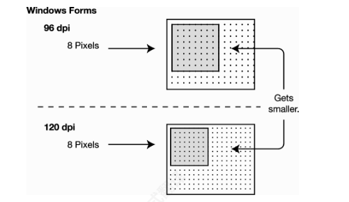
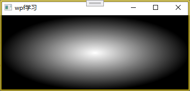
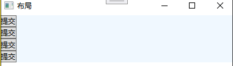
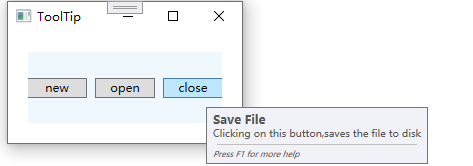
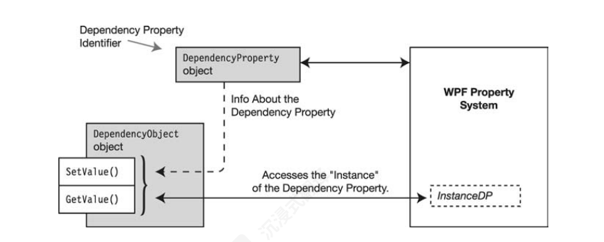
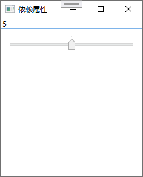
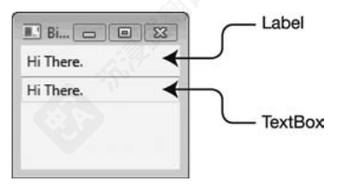
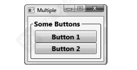

# `wpf`概述

## 系统`DPI`与`wpf`单位

要在屏幕上布局一个窗口，Windows必须假设屏幕每英寸有多少点（或像素）（dpi）。

`winform`使用像素作为长度单位,通常假设系统每英寸有96像素，并据此编写代码。但如果将用户设置从96dpi更改为120dpi：在96dpi下长度为1英寸（即96像素）的东西，在120dpi下变成了0.8英寸长.



> 在 WPF (Windows Presentation Foundation) 中，**DIP（Device Independent Pixel，设备无关像素）** 是核心的度量单位，用
>
> 于确保应用程序在不同分辨率的显示设备上保持一致的视觉尺寸和布局。


1. **定义**：

   - **1 DIP = 1/96 英寸**（无论物理设备的分辨率或 DPI 如何）。
   - 这是一个虚拟像素单位，与物理屏幕的像素密度无关。
2. **设计目的**：

   - 解决传统像素（Physical Pixel）在不同 DPI 屏幕上显示尺寸不一致的问题。
   - 例如：
     - 在 96 DPI 的屏幕上：`96 DIP = 1 英寸`。
     - 在 192 DPI（高分辨率）的屏幕上：`96 DIP` 仍为1英寸，但占据 192 物理像素。

## 通过控制台创建`WPF`

创建`WPF`应用程序需要引用三个`wpf类库文件`


```c#
[STAThread]//指示单线程
static void Main()
{
    //窗体对象
    Window window = new Window();
    window.Content = "自定义界面";
    window.Title = "MyWPF";
    window.Height = 200;
    window.Width = 200;
     Application application = new Application();
    application.Run(window);
}
```


大多数功能最低的 WPF 程序都包含 Application 类的一个实例和一个或多个 Window 类的实例。可以将 WPF 程序视为单个 Application 对象和一个或多个 Window 对象

## Window

使用派生类创建窗体,并添加一个按钮对象:

```c#
 public class MyWindow:Window
 {
     public MyWindow()
     {
         Width = 400;
         Height = 400;
         Title = "wpf";
         //声明一个Button对象
         Button btn = new Button();
         btn.Content = "click";
         btn.Width = 100;
         btn.Height = 50;
         //Set the button to be the window content. 
         Content = btn;
         //样式
         WindowStyle = WindowStyle.ThreeDBorderWindow;
     }
 }
 public class Program
 {
     [STAThread]//指示单线程
     static void Main()
     {
         //窗体对象
        MyWindow window = new MyWindow();
          Application application = new Application();
         application.Run(window);
     }
 }
```

## `WPF`应用程序

WPF应用程序模板生成一个包含两个类的程序——一个类继承自Application，另一个类继承自Window


### 颜色


`Brushes`（静态工具类）：

- 专门为 `SolidColorBrush` 提供预定义实例
- 包含常用颜色的静态属性（如 `Brushes.Red`, `Brushes.Blue`）
- 返回的画笔是冻结的（不可修改），优化性能

```c#
public MainWindow()
{
    InitializeComponent();
    Title = "wpf学习";
    Content = "www.ccc";
    //1.设置颜色1
    Background = Brushes.AliceBlue;
    //2设置颜色2
    Background = new SolidColorBrush(Colors.Red);
    //设置颜色3
    Color c = new Color() { A = 255, B = 255, G = 255, R = 255 };
    Background = new SolidColorBrush(c);
}
```

`Color`结构体中`A`属性即`alpha`通道，用来控制图像透明度，数字越大，透明度越低。

#### 线性渐变

`LinearGradientBrush class`有多个构造函数，每个构造函数都允许你以不同的方式指定渐变的特性。最直接的构造函数需要

两个颜色和两个点


在确定起点和终点时，线性渐变的坐标系使用一个从0到1的滑动刻度。

无论实际绘制的项目有多大：

* 高度始终被认为是一个距离为1的值。
* 宽度始终被认为是一个距离为1的值。
* 即使用户更改了窗口或对象的大小，边缘仍然被认为是一个长度为1的单位。


```c#
public MainWindow()
{
    InitializeComponent();
    Title = "wpf学习";
    Content = "www.ccc";
    Point p1 = new Point(0, 0);
    Point p2 = new Point(1, 1);
    LinearGradientBrush br = new LinearGradientBrush(Colors.White, Colors.Beige, p1, p2);
    Background = br ;
}
```


#### 径向渐变

默认情况下， `RadialGradientBrush` 总是从画布中心开始并逐渐向外扩展


```c#
 RadialGradientBrush ra = new RadialGradientBrush(Colors.White,Colors.Black);
 Background = ra ;
```



### `Application`类

每个WPF应用程序都有一个 Application class实例

* The Application 类是 System.Windows 命名空间的成员。这与WindowsForms程序的 Application 类不同，后者位于

  System.Windows.Forms 命名空间中。

* `Run `方法启动程序会调用 `OnStartup`方法。

* Current 属性是一个静态属性，它返回程序`Application `对象的引用。

* StartupUri 属性包含应用程序启动时UI的起始位置。

:bookmark: `Application`的生命周期

```c#
//被WPF框架自动调用
public partial class App : Application
{
    //应用程序启动时做一些初始化工作
    protected override void OnStartup(StartupEventArgs e)
    {
        base.OnStartup(e);
    }

    //窗口处于激活状态
    protected override void OnActivated(EventArgs e)
    {
        base.OnActivated(e);
    }
    //窗口处于非激活状态
    protected override void OnDeactivated(EventArgs e)
    {
        base.OnDeactivated(e);
    }

    //应用程序结束前，结束一些资源
    protected override void OnExit(ExitEventArgs e)
    {
        base.OnExit(e);
    }
}
```

 WPF 应用程序生命周期中**方法执行时触发的对应事件**：

| 事件名称          | 触发方法          | 事件处理器签名                                               |
| :---------------- | :---------------- | :----------------------------------------------------------- |
| **Startup**       | `OnStartup`       | `void App_Startup(object sender, StartupEventArgs e)`        |
| **Exit**          | `OnExit`          | `void App_Exit(object sender, ExitEventArgs e)`              |
| **Activated**     | `OnActivated`     | `void App_Activated(object sender, EventArgs e)`             |
| **Deactivated**   | `OnDeactivated`   | `void App_Deactivated(object sender, EventArgs e)`           |
| **SessionEnding** | `OnSessionEnding` | `void App_SessionEnding(object sender, SessionEndingEventArgs e)` |

```c#
[STAThread]//指示单线程
static void Main()
{
    //窗体对象
    MyWindow window = new MyWindow();
    Application application = new Application();
    application.Startup += Application_Startup;//订阅事件
    application.Deactivated += Application_Deactivated;//订阅事件
    application.Run(window);//调用OnStart方法，触发StartUp事件
}

private static void Application_Deactivated(object sender, EventArgs e)
{
    MessageBox.Show("隐藏到后台了");
}

private static void Application_Startup(object sender, StartupEventArgs e)
{
    MessageBox.Show("应用程序启动");
}
```

### `UI`

#### 控件的继承


:bookmark: 常见的控件


:one: `Content` 属性包含单个内容项。从 ContentControl 类派生的控件继承此属性。

:two: Items 属性是一个可以包含多个内容项的集合。从 ItemsControl 类派生的控件继承此属性。如Listbox 控件，它使用 Items 

属性来保存列表框中显示的项。

:three: Children 属性是一个UI元素的集合。 Children 属性被从 Panel 类派生的类继承。

#### `FrameWorkElelment`

控件均继承于`FrameWorkElelment`.

##### FrameworkElement 属性表

| 属性名              | 对象类型            | 作用说明                                                   |
| :------------------ | :------------------ | :--------------------------------------------------------- |
| Width               | double              | 获取或设置元素的宽度（以与设备无关的单位，1单位=1/96英寸） |
| Height              | double              | 获取或设置元素的高度（以与设备无关的单位，1单位=1/96英寸） |
| ActualWidth         | double              | 获取此元素渲染后的实际宽度（只读）                         |
| ActualHeight        | double              | 获取此元素渲染后的实际高度（只读）                         |
| Name                | string              | 获取或设置元素的标识名称，用于代码引用                     |
| Style               | Style               | 获取或设置元素渲染时使用的样式                             |
| Margin              | Thickness           | 获取或设置元素的外边距                                     |
| HorizontalAlignment | HorizontalAlignment | 获取或设置在父元素中的水平对齐方式                         |
| VerticalAlignment   | VerticalAlignment   | 获取或设置在父元素中的垂直对齐方式                         |
| FocusVisualStyle    | Style               | 获取或设置元素获得键盘焦点时的视觉样式                     |
| FlowDirection       | FlowDirection       | 获取或设置文本和UI元素的流动方向                           |
| DataContext         | object              | 获取或设置元素参与数据绑定的数据上下文                     |
| Resources           | ResourceDictionary  | 获取或设置本地定义的资源字典                               |

##### FrameworkElement 方法表

| 方法名        | 参数                 | 作用说明                                       |
| :------------ | :------------------- | :--------------------------------------------- |
| BringIntoView | 无                   | 尝试将整个元素放入可滚动区域的视图中           |
| BringIntoView | Rect targetRectangle | 尝试将元素的指定矩形区域放入可滚动区域的视图中 |
| FindName      | string name          | 通过名称查找子元素                             |
| FindResource  | object resourceKey   | 通过资源键查找资源，找不到时引发异常           |

##### FrameworkElement 事件表

| 事件名称  | 作用说明                               |
| :-------- | :------------------------------------- |
| Loaded    | 当元素完成布局、渲染并准备好交互时发生 |
| KeyDown   | 当焦点在元素上且按下键盘键时发生       |
| GotFocus  | 当元素获得逻辑焦点时发生               |
| MouseDown | 当鼠标指针在元素上并按下鼠标按钮时发生 |
| MouseMove | 当鼠标指针在元素上移动时发生           |
| Click     | 当在元素上单击鼠标时发生               |

# `XAML`

:bookmark:使用控制台应用程序创建UI面板，必须手动创建对象，且需要明确哪些对象包含哪些对象。


```c#
public class MyWindow : Window
{
    public MyWindow()
    {
        Width = 400;
        Height = 400;
        Title = "xmal";
        Background = Brushes.AntiqueWhite;
        StackPanel stackPanel = new StackPanel();
        TextBlock textBlock = new TextBlock() { Text = "textBlock",FontSize = 20,
                                               HorizontalAlignment = HorizontalAlignment.Center};
        Button btn = new Button() { Content = "Click Me" };
        //按钮文本块在StackPanel容器中
        stackPanel.Children.Add(textBlock);
        stackPanel.Children.Add(btn);
        //StackPanel容器是Window对象的内容
        Content = stackPanel;
    }
}
public class Program
{
    [STAThread]//指示单线程
    static void Main()
    {
        //窗体对象
        MyWindow window = new MyWindow();
        Application application = new Application();
        application.Run(window);
    }
}
```

在`wpf`中，用户界面是一棵WPF类对象树。这棵树有一个顶点节点，树中的每个节点可以有零个或多个子节点。

树结构正好是`XML`特点，WPF设计者利用这一事实创建了一种XML变体，称为`XAML`，用于创建WPF对象树。（`XAML`代表可扩

展应用程序标记语言。）

XAML解析器解释XAML文档并生成WPF对象树


使用`XAML`标记语言创建用户界面:

:one:  一个XAML树由元素组成.

:two: 最顶层或外层的元素是根元素，包含所有其他元素

:three: 每个元素表示一个`wpf`对象


## `App.xaml`与`MainWindow.xaml`

```
App.xaml      // 前端声明（资源/启动配置）
└── App.xaml.cs  // 后台代码（生命周期/事件处理）
    └── 继承 Application 基类
```

`App.xaml`文件关键作用

-  WPF 应用的启动入口（类似控制台程序的 `Main()` 方法）
- 系统自动从此文件开始初始化应用程序

xaml类型的文件包含两部分，一部分以.xaml扩展名结尾的前端代码，另一部分以.xaml.cs结尾的后端代码，通常我们也把后端

代码称为隐藏代码。


:bookmark: `MainWindow`程序的主窗体

```xaml
<Window x:Class="MyWpf.MainWindow"
        xmlns="http://schemas.microsoft.com/winfx/2006/xaml/presentation"
        xmlns:x="http://schemas.microsoft.com/winfx/2006/xaml"
        Title="wpf"  
        Width="250" Height="300"
        Topmost="True">
```


可以在`XAML`标签上使用`xlmns`特征来定义命名空间(`XML-Namespace`的简写)，当来源不同的类重名时，可以使用名称空间加以区分。

```xaml
xmlns[:可选映射前缀] = "命名空间" 
映射前缀的意思是该名称空间的别名
```

没有映射前缀的名称空间称为默认的名称空间，所有来自这个名称空间的标签都不用加前缀。

## 语法

元素转为为类对象的过程：

:one: 使用无参数构造函数创建对象。

:two: 使用`XAML`元素的内容部分，赋值给类对象的默认内容属性。

:three: 将`XAML`特征中的值赋值给对象的其他属性。

### 元素语法

元素的默认语法由三部分组成——起始标签、内容部分和结束标签，内容区域中的任何内容都将分配给该类的默认内容属性。


设置对象的其他属性，可以通过特性语法来实现。


:one: 特性必须放置在开始标签内，紧随元素名称之后。它们不能出现在内容区域或结束标签中。

:two: 特性语法由一个标识符组成，该标识符会映射到对象的属性名称，后面跟着一个等号，然后是用一对双引号括起来的字符串。

:three: 一个元素可以有任意数量的特性，这些特性必须用空格分隔——不能用逗号。

### 空元素

有时一个元素不需要内容。例如，你可能想要一个没有文字的按钮，或者上面没有其他任何东西。你可以用

两种方法指定这种元素：

:one:将结束标签立即放置在开始标签之后，或者用空白字符分隔标签.

:two:单标签


### 默认内容属性

可以包含内容WPF类都有一个特殊属性，该属性通过 `[ContentProperty]` 特性指定为其默认内容属性。

默认内容容器的声明可能不在类本身上，可能需要深入继承树才能找到它。


```xaml
<!--Stack可以包含内容，默认属性为Children-->
<StackPanel>
    <Button>按钮</Button> <!--默认内容属性-->
    <Button Content="按钮"></Button> <!--显示声明-->
</StackPanel>
```

对于布局控件

```xaml
<StackPanel>
    <Button/>
    <Button/>
    <Button/>
</StackPanel>
```

默认内容属性为`public System.Windows.Controls.UIElementCollection Children { get; }`,实际编译过程中会执行`public virtual int Add(System.Windows.UIElement element)`方法，将每一个元素添加到集合`UIElementCollection`中。

### 属性元素语法

若设置的属性是复杂的对象或几何，可以采用属性元素语法：


尽管它具有元素的语法，但它不会生成对象，它用来设置对象的属性，如设置一个渐变颜色的按钮。


```xaml
<StackPanel>
    <Button Height="20">
        <Button.Background>
            <LinearGradientBrush StartPoint="0,0" EndPoint="1,1">
                <!--位于渐变的开始位置-->
                <GradientStop Color ="Red" Offset="0.0"></GradientStop>
                <!--位于渐变的结束位置-->
                <GradientStop Color ="Wheat" Offset="1.0"></GradientStop>
            </LinearGradientBrush>
        </Button.Background>
    </Button>
</StackPanel>
```

再比如在按钮中加个图片，`public object Content { get; set; }`属性是个`object`类型，所以它可以接受任何类型。


```xaml
<StackPanel>
    <Button HorizontalAlignment="Left" Margin="5"
            Click="Btn_Click">
        <Button.Content>
            <StackPanel Orientation="Horizontal">
                <Image Source="Res/searc.ico" Width="15" Margin="0 0 5 0"/>
                <Label Content="按钮"/>
            </StackPanel>
        </Button.Content>
    </Button>
</StackPanel>
```

### 附加属性

附加属性是一种特殊的属性类型，它在某个类中定义，但在另一个类中使用

把按钮放在`Grid`的某个单元格内，注意此时的`Row`属性是`Grid`的属性，`Button`内部没有该属性。


### 对象名称

在C#中创建的对象有名称

```c#
Button btn = new Button();
```

在`xaml`中创建的对象默认没有名称

```xaml
<Button>Hi There</Button>
```

许多类都有一个` Name `属性，如果你需要操作该对象，可以使用属性来设置它

```xaml
<Button Name="myButton">Click Me</Button>
```

然而，有些类没有` Name `属性,可以使用指令`x:Name` ,用于为 `XAML` 元素指定一个唯一的标识符名称

```xaml
<Button x:Name="myButton">Click Me</Button>
```

### 命名空间

命名空间使用 xmlns 属性分配在XAML文档根元素的开始标签中,`XAML`标签语言指定了两个标准命名空间：


`wpf`命名空间定义所有 WPF 核心控件和类，`xaml`命名空间提供 `xaml` 语言本身的特性和指令，使用时需添加别名


#### 使用其他命名空间中的类

我们可能需要使用来自不同命名空间中的类型，如本项目中的命名空间定义的类型


如果命名空间位于另一个程序集中，必须还包括程序集名称——不带 .dll 扩展名


自定义一个带背景颜色的按钮类

```c#
public class MyButton :Button
{
    public MyButton()
    {
        Background = new LinearGradientBrush(Colors.Red,Colors.White,new Point(0,0),new Point(1,1));
    }
}
```

使用自定义按钮

```xaml
<StackPanel>
    <local:MyButton Height="20">按钮</local:MyButton>
</StackPanel>
```


### 标签扩展

标签扩展有两种形式，:one:构造函数与多个参数，:two:是属性 = 值形式，多个用逗号分隔。


标记扩展是第一种形式并且有n个构造函数参数，`XAML`解析器会找到具有n个参数的扩展类构造函数，并使用该构造函数来创

建扩展类对象。

如果标记扩展具有属性/值对，则会调用无参数构造函数。一旦对象被构造，其属性会根据属性/ 值对中的值进行设置。

无论哪种方式，一旦对象被构建并设置其属性，XAML解析器就会调用`ProvideValue()`方法，将返回的值赋给目标属性。

:bookmark:自定义扩展类(了解)

```c#
public class MyTime : MarkupExtension
{
    private string info;

    public MyTime()
    {
        
    }
    public MyTime(string str)
    {
        info = str;
    }
    public string Info
    {
        get { return info; }
        set { info = value; }
    }
    //主动调用将结果赋值给属性
    public override object ProvideValue(IServiceProvider serviceProvider)
    {
        return String.Format("{0}:{1}", info, DateTime.Now.ToLocalTime().ToString());
    }
}
```

:bookmark:UI界面


```xaml
<StackPanel>
    <Button Content="{local:MyTime Info=当前时间}"></Button>
    <Button Content="{local:MyTime 时间}"></Button>
</StackPanel>
```


### 空白与特殊字符

您出于某种原因需要让`XAML`解析器保留您放置的空白，可以将 xml:space 属性设置为值 preserve


某些字符——例如左尖括号(<)和右尖括号(>)——对`XAML`具有特殊含义。如果你尝试在元素的content 部分使用它们，会混淆

`XAML`解析器。对于这些字符以及其他几个字符，你必须使用特殊字符串来告诉解析器插入相应的字符。

这些特殊字符串被称为字符实体。所有字符实体都以和号字符(&)开头并以分号结束


```xaml
 <StackPanel>
     <Button xml:space="preserve">按   钮</Button>
     <Button>&amp;</Button>
     <Button>&gt;</Button>
     <Button>&quot;</Button>
 </StackPanel>
```

# 布局

`WPF`提供了合适的布局和定位功能，使用合适的容器元素帮助您定位子 UI 元素。父容器通常是窗口的内容。您可以放置子级容器和元素，并适当地设置边距、填充和对齐。

在 WPF 中，Panel 是提供布局支持的基础类。WPF 中有很多派生自 Panel 的面板，可以帮助您创建简单到复杂的布局，它们都定义在 System.Windows.Controls 命名空间中。

所有 Panel 元素都支持由 FrameworkElement 定义的尺寸和定位。可以设置 Height（高度）、Width（宽度）、Margin（边距）、Padding（填充）、HorizontalAlignment（水平对齐）和 VerticalAlignment（垂直对齐）属性来设计您的 UI。


## 布局过程

布局过程分为两个步骤，称为测量和排列：

 :one: 测量：在测量阶段，窗口、面板或容器会询问其子元素它们希望的大小。每个子元素通过首先询问其子元素的期望的大

小。当元素从其子元素处收到答案时，它会计算其理想大小并将其返回给其父元素。

:two: 排列：当父元素从子元素处收到所有请求的大小后，它会分配子元素占用的空间。子元素反过来排列其子元素。


:bookmark: 父容器给子元素分配的空间称之为布局槽，子元素默认会占满整个布局槽.

:one: 通过 `Width`/`Height` 或内容尺寸决定**实际占用大小**（但不超过布局槽）

:two: 通过 `HorizontalAlignment`/`VerticalAlignment` 决定**在槽内的对齐位置**

:bookmark:为何子元素会占满整个布局槽?

:red_circle:默认拉伸对齐：WPF元素的默认`HorizontalAlignment`和`VerticalAlignment`值为`Stretch`。这导致子元素自动扩展以填充父级分配的空间.

如顶级容器`window`窗口有一个布局槽，其子元素如`StackPanel`会默认充满整个布局槽。


## 约束元素的大小

`Width 和 Height`:设置元素在布局槽中的实际宽度或高度。

`MinWidth, MaxWidth, MinHeight和 MaxHeight`:设置一个范围，实际宽度或高度必须保持在这个范围内，而不是设置固定的宽

度或高度。

```xaml
 <StackPanel Background="AliceBlue" VerticalAlignment="Top">
     <!--约束在200-400之间，如果插槽比元素小，那么元素通常会截断以适应插槽-->
     <Button MaxWidth="400" MinWidth="200" Content="带约束的按钮" />
     <!--无约束，会随着窗口大小变化而伸缩，以匹配窗口的宽度-->
     <Button  Content="无约束按钮" Background ="Beige"/>
 </StackPanel>
```


## 对齐

> 如果布局槽比元素大，我们可以设置元素在插槽中的对齐方式，可以将值分配给`HorizontalAlignment `和 `VerticalAlignment `
>
> 属性。每个属性都有四个枚举值可供选择：
>
> `HorizontalAlignment: Left, Center, Right,或 Stretch`
>
> `VerticalAlignment: Top, Center, Bottom,或 Stretch`


```xaml
<StackPanel Background="AliceBlue" VerticalAlignment="Top">
    <Button HorizontalAlignment="Left">Left</Button>
    <Button HorizontalAlignment="Right">Right</Button>
    <Button HorizontalAlignment="Center">Center</Button>
    <!--默认行为-->
    <Button HorizontalAlignment="Stretch">Strech</Button>
</StackPanel>
```

:bookmark:内容对齐

可以使用`HorizontalContentAlignment` 或`VerticalContentAlignment `属性设置内容的位置。


```xaml
<StackPanel Background="AliceBlue" VerticalAlignment="Top">
    <Button HorizontalContentAlignment="Left">Left</Button>
    <Button HorizontalContentAlignment="Right">Right</Button>
    <Button HorizontalContentAlignment="Center">Center</Button>
    <!--默认行为-->
    <Button HorizontalContentAlignment="Stretch">Strech</Button>
</StackPanel>
```

## 可见性

可以使用`Visibility` 属性设置控件的可见性。该属性可以取三个枚举值：

:one:` Visible`：这是默认值，使元素可见。


:two:` Hidden`：此值使元素不可见——但元素仍然占用容器的布局空间。

:three: `Collapsed`：此值也使元素不可见——但在此情况下，元素不占用空间。


## 内边距和外边距

内边距是在元素内部添加的额外空间，位于内容和元素的外部边框之间。

外边距是在元素外部添加的额外空间，元素外部边框与布局槽边界的距离。


注意两个按钮的间距。

```xaml
<StackPanel Background="AliceBlue" VerticalAlignment="Top">
    <Border BorderBrush="Red" BorderThickness="1">
        <Button Margin="20">外边距按钮</Button>
    </Border>
    <Border BorderBrush="Red" BorderThickness="1">
        <Button Padding="20">内边距按钮</Button>
    </Border>
    <Border BorderBrush="Red" BorderThickness="1">
        <Button Padding="20" Margin="20">内外边距按钮</Button>
    </Border>
    <Border BorderBrush="Red" BorderThickness="1">
        <Button Padding="20" Margin="20">内外边距按钮</Button>
    </Border>
</StackPanel>
```


关于`margin`的另一个例子：

```xaml
<Grid>
    <Button Width="100" Height="100"  Margin="130">anniu</Button>
</Grid>
```


`margin`根据左上右下顺序进行调整，随着margin增大，元素逐渐被`margin`挤占掉

## `Panel`

> `panel`是布局的容器，可以包含多个控件对象。


不同面板的布局槽特性：

| 面板类型       | 插槽特性                   |
| :------------- | :------------------------- |
| **Grid**       | 单元格定义的精确区域       |
| **StackPanel** | 连续排列的条状区域         |
| **DockPanel**  | 根据 Dock 值划分的边缘区域 |
| **Canvas**     | 整个 Canvas 区域（无约束） |
| **WrapPanel**  | 动态计算的连续区块         |


### `StackPanel`

> 将子元素排列成水平或垂直的一行。

| 属性名          | 默认值        | 说明                                                         |
| :-------------- | :------------ | :----------------------------------------------------------- |
| `Orientation`   | `Vertical`    | 子元素排列方向： `Vertical`（垂直，默认） `Horizontal`（水平） |
| `FlowDirection` | `LeftToRight` | 设置元素在父元素中排列的方向                                 |


```xaml
<Grid Height="385" VerticalAlignment="Bottom">
    <!--定义行 高度比2:8-->
    <Grid.RowDefinitions>
        <RowDefinition Height="1*"/>
        <RowDefinition Height="9*"/>
    </Grid.RowDefinitions>
    <StackPanel Orientation="Horizontal">
        <Button Content="提交" Width="50" Margin="2"></Button>
        <Button Content="发布"  Width="50" Margin="2"></Button>
        <Button Content="测试" Width="50" Margin="2"></Button>
    </StackPanel>
</Grid>
```

:bookmark: StackPanel 中元素不同方向的对齐支持：

| 方向     | HorizontalAlignment | VerticalAlignment | 原因                    |
| :------- | :------------------ | :---------------- | :---------------------- |
| **垂直** | ✔️ 有效              | ❌ 无效            | 元素的高度 = 布局槽高度 |
| **水平** | ❌ 无效              | ✔️ 有效            | 元素的宽度=布局槽宽度   |

:red_circle:使用`FlowDirection="RightToLeft"`会反转坐标系，使得原来的左变为右方向（了解）。

```xaml
<StackPanel Background="AliceBlue" VerticalAlignment="Top" 
            FlowDirection ="RightToLeft">
    <Button HorizontalAlignment="Right">提交</Button>
    <Button HorizontalAlignment="Right">提交</Button>
    <Button HorizontalAlignment="Right">提交</Button>
    <Button HorizontalAlignment="Right">提交</Button>
</StackPanel>
```



### `WrapPanel`


`WrapPanel` 将元素并排放置，一个接一个，但与 StackPanel不同，当元素到达 WrapPanel的末尾时，它们会开始新的一行或列。

默认情况下， WrapPanel 从左上角开始，并将每个后续元素放置在先前元素右侧,但也有三种其他可能性：


可以使用 `ItemHeight` 或 `ItemWidth` 属性来设置 `WrapPanel`中元素的布局槽大小

```xaml
<WrapPanel Background="AliceBlue" ItemHeight="80">
    <!--默认Stretch-->
    <Button>按钮1</Button>
    <Button VerticalAlignment="Top">按钮2</Button>
    <Button VerticalAlignment="Center">按钮3</Button>
    <Button VerticalAlignment="Bottom">按钮4</Button>
    <Button VerticalAlignment="Stretch">按钮5</Button>
</WrapPanel>
```


### `Grid`

`Grid`是一个由行和列定义的单元格组成的容器。


`Grid` 可以包含任意数量的行和列。规定第一行是行0，第一列是列0。

:one: 默认情况下，分隔单元格的网格线是不可见的。你可以通过将 `ShowGridLines` 属性设置为 `True`来使它们可见，
:two: 默认情况下，一个 `Grid`有一个行和一个列。所以即使没有定义任何行或列，仍然有行0和列0。

:bookmark:使用属性元素语法定义行与列

```xaml
 <Grid>
     <Grid.RowDefinitions>
         <RowDefinition></RowDefinition>
     </Grid.RowDefinitions>
     <!--属性的元素语法 相当于
     var grid = new Grid();
     grid.RowDefinitions.Add(new RowDefinition());
     -->
 </Grid>
```

单元格设置好后，可以为元素设置 `Grid.Row` 和 `Grid.Column`附加属性来显式地将项添加到单元格中

| **属性名**          | **应用对象** | **类型**                     | **默认值** | **说明**                                     |
| :------------------ | :----------- | :--------------------------- | :--------- | :------------------------------------------- |
| **Grid 自身属性**   |              |                              |            |                                              |
| `ShowGridLines`     | Grid         | `bool`                       | `false`    | 是否显示虚线网格线（调试用）                 |
| `RowDefinitions`    | Grid         | `RowDefinitionCollection`    | 空集合     | 行定义集合（通过 `<RowDefinition>` 添加）    |
| `ColumnDefinitions` | Grid         | `ColumnDefinitionCollection` | 空集合     | 列定义集合（通过 `<ColumnDefinition>` 添加） |
| **子控件附加属性**  |              |                              |            |                                              |
| `Grid.Row`          | 子控件       | `int`                        | `0`        | 子控件所在行索引（从 0 开始）                |
| `Grid.Column`       | 子控件       | `int`                        | `0`        | 子控件所在列索引（从 0 开始）                |
| `Grid.RowSpan`      | 子控件       | `int`                        | `1`        | 子控件跨越的行数（纵向合并单元格）           |
| `Grid.ColumnSpan`   | 子控件       | `int`                        | `1`        | 子控件跨越的列数（横向合并单元格）           |

`Example`:one:


```xaml
<Grid ShowGridLines="True">
    <Grid.RowDefinitions>
        <RowDefinition></RowDefinition>
        <RowDefinition></RowDefinition>
        <RowDefinition></RowDefinition>
    </Grid.RowDefinitions>
    <Grid.ColumnDefinitions>
        <ColumnDefinition></ColumnDefinition>
        <ColumnDefinition></ColumnDefinition>
        <ColumnDefinition></ColumnDefinition>
    </Grid.ColumnDefinitions>
    <Button>按钮1</Button> <!--默认在行0，列0-->
    <Button Grid.Row="1" Grid.Column="1">按钮2</Button>
    <Button Grid.Column="2" Grid.Row="2">按钮3</Button>
</Grid>
```

`Example`:two:


```xaml
<Grid>
    <!--定义行-->
    <Grid.RowDefinitions>
        <RowDefinition/>
        <RowDefinition/>
    </Grid.RowDefinitions>
    <!--定义列-->
    <Grid.ColumnDefinitions>
        <ColumnDefinition/>
        <ColumnDefinition/>
        <ColumnDefinition/>
    </Grid.ColumnDefinitions>
    <!--默认行0列0-->
    <Rectangle Width="100" Height="60" Fill="Orange"/>
    <Rectangle Width="100" Height="60" Fill="Orange" Grid.Column="1"/>
    <Rectangle Width="100" Height="60" Fill="Orange" Grid.Column="2"/>
    <Rectangle Width="100" Height="60" Fill="Orange" Grid.Row="1"/>
    <Rectangle Width="100" Height="60" Fill="Orange" Grid.Column="1" Grid.Row="1"/>
    <Rectangle Width="100" Height="60" Fill="Orange" Grid.Column="2" Grid.Row="1"/>
</Grid>
```


#### 跨越单元格

当你在单元格中放置一个元素时，你也可以指定该元素跨越多个单元格。使用以下一个或两个附加属性来完成
此操作：


1. `Grid.ColumnSpan`用于指定跨越的列数。
2. `Grid.RowSpan `用于指定跨越的行数。


```xaml
<Grid.RowDefinitions>
    <RowDefinition/>
    <RowDefinition/>
    <RowDefinition Height="30"/>
</Grid.RowDefinitions>
<Grid.ColumnDefinitions>
    <ColumnDefinition/>
    <ColumnDefinition/>
</Grid.ColumnDefinitions>
<Border Margin="3" Background="#f24f1c"/>
<Border Margin="3" Background="#7fba00" Grid.Column="1"/>
<Border Margin="3" Grid.Row="1" Background="#00a7f0"/>
<Border Margin="3" Grid.Row="1" Grid.Column="1" Background="#feb900"/>
<!--设置跨行-->
<TextBlock Grid.Row="2" Text="Microsoft" FontSize="20" HorizontalAlignment="Center"
           VerticalAlignment="Center" Grid.ColumnSpan="2"/>
```

#### 调整行列的大小

Grid 提供了三种控制行列大小的途径：
:one: 绝对尺寸：行和列被赋予绝对大小。
:two: 自动尺寸：行和列会根据内容自动调整大小。
:three: 按比例大小：可用空间按比例分配给行和列。

##### 绝对尺寸

在行定义中设置 Height 属性：

`<RowDefinition Height="40"></RowDefinition>`

在列定义中设置 Width 属性：

`<ColumnDefinition Width="40"></ColumnDefinition>`

```xaml
<Grid ShowGridLines="True">
    <Grid.RowDefinitions>
        <RowDefinition Height="60"></RowDefinition>
        <RowDefinition ></RowDefinition>
        <RowDefinition></RowDefinition>
    </Grid.RowDefinitions>
    <Grid.ColumnDefinitions>
        <ColumnDefinition Width="35"></ColumnDefinition>
        <ColumnDefinition Width="150"></ColumnDefinition>
    </Grid.ColumnDefinitions>
    <Button>btn</Button>
    <Button Grid.Column="1" Grid.Row="1">btn_150</Button>
</Grid>
```

使用绝对尺寸设置的单元格在 Grid尺寸变化时保持相同大小。


##### 自动尺寸


```xaml
<Grid ShowGridLines="True">
    <Grid.RowDefinitions>
        <RowDefinition Height="auto"></RowDefinition>
    </Grid.RowDefinitions>
    <Grid.ColumnDefinitions>
        <ColumnDefinition Width="auto"></ColumnDefinition>
        <ColumnDefinition Width="auto"></ColumnDefinition>
    </Grid.ColumnDefinitions>
    <Button>Short1</Button>
    <Button Grid.Column="1">Short2</Button>
</Grid>
```

##### 比例

一个具有按比例分隔的列或行的网格会先调整绝对尺寸和自动调整大小的行和列，然后将剩余的空间按比例分配给按比例调整大小的行和列


### `DockPanel`

DockPanel 是 WPF 中用于动态停靠控件的布局容器，它允许子元素沿容器的边缘 (上、下、左、右) 停靠，剩余空间可填充最后一个子元素。
:one: 默认情况下， `DockPanel` 中的元素会向左停靠。
:two: 默认情况下，面板中最后放置的元素会扩展以填充剩余空间。将`DockPanel`的 `LastChildFill`属性设置为` False`来关闭此功能。

:red_circle:后放置的元素会从剩余的空间中继续分配空间


```xaml
<DockPanel LastChildFill="False">
    <Button>按钮1</Button> <!--默认停靠左侧-->
    <Button>按钮2</Button>
    <Button>按钮3</Button>
</DockPanel>
```

附加属性

| 属性名           | 类型   | 默认值 | 说明                                               |
| :--------------- | :----- | :----- | :------------------------------------------------- |
| `DockPanel.Dock` | `Dock` | `Left` | **指定停靠位置**：`Left`, `Right`, `Top`, `Bottom` |

```xaml
<DockPanel>
    <Button DockPanel.Dock="Top">按钮1</Button> 
    <Button DockPanel.Dock="Right">按钮2</Button>
    <Button DockPanel.Dock="Bottom">按钮3</Button>
    <Button>按钮4</Button>
    <Button Background="AliceBlue">按钮5</Button>
</DockPanel>
```


### `Canvas`


使用相对于四个角之一的坐标,将每个元素放置在特定的位置。

设置水平位置属性为Canvas.Left或Canvas.Right，不能同时使用两者。

设置垂直位置属性为Canvas.Top或Canvas.Bottom，不能同时使用两者。

当Canvas调整大小时：Canvas中的元素保持实际大小；它们不会调整以适应新的画布大小。只有当与其关联的角移动时，项目才会改变位置。在这种情况下，项目也会移动，以保持相对于该角的位置不变。


元素重叠

当两个对象在Canvas上占据相同区域时，以下两点决定了哪个将显示在前、哪个将在后：

1. 如果一个对象的`Panel.ZIndex`属性值高于另一个对象，它将显示在前。
2. 如果两个对象的`Panel.ZIndex`属性值相同，那么最后添加到Canvas的对象将显示在前。
3. 默认情况下，Canvas上的任何元素`Panel.ZIndex`值为0。


```xaml
<Canvas>
    <Rectangle Canvas.Left="50" Width="50" Height="50" 
               Panel.ZIndex="1"
               Fill="Orange"/>
    <Rectangle Canvas.Left="75" Canvas.Top="25"
               Width="50" Height="50" Fill="AliceBlue"/>
</Canvas>
```

### `UniformGrid`

`UniformGrid` 是一个极其简单的网格表格：

* 一个 UniformGrid 的所有单元格始终与所有其他单元格大小相同，无论UniformGrid 是否改变大小或形状。
* 每个单元格包含一个元素。
* 元素按其在列表中列出的顺序添加到单元格中。
* 通过指定UniformGrid 元素中的行数和列数来创建单元格。
* `FirstColumn`指定第一行前导空格的数量。


```xaml
<UniformGrid Columns="4" FirstColumn="2">
    <Label Content="Cell 1" Background="Yellow"/>
    <Label Content="Cell 2" Background="Gray"/>
    <Label Content="Cell 3" Background="Red"/>
    <Label Content="Cell 4" Background="Pink"/>
    <Label Content="Cell 5" Background="SkyBlue"/>
    <Label Content="Cell 6" Background="Orange"/>
</UniformGrid>
```

# 控件与图片


## 图像元素

`Image` 元素仅用于显示图像。它不是控件，因为用户没有任何可交互的内容。


```xaml
<StackPanel Background="AliceBlue">
    <Image Source ="D:\LZBapplication\VSinstall\sharpcode\MyWpf\MyWpf\Resources\searc.ico"  
           Width="200" HorizontalAlignment="Left"/>
</StackPanel>
```


## 内容控件

`ContentControl`允许其他WPF元素、控件和面板作为其内容。

:one: 内容控件只允许单个内容元素（除了`HeaderedContentControl`）。

:two: 标签之间内容默认赋值给 Content 属性，该属性接受类型为 object的元素。


内容的渲染方式取决于多个因素：

:one: 如果赋值给 `Content`属性的对象是从 `UIElement`派生出来的，`WPF`知道如何渲染它
:two: 如果对象不是从 UIElement派生出来的，有两种可能性：

1. 如果对象是一个具有相关数据模板的数据对象，则使用该模板来渲染它。
2. 如果对象没有模板，则WPF调用对象的 ToString方法，该方法默认打印出对象所属类的名称。

### Lable

> 主要用于静态显示一些内容。通常这些内容是文本，但由于这是一个`ContentContro`l，它可以包含任何内容，例如图片
>
> 或任何其他来自 `UIElement`的元素。


```c#
<StackPanel Background="AliceBlue">
    <Label>
        <Image Source="Res\searc.ico" Height="50"></Image>
    </Label>
    <Label Background="AntiqueWhite"
           Margin="10"
           HorizontalAlignment="Left">图像</Label>
    <!--Margin支持四个参数，分别代表左上右下，也支持两个参数，代表左右，上下；
一个参数代表上下左右边距-->
</StackPanel>
```


```xaml
<StackPanel Margin="10" >
    <Label Content="1. This is a Label control."/>
    <Label Content="2. A Label control with text formatting"
           FontWeight="Bold"
           Foreground="Red"
           FontStyle="Italic"/>
    <Label>
        <StackPanel Orientation="Horizontal">
            <TextBlock Text="3. A Rectangle"/>
            <Rectangle Width="30" Height="20" Fill="Red" Margin="10,0"/>
            <TextBlock Text="inside a Label control"/>
        </StackPanel>
    </Label>
</StackPanel>
```


### button

| 常用属性                              |                                                              |
| ------------------------------------- | ------------------------------------------------------------ |
| `public bool IsCancel { get; set; }`  | 指示 [Button](https://learn.microsoft.com/zh-cn/dotnet/api/system.windows.controls.button?view=windowsdesktop-9.0) 是否是一个取消按钮, 用户可以通过按 ESC 键来激活 Cancel 按钮。 |
| `public bool IsDefault { get; set; }` | 是否是一个确认按钮, 用户可以通过按 `Enter` 键来激活确认按钮。 |


```c#
<Grid>
    <Button Height="30" Name="btn" Background="#ffeeee"
            FontSize="16" FontFamily="宋体" FontWeight="Bold"
            Margin="20,0" Content="提交"
            Click="Button_Click"
            MouseMove="Button_MouseMove"
            >
    </Button>
</Grid>
 //事件
   private void Button_Click(object sender, RoutedEventArgs e)
    {
        MessageBox.Show("点击事件");
    }
    /// <summary>
    /// 鼠标移入按钮，背景变色
    /// </summary>
    /// <param name="sender"></param>
    /// <param name="e"></param>
    private void Button_MouseMove(object sender, MouseEventArgs e)
    {
        this.btn.Background = new SolidColorBrush(Color.FromRgb(250,240,240));
    }
```

在模态窗口中设置 `IsCancel` 按钮，内部会执行 `DialogResult = false`，然后关闭模态窗口

### `ToolTip`

`ToolTip`:一个长方形的小弹出窗口,用户将指针悬停在一个控件上时显示有关该控件用途的简短说明,无法独立创建。

该类在`ContentControl`中声明，但只能作为其余控件的属性来使用。

`ToolTip`属性从`FramworkElement`继承而来，几乎所有控件都能使用。

```xaml
<Button Content="按钮">
    <Button.ToolTip>点击按钮触发事件</Button.ToolTip>
</Button>
```


```xaml
<StackPanel Orientation="Horizontal" HorizontalAlignment="Center" Margin="20"
            Background="AliceBlue">
    <Button Content="new" Width="60" Height="20" Margin="4" 
            ToolTip="Create a new File"/>
    <Button Content="open" Width="60" Height="20" Margin="4" 
    ToolTip="open a file" ToolTipService.ShowDuration="2000"/>
    <!--ShowDuration持续时间-->
    <Button Content="close" Width="60" Height="20" Margin="4" 
    ToolTip="saves the file to disk"/>
</StackPanel>
```



```xaml
<Button Content="close" Width="60" Height="20" Margin="4">
    <!-- ToolTipService.InitialShowDelay首次显示的时间 -->
    <Button.ToolTip ToolTipService.InitialShowDelay="0">
        <ToolTip> <!-- 继承于ContentControl-->
            <StackPanel>
                <TextBlock FontWeight="Bold"
                    Text="Save File"/>
                <TextBlock Text="Clicking on this button,saves the file to disk"
                    FontSize="10"/>
                <Border BorderBrush="Silver" BorderThickness="0 1 0 0" Margin="4"/>
                <TextBlock FontStyle="Italic" FontSize="8" Text="Press F1 for more help"/>
            </StackPanel>
        </ToolTip>
    </Button.ToolTip>
</Button>
```

### `RadioButton`与`CheckBox`

`CheckBox` 和 `RadioButton` 控件是按钮的特殊形式，它们会维护状态。

每次用户点击一个 CheckBox，它通过设置或取消`IsChecked `属性在选中和非选中状态之间切换。


```xaml
<StackPanel Background ="#F5F5F5">
    <CheckBox Margin="5,10,0,0">Option1</CheckBox>
    <CheckBox Margin="5,0,0,0">Option2</CheckBox>
    <RadioButton Margin="5,10,0,0">one of three</RadioButton>
    <RadioButton Margin="5,0,0,0">two of three</RadioButton>
    <RadioButton Margin="5,0,0,0">threeof three</RadioButton>
</StackPanel>
```

#### 分组


```c#
<StackPanel>
    <StackPanel Orientation="Horizontal">
        <RadioButton GroupName="rdoGroup1"
                     Content="Radio 1"
                     IsChecked="True"
                     Margin="4"/>
        <RadioButton GroupName="rdoGroup1"
         Content="Radio 2"
         Margin="4"/>
        <RadioButton GroupName="rdoGroup1"
         Content="Radio 3"
         Margin="4"/>
    </StackPanel>
    <StackPanel Orientation="Horizontal">
        <RadioButton GroupName="rdoGroup2"
                     Content="Radio 1"             
                     Margin="4"/>
        <RadioButton GroupName="rdoGroup2"
                     Content="Radio 2"
                     IsChecked="True"
                     Margin="4"/>
        <RadioButton GroupName="rdoGroup2"
                     Content="Radio 3"
                     Margin="4"/>
    </StackPanel>
    <StackPanel Orientation="Horizontal">
        <CheckBox Content="checkbox 1"
                  IsChecked="True"
                  Margin="4"/>
        <CheckBox Content="checkbox 2"
                  Margin="4"/>
        <CheckBox Content="checkbox 3"
                  Margin="4"/>
    </StackPanel>
</StackPanel>
```

:red_circle:radioButton 如果需要实现分组的效果 

1. 使⽤布局容器来嵌套 （如grid /stackPanel等等）
2. 可以使⽤groupName进⾏区分 


:bookmark:界面`UI`

```xml
<Grid Name="mainGrid">
    <Label Content="选课" Width="200" HorizontalAlignment="Left"/>
    <CheckBox Content="C#" Width="200" HorizontalAlignment="Left" Margin="10,30"/>
    <CheckBox Content="数据结构" Width="200" HorizontalAlignment="Left" Margin="10,60"/>
    <CheckBox Content="二次开发" Width="200" HorizontalAlignment="Left" Margin="10,90"/>
    <Button Content="获取我的选课"  VerticalAlignment="Top"
            Margin="0,120" Height="30" FontSize="15"
            Background="AliceBlue"
            Click="Button_Click_1"/>
</Grid>
```

:bookmark:点击事件

```c#
private void Button_Click_1(object sender, RoutedEventArgs e)
{
    UIElementCollection eleCol = this.mainGrid.Children;
    StringBuilder sb = new StringBuilder();
    sb.Append("选择的课程是");
    foreach (UIElement ele in eleCol)
    {
        if (ele is CheckBox && (ele as CheckBox).IsChecked.GetValueOrDefault())
        {
            sb.Append((ele as CheckBox).Content);
        }
    }
    MessageBox.Show(sb.ToString());
}
```

### `ScrollViewer`

如果内容太大而无法在分配的区域中显示， ScrollViewer 会为其 Content 元素添加滚动条。


```xaml
<ScrollViewer>
    <Image Source="Res/searc.ico"/>
</ScrollViewer>
```


### HeaderedContentControls

`HeaderedContentControl `类派生自` ContentControl` 类,包含两个内容项—— `Content` 和 Header。

* Content 属性包含主内容。
* `Header` 属性中的内容作为标题。


#### `GroupBox`

`GroupBox`在其内容周围添加边框，并将标题放置在边框的左上角。注意事项如下：

* 可以在 `GroupBox`上设置 `BorderThickness `和 `Background `。
* `Header` 本身可以包含内容。

```xaml
<!--左-->
<GroupBox Header="Group" Margin="2" Background="AliceBlue">
    <StackPanel>
        <Image Source="Res/searc.ico" Width="20" VerticalAlignment="Top" 
   HorizontalAlignment="Left"/>
        <Button Margin="3">btn1</Button>
        <Button Margin="3">btn2</Button>
    </StackPanel>
</GroupBox>
```

```xaml
<!--右-->
<GroupBox>
    <!--属性元素-->
    <GroupBox.Header>
        <Image Source="Res/searc.ico" Width="20" VerticalAlignment="Top"/>
    </GroupBox.Header>
    <StackPanel>
        <Button Margin="3">btn1</Button>
        <Button Margin="3">btn2</Button>
    </StackPanel>
</GroupBox>
```


#### `Expander Control `

`Expander` 控件类似于一个 `GroupBox` ，可以通过点击按钮来显示或隐藏其内容。

* 像 `GroupBox`一样，它包含一个 `Header` 和 `Content`。
* 在 `Header`旁边，它还包含一个圆形按钮，带有指向上或下的箭头，以指示内容框是否应下拉（打开）或上拉（关闭）,相邻控件会自动调整位置，避免留白或重叠。
* 当 `Expander` 展开时，如果空间不足以显示所有内容，多余的内容将被截断。要解决此问题，您可以在 `Content`部分使用 `ScrollViewer`，以便用户可以滚动查看所有内容。
* 使用` ExpandDirection`可以切换方向。

```xaml
<StackPanel>
    <Expander Header="?" Background="AliceBlue">
        <StackPanel Orientation="Vertical">
            <Button>按钮1</Button>
            <Button>按钮2</Button>
            <Button>按钮3</Button>
        </StackPanel>
    </Expander>
    <Button>其他控件</Button>
</StackPanel>
```


## `window`类

> 大多数`WPF`程序由一个 `Window`对象组成，该对象包含其他元素。
>
> `window`对象只能有一个内容项。通常是某种面板，其中包含其他项。


:bookmark:`window`常用属性与方法

| **名称**                  | **类别** | **描述**                                                     |
| :------------------------ | :------- | :----------------------------------------------------------- |
| **Show**                  | 方法     | 在屏幕上创建一个可见窗口，创建后立即返回，不会等待窗口关闭。 |
| **ShowDialog**            | 方法     | 在屏幕上创建一个可见窗口，直到该窗口关闭才返回。             |
| **Hide**                  | 方法     | 使窗口不可见。                                               |
| **TopMost**               | 属性     | 指定窗口是否置顶：`true`（始终显示在最前）或 `false`（正常层级）。 |
| **ShowInTaskBar**         | 属性     | 控制窗口是否在任务栏中列出。                                 |
| **WindowStartupLocation** | 属性     | 指定窗口初始位置（`Manual`/`CenterScreen`/`CenterOwner`）。  |
| **Icon**                  | 属性     | 设置窗口图标（图标文件路径或资源）。                         |
| **Title**                 | 属性     | 设置窗口标题文本。                                           |
| **WindowStyle**           | 属性     | 窗口边框样式： `None`（无边框） `SingleBorderWindow`（单边框） `ThreeDBorderWindow`（3D边框） `ToolWindow`（工具箱窗口） |
| **ResizeMode**            | 属性     | 窗口缩放控制： `NoResize`（不可调节） `CanMinimize`（仅可最小化） `CanResize`（可调节） `CanResizeWithGrip`（可调节+显示网格） |
| **Width**                 | 属性     | 窗口设计宽度（设备无关单位）。                               |
| **Height**                | 属性     | 窗口设计高度（设备无关单位）。                               |
| **MinWidth**              | 属性     | 窗口最小宽度限制。                                           |
| **MaxWidth**              | 属性     | 窗口最大宽度限制。                                           |
| **MinHeight**             | 属性     | 窗口最小高度限制。                                           |
| **MaxHeight**             | 属性     | 窗口最大高度限制。                                           |
| **ActualWidth**           | 属性     | 窗口实际渲染宽度（运行时计算，只读）。                       |
| **ActualHeight**          | 属性     | 窗口实际渲染高度（运行时计算，只读）。                       |

### 独立窗口与子窗口


一个程序可以创建多个窗口。这些窗口可以是完全独立的，也可以被其他窗口拥有。

 被另一个窗口拥有的窗口称为子窗口。子窗口也称为无模式对话框。

* 当其所有者窗口最小化或关闭时，子窗口也会最小化或关闭。
* 要将窗口设置为子窗口，请将其 `Owner` 属性设置为所有者窗口的引用。

```c#
//点击按钮生成一个独立窗口
private void Button_Click(object sender, RoutedEventArgs e)
{
    other otherWin = new other();
    otherWin.Owner = this;//设置为所有者窗口的引用
    otherWin.Show();
}
```

:red_circle:通过 `Show()` 创建的窗口是操作系统管理的独立窗口，即使设置 `Owner`，它仍属于顶级窗口，与父窗口**平级**（只是逻辑上存在从属关系)

### 模态对话框

模态对话框，是一个专注于显示特定信息集或从用户收集信息的窗口。

 `Window` 类有一个可空的 bool 属性名为 DialogResult ，尽管它是所有窗口的成员，但只有在窗口是模态对话框时才能设置。

在调用 ShowDialog之前，它的值为 null。

显示 `WPF` 模态窗口后，设置 `DialogResult` 为 `true` 或 `false` 会自动关闭窗口，不需要额外调用 `Close()`。

值得注意的是`window.ShowDialog()`的具体返回值取决于窗口关闭时 `DialogResult` 属性的值。


设置 DialogResult的值有几种方法：

:one: 在模态窗口的逻辑中，您可以设置值为 true 或 false。

:two: 如果用户使用窗口栏中的关闭图标关闭窗口，系统将设置 DialogResult 值为 false。

:three: 可以在对话框上设置专门指定的按钮。

* 将按钮的 IsCancel 属性设置为 true ，并且用户点击该按钮，系统将自动设置
  DialogResult 为 false 并关闭窗口。
* 将按钮的 `IsDefault` 属性设置为 true ，用户点击该按钮，将调用按钮的事件处理程序，将 DialogResult 值设置为 true 或 false 并关闭窗口。

### `MessageBox`对话框

`MessageBox class`创建的模态对话框向用户显示消息、错误或警告。由于对话框是模态的，用户必须在继续程序之前处理

它。要显示消息框，请使用`静态Show` 方法，并为其提供适当的参数（有12个重载）

消息框有四个可以控制的区域，通过使用`MessageBoxButton` 和 `MessageBoxImage` 枚举来控制显示哪组按钮以及显示哪个图

像，以下是四参数形式的语法示例：

```c#
MessageBoxResult res = MessageBox.Show("警告","警告窗口",MessageBoxButton.OKCancel,MessageBoxImage.Warning);
```


当用户关闭消息框时， Show 方法返回一个值，该值指定用户点击了哪个按钮，从而允许您执行相应的操作。五个可能的值

是 MessageBoxResult枚举的值——Cancel、 No、 None、 OK和 Yes。

`None` 表示消息框意外情况下被关闭：如通过任务管理器关闭。


## `ItemsControl`

 `ContentControl` 类只能有一个内容项，但 `ItemsControl` 类可以有任意数量的内容项。

* 内容项保存在一个有序集合中，通过 Items属性访问(添加内容项的本质是调用`ItemCollection Items.Add(object newItem)`)。
* 内容项可以是相同或不同的类型。


### `ListBox`

` ListBox` 向用户显示一组元素，用户可以从中选择一个或多个子项。以下是一些关于 ListBox的重要分析：

* 与所有`ItemsControl`一样， `ListBox` 中的子元素可以是任何从 `UIElement` 类派生的类型。

* 默认情况下， `ListBox` 将子元素宽度设置为最宽项的宽度。

  将子元素放入 `ListBox`的 Items 集合中，有两种形式

   :one: 显式地将每个项包装在` ListBoxItem `元素中，

  :two: 直接将控件放入集合中，系统在`UI`渲染层面会隐式包装它们（在控件外层套一层`ListBoxItem`,其`Content`属性为控件）

  

  ```xaml
   <StackPanel>
       <ListBox>
           <ListBoxItem>Sweetie</ListBoxItem>
           <ListBoxItem>Darwin</ListBoxItem>
           <ListBoxItem>Florence</ListBoxItem>
           <Button>按钮</Button>
       </ListBox>
   </StackPanel>
  ```

#### 确认选择

当用户在列表框中选中了一个元素时，您可以通过使用` ListBox`的 `SelectedItem` 属性来确定哪个元素被选中。此属性返回

指向第一个选中的对象引用，如果没有选中任何项目为`null`。

| **属性名**        | **类型**             | **描述**                                                     | **默认值**       |
| :---------------- | :------------------- | :----------------------------------------------------------- | :--------------- |
| **SelectedItem**  | `object`             | 获取或设置当前选中的**第一个项**（多选时返回第一个选中的项） | `null`（未选中） |
| **SelectedItems** | `IList`              | 获取当前选中的所有项的集合（只读）                           | 空集合           |
| **SelectedIndex** | `int`                | 获取或设置当前选中的**第一个项的索引**（多选时返回第一个选中项的索引） | `-1`（未选中）   |
| **SelectionMode** | `SelectionMode` 枚举 | 控制选择行为： • `Single` - 单选 • `Multiple` - 多选 • `Extended` - 扩展多选（Ctrl/Shift选择） |                  |


```c#
//点击按钮，确认是否被选择
private void Button_Click_1(object sender, RoutedEventArgs e)
{
    object o = its.SelectedItem;
    if( o != null && o is ListBoxItem)
    {
        ListBoxItem i = (ListBoxItem) o;
        MessageBox.Show(i.Content?.ToString() ?? "空", "Select Item");
    }
    else
    {
       
        MessageBox.Show("未选中",$"未选中的索引为{its.SelectedIndex}");//未选中-1
    }
    
}
```

#### 选择更改事件

每当 `ListBox` 中的选定项更改时， `ListBox`的 `SelectionChanged` 事件就会被触发。


```c#
 private void its_SelectionChanged(object sender, SelectionChangedEventArgs e)
 {
     if(sender is ListBox)
     {
         ListBox box = (ListBox)sender;
         if(box.SelectedItem is ListBoxItem)
         {
             string? s = ((ListBoxItem)(box.SelectedItem)).Content?.ToString();
             MessageBox.Show(s);
         }  
     }
 }
```

:bookmark:多选择

通过`SelectionMode`属性设置选择模式。

* Single:用户只能从列表中选择单个子项。这是默认设置。
* Extended:用户可以从列表中选择多个子项，但在选择第一个项目之后必须按住一个特殊键才能选择其他项目。
* Multiple:用户可以通过单击列表中的项目来选择多个项目，而无需按任何特殊键以允许多选。

通过遍历列表并检查每个子项上的 `IsSelected`属性来确定哪些子元素被选中

```c#
//获取或设置一个值，该值指示ListBoxItem是否被选中
public bool IsSelected { get; set; }
```


```xaml
<StackPanel>
    <ListBox Name="its" SelectionChanged="its_SelectionChanged"
             SelectionMode="Multiple">
        <ListBoxItem>Princess</ListBoxItem>
        <ListBoxItem>Avonlea</ListBoxItem>
        <ListBoxItem>Brumby</ListBoxItem>
    </ListBox>
</StackPanel>
```

```c#
private void its_SelectionChanged(object sender, SelectionChangedEventArgs e)
{
    //注意此时的子元素全部是ListBoxItem对象，换成其他对象此处不合适
    foreach(ListBoxItem i in its.Items)
    {
        if(i.IsSelected)
        {
            MessageBox.Show(i.Content?.ToString());
        }
    }
}
```

### `ComboBox`

设置`ComboBox`的 `Items` 集合的方法与设置 `ListBox`中集合的方法类似。您可以显式地将子项包装
在 `ComboBoxItem` 中，或让系统隐式包装它们。


```xaml
<StackPanel>
    <!--SelectedIndex获取或设置当前选择中第一项的索引，如果选择为空，则返回负1-->
    <ComboBox Name="com" HorizontalAlignment="Left" Width="100" Margin="3"
              SelectedIndex="0">
        <ComboBoxItem>one</ComboBoxItem>
        <ComboBoxItem>two</ComboBoxItem>
        <ComboBoxItem>three</ComboBoxItem>
    </ComboBox>
    <Button Width="100" HorizontalAlignment="Left" Margin="3"
            Click="Button_Click_2">Get Value</Button>
</StackPanel>
```

要从代码中获取选定的项，请使用 `SelectionBoxItem` 属性（选中项的内容，非`ComboBoxItem`对象）

```c#
private void Button_Click_2(object sender, RoutedEventArgs e)
{
    MessageBox.Show((this.com.SelectionBoxItem as string));
    //也可以通过SelectedItem访问
    //MessageBox.Show((this.com.SelectedItem as ComboBoxItem)?.Content.ToString());
}
```

:bookmark: `IsEditable`

当 `IsEditable` 属性设置为 `True`时， `ComboBox` 的外观会改变，使其看起来像文本框。文本框的行为取决于另一个属性`IsReadOnly`。


```xaml
<StackPanel>
    <!--SelectedIndex获取或设置当前选择中第一项的索引，如果选择为空，则返回负一(-1)-->
    <ComboBox Name="com" HorizontalAlignment="Left" Width="100" Margin="3"
              SelectedIndex="0"
              IsEditable="True">
        <ComboBoxItem>one</ComboBoxItem>
        <ComboBoxItem>two</ComboBoxItem>
        <ComboBoxItem>three</ComboBoxItem>
    </ComboBox>
    <Button Width="100" HorizontalAlignment="Left" Margin="3"
            Click="Button_Click_2">Get Value</Button>
</StackPanel>
```

当 `IsEditable="true"` 时，`ComboBox` 的选中项可能以纯文本形式显示，导致无法通过 `SelectionBoxItem` 访问原始对象。若需访问选中项，需确保 `IsEditable="false"` 或通过 `SelectedItem`获取内容

```c#
private void Button_Click_2(object sender, RoutedEventArgs e)
{
    MessageBox.Show((this.com.SelectedItem as ComboBoxItem).Content?.ToString());
}
```

:bookmark:自动加载


### `Menu`菜单

`WPF`提供两种类型的菜单：普通菜单和上下文菜单。普通菜单可以放置在窗口的任何位置，尽管它们通常停靠在顶部。

一个菜单由一个 `Menu` 对象组成，其中包含一个 `MenuItem`列表：

* 由 Menu 对象包含的 MenuItem列表组成顶级菜单，当菜单可见时菜单列表可见(通过`Visibility="Hidden`来隐藏)。
* 每个 MenuItem 对象都有一个 Header 属性，表示菜单项的字符串。
* 可以将事件处理程序分配给 MenuItem的 Click 事件，当用户点击菜单项时执行处理程序。


```xaml
<DockPanel LastChildFill="False">
    <Menu Background="#f5f5f5" DockPanel.Dock="Top" Visibility="Hidden">
        <MenuItem Header="File">
            <MenuItem Header="New"/>
            <MenuItem Header="Open"/>
            <MenuItem Header="Save"/>
            <Separator/>
        </MenuItem>
        <MenuItem Header="Edit">
            <MenuItem Header="Undo"/>
            <MenuItem Header="Redo"/>
        </MenuItem>
    </Menu>
</DockPanel>
```

`Menu`对象包含一组`MenuItem `对象，这些对象构成了顶级菜单。然而， `MenuItem`可以包含嵌套的 `MenuItem`，这些 `MenuItem`充当子菜单。


在`WPF`应用程序中，可以通过在菜单项的标题前添加下划线来指定访问键(自动激活)

```xaml
<DockPanel LastChildFill="False">
    <Menu Background="#f9f9f9" DockPanel.Dock="Top">
        <MenuItem Header="_File"> <!--快捷键Alt + F-->
            <MenuItem Header="New" Icon="🕯️"/>
            <MenuItem Header="Open" Icon="&#x1f4c2;"/>
            <MenuItem Header="Save" Icon="&#x1F4BE;"/>
            <Separator/>
        </MenuItem>
        <MenuItem Header="Edit"><!--快捷键Alt + E-->
            <MenuItem Header="Undo"/>
            <MenuItem Header="Redo"/>
        </MenuItem>
        <MenuItem Header="_Qxit" Click="MenuItem_Click">
            <!--按Alt+Q退出-->
        </MenuItem>
    </Menu>
</DockPanel>
```


### 上下文菜单

上下文菜单是与特定元素关联的一组操作。当用户右键单击元素时，上下文菜单会显示：

* 上下文菜单由 ContextMenu 类实现。
* 必须将 ContextMenu 类的对象与元素的 ContextMenu属性关联。
* 与 Menu 类似，一个 ContextMenu 对象包含一组嵌套的 MenuItem 对象，这些对象构成了实际的菜单树。


```xaml
<StackPanel>
    <TextBlock Text="Right-click on me to Open Context Menu">
        <TextBlock.ContextMenu>
            <ContextMenu>
                <MenuItem Header="Menu item 1"/>
                <MenuItem Header="Menu item 2"
                          InputGestureText="Ctrl +R"
                          Click="MenuItem_Click"/>
                <Separator/>
                <MenuItem Header="Menu item 3"/>
            </ContextMenu>
        </TextBlock.ContextMenu>
    </TextBlock>
</StackPanel>
```

`InputGestureText`仅是设置文本，不与`MenuItem`相关联。

### `TabControl`

包含多个项的控件，这些项共享屏幕上的同一空间。


```xaml
<StackPanel>
    <TabControl>
        <TabItem Header="Tab 1">
            <TextBlock Text="You have Selected 'Tab 1'"
                       FontSize="15" Margin="10" HorizontalAlignment="Left"/>
        </TabItem>
        <TabItem Header=" Tab 2">
            <TextBlock Text="You have Selected 'Tab 2'"
                   FontSize="15" Margin="10" HorizontalAlignment="Left"/>
        </TabItem>
        <TabItem>
            <TabItem.Header>
                <StackPanel Orientation="Horizontal">
                    <Ellipse Width="10" Height="10" Fill="AntiqueWhite"
                             Margin="0 1 8 0"/>
                    <TextBlock Text="Tab 3"/>
                </StackPanel>
            </TabItem.Header>
            <TextBlock Text="You have selected 'Tab 3'"/>
        </TabItem>
    </TabControl>
    <TextBlock Text="固定区域"/>
</StackPanel>
```

也可以进行嵌套


```xaml
<StackPanel>
    <TabControl>
        <TabItem Header="上封头">
            <TabControl>
                <TabItem Header="进料口">
                    进料口管口信息
                </TabItem>
                <TabItem Header="人孔">
                    人孔口管口信息
                </TabItem>
                <TabItem Header="清洗口">
                    清洗口管口信息
                </TabItem>
            </TabControl>
        </TabItem>
        <TabItem Header="下封头">
            <TabControl>
                <TabItem Header="出料口">
                    出料口管口信息
                </TabItem>
                <TabItem Header="液位计">
                   液位计管口信息
                </TabItem>
                <TabItem Header="温度传感器街头">
                    温度传感器管口信息
                </TabItem>
            </TabControl>
        </TabItem>
    </TabControl>
</StackPanel>
```


## 其他控件

### Border

> 在另一个元素四周绘制边框和/或背景。
>
> [Border](https://learn.microsoft.com/zh-cn/dotnet/api/system.windows.controls.border?view=windowsdesktop-6.0) 只能有一个子级。 若要显示多个子元素，需要在父 [Border](https://learn.microsoft.com/zh-cn/dotnet/api/system.windows.controls.border?view=windowsdesktop-6.0)内放置一个附加[Panel](https://learn.microsoft.com/zh-cn/dotnet/api/system.windows.controls.panel?view=windowsdesktop-6.0)元素。 然后，可以在该 [Panel](https://learn.microsoft.com/zh-cn/dotnet/api/system.windows.controls.panel?view=windowsdesktop-6.0) 元素中放置子元素。
>
> 如果要在内容周围显示边框，必须将元素放在父 [Border](https://learn.microsoft.com/zh-cn/dotnet/api/system.windows.controls.border?view=windowsdesktop-6.0) 元素中。


```c#
<Grid>
    <Border Background="AliceBlue" Width="200" Height="30" CornerRadius="10"
            BorderThickness="1"
            >
        <Button Content="按钮" Width="200" Height=" 20" BorderBrush="Transparent"
                Background="Transparent" 
                Click="Button_Click">
        </Button>
    </Border>
</Grid>
```

| 常用属性                                         |                  |
| ------------------------------------------------ | ---------------- |
| `public Brush BorderBrush { get; set; }`         | 设置外部边框颜色 |
| `public CornerRadius CornerRadius { get; set; }` | 圆角             |

### `TextBox`

`TextBox` 用于向用户显示少量文本并允许用户输入少量文本,`TextBox` 的内容存储在`Text` 属性中.


```xaml
 <StackPanel Name="stack">
     <TextBox Text="value" Name="t"></TextBox>
     <Button Content="GetValue" Click="Button_Click_1"/>
 </StackPanel>
```

| 属性名称                          | 作用说明                                          | 示例值/用法                        |
| :-------------------------------- | :------------------------------------------------ | :--------------------------------- |
| **`IsReadOnly`**                  | 控制文本框是否为只读模式（可选中/复制但不可编辑） | `"True"`                           |
| **`IsEnabled`**                   | 控制文本框是否可用（禁用时变灰）                  | `"True"`（可用） `"False"`（禁用） |
| **`TextWrapping`**                | 控制文本自动换行行为                              | `"Wrap"`（超出宽度时自动换行行）   |
| **`AcceptsReturn`**               | 控制是否允许输入回车键                            | `"True"`（按Enter换行）            |
| **`VerticalScrollBarVisibility`** | 控制垂直滚动条的显示行为                          | `"Auto"`（需要时自动显示）         |


```xaml
<StackPanel Margin="10 10 10 20">
    <TextBox Height="30" Margin="10.5" Text="Hello"/>
    <TextBox Text="Hello Wpf!" FontSize="18" Foreground="blue" FontWeight="Bold" 
             Height="30" Margin="10.5"/>
    <TextBox Text="This is a 'ReadOnlu' TextBox control " IsReadOnly="True" 
     Height="30" Margin="10.5"/>
    <TextBox Text="This is a 'Disabled' TextBox control " IsEnabled="False" 
             Height="30" Margin="10.5"/>
    <TextBox TextWrapping="Wrap" AcceptsReturn="True" Height="60" VerticalScrollBarVisibility="Auto" Margin="10 5" 
             Text="This is multiline textbox.User can press 'Enter' key to move to next line."  />
</StackPanel>
```

### TextBlock

> 提供一个轻型控件，用于显示少量内容。

| 属性名称              | 作用说明                                 | 示例值/用法                                  |
| :-------------------- | :--------------------------------------- | :------------------------------------------- |
| **`Text`**            | 直接设置显示的文本内容（优先于标签内容） | `"1. This is a TextBlock..."`                |
| **`FontWeight`**      | 设置文本粗细样式                         | `"Bold"`（粗体）                             |
| **`FontStyle`**       | 设置文本倾斜样式                         | `"Italic"`（斜体）                           |
| **`TextDecorations`** | 添加文本装饰线                           | `"Underline"`（下划线）                      |
| **`Foreground`**      | 设置文本颜色                             | `"Red"`（红色）                              |
| **`FontFamily`**      | 设置字体类型                             | `"Lucida Handwriting"`（手写体）             |
| **`TextWrapping`**    | 控制文本自动换行行为                     | `"Wrap"`（超出宽度时自动折行）               |
| **`TextTrimming`**    | 控制文本裁剪方式                         | `"CharacterEllipsis"`（超长时显示省略号...） |


```c#
<StackPanel>
    <TextBlock Text="1. This is a TextBlock control, with 'Text'   property" Margin="10 5" />
    <TextBlock Margin="10 5"> 
        2. This is a TextBlock control, having text as Content</TextBlock>
    <TextBlock Text="3. This is a TextBlock control, having text    formatting" 
        FontWeight="Bold"  
        FontStyle="Italic"  
        TextDecorations="Underline" 
        Foreground="Red" 
        Margin="10 5" />
    <TextBlock Text="4. TextBlock with different FontFamily" 
               FontFamily="Lucida Handwriting" FontSize="16" 
               Foreground="Blue" Margin="10 5" />
    <TextBlock Text="5. This is a TextBlock control, having long text content, wrapped automatically using 'TextWrapping' property." 
               TextWrapping="Wrap" Margin="10 5" />
    <TextBlock  Text="6. This is a TextBlock control, having long text content, trimmed 
        automatically using  
        'TextTrimming' property. " TextTrimming="WordEllipsis"
                Margin="10 5"/>
</StackPanel>
```

### 与数值相关的控件

范围控件继承自 RangeBase 类，该类表示一个数值，该数值被限制在一个特定的范围内。

* 范围控件表示的数值类型是 double类型。
* 范围控件的 Minimum 和 Maximum 属性包含控件可以具有的最小值和最大值。
* 控件的 Value 属性表示当前值。如果尝试将 Value 设置在 Minimum以下 或 Maximum以上， Value属性将设置为 Minimum 或 Maximum。

#### `Slider`

`slider`控件允许用户通过在轨道上左右移动滑块来设置控制值


| 属性              | 作用                                |
| :---------------- | :---------------------------------- |
| **TickFrequency** | 刻度线间隔（每1个单位显示一个刻度） |
| **TickPlacement** | 刻度线位置                          |

:bookmark:`TickPlacement`de的枚举值


```xaml
<StackPanel>
    <Slider x:Name="slider" Value="50"
        TickFrequency="1"  TickPlacement="BottomRight" 
        Minimum="1" Maximum="4"/>
    <TextBlock>
        <Run Text="Current slider value is"/>
        <Run Text="{Binding Value,ElementName=slider}"/>
    </TextBlock>
</StackPanel>
```


# 依赖属性

> `wpf`中依赖属性与普通`CLR`属性一致都是用来管理方法的，将获取值的方法与设置值的方法整合到属性包装器中。但依赖属性将其值托管给属性系统管理，包括取值、赋值以及最重要的变更通知等，当然实际值仍存在于各自的实例中。

## 依赖属性架构



依赖属性架构基于两个类——`DependencyProperty` 和 `DependencyObject`。

:one: `DependencyProperty` 类的实例被称为依赖属性标识符。它并不表示属性值——而是关于属性的特性以及元数据，如默认值，属性更改回调等。

:two: 通过`DependencyProperty.Register()`方法可在`wpf`属性系统中注册一个依赖属性，被注册过的依赖属性会被分配一个全局唯一的索引（`GlobalIndex`）。

:three: `DependencyObject` 类的对象有`GetValue()`和`SetValue()`两个方法，用于中获取和设置依赖属性值。

:bookmark: 值是如何存储的?`GlobalIndex`又是如何与之关联的？

值是存储在**每个 `DependencyObject` 实例内部**的一个类型为 `EffectiveValueEntry` 的结构体数组中，每个元素包含`GlobalIndex`和`value`属性，这个`PropertyIndex`存储的就是属性系统分配的全局唯一索引，更加方便我们进行查找。


虽然可以使用从 `DependencyObject`继承的 `GetValue 和SetValue `方法访问依赖属性，但我们应该创建一个调用这些方法的CLR属性，更方便的获取或设置依赖属性。

:bookmark: 使用依赖属性创建多边形


```xaml
<StackPanel>
    <TextBox Name="input" TextChanged="input_TextChanged">0</TextBox>
    <Polygon Name="poly" Stroke="Black" Fill="LightGray"/>
</StackPanel>
```

```c#
 public partial class MainWindow : Window
 {
     //依赖属性标识
     public static readonly DependencyProperty SidesProperty;
     //依赖属性
     public int Sides
     {
         //通过依赖属性标识符设置值或者读取值
         set => SetValue(SidesProperty, value);
         get => (int)GetValue(SidesProperty);
     }
     static MainWindow()
     {
         //定义元数据
         FrameworkPropertyMetadata md = new FrameworkPropertyMetadata();
         md.PropertyChangedCallback = OnSidesChange;
         //将Sides与SiderProperty关联，用于xaml文档中绑定，样式等需要解析字符串的场景
         SidesProperty = DependencyProperty.Register("Sides",
        //Sides，应该要与属性包装器名称一致
             typeof(int), //依赖属性返回值
             typeof(MainWindow),//所属类，依赖哪个类
             md);//元数据，依赖属性的其他特性。
     }
     
     private static void OnSidesChange(DependencyObject d, DependencyPropertyChangedEventArgs e)
     {
         MainWindow? window = d as MainWindow;
         if (window == null) return;
         window.poly.Points.Clear();//清除点
         const int xCenter = 80;
         const int yCenter = 80;
         const int r = 50;
         double radian = 2*Math.PI/window.Sides;//弧度
         for (int i = 0; i < window.Sides; i++)
         {
             //添加点画多边形
             window.poly.Points.Add(new Point(xCenter+Math.Cos(radian/2 + i*radian)*r, yCenter+Math.Sin(radian/2+i*radian)*r));
         }
     }
     public MainWindow()
     {
         InitializeComponent();
     }
     //文本改变，触发该事件
     private void input_TextChanged(object sender, TextChangedEventArgs e)
     {
         bool b = int.TryParse(input.Text, out int num);
         if(b && num>2) Sides = num;//调用回调函数
     }
 }
```

------

以下是`SetValue`和`GetValue`u过程，目前仅作了解，不再深入。

:bookmark: `SetValue`:


:bookmark:`GetValue`过程


## 附加属性

附加属性是特殊的依赖属性。和普通依赖属性的差异如下：

常规依赖属性有一个CLR属性包装器。而附加属性有两种静态方法：GetXXX和SetXXX，其中XXX是依赖属性标识符的名称，不带Property后缀。这些方法调用目标对象的GetValue和SetValue方法。

目标对象必须派生自DependencyObject，以便GetXXX和SetXXX方法可以调用其GetValue和SetValue方法。

附加属性通过静态方法`RegisterAttached`注册，而不是通过`Register`方法

**附加属性即使用`GetXXX和SetXXX`方法，将值存储在子元素中，每个子元素互不干扰。**


```xaml
<StackPanel>
    <TextBlock Text="?" Name="text"/>
</StackPanel>
```

`C#`

```c#
public class IntStorage : DependencyObject { }
public partial class MainWindow : Window
{
    //依赖属性标识符
    public static readonly DependencyProperty? CountProperty;

    static MainWindow()
    {
        //在属性系统中注册附加属性
        CountProperty = DependencyProperty.RegisterAttached("Count",typeof(int), typeof(MainWindow));
    }
    public MainWindow()
    {
        InitializeComponent();
        //修改文本值
        IntStorage intStorage = new IntStorage();
        SetCount(intStorage, 10);
        //找到依赖属性系统内部存储依赖属性的值
        text.Text =GetCount(intStorage).ToString();
    }

    public static int GetCount(IntStorage ints) => (int)ints.GetValue(CountProperty);

    public static void SetCount(IntStorage ints, int value) => ints.SetValue(CountProperty, value);

}
```

# 数据绑定

> 建立数据源与`UI`元素的自动关联，实现：
>
> - UI变化 → 更新数据源 (目标→源)
> - 数据变化 → 更新UI (源→目标)
>
> 为了使数据绑定在 `WPF` 应用程序中工作，绑定的双方必须提供对另一方的更改通知。数据绑定的源属性可以是 `.NET CLR `属性或依赖属性，但目标属性必须是依赖属性


------



```xaml
<StackPanel>
    <!--TextBox作为目标UI，Slider作为数据源，数据发生变化，目标UI也会发生变换-->
    <TextBox Text="{Binding ElementName=slider,Path=Value}"></TextBox>
    <Slider Margin="10" TickPlacement="TopLeft" Name="slider"></Slider>
</StackPanel>
```

保持同步的数据元素必须是属性。一个属性称为源属性，另一个称为目标属性.

:bookmark:绑定语法


标记扩展类的名称是`Binding`。在此示例中，它有两个参数，可以按任意顺序放置。

* `ElementName` 属性指定了目标属性要绑定的源对象。
*  `Path` 属性指定绑定源对象的某哪属性。
*  目标属性必须是一个依赖属性。
*  如果只绑定了源对象，而未指定路径，那么


## 绑定的本质

:bookmark:使用代码方式实现绑定



```xaml
 <StackPanel>
     <Label Name="displayText" Height="30"></Label>
     <TextBox Name="sourceInfo" Margin="5"></TextBox>
 </StackPanel>
```

```c#
 public MainWindow()
 {
     InitializeComponent();
     Binding binding = new Binding();
     binding.Source = sourceInfo;//设置源
     binding.Path = new PropertyPath("Text");//设置源属性
     //连接源属性与目标属性
     //通过依赖属性标识符定位属性系统中的依赖属性
     displayText.SetBinding(ContentProperty, binding);
 }
```

`displayText.SetBinding(ContentProperty, binding)`会创建一个`BindingExpression`对象，类似于桥梁的作用。

* 数据源实现INPC 或为依赖属性→ 触发事件 → BindingExpression → 更新UI依赖属性

* UI依赖属性改变 → 属性系统通知 → BindingExpression → 反射调用setter

  :red_circle:数据源确保实现 `INotifyPropertyChanged`接口 ，这样值改变时才会触发事件通知BindingExpression对象


简化的绑定模型


除了使用`ElementName`绑定数据源外，还是可以使用`Source`属性绑定静态资源作为数据源。

## 绑定的方式

### 使用`CLR`属性进行数据绑定

`CLR` 属性在 `.NET` 类中定义的普通属性，这些属性具有 `get` 和 `set` 访问，我们可以在数据绑定中使用这些普通的 `CLR` 属性，但默认情况下不可能实现自动的 UI 通知，除非创建了通知机制。

未实现通知接口则UI不会更新：


```xaml
 <Grid>
     <Grid.ColumnDefinitions>
         <ColumnDefinition Width="Auto"/>
         <ColumnDefinition Width="15"/>
         <ColumnDefinition Width="*"/>
     </Grid.ColumnDefinitions>
     <Grid.RowDefinitions>
         <RowDefinition Height="Auto"/>
         <RowDefinition Height="Auto"/>
         <RowDefinition Height="10"/>
         <RowDefinition Height="Auto"/>
     </Grid.RowDefinitions>
     <!--Row 0-->
     <TextBlock Text="Your Department"/>
     <TextBlock Text=":" HorizontalAlignment="Center" Grid.Column="1"/>
     <TextBlock Text="{Binding Department, ElementName=window}" Margin="0 2" Grid.Column="2"/>
     <!--Row 1-->
     <TextBlock Text="Your Name" Grid.Row="1"/>
     <TextBlock Text=":" Grid.Column="1" Grid.Row="1" HorizontalAlignment="Center"/>
     <TextBox Text="{Binding PersonName, ElementName=window,Mode=TwoWay}" Margin="0 2" Grid.Column="2" Grid.Row="1"/>
     <!--Row3-->
     <StackPanel Orientation="Horizontal"
                 HorizontalAlignment="Center"
                 Grid.Row="3" Grid.ColumnSpan="3">
         <Button Content="Submit" Margin="4" Width="80" Click="OnSubmit"/>
         <Button Content="Reset" Margin="4" Width="80" Click="OnReset"/>
     </StackPanel>
 </Grid>
```

`cs`文件

```c#
public partial class MainWindow : Window,INotifyPropertyChanged//源更新通报接口
{
    public string Department { get => "Softer"; }

    public event PropertyChangedEventHandler? PropertyChanged;

    private string personName;
    public string PersonName
    {
        get { return personName; }
        set 
        { 
            personName = value; 
            OnPropertyChanged();
        }
    }

    private void OnReset(object sender, RoutedEventArgs e)
    {
       PersonName = string.Empty;
    }
    public virtual void OnPropertyChanged([CallerMemberName]string? propertyName = null)
    {
        PropertyChanged?.Invoke(this,new PropertyChangedEventArgs(propertyName));
    }
    private void OnSubmit(object sender, RoutedEventArgs e)
    {
        MessageBox.Show("hello" + PersonName);
    }
    public MainWindow()
    {
        InitializeComponent();
    }
}
```

### 使用依赖属性进行绑定


```c#
public partial class MainWindow : Window
{
    public string Department { get => "Softer"; }

    //元数据
    public static readonly DependencyProperty PersonNameProperty =
        DependencyProperty.Register("PersonName",typeof(string),typeof(MainWindow), new PropertyMetadata("matrix"));
    //CLR属性包装器
    public string PersonName
    {
        get => (string)GetValue(PersonNameProperty);
        set => SetValue(PersonNameProperty, value);
    }
    private void OnReset(object sender, RoutedEventArgs e)
    {
        PersonName = string.Empty;
    }
    private void OnSubmit(object sender, RoutedEventArgs e)
    {
        MessageBox.Show("hello" + PersonName);
    }
    public MainWindow()
    {
        InitializeComponent();
    }
}
```

### 绑定对象

当多个绑定使用同一个源对象时，你可以为元素指定一个 DataContext 。从 `FrameworkElement` 派生的每个类都有一个 `DataContext` 属性。

再使用`DataContext`属性之前，我们有必要了解WPF查找绑定源的优先级：

1. `ElementName` - 直接指定元素名称
2. `Source` - 直接指定源对象
3. `RelativeSource` - 相对于当前元素的源
4. `DataContext` - 元素的数据上下文（默认）

:small_red_triangle:**当一个控件同时设置了DataContext和在Binding中指定了Source（或其他绑定源属性）时，绑定会优先使用在Binding中明确指定的源，而忽略DataContext。**

换句话说：**明确指定的绑定源属性（Source/ElementName/RelativeSource）的优先级高于继承的DataContext**。

如果在某元素未查找到绑定源，它会开始沿着元素树向上搜索具有其`DataContext`属性设置的元素。如果找到，它将使用该值作为绑定的源。

```c#
//ViewModel,视图模型
public class Person : INotifyPropertyChanged
{
    private string name ="la";

    public string Name
    {
        get { return name; }
        set 
        { 
            name = value; 
            //[CallerMemberName]检测到在setter方法调用的，自动获取Name属性
            OnPropertyChanged();
        }
    }

    public event PropertyChangedEventHandler? PropertyChanged;

    //[CallerMemberName]特性，自动获取调用该方法的成员名称，如属性名
    protected virtual void OnPropertyChanged([CallerMemberName]string? propertyName=null)
    {
        PropertyChanged?.Invoke(this, new PropertyChangedEventArgs(propertyName));
    }
}
```

:bookmark:建立数据上下文，以及绑定

```xaml
<StackPanel Name="stack">
    <StackPanel.DataContext>
        <local:Person/>
    </StackPanel.DataContext>
    <Label Content="{Binding Path =Name}"></Label>
</StackPanel>
```

:bookmark:`初探MVVM`


```xaml
<StackPanel Margin="10">
    <TextBlock Margin="0 0 0 20" TextWrapping="Wrap">
      <Run Text="{Binding PersonName}"/> blogs at <Hyperlink NavigateUri="{Binding Blog}">
          <Run Text="{Binding Blog}"/> 
      </Hyperlink>
        and has<Run Text="{Binding Experience}"/>years experience
    </TextBlock>
    <StackPanel Orientation="Horizontal">
        <TextBlock Text="Enter years of experience:"/>
        <TextBox Text="{Binding Experience}" 
                 Margin="10 0" Width="50"/>
    </StackPanel>
</StackPanel>
```

`MainWindow`中仅绑定数据源

```c#
public partial class MainWindow : Window
{

    private readonly PersonViewModel personDetails = new PersonViewModel("Kunal Chowdhury",
       "http://www.kunal-chowdhury.com",10);
    public MainWindow()
    {
        InitializeComponent();
        //数据源
        this.DataContext = personDetails;
    }
}
```

`ViewModel`

```c#
class PersonViewModel : INotifyPropertyChanged
{
    public PersonViewModel(string name, string blog, int ex)
    {
        Blog = blog;
        Name = name;
        Experience = ex;
    }
    private string _name;
    /// <summary>
    /// Name属性
    /// </summary>
    public string? Name
    {
        get => _name;
        set
        {
            _name = value;
            OnPropertyChanged();
        }
    }

    private string _blog;
    public string? Blog
    {
        get => _blog;
        set
        {
            _blog = value;
            OnPropertyChanged();
        }
    }
    private int _exprience;
    public int Experience
    {
        get => _exprience;
        set
        {
            _exprience = value;
            OnPropertyChanged();
        }
    }
    public event PropertyChangedEventHandler? PropertyChanged;
    public virtual void OnPropertyChanged([CallerMemberName] string? propertyName = "")
    {
        PropertyChanged?.Invoke(this, new PropertyChangedEventArgs(propertyName));
    }
}
```

### 绑定到一个集合

> `ItemsControl` 需要显式设置 `ItemsSource`来指定数据源来生成内容集合，即使 `DataContext` 可用且包含数据集合，系统也不会自动将 `DataContext` 应用到 ItemsSource 属性

从对象集合中一次绑定一个对象到控件。

| 特性         | **Items 属性**              | **ItemsSource 属性**                    |
| :----------- | :-------------------------- | :-------------------------------------- |
| **类型**     | `ItemCollection` (直接集合) | `IEnumerable` (数据源)                  |
| **绑定支持** | ❌ 不支持数据绑定            | ✅ 支持数据绑定                          |
| **可修改性** | ✅ 可直接添加/删除项         | ❌ 只读（需修改源集合）                  |
| **动态更新** | ❌ 手动更新                  | ✅ 自动更新（使用 ObservableCollection） |

```xaml
<StackPanel>
    <StackPanel>
        <!--要让ComboBox知道在显示中使用哪个属性，将DisplayMemberPath设置为该属性的名称-->
        <ComboBox ItemsSource="{Binding}" DisplayMemberPath="Name" SelectedIndex="0"/>
    </StackPanel>
</StackPanel>
```

```c#
 public MainWindow()
 {
     InitializeComponent();
     Person[] pers = new Person[]
     {
         new Person("小李",30),
         new Person("*",28),
         new Person("李",60)
     };
     //数据源
     this.DataContext = pers;
 }
```


------

:bookmark:示例


```xaml
<DataGrid AutoGenerateColumns="False" ItemsSource="{Binding}">
    <DataGrid.Columns>
        <DataGridTextColumn Header="姓氏" Binding="{Binding FirstName}"/>
        <DataGridTextColumn Header="名字" Binding="{Binding LastName}"/>
        <DataGridTextColumn Header="单位" Binding="{Binding Department}"/>
    </DataGrid.Columns>
</DataGrid>
```

后台`cs`

```c#
public partial class MainWindow : Window
{
    public ObservableCollection<Employee> Employees { get; set; }
    public MainWindow()
    {
        InitializeComponent();
        Employees = new ObservableCollection<Employee>();
        Employees.Add(new Employee { FirstName = "Kunal", LastName = "Chowdhury",
                                    Department = "Software Division" });
        Employees.Add(new Employee { FirstName = "Michael", LastName = "Washington",
                                    Department = "Software Division" });
        Employees.Add(new Employee { FirstName = "John", LastName = "Strokes", 
                                    Department = "Finance Department" });
        this.DataContext = Employees;
    }
}
```

`ViewModel`

```c#
public class Employee :ViewModelBase
{
	private string? _firstName;
	public string? FirstName
	{
		get { return _firstName; }
		set => SetField(ref _firstName, value);
	}
    private string? _lasttName;
    public string? LastName
    {
        get { return _lasttName; }
        set => SetField(ref _lasttName, value);
    }
	private string? _department;

	public string? Department
	{
		get { return _department; }
		set => SetField(ref _department, value);
    }

}
```

:small_red_triangle:`ViewModelBase`(重要，所有viewModel的基类)

```c#
public class ViewModelBase : INotifyPropertyChanged
{
    public event PropertyChangedEventHandler? PropertyChanged;

    /// <summary>
    /// 值改变立即通知
    /// </summary>
    /// <param name="propertyName">属性名称</param>
    protected virtual void OnPropertyChanged([CallerMemberName] string? propertyName = null)
    {
        PropertyChanged?.Invoke(this, new PropertyChangedEventArgs(propertyName));
    }
    //辅助方法
    protected bool SetField<T>(ref T field, T value, [CallerMemberName] string? propertyName = null)
    {
        if (EqualityComparer<T>.Default.Equals(field, value)) return false;
        field = value;
        OnPropertyChanged(propertyName);
        return true;
    }
}
```

### 静态绑定


```xaml
<Window.Resources>
    <SolidColorBrush x:Key="col" Color="red"/>
</Window.Resources>
<Label Background="{x:Static SystemColors.AccentColorBrush}"
   Content="Kunal Chowdhury"
   FontSize="25"
   Foreground="{StaticResource col}"
   Width="300" Height="60"
   Padding="10" Margin="10"/>
```

:bookmark:`x:static`

`x:Static` 是 `WPF `中的一种标记扩展，用于在 `XAML` 中引用静态成员（静态属性、字段、常量或枚举值）。它允许你将代码中的静态值直接绑定到 `XAML` 中的属性。:red_circle:`x:Static` 用于获取静态值的初始值,没有监听属性更改的机制。

`{StaticResource}` 用于访问在 `XAML`中自定义的资源（颜色、画笔、转换器等）

```xaml
<!-- 引用静态属性 -->
<TextBlock Text="{x:Static local:MyClass.StaticProperty}"/>

<!-- 引用枚举值 -->
<Button Visibility="{x:Static Visibility.Collapsed}"/>

<!-- 引用系统常量 -->
<Border Width="{x:Static SystemParameters.HorizontalScrollBarWidth}"/>
```

## 绑定方向

在之前的示例中，更新数据只在一个方向上流动—从 `TextBox` 到 `Label`——从源到目标。通过将 `Binding`对象的 Mode 属性设置为以下值之一来设置数据更新的方向：
:one: OneWay:当源变化时更新目标。

:two: TwoWay:双向更新。当源变化时更新目标，当目标变化时更新源。

:three: OneWayToSource:当目标变化时更新源。

:four: OneTime:一次性更新目标属性，使用源属性的初始值。之后，目标不会再更新。

 :five: Default:使用目标的默认绑定模式。

```xaml
<StackPanel>
    <TextBox Text="{Binding ElementName=slider,Path=Value,
        Mode =TwoWay}"></TextBox>
    <Slider x:Name="slider" TickPlacement="TopLeft" Value="2"></Slider>
</StackPanel>
<!--默认要失去焦点才更新，只能Tab一下才有用->
```

:small_red_triangle:双向绑定就是`OneWay`与`OneWayToSource`的组合。

## 触发器

当你改变滑块的位置时， TextBox中的值会立即更新。但当你要改变`TextBox`的值时，滑块直到窗口中的焦点改变时才会更新。它们行为上的差异取决于两个因素——更新方向和 `Binding `对象的`UpdateSourceTrigger`值。

* 当更新的方向是从源到目标时，更新总是立即发生。
*  当更新的方向是从目标到源时，更新何时发生取决于Binding的UpdateSourceTrigger 属性的值。


:bookmark:属性`UpdateSourceTrigger`的枚举值

| 值              | 当源被更新时                                                 |
| :-------------- | :----------------------------------------------------------- |
| PropertyChanged | 源在目标属性更改时立即更新                                   |
| LostFocus       | 当目标属性发生变化时，一旦目标在窗口中失去焦点，源属性就会更新 |
| Explicit        | 只有当代码显式调用`BindingExpression.UpdateSource()`方法时，源属性才会更新 |


```xaml
<StackPanel>
    <TextBox Text="{Binding ElementName=slider,Path=Value,
        Mode =TwoWay,UpdateSourceTrigger=Explicit}"
             Name="tValue"></TextBox>
    <Slider x:Name="slider" TickPlacement="TopLeft" Value="2"></Slider>
    <Button Click="Button_Click">更新</Button>
</StackPanel>
```

```c#
private void Button_Click(object sender, RoutedEventArgs e)
{
    //获取bindingExpress对象
    BindingExpression be = tValue.GetBindingExpression(TextBox.TextProperty);
    be.UpdateSource();//更新
}
```

## 数据转换

数据转换是我们编写的一个特殊类，它拦截源和目标之间的数据，并且可以根据想要的方式对其进行操作。数据转换器类必须使用 `ValueConversion` 特性，并且必须实现IValueConverter接口。该接口包含两个方法—Convert (源→UI)和 ConvertBack（UI → 源）


用xaml实现一个 TextBox/Slider 窗口，其中TextBox 始终显示两位小数。

```xaml
<StackPanel>
    <TextBox Margin="10">
        <TextBox.Text>
            <Binding ElementName="slider" Path="Value">
                <Binding.Converter> <!--绑定转换类-->
                    <local:TwoWayConverter/>
                </Binding.Converter>
            </Binding>
        </TextBox.Text>
    </TextBox>
    <Slider Margin="10" Value="5" TickPlacement="BottomRight" Name="slider"/>
</StackPanel>
```

```c#
// type of source,type of target
[ValueConversion(typeof(double), typeof(string))]
public class TwoWayConverter : IValueConverter
{
    //源→UI
    public object Convert(object value, Type targetType, object parameter, CultureInfo culture)
    {
        double num = (double)value;
        return num.ToString("F2");
    }
    // UI → 源
    public object ConvertBack(object value, Type targetType, object parameter, CultureInfo culture)
    {
        double.TryParse(value.ToString(), out double num);
        return num;
    }
}
```


```xaml
<Window.Resources>
    <convert:ConvertDecimal x:Key="decimal"/>
</Window.Resources>
<Grid>
    <TextBlock FontSize="{Binding ElementName=font,Path=Value,Converter={StaticResource decimal}}"
               Margin="4"  FontFamily="Arial"
               HorizontalAlignment="Center" VerticalAlignment="Center">
        <Run Text="Font Size:"/>
        <Run Text="{Binding Value,ElementName=font, Converter={StaticResource decimal}}"/>
    </TextBlock>
    <Slider x:Name="font" VerticalAlignment="Bottom" 
            Maximum="40" Value="20" LargeChange="1"/>
</Grid>
```

```c#
public class ConvertDecimal : IValueConverter
{
    //源到目标
    public object Convert(object value, Type targetType, object parameter, CultureInfo culture)
    {
        string str = string.Format("{0:0}", (double)value);
        return int.Parse(str);
    }
}
```

## 一个元素上多个绑定

多个属性被绑定的元素被称为多重绑定元素。

窗口顶部包含一个 Label ，下方有两个 ComboBoxes。顶部的 ComboBox 包含一系列字体家族，并绑定到Label标签的 FontFamily 属性上。第二个 ComboBox 包含一组 FontWeight，并绑定到Label标签的FontWeight 属性上。


```xaml
<StackPanel>
    <Label Content="My Text" FontFamily="{Binding SelectedValue.Content,ElementName=fontBox}"
           FontWeight="{Binding SelectedValue,ElementName=weightBox}"/>
    <ComboBox Name="fontBox" SelectedIndex="0" Margin="5,0,5,2 ">
        <ComboBoxItem>Arial</ComboBoxItem>
        <ComboBoxItem>Courier New</ComboBoxItem>
    </ComboBox>
    <ComboBox Name="weightBox" SelectedIndex="0" Margin="5,0,5,2">
        <ComboBoxItem>Normal</ComboBoxItem>
        <ComboBoxItem>Bold</ComboBoxItem>
    </ComboBox>
</StackPanel>
```

# 路由与事件

## 事件

Windows编程是事件驱动的，在程序运行时，它可以随时被用户操作或系统操作（如按钮点击、按键）中断。当这种情况发生时，程序需要处理该事件，然后继续执行。如果希望程序在特定事件发生时执行某些任务，必须编写一个方法，称为事件处理程序，以便在事件发生时调用它。

事件是一个.NET对象，其中包含一个引用列表，指向与之关联的事件处理程序。系统负责检测事件何时发生。当事件发生时，所有与该事件关联的事件处理程序按顺序被调用。

```xaml
<StackPanel>
    <Button Name="myName" Padding="10" Content="Click Me"
            Click="myName_Click"
            MouseEnter="myName_MouseEnter"
            MouseLeave="myName_MouseLeave"/>
</StackPanel>
```

鼠标指针进入按钮区域时，`MouseEnter`事件被触发，该方法将按钮文本更改为“鼠标悬停”。

当鼠标指针离开按钮区域时，MouseLeave事件被触发，该方法将按钮文本恢复为“点击我”。

当按钮被点击时，Click事件被触发，该方法将按钮文本设置为“已点击”或“再次点击”

```c#
 private void myName_Click(object sender, RoutedEventArgs e)
 {
     myName.Content = (myName.Content.ToString() == "clicked" || myName.Content.ToString() == "clicked again") ? "clicked again" : "clicked";
 }

 private void myName_MouseEnter(object sender, MouseEventArgs e)
 {
     myName.Content = "mouse over";//鼠标悬停
 }

 private void myName_MouseLeave(object sender, MouseEventArgs e)
 {
     myName.Content = "click me";
 }
```

## 路由

WPF添加了一种新类型的事件对象，称为路由事件，它单单处理添加事件处理程序的元素，还发送到元素树中的其他元素。

WPF对其路由事件使用三种不同的路由策略：

:one: 直接路由:类似于标准CLR事件行为。当事件在一个元素上被触发时，WPF仅在触发事件的元素上检查事件处理程序。

:two: 冒泡路由:首先检查事件被触发的元素，然后沿着元素树向上传播，直到顶层的元素。在每个后续被触发事件的元素上，如果该元素有对应的事件处理程序，则调用该处理程序。

:three: 隧道路由:从元素树的顶部开始，逐级向下工作，在每个元素上触发事件，直到到达最初触发事件的元素。按照惯例，内置的WPF隧道事件名称以前缀`Preview`开头。

在许多情况下，WPF使用事件时，它不是引发单个路由事件，而是使用一对路由事件——首先引发隧道事件，然后引发冒泡事件。这样做的原因是它为你提供了在更高级别处理事件的机会，而不是在事件引发的地方处理事件。

从顶部开始路由并向下隧道传播，允许你在更高层次创建一个事件处理器，该处理器接管事件处理，条件允许可以阻止它进一步向下传播。

第一个参数相同与CLR事件相同，但第二个参数是RoutedEventArgs或RoutedEventArgs的子类类型


一个RoutedEventArgs对象有四个属性，这些属性携带了从路由事件中获取的重要信息事件：

1. Source:这是引发事件的对象的引用，并且可能包含处理事件所需的信息。
2. Handled:如果你想阻止事件的传递，可以将此属性设置为true，默认值是false。

### 冒泡路由示例

创建一个窗口，左侧,右侧各有一个区域。在左侧区域，我们将触发和处理事件，输出显示在右侧区域，可以看到哪些事件被触发，以及它们的触发顺序。右侧还有一个按钮，用于清除结果。


```xaml
<StackPanel Orientation="Horizontal" VerticalAlignment="Top">
    <Border Name="myBorder" BorderThickness="10"
            BorderBrush="BurlyWood" MouseUp="myBorder_MouseUp">
        <Label Name="myLabel" Padding="10" MouseUp="myLabel_MouseUp">
            <Image Name="car" Source="Res/searc.ico" Stretch="Uniform"
                   MouseUp="car_MouseUp" Width="100" Height="100"/>
        </Label>
    </Border>
    <StackPanel>
        <Button Name="clear" Padding="10,3" Click="clear_Click">
            Clear
        </Button>
        <TextBlock Name="tb" Margin="5,5,0,0"></TextBlock>
    </StackPanel>
</StackPanel>
```

```c#
private void myBorder_MouseUp(object sender, MouseButtonEventArgs e)
{
    tb.Text += "border sees it \n";
}

private void car_MouseUp(object sender, MouseButtonEventArgs e)
{
    tb.Text += "Images sees it\n";
}

private void clear_Click(object sender, RoutedEventArgs e)
{
    tb.Text = "";
}

private void myLabel_MouseUp(object sender, MouseButtonEventArgs e)
{
    tb.Text += "label sees it\n";
}
```

当在元素上触发冒泡事件时，该事件会沿着树向上传递，任何具有该事件事件处理器的元素都会执行它


### 隧道

添加隧道路由扩展上节的代码


```xaml
<StackPanel Orientation="Horizontal" VerticalAlignment="Top">
    <Border Name="myBorder" BorderThickness="10"
            BorderBrush="BurlyWood" 
            MouseUp="myBorder_MouseUp"
            PreviewMouseUp="myBorder_PreviewMouseUp">
        <Label Name="myLabel" Padding="10" 
               MouseUp="myLabel_MouseUp"
               PreviewMouseUp="myLabel_PreviewMouseUp">
            <Image Name="car" Source="Res/searc.ico" Stretch="Uniform"
                   MouseUp="car_MouseUp" 
                   PreviewMouseUp="car_PreviewMouseUp"
                   Width="100" Height="100"/>
        </Label>
    </Border>
    <StackPanel>
        <Button Name="clear" Padding="10,3" Click="clear_Click">
            Clear
        </Button>
        <TextBlock Name="tb" Margin="5,5,0,0"></TextBlock>
    </StackPanel>
</StackPanel>
```

```c#
private void myBorder_MouseUp(object sender, MouseButtonEventArgs e)
{
    tb.Text += "border sees it \n";
}

private void car_MouseUp(object sender, MouseButtonEventArgs e)
{
    tb.Text += "Images sees it\n";
}

private void clear_Click(object sender, RoutedEventArgs e)
{
    tb.Text = "";
}

private void myLabel_MouseUp(object sender, MouseButtonEventArgs e)
{
    tb.Text += "label sees it\n";
}

private void myBorder_PreviewMouseUp(object sender, MouseButtonEventArgs e)
{
    tb.Text += "Tunneling: border sees it \n";
}

private void myLabel_PreviewMouseUp(object sender, MouseButtonEventArgs e)
{
    tb.Text += "Tunneling: label sees it\n";
}

private void car_PreviewMouseUp(object sender, MouseButtonEventArgs e)
{
    tb.Text += "Tunneling: Images sees it\n";
}
```


## 命令

命令架构由以下组件组成


命令源对象触发命令的执行：命令源通常是UI输入元素，如Button或输入手势。

命令对象表示要执行的操作，包括操作应启用条件的条件，以及表示命令的输入手势列表。但它实际上并不包含执行操作的代码！

命令目标是命令操作的对象：命令绑定将命令与目标连接起来。

### 内置命令

命令源具有Command和CommandTarget属性，这些属性可以分别存储对命令对象和目标对象的引用。

命令绑定与数据绑定的区别


程序的界面由一个StackPanel组成，包含两个TextBox和两个Button。剪切按钮是剪切命令的源，第一个TextBox是命令的目标。粘贴按钮是粘贴命令的源，第二个TextBox是命令的目标。

```xaml
 <StackPanel>
     <TextBox Name="cutFrom"></TextBox>
     <TextBox Name ="pasteTo"></TextBox>
     <StackPanel Orientation="Horizontal">
         <!--command要执行的命令-->
         <!--命名目标是cutFrom-->
         <Button Width="50"
                 Command="ApplicationCommands.Cut" 
                 CommandTarget="{Binding ElementName=cutFrom}">cut</Button>
         <!--粘贴源-->
         <Button Width="50"
                 Command="ApplicationCommands.Paste"
                 CommandTarget="{Binding ElementName=pasteTo}">
             Paste
         </Button>
     </StackPanel>
 </StackPanel>
```

### 自定义命令


> 标准命令模板

```c#
public class DelegateCommand : ICommand
{
    //WPF控件（如按钮）订阅此事件，但实际订阅被转发给命令管理器(CommandManager)去管理。
    //当用户进行鼠标、键盘等交互操作后，CommandManager会触发RequerySuggested事件，
    //进而调用所有关联命令的CanExecute方法，从而更新命令状态
    public event EventHandler? CanExecuteChanged
    {
        add { CommandManager.RequerySuggested += value; }
        remove {  CommandManager.RequerySuggested -= value;}
    }

    private Action<object?> _execute;

    private Func<object?,bool>? _canExecute;
    public DelegateCommand(Action<object?> execute,Func<object?,bool>? canExecute = null) 
    {
        //参数为null，扔错误
        ArgumentNullException.ThrowIfNull(execute);
        _execute = execute;
        _canExecute = canExecute;
    }
    //命令状态：可以执行不
    public bool CanExecute(object? parameter) =>_canExecute == null || _canExecute(parameter);
    //执行具体操作
    public void Execute(object? parameter) => _execute.Invoke(parameter);
}
```


# 资源

`WPF`中`resource`指代两种不同类型的事物：

* 第一种资源类型指的是程序使用但不是程序代码创建的项。例如，从代码外部提供的图像或图标。
* 第二种资源是`WPF`中描述存储在对象字典中并在代码的各个位置使用的. NET代码对象。这些通常与XAML标记相关联，但也用于隐藏代码。他们也被称对象资源。

对象资源可以在应用程序中的不同地方**重复使用**，例如：

* 颜色、画刷（Brushes）
* 样式（Styles）
* 控件模板（ControlTemplates）、数据模板（DataTemplates）
* 几何图形、动画
* 甚至自定义的业务对象

## 资源字典

`WPF`提供了一个名为 ResourceDictionary的字典类。

* `ResourceDictionary` 类实现了一个字典，你可以将任何类型的对象引用放入其中，并提供任何类型的键。
* 对象始终以 object类型的引用形式存储，因此从字典中检索它们后，你必须将它们转换回原始类型。

控件从FrameworkElement类继承Resources属性。


使用`c#`代码创建资源

```xaml
<StackPanel x:Name="sp">
    <Button Content="find resource" Name="btn"/>
</StackPanel>
```

```c#
public MainWindow()
{
    InitializeComponent();
    //向StackPanel的 Resources 属性添加了一个Brush 对象。字符串“ background”是稍后用于查找 Brush对象的键。
    sp.Resources.Add("background",Brushes.AliceBlue);
    //FindResource方法来搜索资源并将结果给按钮的Background 属性。
    //搜索的结果必须强制转换回 Brush 类型
    btn.Background = (Brush)btn.FindResource("background");
    //该方法从当前元素开始，沿着元素树向上搜索，查询每个元素的 Resources 属性
    //如果找到资源，则返回其引用。否则，抛出异常
}
```

如果 `FindResource `方法到达元素树的顶部并且没有找到资源，它们在放弃之前会尝试两个地方—— `Application` 对象和系统资源


:bookmark:资源优先级


:bookmark: 使用`XAML`来存储和检索资源的值


```xaml
<StackPanel>
    <StackPanel.Resources>
        <!--设置键，等效于Add方法，向字典对象中添加键值对-->
        <SolidColorBrush x:Key="background" Color="#f5f5f5"/>
    </StackPanel.Resources>
    <!--根据键检索资源，一次性加载-->
    <Button Content="find resource" Background="{StaticResource background}"/>
</StackPanel>
```

:bookmark:使用静态资源定义一个渐变画刷


```xaml
<Window.Resources>
    <LinearGradientBrush x:Key="brush" StartPoint="0 0" EndPoint="1 1">
        <!--Offset 属性定义了渐变中颜色停止点的位置-->
        <GradientStop Offset="0" Color="red"/>
        <GradientStop Offset="1" Color="Green"/>
    </LinearGradientBrush>
</Window.Resources>
<!--StaticResource指令检索资源，一次性加载-->
<StackPanel Background="{StaticResource brush}">
</StackPanel>
```

## 静态资源与动态资源

从`ResourceDictionary`以`StaticResource`读取对象时，其引用会被分配给属性一次。如果资源库中的引用发生变化，该变化不会传播到持有原始引用的属性。

使用DynamicResource读取对象时，如果引用地址发生变化，持有旧引用的属性会自动更新。

:red_circle: 区别：资源系统负责管理对象的引用，而数据绑定系统负责处理对象内部属性的变化通知。

| 特性                 | StaticResource                           | DynamicResource                          |
| :------------------- | :--------------------------------------- | :--------------------------------------- |
| **主要作用**         | 获取数据源引用                           | 获取数据源引用                           |
| **引用获取时机**     | XAML加载时一次性获取                     | XAML加载时获取并建立监听                 |
| **监听内容**         | 不监听任何变化                           | 只监听资源键对应对象的整体替换           |
| **性能**             | 较高（无运行时监听开销）                 | 较低（需要维护资源监听）                 |
| **适用场景**         | 资源不会改变时                           | 资源可能被整体替换时（如主题切换）       |
| **与属性更新的关系** | 无关，属性更新依赖INotifyPropertyChanged | 无关，属性更新依赖INotifyPropertyChanged |
| **UI更新机制**       | 依赖数据源的INotifyPropertyChanged实现   | 依赖数据源的INotifyPropertyChanged实现   |

```xaml
<Window.Resources>
    <LinearGradientBrush x:Key="brush" StartPoint="0 0" EndPoint="1 1">
        <GradientStop Color="White" Offset="0"/>
        <GradientStop Color="Wheat" Offset="1"/>
    </LinearGradientBrush>
</Window.Resources>
<StackPanel Background="{DynamicResource brush}">
    <Button Content="btn1" Background="{DynamicResource brush}"/>
    <Button Content="btn2" Background="{StaticResource brush}"/>
    <Button Click="Button_Click" Content="Change Color"/>
</StackPanel>
```

验证☑️替换资源后，`btn2`颜色不变，其余绑定动态资源的 颜色都改变。

```c#
  private void Button_Click(object sender, RoutedEventArgs e)
  {
      this.Resources["brush"] = Brushes.Gray;
  }
```

验证☑️属性更新依赖INotifyPropertyChanged，与资源类型无关

```xaml
<StackPanel>
    <StackPanel.Resources>
        <viewmodel:TestData Experience="5" x:Key="tes"/>
    </StackPanel.Resources>
    <TextBox Text="{Binding Experience, Source={StaticResource tes}}"/>
    <Slider Value="{Binding Experience, Source={StaticResource tes}}"></Slider>
</StackPanel>
```

## 程序集资源

**程序集资源 (Assembly Resources)**：它们不是通过代码生成的，而是像图片、音频、视频这类事先做好的文件，然后添加到项目中供程序使用。

| 特性         | 嵌入资源 (Build Action = `Resource`) | 松散文件 (Build Action = `Content`)            |
| :----------- | :----------------------------------- | :--------------------------------------------- |
| **部署**     | 只需一个.exe文件，简单               | 需同时部署.exe和资源文件                       |
| **更新**     | 需重新编译程序                       | 直接替换资源文件即可                           |
| **文件大小** | .exe文件较大                         | .exe文件小，总体积可能更大                     |
| **适用场景** | 图片不多、不常更换、希望部署简单     | 资源很多、需要动态更换（如主题）、在线更新资源 |

:one: 嵌入资源

这是最常用、最简单的方式。图片会被打包进最终的 `.exe` 可执行文件里。

选择的属性值**：**`资源`Resource

1. 在“解决方案资源管理器”中右键点击你的图片文件。
2. 选择“属性”。
3. 在属性窗口中，找到“**生成操作**”这一行。
4. 点击右侧的下拉菜单，从列表中选择“**资源**”。

**❗特别注意：**

- 绝对不要选择它下面的“**嵌入的资源**”（英文：`Embedded Resource`）。这是给旧技术 Windows Forms 使用的，在 WPF 中引用路径会非常麻烦。

:two:  作为单独文件 (松散文件)

图片不会打包进exe，而是作为单独的文件，和exe一起发布。

选择的属性值**：**`内容Content`

1. 同上，打开图片文件的“属性”窗口。
2. 将“**生成操作**”设置为“**内容**”。
3. 此外，还需要设置它的“**复制到输出目录**”属性。
   - 选择“**始终复制**”：每次编译时都会复制一次。
   - 选择“**如果较新则复制**”：只有图片文件被修改过才会复制。

# 样式

```
WPF 外观系统
│
├── 样式 (Style)
│   │
│   ├── 设置器 (Setter): 设置控件的标准属性 (如: Background, FontSize)
│   │
│   └── 模板设置器 (Template Setter): 设置控件的 Template 属性
│       │
│       └── 控件模板 (ControlTemplate): 彻底重新定义控件的视觉结构和行为
│
└── 数据模板 (DataTemplate): 定义数据的可视化方式，与样式平行
```


简单来说，**样式就是一组属性的集合**。它允许您将多个属性设置（如 `Background`, `FontSize`, `Margin` 等）打包成一个可重用的单元，然后一次性应用到多个控件上。

**核心目的**：保持UI外观的一致性并减少重复代码（XAML和C#代码）。

**样式的关键组成部分：**

- `TargetType`：指定这个样式可以应用到哪种类型的控件上（如 `Button`, `TextBlock`）。
- `Setters`：核心部分，是一个集合，里面包含了你要设置的属性和其目标值。
- `Resources`：样式通常被定义为资源，以便复用。
- `Triggers`：允许样式在特定条件（如鼠标悬停、获得焦点）下改变属性值，提供动态交互效果。

定义和应用样式有两种方式——命名样式和目标样式。

:one: 命名样式:你在声明样式时为其指定一个名称。然后，你使用该样式的名称将样式显式应用于选定的元素。

:two: 目标样式:你在声明样式时为其指定一个目标类型。然后，该样式将自动应用于该类型的元素。

在目标对象上设置属性可能会覆盖样式上的Style设置。

## 命名样式

```xaml
<Window.Resources>
    <Style x:Key ="buttonStyle">
        <Setter Property="Button.Height" Value="20"/>
        <Setter Property="Button.Background" Value ="Aqua"/>
        <Setter Property="Button.Width" Value ="40"/>
        <Setter Property="Button.Margin" Value="20"/>
    </Style>
</Window.Resources>
<StackPanel>
    <Button Style="{StaticResource buttonStyle}">按钮</Button>
</StackPanel>
```

* 使用`x:Key`属性来命名一个样式。与任何资源一样，键可以是任何类型，但它通常是字符串。
* 样式的名称应以后缀`Style`结尾。
* Style属性值使用称为Setter的元素来设置。Setter需要两个属性`Property`和`Value`。
  * Property属性指定应设置目标元素的哪个属性，指定的属性必须是一个依赖属性。对于命名样式，当分配给Setter的Property属性时，仅提供属性名称是不够的——你还需要包含一个类名。
* `Value`用于设置目标属性的值。对于复杂值，需要使用属性元素语法。


命名样式的`Setter`中，必须使用带有属性名称的类名。然而，类名不必是属性的精确类；它也可以是派生类的类名。（最后找到的就是同一个依赖属性）




```xaml
<Window.Resources>
    <Style x:Key="buttonStyle">
        <Setter Property="Control.FontSize" Value="16"/>
        <Setter Property="Control.FontFamily" Value="Arial"/>
        <Setter Property="Control.FontWeight" Value ="Bold"/>
    </Style>
</Window.Resources>
<GroupBox Header=" Some Buttons" BorderBrush="AliceBlue" Margin="5"
          Style="{StaticResource buttonStyle}">
    <StackPanel Margin="5">
        <Button>button1</Button>
        <Button>button2</Button>
    </StackPanel>
</GroupBox>
```

## 目标样式

目标样式设计用于仅应用于一种类型的目标元素。在样式声明中：

将TargetType属性设置为要应用样式的元素的精确类型。样式将不会应用于指定类型的派生类型元素。

不要设置x:Key属性。设置x:Key属性会阻止目标样式自动应用。


```xaml
    <!-- 目标样式将自动仅应用于Button元素。 -->
 <Window.Resources>
     <Style TargetType="Button">
         <Setter Property="FontSize" Value="16"/>
         <Setter Property="FontFamily" Value="Arial"/>
         <Setter Property="FontWeight" Value ="Bold"/>
     </Style>
 </Window.Resources>
 <GroupBox Header=" Some Buttons" BorderBrush="AliceBlue" Margin="5">
     <StackPanel Margin="5">
         <Button>
             <StackPanel>
                 <TextBlock Text="文本"/>
                 <TextBox Text="文本"/>
             </StackPanel>
         </Button>
         <Button>button2</Button>
     </StackPanel>
 </GroupBox>
```

虽然目标样式将自动仅应用于Button元素，但是`TextBox`等元素也应用了目标样式，这是因为继承了父类的依赖属性（注意不是所有的依赖属性都可以继承）以下为简要介绍


:bookmark:命名样式与目标样式的区别

命名样式具有以下特征：

* 声明使用`x:Key`属性来命名样式,可以应用于多种类型的元素。

* `Property`需要使用类名，不必是精确类。
* 使用StaticResource标记扩展来显式地应用命名样式到它所应用的元素的Style属性上。

目标样式具有以下特征：

* 使用TargetType属性，给出样式应用的确切类型。
* 样式不能使用x:Key属性。
* 设置器不需要类名。
* 样式将自动应用**定义该样式的资源字典的作用域内**的所有匹配类型的元素。

## `EventSetter`

每个Setter在Setters集合的Style中可以设置一个依赖属性的值。有时可能需要在后台代码处理某些事件。为此，WPF提供了EventSetter元素。

`EventSetters`允许您将事件处理程序附加到样式。如果应用样式的元素接收到给定的事件，它将调用给定的事件处理程序。EventSetter元素有两个属性，`Event和Handler`，分别表示事件名称和事件处理程序名称。

示例：每次移动鼠标数量+1


```xaml
<Window.Resources>
    <Style TargetType="Button">
        <Setter Property="FontFamily" Value="宋体"/>
        <Setter Property="FontSize" Value="15f"/>
        <Setter Property="Background" Value="#f5f5f5"/>
        <Setter Property="Foreground" Value="Red"/>
        <!--设置事件处理器-->
        <EventSetter Event="MouseEnter" Handler="Button_MouseEnter"/>
    </Style>
</Window.Resources>
<StackPanel>
    <Button>
        <TextBlock>
            <Run Text="值为 "/>
            <Run Text="{Binding Times}"/>
        </TextBlock>
    </Button>
</StackPanel>
```

后台代码：

```c#
 public partial class MainWindow : Window
 {
      private TestData? testData;

     //public ObservableCollection<Employee> Employees { get; set; }
     public MainWindow()
     {
         InitializeComponent();
         testData = new TestData();//ViewModel
         this.DataContext = testData;
     }

     private void Button_MouseEnter(object sender, MouseEventArgs e)
     {
         //此处直接更改数据源，更加方便
        if(testData != null) testData.Times++;
     }
 }
```

## 样式中的集合


样式类中有三个重要的集合：

| 集合名称           | 主要作用                                            |
| ------------------ | --------------------------------------------------- |
| **Setters 集合**   | 设置目标元素的属性值，定义控件的基础外观样式        |
| **Triggers 集合**  | 提供条件样式，根据特定状态或条件动态改变元素外观    |
| **Resources 集合** | 存储对象资源，供样式中的Setters和Triggers使用和共享 |


```xaml
<Window.Resources>
    <Style TargetType="Button">
        <!--样式内部资源，仅样式内部使用-->
        <Style.Resources>
            <!--渐变画刷-->
            <LinearGradientBrush x:Key="line" StartPoint="0 0" EndPoint="1 1">
                <GradientStop Color="Red" Offset="0"/>
                <GradientStop Color="Gray" Offset="1"/>
            </LinearGradientBrush>
        </Style.Resources>

        <Style.Setters>
            <Setter Property="Background" Value="{StaticResource line}"/>
        </Style.Setters>
        
        <Style.Triggers>
            <!--触发器-->
        </Style.Triggers>
    </Style>
</Window.Resources>
<StackPanel>
    <Button Content="按钮"/>
</StackPanel>
```

## 属性触发器`Property Trigger`

`Property Trigger`是一种条件样式，其中条件基于特定依赖属性的值。当该属性具有某个值时，样式会被应用。如果该属性不再具有该值，样式会立即停止应用，并且元素恢复到其非触发时的外观。

属性触发器由以下组件组成：

* 一个依赖属性(Property)，它被监控是否获取特定值。
* 当被监控的属性具有指定值时应用的Setter集合。


```xaml
<Window.Resources>
    <Style TargetType="Button">
        <Style.Setters>
            <Setter Property="FontStyle" Value="Italic"/>
        </Style.Setters>
        
        <Style.Triggers>
            <!--触发器-->
            <Trigger Property="IsMouseOver" Value="True">
                <Setter Property="FontSize" Value="25"/>
                <Setter Property="FontWeight" Value="Bold"/>
            </Trigger>
        </Style.Triggers>
    </Style>
</Window.Resources>
<StackPanel>
    <Button Content="按钮"/>
</StackPanel>
```

### `MultiTrigger`（了解）

MultiTrigger 是 WPF 中的一种特殊触发器，它与普通 Trigger 的区别在于：

- **普通 Trigger**：监控单个依赖属性的值变化
- **MultiTrigger**：需要多个条件同时满足时才触发

```xaml
<Window.Resources>
    <Style TargetType="Button">
        <Style.Setters>
            <Setter Property="FontStyle" Value="Italic"/>
        </Style.Setters>
        
        <Style.Triggers>
            <MultiTrigger>
                <MultiTrigger.Conditions>
                    <Condition Property="IsMouseOver" Value="True"/>
                    <Condition Property="IsFocused" Value ="True"/>
                </MultiTrigger.Conditions>
                <MultiTrigger.Setters>
                    <Setter Property="FontSize" Value="25"/>
                </MultiTrigger.Setters>
            </MultiTrigger>
        </Style.Triggers>
    </Style>
</Window.Resources>
<StackPanel>
    <Button Content="按钮"/>
</StackPanel>
```

# 控件模板

WPF创建控件的实例时，它执行以下两个任务：

1. 它创建一个类对象(模板父级)，该对象包含控件行为的规范，比如焦点，点击，悬停等规范。
2. 查找控件的`ControlTemplate`并实例化一个具体的视觉元素对象，就是控件的外观。注意控件在其Template属性中存储ControlTemplate对象的引用


`ContentPresenter`类的对象正如其名所示；它们生成内容在用户界面上的显示。事实上，不仅你的自定义`ControlTemplate`需要`ContentPresenter`对象来显示内容；每个ContentControl类的默认模板也包含一个ContentPresenter对象。

以下是一些关于ContentPresenter类的重要事项：

* ContentPresenter对象在模板内部充当占位符，用于指定内容应放置的位置。
* 默认情况下，ContentPresenter从模板父级获取实际内容，并将其绑定到自己的Content属性。ContentPresenter甚至不允许直接包含自己的内容。
* 要使用ContentPresenter，你必须将ControlTemplate的TargetType属性设置为模板父级的类型。


```xaml
<Window.Resources>
    <Style TargetType="Button">
        <Style.Resources>
            <LinearGradientBrush x:Key="col" 
                                 StartPoint="0 0" EndPoint="1 1">
                <GradientStop Color="Gray" Offset="0"/>
                <GradientStop Color="White" Offset="1"/>
            </LinearGradientBrush>
        </Style.Resources>

        <Style.Setters>
            <Setter Property="Template">
                <Setter.Value>
                    <ControlTemplate TargetType="Button">
                        <Border BorderBrush="{StaticResource col }" BorderThickness="5"
                                Padding="4" Background="{StaticResource col}"
                                CornerRadius="5"
                                HorizontalAlignment="Center"
                                >
                            <ContentPresenter/>
                        </Border>
                    </ControlTemplate>
                </Setter.Value>
            </Setter>
            <Setter Property="FontFamily" Value="Arial"/>
            <Setter Property="FontSize" Value="15"/>
            <Setter Property="Background" Value="#f5f5f5"/>
        </Style.Setters>
    </Style>
</Window.Resources>
<StackPanel>
    <Button Content="button1" Margin="5"/>
    <Button Content="button2" Margin="5"/>
</StackPanel>
```

# 数据绑定进阶

## 数据模板

`DataTemplate`是将数据对象的详细信息以自定义的、可视化的方式展示出来。有关数据模板的一些重要事项如下：

* 与控件模板一样，数据模板通常在元素树中更高的位置声明为资源。
* 可以将数据模板应用于ContentControls或ItemsControls。ItemsControl。
  * 对于ItemsControl控件，模板对象赋值给ItemTemplate属性。
  * 对于ContentControls控件，模板对象赋值给ContentTemplate属性。


使用数据模板我们可以创建更好看的外观。


注意模板内的 DataContext：

- 模板的数据上下文是当前控件绑定的对象
- 但对于 ItemsControl（如 ListBox），有一个特殊行为：WPF 会自动将模板的 DataContext 设置为集合中的当前项

```xaml
<Window.Resources>
    <DataTemplate x:Key="temp">
        <Border Margin="1" BorderBrush="Blue"
                BorderThickness="2" CornerRadius="2">
            <Grid>
                <Grid.RowDefinitions>
                    <RowDefinition/>
                    <RowDefinition/>
                </Grid.RowDefinitions>
                <Grid.ColumnDefinitions>
                    <ColumnDefinition Width="60"/>
                    <ColumnDefinition Width="20"/>
                </Grid.ColumnDefinitions>
                <TextBlock FontWeight="Bold" Text="{Binding FirstName}" Padding="2"/>
                <Rectangle Grid.Column="1" Grid.RowSpan="2"
                   Fill="{Binding FavoriteColor}"/>
                <TextBlock Padding="2" Grid.Row="1" Text="{Binding Age}"/>
            </Grid>
        </Border>
    </DataTemplate>
</Window.Resources>
<StackPanel Orientation="Horizontal">
    <ListBox SelectedItem="{Binding CurrentPerson}" Margin="5"
             ItemsSource="{Binding People}"
             Width="100"
             x:Name="list" 
             ItemTemplate="{StaticResource temp}"/>
    <StackPanel Margin="10 5">
        <Label Content="{Binding CurrentPerson.FirstName}"/>
        <Label Content="{Binding CurrentPerson.Age}"/>
        <Label Content="{Binding CurrentPerson.FavoriteColor}"/>
    </StackPanel>
</StackPanel>
```

`MainView`

```c#
public class MainView :ViewModelBase
{

		private Person? _currentPerson;

		public Person? CurrentPerson
        {
			get { return _currentPerson; }
			set => SetField(ref _currentPerson, value);
		}
        public ObservableCollection<Person> People { set; get; }

        public MainView()
        {
            People = new ObservableCollection<Person>(
                );
            People.Add(new Person("shirley", 24, "Green"));
            People.Add(new Person("Roy", 36, "Blue"));
            People.Add(new Person("Isable", 25, "Orange"));
            People.Add(new Person("Manuel", 27, "Red"));
            CurrentPerson = People[1];
        }
}
```

:bookmark:内容控件的模板


```xaml
  <Window.Resources>
      <DataTemplate x:Key="temp">
          <Border Background="{Binding FavoriteColor}" Width="40" Height="40"
                  CornerRadius="10">
              <Button Content="{Binding FirstName}" Background="Transparent"
                      BorderBrush="Transparent" Foreground="White"/>
          </Border>
      </DataTemplate>
  </Window.Resources>
  <StackPanel>
      <Label Content="{Binding CurrentPerson}" 
              ContentTemplate="{StaticResource temp}"/>
  </StackPanel>
```

创建资源资源，在`App.xaml`或`MainWindow.xaml`中引用。

```xaml
<Window.Resources>
    <ResourceDictionary>
        <!-- 合并多个外部资源文件 -->
        <ResourceDictionary.MergedDictionaries>
            <ResourceDictionary Source="./Res/Template/DataTemplates.xaml"/>
        </ResourceDictionary.MergedDictionaries>
        <!-- 除此之外，还可以定义本地资源 -->
    </ResourceDictionary>
</Window.Resources>
```

`Window.Resources`只能包含一个 `ResourceDictionary`对象，这个 `ResourceDictionary` 可以包含多个资源（通过直接定义或合并其他字典）


