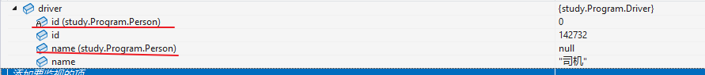

# 面向对象之封装

面向过程：面向的是完成这件事的过程，强调的是完成这件事的动作。

如把大象关进冰箱：`1.`打开冰箱门`2.`把大象塞进去`3.`关闭冰箱门

面向对象思想：找个对象帮你做事（强调对象，意在写出通用代码，屏蔽差异）。

将冰箱作为对象，把大象关进冰箱（可以屏蔽所有人的差异）。

1. 冰箱门可以被打开
2. 大象可以塞进冰箱
3. 冰箱门可以被关闭

也可以把大象放在柜子里，柜子也可以被打开，塞东西，被关闭。

对象必须是看的见，摸得着的实物。我们在代码中描述对象，通常描述这个对象的特征和行为，如：

| 电风扇的属性 | 电风扇的方法 |
| ------------ | ------------ |
| 外形         | 转动         |
| 颜色         | 扇风         |

我们把这些具有相同属性和方法的对象进行封装，抽象出类这个概念。（类相当于模子，确定了对象应该具有的特征和行为。）对象就是类创建出来的。

1. 创建一个things类，功能是可以打开，装东西，关闭。
2. 创建任意对象都有这个功能。

## 类的基本语法

> 类的声明相当于声明了一个自定义变量类型，该类型规定了实例的特征与行为。对象是类创建出来的,相当于声明一个自定义类型的变量。

类成员包含数据成员和函数成员。


:bookmark:语法规范

```csharp
[public] class 类名//类名符合Pascal规范
{
    //类的成员
    构造函数：依次为对象的属性赋值（实例化类以后）;
    字段：存储数据；
    属性：保护字段，对字段的赋值和取值进行限定；
    方法：描述对象的行为
    运算符重载:使得自定义类型可以使用运算符
    索引器
    析构函数：GC时自动调用；
    事件:发布通知
}
//写好一个类，我们需要使用关键字new创建这个类的对象。这个过程叫类的实例化
```

:bookmark:创建一个类并实例化：

```c#
public class Program
{
    public static void Main(string[] args)
    {
        Person p1;//仅栈上开辟空间，堆中未开辟空间
        Person p2 = null;//栈中空引用
        Person p3 = new Person();
    }
}
public class Person { }
```


## 实例成员与静态成员

默认情况下，每个类实例都会保存一份成员的副本，这些成员统称为实例成员；而有的成员被类的所有实例共享，统称为静态成员，在静态存储区域中存储，且只有一份拷贝。换句话说，实例成员与实例绑定，而静态成员与类型绑定。

值类型静态字段直接嵌入在静态存储区域中，引用类型静态字段的引用存储在静态存储区域中，实际数据存储在托管堆中。


生命周期：

1. 静态成员从类型首次实例化或首次访问该类型成员时一次性完全加载，直到程序结束销毁静态成员；
2. 实例成员在实例化后才会分配初始化内存，直到对象被GC回收结束。

以下是详细分析：


| 特征       | 静态值类型字段                              | 静态引用类型字段                                             |
| :--------- | :------------------------------------------ | :----------------------------------------------------------- |
| 存储位置   | 值本身直接嵌入 静态存储区域                 | 引用（指针）存储在静态存储区域                               |
| 指向的对象 | 无（值直接存储）                            | 指向的对象实例存储在GC堆上                                   |
| GC 管理    | **否** (值本身在高频堆，非 GC 管理)         | 引用本身在高频堆，不受 GC 管理； 指向的对象在GC堆，受 GC 管理 |
| GC 回收    | 值永不回收(随应用卸载消失)                  | 引用永不回收，(随应用卸载消失) ,指向的对象可以被 GC 回收(当不再被引用时) |
| 生命周期   | 类型首次实例化或首次访问该类型成员→应用卸载 | 引用：类型首次实例化或首次访问该类型成员→应用卸载 ，指向的对象：可能短于应用卸载 (被 GC 回收后) |

想提前销毁实例成员数据，可通过设置对象为null,切断引用与托管堆的联系，这样在GC时，就会销毁该对象实际数据。

调用的区别：

1. 在外部调用实例成员的时候，需要使用`对象名.实例成员`。
2. 在外部调用静态成员时，使用`类名.静态成员`。

```csharp
public static void Main(string[] args)
{
    D._num = 1;//静态成员直接调用
    D d = new D();
    d._age = 20;//实例成员：对象名.实例成员名
}
public  class D 
{
    public int _age;
    public static int _num;//静态成员，static修饰
}
```

## 字段

### 实例字段

创建类的实例时，字段会整体清零（值由类型决定,数值类型为`0`，引用类型为`null`，布尔值为`false`），若存在初始值，整体清零后会通过字段初始化器依次给字段赋值（也就是显示赋值）。

```c#
public class Example
{
    int c;//清零后为0
    private int a = 10;    // 显示初始化10
    private string b; //null
}
```

:bookmark:查看类型默认值。

```c#
Console.WriteLine(default(int));
//用default(变量类型)查看默认值
```

使用类类型步骤：声明类型，创建实例(类的实例化)，初始化对象。

:red_circle:类的内部成员(即使是私有的)可以互相访问，要想被外界访问，需使用`public`修饰符。

:one:声明一个`Car`类。

```csharp
internal class Car
{
    public string _type;//类型
    public int _wheel=4;//轮子数量，字段显示初始化
    public int _maxSpeed;//最高速度
    public void Action() 
    {
        //this指的是这个类的实例
        Console.WriteLine("汽车类型{0},有{1}个轮子,最高速度{2}Km/h",
                          this._type,this._wheel,_maxSpeed);
    }
}
```

:two:创建类的实例：所有字段清零→字段初始化器依次执行(有的话)

```csharp
//Main函数入口
static void Main(string[] args)
{
    Car car;//仅分配栈空间，未定义
    car = new Car(); //分配堆空间
    //字段_wheel有用户定义的字段初始化值
}
```


:red_circle:`new`运算符作用：为对象分配内存(换句话说类是不占内存的，而创建的对象是占内存的)。

:three:对象的初始化：依次给对象的字段赋值。

```c#
//Main函数入口
static void Main(string[] args)
{
    //2.创建类的实例
    Car car = new Car();
    //3 . 给字段赋值叫做对象的初始化
    car._type = "轿车";
    car._wheel = 4;
    car._maxSpeed = 200;
}
```

对于实例成员改变其值不会影响到其他实例成员的值。

```c#
Car c1 = new Car();
c1._type = "拖拉机";
Car car2 = new Car();
car2._type = "飞机";
Console.WriteLine(c1._type);//拖拉机
Console.WriteLine(car2._type);//飞机
//两个对象在内部中分别开辟了空间
```


字段类型可以是类型本身，但是要注意 :red_circle:不能在内部进行初始化，否则会造成内存溢出：

```c#
public class Person 
{
    private Person p;//对象实例化后字段值为null
    private Person friend = new Person();//会造成内存溢出
}
```

### 静态字段

静态字段被类的所有实例共享，所有实例都访问内存的同一位置。

```c#
 public static void Main(string[] args)
 {
     //类无需实例化，可直接访问静态字段
     Console.WriteLine(D._num);
 }
 public  class D 
 {
     public static int _num;
 }
```

:red_circle:与实例成员不同的是，只有在实例创建后才会产生实例成员，实例销毁后实例成员也不存在；对于静态成员即使不存在类实例，可以直接使用。

## 成员常量

成员常量：编译期进行初始化，所以声明时必须初始化，值不再作更改

```c#
//声明时必须初始化
const float PI = 3.1415f;
//编译时PI替换为3.1415f
```

与静态字段类似，对于每个类实例都是可见的，直接使用`类名.成员名`调用；不同的是，常量在内存没有位置，在编译时变量名被替换为具体值。可以在静态类与实例类中存在。

## 静态函数与实例函数

注意一下两点：

1. 静态方法中，能直接访问静态成员，不能直接访问实例成员(因为不能确定是哪个对象的成员)。
2. 实例方法中，既可以使用静态成员，也可以访问实例成员。

```csharp
public class Car 
{
    int _type;
    static int _wheel;
    //实例方法
    public void Show() 
    {
        Console.WriteLine($"type:{_type},wheel{_wheel}");
    }
    //静态方法
    public static void Des() 
    {
        //静态方法无法直接访问实例成员
        //Console.WriteLine(_type);
    }
}
```

在静态方法中访问实例成员：

```c#
public static void Main(string[] args)
{
    //访问实例成员须先创建类的实例
    Program p = new Program();
    p.Test();
}

void Test()
{
    Console.WriteLine("实例方法");
}
```

------

:one: ​创建一个`Person`类，其中有一个`Person[]`类型的成员`friends`，通过`Add`方法向其中添加新朋友。

```c#
public class Person 
{
    public string _name;
    public int _age;
    private Person[] friends;
    public void Add(Person p) 
    {
        if (friends == null)
        {
            friends = new Person[] { p };
        }
        else 
        {
            //扩容
            Person[] temp = new Person[friends.Length+1];
            //搬家
            for (int i = 0; i < friends.Length; i++)
            {
                temp[i] = friends[i];
            }
            //重定向
            friends = temp;
            friends[friends.Length-1] = p;
        }
    }
}
```

:two:单例模式：程序运行期间仅有一个实例。

```c#
public class Person 
{
    //私有化构造函数，外部不能实例化
   private Person()
    {
        
    }
    //外部只读，不能修改
    public static Person Instance { get; } = new Person();
    public int age;
    public string name;
}
```


## readonly修饰符

> `readonly`修饰符可作用与字段，作用同`Const`，不同的是`readonly`可修饰任意变量，因为它在程序运行期运行。

:one:`readonly`字段可以在声明时直接赋予初始值，或者在构造函数中赋值，不能在其他地方对只读字段赋值。

:two:`readonly`字段声明时未初始化，初始化需在各自的构造函数中完成。

```c#
internal  static class Test
{
    //只读字段声明时可直接显示初始化
    public readonly static double PI = 3.14;
    //未在声明时初始化，则字段需要在对应构造函数中初始化。
    public readonly static double radius;
}
```

对于`readonly`修饰的引用类型变量，仅保证引用地址不变，在类的内部或外部都可改变变量的内部状态。

```c#
public class Program
{
    public static void Main(string[] args)
    {
        Person.s.name = "a";
        Person.s.age = 1;
    }
}
public class Person
{
    public static readonly int[] arr = { 1, 2, 3 };
    public static readonly Student s = new Student();
}
public class Student
{
    public string name;
    public int age;
}
```

## 属性

属性的作用是保护字段，对后备字段的赋值和取值进行限定。

属性的本质是两个方法(访问器)，一个是`get`，一个是`set`。

1. 给属性赋值会执行`set`方法，将值`value`赋值给字段(value是set方法的隐式参数,类型与属性类型相同)；
2. 读取属性的值时会执行`get`方法，取字段的值。

在类中，为保护字段存储的数据，应该设置为私有访问修饰符`private`，通过中间商属性去读取字段。

| 属性中的方法 | 类型         |
| ------------ | ------------ |
| 有get也有set | 可读可写属性 |
| 仅get        | 只读属性     |
| 仅set        | 只写属性     |

```csharp
internal class Car
{
    private string _name;
    //private私有访问权限，仅本类中能访问
    public string Name 
    {
        //获取属性值执行get方法
        get { return _name; }
        //设置属性值执行set方法
        set { _name = value; }
    }
    private int _speed;
    //若给属性赋值的速度小于0，则返回默认值0
    public int Speed 
    {
        get { return _speed; }
        set 
        {
            if(value < 0) return; 
            _speed = value;
        }
    }
    ///品牌，自动属性，详见自动实现属性章节
    public string Brand { set; get; }
    public void Show() 
    {
        Console.WriteLine("品牌{3},车类型{0},速度{1}Km/h,",
                          this.Name,this.Speed,this.Brand);
    }
}
static void Main(string[] args)
{
    //创建一个对象后字段会有初始值
    Car car = new Car();
    //对象的初始化，给属性赋值会执行set方法
    //注意给字段赋值不会执行set方法
    car.Name = "卡车";
    car.Speed = -1;//执行set方法，返回字段默认值0
    car.Brand = "*";
    //Show法会打印对象的属性，此时执行get方法
    car.Show();
}
```

实例化一个`car`对象执行过程：


:red_circle:关于调试方面的问题：

调试时属性的值可能与预设想的不一致，是因为查看属性时调试器隐式调用了`get`方法，执行了其中的逻辑，所以在调试时应注意到此问题，尽可能用字段去调试。

```csharp
public int Speed 
{
    get 
    {
        _speed = -100;
        return _speed; 
    }
    set 
    {
        if(value < 0) { return; }
        _speed = value;
    }
}
```

将上述的`Speed`属性做这样的更改，且在`set`方法上打上断点，给属性赋值时（`car.Speed = -1`），按原逻辑返回的是默认值0;

我们在执行`set`方法即将结束时查看`Speed`属性，则会隐式调用`get`方法，将字段_`speed`值更改为`-100`.

### 访问器的访问修饰符

> 1. 默认使用属性声明时的访问权限
> 2. 手动设置的访问器的修饰符要低于属性的访问权限
> 3. 不能同时设置访问器的访问权限(保证属性的访问权限有意义 )

### 只读属性

只读属性通常用一个`get`访问器实现 或者将`set`访问器私有化来实现，可在构造函数中初始化字段值。

:red_circle:私有化set访问器，外部无法访问，但类内部可以访问。

```csharp
internal class Car
{
    public Car(int wheel,string type) 
    {
        _wheel = wheel;
        _type = type;
    }

    private int _wheel;

    public int Wheel
    {
        //私有化set访问器
        get { return _wheel; }
        private set { _wheel = value; }
    }

    private string _type;

    public string Type
    {
        //仅有get访问器
        get { return _type; }
    }

    //set访问器私有化仍在在类内部进行访问
    private void Change() 
    {
        Wheel = 10;
    }

}
//Main函数中调用
 public static void Main(string[] args)
 {
     Car car = new Car(4, "轿车");
     car.Wheel = 5;//set访问器外部无法访问，不可赋值
 }
```

### 自动属性与只读自动属性

不需要显示声明一个私有变量，编译器会自动生成一个私有后备字段存储值（必须有`get`访问器，否则不会生成后备字段），适合不需要复杂逻辑处理的属性。

1. 自动属性访问器后可赋一个默认值，用以显示初始化字段(自动属性存在自动属性初始化器，与字段初始化器同级别，执行顺序与代码位置相关​。:small_red_triangle:（自动属性初始化器与字段初始化器均在构造函数之前执行）。
2. 自动属性必须要有`get`访问器。
3. 只读自动属性也是用一个`get`访问器 或者将`set`访问器私有化来实现，可在声明时初始化或者在构造函数中初始化字段。


```csharp
internal class Tractor
{
    public string Name { get; } = "Tractor";//声明时直接赋予初始值
    public string Color { private set; get; }//私有化访问器，在类的内部可进行更改
    public int Wheel { get; }//默认值0

    public void Show() 
    {
        Console.WriteLine($"名称{Name},颜色{Color},轮子数量{Wheel}");
    }
}
//创建对象后，若未给属性赋值，则调用Show方法，读取字段默认值
```

外部调用:

```c#
public static void Main(string[] args)
{
    Tractor tractor = new Tractor();
    tractor.Color = "红";//set访问器外部无法访问，不可赋值
    tractor.Name = "Test";//无法在外部为自动只读属性赋值
    tractor.Show();
}
```

## 实例构造函数

帮助我们初始化对象，通过属性给给私有字段依次赋值，使用`ctor`快捷方式插入。

1. 构造函数没有返回值，连void都没有
2. 构造函数的名称必须跟类名一致。
3. 没有特殊要求时默认为`public`。
4. 实例化对象时会自动执行构造函数。

:red_circle:私有化构造函数，可以防止外部创建对象实例，只有在满足某些情况才能通过某方法创建实例。

:red_circle:类当中会有一个默认的无参的构造函数，当你写了一个新的构造函数之后，不论是否有参数，原默认无参构造函数都会被代替。

------


```csharp
internal class Student
{
    public Student(string name,char gender,int age,int math,int english,int chinese) 
    {
        this.Name = name;
        this._gender = gender;//Gender属性只读
        this.Age = age;
        //只读自动属性:直接给属性赋值
        this.Math = math;
        this.English = english;
        this.Chinese = chinese;
    }
    /// <summary>
    /// 自动实现属性，编译器隐式声明变量存储值
    /// </summary>
    public string Name { get; set; }
    private char _gender;
    public char Gender
    {
        get { return _gender; }
    }
    private int _age;
    public int Age 
    {
        get { return _age; }
        set
        {
            if(value < 0) 
            {
                value = 0;
            }
            _age = value;
        }
    }
    public int Math { get; }
    public int English { get; }
    public int Chinese {  get; }
}
```

在Main函数中初始化对象。注意此时`new`关键字的作用：

1. 在GC堆中开辟一个空间
2. 所有字段清零
3. 字段或自动属性的后备字段会进行初始化。
4. 调用对象的构造函数进行初始化。


```csharp
internal class Program
{ 
    static void Main(string[] args)
    {
        //类实例化后通过构造函数进行对象的初始化
        Student st = new Student("占山",'女',13,120,100,100);
        //new 后面的方法就是构造方法
    }
}
```

写一个`Ticket`类，有一个距离属性（只读，在构造函数中赋值且不能为负数），有价格属性，只读，且根据距离计算价格。

```csharp
internal class Ticket
{
    public Ticket(double distance) 
    {
        if (distance < 0) 
        {
            distance = 0;
        }
        this.Distance = distance;
    }
    public double Distance { get; }//只读自动实现属性
    private double _price;
    public double Price //逻辑代码
    {
        get 
        {
            if (this.Distance <= 100)
            {
                //100公里原价
                _price = this.Distance * 1;
            }
            else if (this.Distance <= 200)
            {//95折
                _price = this.Distance * 0.95;
            }
            else if (this.Distance <= 300)
            {//9折
                _price = this.Distance * 0.9;
            }
            else 
            {
                _price = this.Distance*0.85;
            }
            return _price; 
        }
    }
}
```

## 静态构造函数

:one:静态构造函数通常用来初始化类的静态字段；

:two: 静态构造函数不得有修饰符，有`static`关键字，不得带参数。

:two:不能手动调用，系统自动调用，仅执行一次，且类中只能有一个静态构造函数

```c#
public class RandomNumber 
{
    static RandomNumber()
    {
        //初始化静态成员
        r = new Random();
    }
    public static Random r; 
}
```

静态成员优先放在静态构造函数中初始化。

```c#
public class Program
{
    public static void Main(string[] args)
    {
        //直接调用则RandomNumber.r为默认null引用
        Console.WriteLine(RandomNumber.r?.Next());
    }
}
public class RandomNumber 
{
    public RandomNum() 
	{
        //在实例构造函数中初始化，不妥
    	r = new Random();
	}
    public static Random r; 
}
```


在C# 中创建一个对象（假设首次访问该类型），成员的初始化顺序如下：

1. **静态字段初始化**：在类型首次被使用（如调用静态方法、访问静态成员或创建实例）时，静态字段优先初始化。
2. **静态构造函数**：静态字段初始化完成后，静态构造函数（如果存在）会被调用。
3. **实例字段/自动属性初始化**：在创建类的实例时，实例字段或自动属性的后备字段会进行初始化。
4. **实例构造函数**：实例字段初始化完成后，实例构造函数才会执行。


:red_circle:静态成员先于实例成员， 字段初始化器先于构造函数。

:bookmark:静态成员初始化只发生一次。

```c#
//测试代码
static Car() 
{
    Console.WriteLine("静态构造函数");
}
public Car() { Console.WriteLine("实例构造函数"); }
public int TT { get; } = Test("自动属性初始化器");
public string _name = Test("实例字段初始化器");
public static string _brand = Test("静态字段初始化器");

public static string Test(string value) 
{
    Console.WriteLine(value);
    return "";
}
```

## 对象初始化器

对象初始化时可以由`new`关键字后跟构造函数及参数列表，同时也可以放置一组初始化语句。

``` c#
public static void Main(string[] args)
{
    MyClass myClass = new MyClass()//无参数括弧可省略
    {
        //初始化语句
        _x = 10,
        _y = 20
    };
    //简化了手动为字段赋值，相当于
    myClass._x = 10;
    myClass._y =20;
}
public class MyClass
{
    public int _x;
    public int _y;
}
```

:red_circle:对象初始化器实质上是简化了手动给字段或属性赋值。

:one:字段或属性须是外部可访问的；

:two:在构造函数之后执行，可能会重置某些数据成员。

## this关键字

:one:this代表当前类的实例，主要用来**区分成员与形参或方法中的局部变量。**

:two:将当前实例作为实参传递给方法，或作为返回值。

:three:在类当中显式调用本类的构造函数。先执行调用的构造函数，再执行本身的构造函数。

:four:用于静态类中的拓展方法。

:five:声明索引器。

:six:不存在于静态函数中，拓展函数除外。

:bookmark:将当前实例作为实参传递

```c#
internal class Salary
{
    public Salary(double salary,double rate) 
    {
        //this区分成员与形参
        this.salary = salary;
        this.rate = rate;
    }
    private double salary;
    private double rate;

    public void GetTax() 
    {
        Console.WriteLine(CalculateTax(this));
    }
    public double CalculateTax(Salary s)
    {
        return s.rate*s.salary;
    }
}
```

:bookmark: 显示调用本类的构造函数

```csharp
internal class Ticket
{
    public Ticket(int distance)
    {
        //对参数进行判断，将值赋给字段_distance
        if(distance < 0) 
        {
            this._distance = 0;
        }
        else 
        {
            this._distance = distance;
        }
    }
    //this()中的传递的参数要与其声明的形参一致，意及交给其初始化对象。
    public Ticket(int distance , int hour):this(distance) 
    { 
        this.Hour = hour;
    }
    private int _distance;
    public int distance
    {
        //只读
        get { return _distance; }
    }
    public int Hour { get; }
}
```

使用无参构造函数调用有参构造函数

```c#
public  class Person 
{
    public Person():this("MyName")
    { 

    }
    public Person(string name) 
    {
        this.name = name;
    }
    public string name;
    public int age;
}
```

:bookmark:拓展方法：

未现有的非静态变量类型添加新的成员方法，:one: 提升程序的拓展性，:two: 不需要在对象中重新写方法，:three: 不需要继承来添加方法，:four: 不需要在已封装的类型中写额外方法。

基本语法

```c#
访问修饰符 static 返回值 函数名(this 拓展类型 参数名，参数类型 参数名...){}
```

:one: 为`string`类型添加拓展方法

```csharp
//拓展方法必须存在静态类中
public static class ExtenSion
{
    public static void Print(this string name) 
    {
        Console.WriteLine("用户{0}定义的拓展方法",name);
    }
}
//Main函数中调用
static void Main(string[] args)
{
    string name = "lzb";
    ExtenSion.Print("张三");//类名.方法调用
    name.Print();//变量.方法调用
}
```

:two:静态类型不能添加拓展方法：

```c#
//报错，静态类型不能作为参数
public static void Test(this Console str)
 {
     
 }
```

:red_circle:注意拓展方法与类型内部方法重名：优先执行类型内部的方法：

```c#
public class Program
{
    public static void Main(string[] args)
    {
        string str = "c";
        Console.WriteLine(str.ToString());//c
    }
}
public static class Extension
{
    public static void ToString(this string str)
    {
        Console.WriteLine("重名的Tostring方法");
    }
}
```

------

自定义一个玩家类型，为它添加一个自杀的拓展方法.

```c#
public static class Extension
{
    public static void Kill(this Player p)
    {
        Console.WriteLine($"{p.Name}杀身成仁...");
    }
}

public class Player
{
    public string Name { set; get; }

    public int Hp { set; get; }

    public void IsAttack(Player otherPLyer) { }
}
```

## 索引器

> 让对象可以像数组一样通过索引访问 类内部的成员，使程序看起来更直观,比较适用于类中有数组的情况。
>
> 索引器类似于属性，有`get`和`set`访问器。
>
> 索引器没有名称，用`this`去指代当前名称。

语法：

```c#
访问修饰符 返回值 this[参数类型 参数名，参数类型 参数名...]
{
    内部写法与属性索引器相同
    get{}
    set{}
}
```

本质：通过`[]`种传入的参数，返回不同的值或给相关成员设置值。

```c#
 public class ModelSpace 
 {
     private sbyte _modelSpaceId = 1;
     private sbyte _drawSpaceId = 2;
     private sbyte _otherSpaceId = 3;
     //索引器没有名称，用this指代
    //[]中可是是任何类型
     public sbyte this[int i] 
     {
         //可以有set访问器
         get 
         {
             switch(i)
             {
                 case 0: return _modelSpaceId;
                 case 1: return _drawSpaceId;
                 case 2: return _otherSpaceId;
                 default: return 0;
             }
         }
     }
 }
```

使用数组创建索引器

```c#
string[] colors = new string[] { "red", "yellow", "green", "white" };

public string this[byte index]
{
    get { return colors[index]; }
}
```

索引器支持重载

```c#
string name;
int age;
Person[] p = new Person[10];
int[,] arrs = new int[2, 2];//2行2列数组
public Person this[int index]
{
    get { return p[index]; }
    set { p[index] = value; }
}
//重载
public int this[int i, int j]
{
    get { return arrs[i, j]; }
    set { arrs[i, j] = value; }
}
```

:bookmark:自定义整型数组类，为它添加增删改查的方法。

```c#
public class MyArray
{
    public MyArray()
    {
        arrs = new int[16];
    }
    private int[] arrs;

    //容量，数组长度
    public int Capacity
    {
        get { return arrs.Length; }
    }

    private int count;
    public int Count
    {
        get { return count; }
    }
    //增
    public void Add(int value)
    {
        if (Count >= Capacity)
        {
            //扩容
            int[] temp = new int[Capacity * 2];
            //转移数据
            for (int i = 0; i < Count; i++)
            {
                temp[i] = arrs[i];
            }
            arrs = temp;
        }
        //容量足够则
        arrs[count++] = value;
    }
    //删
    public void Remove(int value)
    {
        int tempIndex = -1;
        for (int i = 0; i < Count; i++)
        {
            if (arrs[i] == value)
            {
                tempIndex = i;
                break;
            }
        }
        //数据向前挪动
        for (; tempIndex < count - 1; tempIndex++)
        {
            arrs[tempIndex] = arrs[tempIndex + 1];
        }
        arrs[count-- - 1] = 0;//重置
    }
    //改查

    public int this[int index]
    {
        get
        {
            //索引不能超过count-1
            if (index >= Count)
            {
                Console.WriteLine($"索引越界,最大索引为{Count - 1}");
                return -1;
            }
            return arrs[index];
        }
        set
        {
            if (index >= Count)
            {
                Console.WriteLine($"索引越界,最大索引为{Count - 1}");
                return;
            }
            arrs[index] = value;
        }
    }
}
```

## 析构函数

当引用类型的堆内存被回收时，析构函数才会执行，意在帮助我们释放实例资源(`GC`垃圾回收器主动调用析构函数)。

如果希望程序立即释放内存资源，就使用析构函数，不需要则通过GC(Garbage Collection-垃圾回收装置)自动释放资源

```csharp
~类名()
{
    //代码区域
}
//示例
 ~Student() 
 {
     Console.WriteLine("在程序结束时，堆内存被回收，析构函数会被执行");
 }
```

### 垃圾回收机制

垃圾回收`Garbage Collector`简称`GC`,垃圾回收的过程是在遍历托管堆上动态分配的所有对象，同过识别他们是否被引用来确定哪些对象是垃圾，哪些对象仍要继续使用。

:bookmark:所谓的垃圾就是没有被任何变量引用。

```c#
Person person = new Person();
person = null;
//此时new Person()创建的对象即为垃圾，但不会立即回收
```

:red_circle:注意：

1. `GC`只负责GC堆内存的垃圾回收，所以引用类型内存空间的分配与释放都是通过垃圾回收机制来管理的

2. 静态引用成员数据也可以被回收，但静态存储区域中存放的值与引用无法回收

3. 栈`stack`上的内存是由系统自动管理的，会自动分配和释放内存。

   ```mermaid
   graph LR
       subgraph 内存区域
           subgraph Stack[栈 - 系统管理]
               A1[值类型 int x=5]
               A2[引用指针]
           end
           
           subgraph StaticArea[静态存储区 - 系统管理]
               B1[值类型 static int y=10]
               B2[静态引用指针]
           end
           
           subgraph ManagedHeap[GC堆 - GC管理]
               D1[堆对象A]
               D2[堆对象B]
               D3[堆对象C]
           end
       end
       
       A2 --> D1
       B2 --> D2
       D1 --> D3
       
       
       %% 管理责任标注
       StackManager[管理责任：系统自动管理] -.-> Stack
       StaticManager[管理责任：系统管理] -.-> StaticArea
       GCManager[管理责任：垃圾回收器GC] -.-> ManagedHeap
       
       style Stack fill:#c8e6c9,stroke:#2e7d32
       style StaticArea fill:#e1bee7,stroke:#7b1fa2
       style ManagedHeap fill:#bbdefb,stroke:#1976d2
       style A1 fill:#a5d6a7
       style A2 fill:#81c784
       style B1 fill:#ce93d8
       style B2 fill:#ba68c8
       style D1 fill:#90caf9
       style D2 fill:#64b5f6
       style D3 fill:#42a5f5
       style StackManager fill:#c8e6c9,stroke:#2e7d32
       style StaticManager fill:#e1bee7,stroke:#7b1fa2
       style GCManager fill:#bbdefb,stroke:#1976d2
   ```

   ------

   :book:`C#`回收机制原理：

   :one:将堆内存分为三块：0代内存，1代内存，2代内存,新分配的对象都会配置在第0代内存中，当0代内存满时，触发第一次垃圾回收。

   

   :two:GC扫描堆中的数据

   1. 释放无引用对象。
   2. 搬迁引用对象到1代内存，并修改引用地址
   3. 压缩堆(因为搬迁后在内存里随意排列)

   

   :three:当1代内存满时，会清除1代和0代中无引用对象，搬迁→修改引用地址→压缩堆；2代内存满时，会清除0，1，2代中的无引用对象。

   :bookmark:对于`83kb`以上的对象我们称之为大对象，我们总认为它们是第二代内存，目的是提升性能，因为对大对象进行搬迁压缩以及释放会消耗内存，造成卡顿。

   我们可以在过场景时手动调用`GC`：

   ```c#
   GC.Collect();//手动回收垃圾
   ```

   

   

## 运算符重载

> 让自定义类和结构体对象能够使用运算符进行运算

### 基本使用

语法：

```c#
public static 返回类型 operator 运算符(参数列表)//必须有一个参数和本类型相关
```

:red_circle:注意

1. 一定是公共的静态方法（固定）
2. 参数的数量与运算符相关
3. 参数的前后位置决定运算时操作数的位置
4. 一个符号可以多个重载
5. 关系运算符必须配对出现(重载`>`就必须重载`<`)
6. 不能使用`ref`与`out`关键字

:bookmark:定义一个`Point`类，重载`+`运算符

```c#
public class Point 
{
    public Point() { }
    public Point(int a,int b) 
    {
        x = a; y = b;
    }
    public int x;
    public int y;
    public static Point operator + (Point a, Point b)
    {
        Point p = new Point()
        {
            x = a.x + b.x,
            y = a.y + b.y
        };
        return p;
    }
    //操作数位置与参数相关
    public static Point operator +(Point a, int value)
    {
        Point p = new Point()
        {
            x = a.x + value,
            y = a.y + value
        };
        return p;
    }
    public static Point operator +(int value,Point a)
    {
        Point p = new Point()
        {
            x = a.x + value,
            y = a.y + value
        };
        return p;
    }
}
```

实现了单个运算符`+`，就可以使用复合运算符`+=`。

### 可重载与不可重载运算符

:one: 算数运算符都可以进行重载。

```c#
 public class Point 
 {
     public static Point operator + (Point a, Point b)
     {
         return null;
     }

     public static Point operator -(Point a, Point b)
     {
         return null;
     }
     public static Point operator *(Point a, Point b)
     {
         return null;
     }
     public static Point operator / (Point a, Point b)
     {
         return null;
     }
     public static Point operator %(Point a, Point b)
     {
         return null;
     }
     //一元运算符只需要一个参数
     public static Point operator ++ (Point a)
     {
         return null;
     }
```

:two: 逻辑运算符,只支持逻辑`!`重载

```c#
public static bool operator ! (Point p)
{
    if(p == null) return true;
    else return false;
}
```

:three:位运算符：`&,|,~,^,<<,>>`都可以进行重载

:four:关系运算符都可进行重载，一般返回`bool`类型，注意必须成对出现。

```c#
public class Point 
{
    //> <要成对出现
    public static bool operator > (Point p1,Point p2)
    {
        return false;
    }
    public static bool operator <(Point p1, Point p2)
    {
        return false;
    }
}
```

:five:不可重载运算符

1. 逻辑`&&`，逻辑`||`
2. 索引器`[]`
3. 强转运算符`()`
4. 点，三目运算符，赋值符号

------

练习:one:定义一个位置结构体，为其重载位置是否相等的运算符。

```c#
public struct Position 
{
    public int x;
    public int y;
    public static bool operator ==(Position p1,Position p2)
    {
        if(p1.x == p2.x && p1.y == p2.y) return true;
        else return false;
    }
    public static bool operator !=(Position p1, Position p2)
    {
        if (p1.x != p2.x || p1.y != p2.y) return true;
        else return false;
    }
```

练习:two: 定义一个`Vector3d`类，重载其运算符。

```c#
public class Vector3d 
{
    public int x, y, z;
    public static Vector3d operator +(Vector3d v1,Vector3d v2)
    {
        Vector3d v = new Vector3d()
        {
            x = v1.x + v2.x,
            y = v1.y + v2.y,
            z = v1.z + v2.z
        };
        return v;
    }
    public static Vector3d operator *(Vector3d v1,int num)
    {
        Vector3d v = new Vector3d() 
        {
            x = v1.x * num,
            y = v1.y * num,
            z = v1.z * num
        };
        return v;
    }
}
```

## 内部类与分部类⭐

:one:内部类：在一个类中声明一个类，意在将类分割为不同的模块，使用时需要用包裹者点处自己(类似成员，所以使用`private`修饰符外部不能访问该类)

```c#
public class Program
{
    public static void Main(string[] args)
    {
        Person person = new Person();
        Person.Body body = new Person.Body();
    }
}
public class Person
{
    public string name;
    public int age;
    public Body body;
    //内部类
    public class Body
    {
    }
}
```

:two: 分部类：适用于多人开发时，同时存在同一个类，在类前加`partial`关键字，则代表一个完整的类被分给为几块，各个部分可以访问相关成员，本质就是一个整体。结构，接口，类都可以使用分部形式

```csharp
public abstract partial class Animal
{

    public abstract void Bark();
}
//部分类二
public abstract partial class Animal
{
    //代码体
}
```

:three:分部方法:将声明与实现分离；不能加访问修饰符，默认私有，只能在分部类中声明，没有返回值（返回类型是`void`，参数也不能带`out`关键字)。

:bookmark:分部方法可以不实现，若可以有返回值，在未实现的情况下调用会出错，所以:red_circle:禁止有返回值。

```c#
public partial class Person
{
    public string name;
    public int age;
    partial void Show(int a);
}
public partial class Person 
{
    partial void Show(int a)
    {
        throw new NotImplementedException();
    }
    public void Test() 
    {
        //分部方法可能未实现，使用out参数可能会出错
        //Show(out int a);
    }
}
```

# 面向对象之继承

>  把重复的成员单独封装到一个类中来作为父类，子类便可继承父类所有字段与方法。对于父类的私有成员，子类无法直接访问，但可以通过父类暴露的方法间接访问。
>
>  没有继承父类的实例构造函数，静态构造函数以及析构函数，但是子类会默认调用父类无参的实例构造函数，目的是初始化父类成员，让创建的子类对象包含父类的成员。
>
>  :red_circle: 无法删除继承的成员。
>
>  继承的特性：
>
>  1. 单根性：只能继承一个父类
>  2. 传递性：最上层的父类的成员会传递到最下层的子类。


:small_red_triangle:子类实例是由父类成员(字段与方法)与子类成员共同组成。

## 继承基本语法

:one:定义父类`Car`

```csharp
public class Car 
{
    private string _name;
    public string Name
    {
        set {  _name = value; }
        get { return _name; }
    }
    private int _wheel;
    public int Wheel 
    {
        set { _wheel = value; }
        get { return _wheel; }
    }
    public void Show() 
    {
        Console.WriteLine("车类型{0},轮子数量{1}",this.Name,this.Wheel);
    }
}
```

:two:定义子类`Tractor`

```csharp
public class Tractor:Car 
{
    public Tractor(string name,int wheel) 
    {
        this.Name = name;
        this.Wheel = wheel;
    }
}
```

:three:`Main`函数中调用

```csharp
static void Main(string[] args)
{
    Tractor tc = new Tractor("tractor", 4);
    tc.Show();
    //先调用父类隐式的构造函数
    //再执行自己的构造函数
}
```

:four:继承的传递性：C继承B,B继承A，C继承B和A的成员；先执行最上层的父类构造函数，依次向下执行构造函数，最后才执行自己的构造函数。

```csharp
public class Car
{
    public string Name { get; set; }
    public int Wheel {  get; set; }
}

public class Tractor : Car
{
    public int ChangeYear { get; set; }
}
public class WalkingTractor:Tractor
{
    //声明构造函数，初始化对象
    public WalkingTractor(string name,int wheel,int changeYear,int speed ) 
    { 
        this.Name = name;//Car.Name
        this.Wheel = wheel;
        this.ChangeYear = changeYear;
        this.Speed = speed;
    }
    public int Speed {  get; set; }
}
```

:bookmark:子类与父类同同名成员(理解⭐)

```c#
public static void Main(string[] args)
{
   Driver driver = new Driver();
    driver.name = "司机";
    driver.id = 142732;
}
public class Person 
{
    public string name;
    private int id;//基类私有成员
}
public class Driver : Person 
{
    public int id;//子类成员，与父类的成员不冲突
    public string name;//隐藏父类成员                  
}
```

字段`id`与`name`内存中分别有两个，一个是父类的，另一个是子类的。子类对象调用时会优先在自己内部查找该成员，如果未找到，则沿着继承链向上查找。



:red_circle: 不能在子类构造函数中为父类的自动只读属性赋值，因为父类的成员已经初始化完毕，子类只能读取，除非隐藏或重写(此时的属性成员便是新成员，与基类种的成员无关)。

## base关键字

如果在父类中重新写了一个有参数的构造函数后，无参数的构造函数被顶替，子类调用不到会报错。

解决办法：

1. 在父类重写一个无参数的构造函数
2. 在子类中显式调用父类的构造函数，使用关键字`:base`。
3. 或可通过`this`调用本类中带`:base`的构造函数从而间接调用父类的构造函数。

```csharp
public class Car
{
    public Car(string name,int wheel) 
    {
        this.Name = name;
        this.Wheel = wheel;
    }
    public string Name { get; set; }
    public int Wheel {  get; set; }
}

public class Tractor : Car
{
    //显式调用父类的构造函数
    public Tractor(string name,int wheel,int changeYear) 
        : base(name, wheel) 
    {
        this.ChangeYear = changeYear;
    }
    public int ChangeYear { get; set; }
}
```

------

:one:有一个`Worker`基类，有工种，工作内容两个特征，一个工作方法，；程序员，策划分别继承打工人。

```c#
public class Worker 
{
    public Worker(string type,string content) 
    {
        _type = type;
        _content = content;
    }
    public string _type;
    public string _content;

    public void Work() 
    {
        Console.WriteLine($"工种{_type}，工作内容：{_content}");
    }
}

public class Programmer : Worker 
{
    public Programmer() : base("程序员","Copy") { }
}
public class Plan : Worker 
{
    public string _name;
    public Plan() : base("王者策划", "研究人机") { }

    //通过调用本类中的带base构造函数，间接调用基类构造函数。
    public Plan(string name) : this() { }
}
```

## 成员初始化顺序

子类实例字段先于父类构造函数加载， 为了确保在父类构造函数中可能调用的虚方法能正确访问子类状态。

1. **字段初始化**从最底层的派生类向基类推进（派生类 → 基类）。
2. **构造函数执行**从最顶层的基类向派生类推进。

:bookmark:以下为测试代码：

```c#
 internal class Car
 {
     public Car()
     {
         Console.WriteLine("父类实例构造函数初始化...");
     }

     static Car()
     {
         Console.WriteLine("父类静态构造函数初始化...");
     }
     private static int _id = Des("父类静态字段");
     private int _wheel = Des("父类实例字段");
     private static int Des(string value)
     {
         Console.WriteLine($"{value}在初始化...");
         return 0;
     }
 }

 internal class Tractor : Car
 {
     public Tractor()
     {
         Console.WriteLine("子类实例构造函数...");
     }
     static Tractor()
     {
         Console.WriteLine("子类静态构造函数...");
     }
     private static int _id = Des("子类静态字段");
     private int _wheel = Des("子类实例字段");
     private static int Des(string value)
     {
         Console.WriteLine($"{value}在初始化...");
         return 0;
     }
 }
```

输出结果：

```c#
子类静态字段在初始化...
子类静态构造函数...
//为了确保在父类构造函数中可能调用的虚方法能正确访问子类状态
子类实例字段在初始化...
//静态成员按需加载
父类静态字段在初始化...
父类静态构造函数初始化...
父类实例字段在初始化...
父类实例构造函数初始化...
子类实例构造函数....
```


## new关键字

new关键字的作用：

1. 创建对象，初始化并分配内存
2. 隐藏从父类那里继承的同名成员，在子类中重新声明一个新的成员，注意二者没有任何联系，只是与父类成员同名（不写new同样会隐藏父类成员，不过编译器会进行提示），隐藏后优先调用自己的成员。

   :one:数据成员：相同名称

   :two:函数成员：签名相同(与返回值无关，函数名和参数列表相同)

```csharp
public class Program
{
    public static void Main(string[] args)
    {
        Tractor t = new Tractor("拖拉机");
        t.Show();
        t.ShowTractor();
    }
}
public class Car
{
    public string Name { get; } = "UnKnow";
    public void Show()
    {
        //方法定义在父类种，静态绑定到父类成员
        Console.WriteLine(Name);
    }
}
public class Tractor : Car
{
    public Tractor(string name)
    {
        Name = name;
    }
    public new string Name { set; get; }//新的属性
    public void ShowTractor() { Console.WriteLine(Name); }
}
```

子类中的对象有两个`Name`属性，一个是父类的`Name`,一个是自己的`Name`；方法调用时根据属性所在的上下文读取成员数据。

可使用`base`访问父类属性，`base.成员名`代表当前对象调用继承的父类成员。

```csharp
 public void ShowTractor()
 {
     Console.WriteLine(base.Name);//Person的name
 }
```

## 里氏转换

子类的实例是由基类和子类成员共同组成，若将子类实例转换为基类实例，这样只能访问基类中的成员，除非成员实现虚方法，抽象类，接口。


1. 子类可以转换为父类,此时的对象只能访问基类中的成员，除非实现了多态：

   :one:子类方法override父类虚方法，调用子类的方法。

   :two:抽象，接口父类调用子类实现的方法

2. 如果一个地方需要父类作为参数，我们可以给一个子类代替，如`string.Join(string sep,params object[] values)`
3. 子类赋值给父类，可转换为父类。如果父类中装的是子类对象，亦可强转为子类。

定义一个`Car`类，`Tractor`类与`ThreeWheel`继承于`Car`类。

```csharp
public class Car
{
    public Car(int wheel, string brand)
    {
        this.Wheel = wheel;
        this.Brand = brand;
    }
    public int Wheel { get; } = 4;//默认值4
    public string Brand { get; }
}
//增加Weight属性
public class Tractor : Car
{
    public Tractor(int wheel, string brand,double weight):base(wheel,brand)
    {
        this.Weight = weight;
    }
    public double Weight { get; }
}

//与父类属性一致
public class ThreeWheel : Car
{
    public ThreeWheel(int wheel, string brand) : base(wheel, brand)
    {
    }
}
```

在Main函数中调用

```csharp
static void Main(string[] args)
{
    //把子类对象装到父类对象中
    Car trc = new Tractor(2, "拖拉机", 1000);
    //Console.WriteLine(trc.Weight);无法访问
    Tractor tractor = (Tractor)trc;
    Console.WriteLine(tractor.Weight);//1000
    //属性并未丢失，只是将子类对象转为父类引用，默认访问基类中的成员。
}
```

### 类型转换判断

#### is

判断一个对象是否是指定类型（值类型，引用类型都可），如果是，返回`true`，否则返回`false`。

```csharp
object o = 3;
if(o is int)
{
    //Console.WriteLine(o as int); 值类型不能使用as转换
    Console.WriteLine((int)o);
}
```

#### as

将一个对象转化为指定对象，成功则返回对应的对象，否则返回`Null`（只能用于引用类型）。

```csharp
static void Main(string[] args)
{
    Car trc = new Tractor(2, "拖拉机", 1000);
    Tractor tractor = trc as Tractor;//可以转换
    ThreeWheel thr = trc as ThreeWheel;//null
}
```

------

:one: 把子类放到父类数组中，打印子类中的方法。

```csharp
//Person类中有打招呼方法，子类各自隐藏父类打招呼方法
class Person
{
    public void SayHello() 
    {
        Console.WriteLine("大家好");
    }
}
class Chinese:Person
{
    public new void SayHello()
    {
        Console.WriteLine("安好");
    }
}
class English:Person
{
    public new void SayHello() 
    {
        Console.WriteLine("hi");
    }
}
```

在`Main`函数中执行逻辑：

```csharp
static void Main(string[] args)
{
    Person[] pers = new Person[6];
    //创建Person类型数组,值默认未null
    //即未开辟空间，不会初始化，不会执行构造函数
    Random random = new Random();//创建随机数对象
    for (int i = 0;i<pers.Length;i++)
    {
        int num = random.Next(1,4);//返回随机数1~3
        //根据随机数给数组赋值
        switch(num)
        {
            case 1:
                pers[i] = new Person();
                break;
            case 2:
                pers[i] = new Chinese();
                break;
            case 3:
                pers[i] = new English();
                break;
        }
    }
    //执行打招呼方法
    foreach (Person p in pers)
    {
        //转换类型，执行各自的打招呼方法
        if (p is Chinese)
        {
            ((Chinese)p).SayHello();
        }
        else if (p is English)
        { ((English)p).SayHello(); }
        else
        {
            //父类对象
            p.SayHello();
        }
    }
}
```

:two:写一个`Mosnter`类，派生出`Boss`类和`Goblin`类，随机生成10个怪，调用他们的攻击方法。

```c#
public class Program
{
    public static void Main(string[] args)
    {
        Monster[] monsters = new Monster[10];
        Random random = new Random();
        for (int i = 0; i < 10; i++)
        {
            if (random.Next(0, 10) % 2 == 0)
            {
                monsters[i] = new Boss();
            }
            else monsters[i] = new Goblin();
        }
        foreach (var item in monsters)
        {
            if (item is Boss)
            {
                (item as Boss).Skil();
            }
            else
            {
                (item as Goblin).Attack();
            }
        }
    }
}
public class Monster { }
public class Boss : Monster
{
    public void Skil() { Console.WriteLine("释放技能"); }
}
public class Goblin : Monster
{
    public void Attack() { Console.WriteLine("普攻"); }
}
```

## 万物之父与装箱拆箱

### Object

`object`类是所有类的基类。

1. 可以利用里氏替换原则，用`object`容器装所有的对象；
2. 可以用来表示不确定类型，作为函数参数类型

#### 静态方法

:one:`public static bool Equals(object objA, object objB)`,判断两个对象是否相等。

```c#
 public static void Main(string[] args)
 {
     Console.WriteLine(Equals(1,2));//false
     Animal a1 = new Animal();
     Animal a2 = new Animal();
     Console.WriteLine(Equals(a1,a2));//False,引用类型比较的是地址
 }
```

:two:`public static bool ReferenceEquals(object objA, object objB)`,主要用来比较引用类型对象，值类型始终是`false`

#### 成员方法

:one:`System.Type GetType()`:用于获取当前对象的类型信息

`Type`类型常用属性

1. `string FullName`,获取`namespace+类型`
2. `string Name`，获取类型
3. ` bool IsValueType`,是否时值类型
4. `bool IsClass`,是否是引用类型

```c#
string s = "";
Console.WriteLine(s.GetType().FullName);
Console.WriteLine(s.GetType().Name);
Console.WriteLine(s.GetType().IsValueType);
Console.WriteLine(s.GetType().IsClass);
```

:two:`protected object MemberwiseClone();`返回当前对象的浅拷贝对象：如果成员是值类型，直接复制值；若是引用类型，复制引用。

```c#
public class Program
{
    public static void Main(string[] args)
    {
        Animal animal = new Animal("狗", 10);
        Animal copy = animal.Copy();
        Console.WriteLine(copy.arr[1]);//2
        copy.arr[1] = 10;
        Console.WriteLine(animal.arr[1]);//10
    }
}
public class Animal
{
    public Animal(string name, int age)
    {
        this.name = name;
        this.age = age;
    }
    public int[] arr = { 1, 2, 3 };
    public string name;
    public int age;
    public Animal Copy()
    {
        return (Animal)MemberwiseClone();
    }
}
```

#### 虚方法

:one:`string ToString()`：将当前对象转换为字符串，默认打印当前对象的全名(`namespace+类型全名`)

```c#
int[] arr = { 1, 2 };
Console.WriteLine(arr.ToString());//System.Int32[]
```

可进行重写（快捷键：`CTRL+.`）,用途：调试时打印对象信息。

:two:`bool Equals()`,用于判断两个对象是否相等，与`==`一致。

比较原则：值类型比较值，引用类型比较地址，字符串比较字符；可对`Equal()`方法进行重写。

```c#
public override bool Equals(object obj)
{
    Car other = obj as Car;
    if(other == null) return false;
    return other.Id == Id && other.Name == Name;
}
```

------

:bookmark:有一个玩家类，有姓名，血量，攻击力，防御力等特征，请打印具体内容。

```c#
public class Player 
{
    public Player(string name,int hp,int attack,int defece)
    {
        this.name = name;
        this.hp = hp;
        this.attack = attack;
        this.defense = defece;
    }
    public string name;
    public int hp;
    public int attack;
    public int defense;

    public override string ToString()
    {
        string des = $"姓名{name},血量{hp},攻击力{attack},防御力{defense}";
        return des;
    }
}
```


### 装箱与拆箱

装箱：将值类型转换为引用类型。

拆箱：将引用类型转换为值类型。

```csharp
static void Main(string[] args)
{
    int num = 10;//值类型
    object obj = num;//装箱，把值类型转换为引用类型
    num = (int)obj;//拆箱
}
```


区别：

```csharp
static void Main(string[] args)
{
    Stopwatch sw = new Stopwatch();
    sw.Start();
    ArrayList list = new ArrayList();
    for (int i = 0; i <= 10000000; i++) 
    {
        list.Add(i);
        //list.Add(object value),存在装箱
    }
    sw.Stop();
    Console.WriteLine(sw.Elapsed);//总时间1.28s
}

static void Main(string[] args)
{
    Stopwatch sw = new Stopwatch();
    sw.Start();
    List <int>  list = new List <int>();
    for (int i = 0; i <= 10000000; i++) 
    {
        list.Add(i);//不存在装箱
    }
    sw.Stop();
    Console.WriteLine(sw.Elapsed);//总时间0.09s
}
```

装箱拆箱会损耗内存，代码中应尽量避免装箱与拆箱。

发生装箱与装箱：看这两种类型是否存在继承关系，没有继承关系，不会有装箱与拆箱操作，有继承关系才有可能发生装箱与拆箱。

```csharp
static void Main(string[] args)
{
    string str = "123";//引用类型
    int num = int.Parse(str);//引用类型转值类型，但不是拆箱
}
```


## 访问修饰符

能够修饰类的访问修饰符只有`public` 和 `internal`在同一个项目当中，`public`和`internal`权限一样。

:bookmark:成员访问修饰符

| 关键字             | 作用                                                       |
| ------------------ | ---------------------------------------------------------- |
| public             | 公开的                                                     |
| internal           | 只能在当前程序集中访问                                     |
| protected          | 受保护的，当前类内部以及子类内部可以访问，出了类访问不到。 |
| protected internal | protected + internal                                       |
| private            | 私有的，仅当前类中能访问                                   |

可访问性不一致：子类的访问权限不能高于父类访问权限，因为会暴露父类成员。

## 密封类

在类前加入关键字`sealed`,表示一个类是密封类，让类无法再被继承。

```csharp
 public  sealed  class Animal
 {

     //public abstract void Bark();
 }

 public class Dog : Animal { }//无法从密封类中派生
```

:one:定义一个载具类，实现若干人上车或下车的方法。

```c#
public class Car
{
    public int Capacity { get; } //容量
    private int _number;//乘客数量
    private Person[] _person;
    public Car(int capacity)
    {
        Capacity = capacity;
        _person = new Person[capacity];
        _person[0] = new Driver();
        _number++;
    }
    //上车
    public void AddPerson(Person person)
    {
        if (_number == Capacity) Console.WriteLine("已满载");
        else 
        {
            foreach (Person p in _person)
            {
                if (p != null && p.Id == person.Id) 
                {
                    Console.WriteLine("该人已在车上");
                    return;
                }
            }
            _person[_number++] = person;//装载乘客
        }
    }
    //下车
    public void RemovePerosn(Person person)
    {
        for (int i = 0; i < _number; i++) 
        {
            if(person.Id == _person[i].Id) 
            {
                for (int j = i; j < _number-1; j++)
                {
                    //填补
                    _person[j] = _person[j + 1];
                }
                _person[_number-- - 1] = null; //重置
            }
        }
    }
    //展示
    public void Show() 
    {
        Console.WriteLine($"总人数{_number}");
        for (int i = 0; i < _number; i++)
        {
            Console.WriteLine($"{_person[i].Name}:{_person[i].Id}");
        }
    }
}
public class Person
{
    public virtual int Id { get; }
    public virtual string Name { get; }
}
class Driver : Person
{
    public override int Id { get; } = int.MaxValue;
    public override string Name { get; } = "麻五";
}
public class Passenger : Person
{
    public Passenger(int id, string name)
    {
        Id = id;
        Name = name;
    }
    public override int Id { get; }
    public override string Name { get; }
}
```


## 静态类

**静态类**中只允许静态成员，不允许出现实例成员。且对于静态类，不允许实例化，也不允许继承。

1. 如果一个类作为工具类使用时，可以考虑写成静态类。
2. 静态类在整个项目中资源共享。
3. 静态成员会在首次调用前加载到内存。
4. 之后自动执行静态构造函数。

只有在程序全部结束后，静态类才会释放资源。

```csharp
static Test()//必须无参数
{
    //相关代码
}
```

静态类可以定义拓展方法(给特定类型添加方法)，像`对象.方法`一样去调用，见`this`章节。

```csharp
internal class Program
{
    static void Main(string[] args)
    {
        string str = "this的拓展方法";
        str.Print();
    }
} 
//this的拓展方法
internal static class Person
{
    public static void Print(this string name) 
    {
        Console.WriteLine(name);
    }
}  
```

# 面向对象之多态

让不同子类有不同表现行为且同一子类行为唯一，可用`base`保留父类的行为。实现多态方式：虚方法，抽象类，接口。

```c#
public class Program
{
    public static void Main(string[] args)
    {
        Boss b = new Boss();
        b.Attack();//Boss在攻击
        Monster monster = new Boss();
        monster.Attack();//怪物在攻击
        //new隐藏成员会导致子类行为不一致
    }
}
public class Monster
{
    public string Name { get; set; } = "怪物";
    public void Attack()
    {
        Console.WriteLine($"{Name}在攻击");
    }
}
public class Boss : Monster
{
    public string Name { set; get; } = "Boss";
    public void Attack()
    {
        Console.WriteLine($"{Name}在攻击");
    }
}
```

## 虚方法

:one:虚方法可提供默认实现，子类可选择是否重写。

:two:将父类的方法标记为虚方法，使用关键字`virtual`，这个函数可以被子类重写，使用`override`关键字。

:three:要求虚方法和重写方法有:red_circle:相同的签名与返回类型以及可访问性。

:four:虚方法成员不能是私有的。

```csharp
public class Program
{
    public static void Main(string[] args)
    {
        Boss b = new Boss();
        b.Attack();//Boss在攻击
        Monster monster = new Boss();
        monster.Attack();//Boss在攻击
    }
}
public class Monster
{
    public virtual string Name { get; set; } = "怪物";//虚属性
    public virtual void Attack()
    {
        Console.WriteLine($"{Name}在攻击");
    }
}
public class Boss : Monster
{
    public override string Name { set; get; } = "Boss";
    public override void Attack()
    {
        Console.WriteLine($"{Name}在攻击");
    }
}
```

子类对象调用`override`方法时，执行的是子类中的方法。

若将派生对象转换为基类对象，调用虚方法时，会检查子类的方法是否重新实现，若实现则将基类引用提升至派生类，调用派生类的方法，若派生类未重写则调用默认实现。

若在初始化子对象执行父类构造函数时遇到虚方法也一样，也会去检查子类的方法是否重新实现，了解即可,:red_circle:禁止该行为。

```csharp
public Monster() 
{
    Console.WriteLine(Name);//打印虚属性的值，Boss
}
```

重写基类`object`的`ToString`方法。

```csharp
public class OverString 
{
    //object的ToString方法本质上是一个虚方法
    public override string ToString()
    {
        return "Hello";
    }
}
```

:bookmark_tabs:虚属性(理解)

基类中属性有`set`和`get`访问器：

1. 如果重写的属性是普通属性，可只覆盖基类中的一个访问器。
2. 若重写的是自动属性必须覆盖基类中所有的访问器(因为派生类也会隐式生成一个独立的后备字段，若不重写`set`访问器，赋值时会给基类的后备字段赋值，自己本身的属性永远是系统自动初始化值，这种属性无意义)

```c#
public class Program
{
    public static void Main(string[] args)
    {
        Base d = new Derived(3);
        Console.WriteLine(d.Value);
    }
    public class Base
    {
        protected int _value;
        public virtual int Value
        {
            get { return _value; } 
            set { _value = value; } 
        }
        public virtual string Name { set; get; }
    }

    public class Derived : Base
    {
        //普通属性允许只实现一个访问器
        public override int Value 
        {
            get { return _value*2; }
        }
        public Derived(int value) 
        {
            //赋值时给父类后背字段赋值，执行父类的set访问器
            Value = value;
        }
        //自动属性必须覆盖所有访问器
       public override string Name { get; set; }
    }
}
```


:bookmark_tabs:虚方法中的多层覆盖

> 在一个继承层次结构中，多个派生类依次覆盖基类的方法

```csharp
public class Animal
{
    public virtual void Bark() 
    {
        Console.WriteLine("animal is barking");
    }
}

public class Dog:Animal
{
    public override void Bark()
    {
        Console.WriteLine("dog is bark");
    }
}

public class Labrador : Dog
{
    public override void Bark()
    {
        Console.WriteLine("Labrador is bark");
    }
}
```

1. 基类`Animal`定义一个`bark`的基方法
2. 第一层覆盖：`Dog`类重写了父类`Bark`方法
3. 第二层覆盖：Labrador类重写父类`Dog`中`Bark`方法。

```csharp
static void Main(string[] args)
{
    Animal animal = new Animal();
    Animal dog = new Dog();
    Animal labrador = new Labrador();

    animal.Bark();//animal is bark
    dog.Bark();//animal is bark
    labrador.Bark();// labrador is bark
}
```

`Labrador`类中的方法隐藏父类方法:

```c#
public class Labrador : Dog
{
    new public void Bark()
    {
        Console.WriteLine("Labrador is bark");
    }
}

//调用
public static void Main(string[] args)
{
    Animal animal = new Labrador();
    //输出的是override最高版本
    animal.Bark();//dog is bark
}
```

若`Labrador`类中的方法没有继续重写:

```c#
public class Labrador : Dog
{
    //相当于自上向下查找继承链中的override最高实现的方法
}
public static void Main(string[] args)
{
    Animal La = new Labrador();
    La.Bark();//Dog is Bark
}
```

## 抽象类

当父类中的方法不知道如何实现时，可以将父类写成抽象类，将方法写成抽象方法。由子类实现，所以抽象类不能是密封类

```csharp
//抽象类与接口无法实例化
public abstract class Animal
{
    public string Name { get; set; }
    public abstract void Bark();//抽象方法不允许有方法体
}

public class Dog : Animal 
{
    //必须重写
    public override void Bark()
    {
        Console.WriteLine("呜~");
    }
}
```

抽象类不允许实例化，但可以将子类的对象转成父类对象。

```csharp
internal class Program
{
    static void Main(string[] args)
    {
        Animal a = new Dog();
        a.Bark();//执行的是子类重写的方法
    }
}
```

注意一下几点：

1. 抽象类不能被实例化。
2. 抽象成员必须标记为`abstract`,不能有任何实现，且抽象成员必须在抽象类中
3. 子类继承抽象类，必须把所有的抽象成员重写(包括抽象属性的锲约)，除非子类也是一个抽象类。
4. 在抽象类中不能为抽象属性赋初始值，因为抽象属性无后备字段，仅声明契约，强制派生类实现细节；可在抽象类的构造函数中或普通方法中进行访问，因为此时访问的是实际对象的属性。

   ```c#
   public abstract class Animal
   {
       public abstract string Name { get; }
       //由于子类必须实现抽象属性，此时访问的是由子类实现的具体属性
       public void Show() { Console.WriteLine(Name); }
   }
   ```
5. 抽象类中可以包含普通类中所有的成员，构造函数，索引器，虚方法等。
6. 抽象方法和派生类`override`方法返回类型和方法签名以及访问权限要求一致。

```csharp
//抽象类与接口无法实例化
public abstract class Animal
{
    public Animal(string name,string color) 
    { 
        this.Name = name;
        this.Color = color;
    }
    public string Name {  get;  }
    public string Color {  get; }
    public abstract void Bark();//抽象方法不允许有方法体
}
//抽象类继承抽象类
public abstract class SmallAnimal:Animal 
{
    public SmallAnimal(string name, string color) : base(name, color) { }
    public abstract int Age { get; }//抽象属性也不允许有方法体
}
public class Dog :SmallAnimal
{
    public Dog(string name,string color,int age):base(name,color) 
    {
        //子类的构造函数中写入逻辑
        if (age < 0) { age = -age; }
        this.Age = age;
    }

    //实现抽象属性,此时有后备字段
    public override int Age { get; }

    //必须重写
    public override void Bark()
    {
        Console.WriteLine("呜~");
        Console.WriteLine(this.Name);
        Console.WriteLine(this.Color);
    }
}
```

:bookmark_tabs:抽象类中的多层覆盖

```csharp
public abstract class Animal
{
    public abstract void Bark();
}

public class Dog:Animal
{
    public override void Bark()
    {
        Console.WriteLine("dog is bark");
    }
}

public class Labrador : Dog
{
    public override void Bark()
    {
        Console.WriteLine("Labrador is bark");
    }
}
```

对于抽象类中的多层覆盖，与虚方法一致，将派生对象转换为父类类型变量，也会找到实际对象方法中`override`的实现的最高版本。

```csharp
static void Main(string[] args)
{
    Animal dog = new Dog();
    Animal labrador = new Labrador();
    dog.Bark();//dog is bark
    labrador.Bark();// labrador is bark
}
```

------

:one: 使用多态求矩形的面积和周长以及圆形的面积和周长。

定义一个`Shape`抽象类，有`Area`和`Perimeter抽象`方法。

```csharp
public abstract class Shape
{
    //面积抽象
    public abstract double Area();
    //周长抽象
    public abstract double Perimeter();
}
```

圆形子类去实现抽象方法：

```csharp
public class Circle:Shape
{
    public Circle(double r) { this.R = r; }
    public double R { get; }
    public override double Area()
    {
        double area = Math.PI * R * R;//圆面积
        return area;
    }
    public override double Perimeter()
    {
        double perimeter = 2 * Math.PI * R;
        return perimeter;
    }
}
```

矩形子类去实现抽象方法：

```csharp
public class Rectangel : Shape
{
    public Rectangel(double width,double height) 
    { 
        width = width< 0 ? 0 : width;
        height = height< 0 ? 0 : height;
        this.Width = width;
        this.Height = height;
    }
    public double Width { get; }//宽
    public double Height { get; }//高
    public override double Area()
    {
        double area = this.Width * this.Height;
        return area;
    }

    public override double Perimeter()
    {
        double perimeter = 2 * (this.Width + this.Height);
        return perimeter;
    }
}
```

:two:现有四种武器，冲锋枪，散弹枪，手枪，匕首，写一个玩家类，默认拥有匕首；在玩家内部定义一个方法，可以拾取不同的武器替换自己拥有的武器。

```c#
public class Player 
{
    private Weapon weapon = new Dagger();//默认匕首

    public void PickUp(Weapon w) 
    {
        weapon = w;
        Console.WriteLine($"{weapon.Name}");
    }
}
public abstract class Weapon 
{
    //抽象属性，不会有后备字段
    public abstract string Name { get; }
}

public class SubmachineGun : Weapon
{
    public override string Name { get; } = "冲锋枪";
}
public class ShotGun :Weapon
{
    public override string Name { get; } = "散弹枪";
}
public class Pistol : Weapon
{
    public override string Name { get; } = "手枪";
}
public class Dagger : Weapon
{
    public override string Name { get; } = "匕首";
}
```

## 接口

接口就是一种行为的抽象规范，是抽象行为的基类，规定子类必须实现的方法。

```csharp
[public] interface I...able
{
    //只有函数成员
    //方法，属性，索引器，事件
}
```

1. 接口中的成员可以不添加访问修饰符，默认就是public，不能是`private`；
2. 不能有字段和构造函数，只能有方法且不允许有方法体，如接口属性;
3. 接口不能被实例化，但是能够作为容器存储对象
4. 接口与接口之间可以继承，并且可以多继承
5. 接口不能继承于类，类能继承多个接口
6. 一个类既继承于接口，又继承于类，必须先继承于类（语法）
7. 接口的子类必须实现该接口所有的方法，包括属性的所有访问器。
8. 实现接口的函数可以加`virtual`，让子类重写

:red_circle:注意定义在接口中属性称之为接口属性，而不是自动属性，纯接口定义，不会生成后备字段。

```c#
public interface IFly 
{
    void Fly();
    string Name { get; set; }
    public int this[int index] {  get; set; }
    //还能声明事件
}
public class A : IFly
{
    public int this[int index] 
    {
        get { return 0; }
        set { } 
    }

    public string Name { get; set; }

    public void Fly()
    {
        throw new NotImplementedException();
    }
}
```

:bookmark:接口继承于接口时不需要实现，待类继承于接口时去实现所有方法。

```c#
public interface IFly 
{
    void Fly();
    string Name { get; set; }
    public int this[int index] {  get; set; }
    //还能声明事件
}

public interface IWalk
{
    void Walk();
}
public interface IMove : IWalk, IFly { }
public class B : IMove
{
  //需要实现所有行为
}
```

### 显式实现接口

明确规定某个成员属于某个接口，解决接口与接口，接口类中方法重名问题,用`接口.行为名`实现方法；显式实现的成员**无法通过类实例直接访问**，必须通过接口引用调用。

```csharp
static void Main(string[] args)
{
    IFlyable flyable = new Bird();//接口引用
    Bird bird = new Bird();//类实例
    flyable.Fly();//调用接口的fly,被子类实现
    bird.Fly();// bird is fly
}
public interface IFlyable 
{
    void Fly();
}
public class Bird:IFlyable
{
    public void Fly() 
    {
        Console.WriteLine("Bird is fly");
    }
    //不允许加修饰符，默认priavte，所以无法通过类实例去调用
    void IFlyable.Fly() 
    {
        Console.WriteLine(" 接口中的方法");
    }
}
```

------

:bookmark:移动硬盘，U盘属于存储设备，Mp3属于播放设备，都有存储数据的功能；电脑存在一个接口，能让这些设备进行数据读取。

```c#
public class Computer 
{
    public static IReadFile iRead;
}
public interface IReadFile
{
    void ReadFromFile();
}
public class StorageDevice :IReadFile
{
    public StorageDevice(string name)
    {
        Name = name;
    }
    public string Name { get; set; }
    public void ReadFromFile() 
    {
        Console.WriteLine($"{Name}在读取数据");
    }
}
public class Mp3 : IReadFile
{
    public void ReadFromFile()
    {
        Console.WriteLine("Mp3在读取数据");
    }
}
```

## 密封方法

用密封关键字`sealed`修饰的重写函数，和`override`一起出现，让虚方法或抽象方法不能再被重写。

```c#
public abstract class Animal
{
    public abstract string Name { get; }
    public virtual void Speak() { }
}
public class Person : Animal
{
    public sealed override void Speak()
    {
    }
    public override string Name { get; }
}
```

# 面向对象关联知识点

## 命名空间

命名空间用于组织和重用代码，相当于`类的文件夹`,类是属于命名空间，不同命名空间中可以有同名类。

```c#
//命名空间可以同名
namespace Game 
{
    class GameObject { }
}
namespace Game 
{
    class Boss { }
}
```

如果当前项目没有这个类的命名空间，我们需要导入类的命名空间。

导入命名空间快捷键：`ALT+Enter`，然后选择需要的命名空间。

在一个项目中引用另一个项目的类：

1. 添加引用
2. 引用命名空间

## string

> 构造函数:`public String (char[] value);`将字符数组转换为字符串。

### 字符串的不可变性

当给字符串重新赋值时，老值并没有消失，而是在堆中开辟一块空间存储新值。

```csharp
string s1 = "s1";
//s1,s2此时指向同一块内存空间
string s2 = s1;
//堆中重新开辟空间存储"ss1",s1中原引用地址被替换掉，新地址指向"ss1"
s1 = "ss1";
Console.WriteLine(s1);//ss1
Console.WriteLine(s2);//s1
```

### 字符串的数组特性

`string`类型本质是`char`数组，根据索引访问字符串某个元素。

```c#
public char this[int index]{ get;//仅提供get访问器}
```

```csharp
string s = "adcd";
Console.WriteLine(s[1]);//d
```

改变字符串其中某个字符：

1. 转换为char类型数组；
2. 将数组转化为字符串。

```csharp
string s = "adcd";
char[] chas = s.ToCharArray();//返回char类型数组
//第一个元素变为A
chas[0] = 'A';
s = new string(chas);//将string类实例化，将字符数组转化为字符串
Console.WriteLine(s);//Adcd
```

### 字符串方法与属性

> 字符串的方法大多不会在原引用基础上进行改变，而是返回一个新的字符串。

#### Length属性

`public int Length { get; }`,获取字符串的长度,即字符数量

```csharp
Console.WriteLine("请输入你心中所想的名字");
string s = Console.ReadLine();
Console.WriteLine(s.Length);
```

#### ToUpper/ToLower

`public string ToUpper/ToLower()`,用来返回字符串的大写/小写副本。

两个学员输入喜欢的课程，相同则输出相同，不同则输出不同。

```csharp
static void Main(string[] args)
{
    Console.WriteLine("请输入喜欢的课程");
    string classOne = Console.ReadLine();
    //转换大写
    classOne = classOne.ToUpper();
    Console.WriteLine("请下一个学员");
    string classTwo = Console.ReadLine();
    //转换大写，返回一个字符串
    classTwo = classTwo.ToUpper();
    if (classOne == classTwo)
    {
        Console.WriteLine("相同");
    }
    else 
    {
        Console.WriteLine("不同");
    }
}
```

使用`Equals(与**相等)`方法，比较两个字符串是否相同，返回`bool`值。参数1待比较字符串，参数2枚举类型`StringComParison`，如何进行比较。

```csharp
static void Main(string[] args)
{
    Console.WriteLine("请输入喜欢的课程");
    string classOne = Console.ReadLine();
    Console.WriteLine("请下一个学员");
    string classTwo = Console.ReadLine();
    if (classOne.Equals(classTwo, StringComparison.InvariantCultureIgnoreCase)
        //忽略大小写进行比较
    {
        Console.WriteLine("相同");
    }
    else 
    {
        Console.WriteLine("不同");
    }
}
```

#### Split()_分隔字符串

基于字符数组或字符串数组，将原字符串进行分隔，返回一个string数组。

重载:one:`str.Split(params char[] separator)`,

参数为分隔数组，`char[]`类型的可变参数数组

重载:two:`str.Split(char[]/string[] separator,StringSplitOptions options)`

参数1分隔符数组，有字串或字符类型，参数2是`StringSplitOptions`枚举类型，可用来判断是否需要空字符串。

```csharp
//分隔原理：将分隔字符想象为|，若在最前端或最后端有|，将""添加到最前端或最后端；在||中间加""
//若存在||，中间有""
string str = "a cs adb";
// ||cs||db
//即["","",cs,"",db]
 string[] s = str.Split(new char[] { 'a',' '});
```

从字符串2008-08-08分隔出年月日。

```csharp
string s = "2008-08-08";//2008|08|08
string[] strArr = s.Split(new string[] { "-" }, StringSplitOptions.RemoveEmptyEntries);
Console.WriteLine("{0}年{1}月{2}日", strArr[0], strArr[1], strArr[2]);
//2008年08月08日
```

#### Replace()_替换

`public string Replace (char oldChar, char newChar)`,用新值替换旧值

```c#
string str = "国家关键人物老宁!老宁!";
if (str.Contains("老宁")) //判断是否包含该字符串，返回bool
{
    str = str.Replace("老宁", "*");
}
Console.WriteLine(str);//国家关键人物*!*!
```

#### SubString()_截取字符串

1. `string SubString(int startIndex)`，从指定索引开始截取（包含指定索引），直到最后
2. `string SubString(int startIndex，int length)`,从指定索引开始截取指定长度，且长度不能超出索引。

```csharp
string str = "艳阳天那么风光好";
str = str.Substring(3);//从指定索引开始截取，直到最后
Console.WriteLine(str);//那么风光好

//重载，参数2截取长度
string str = "艳阳天那么风光好";
str = str.Substring(3,2);
Console.WriteLine(str);//那么
```

#### StartWith()_判断是否以指定字符串开头

返回Bool值，对应的方法是`EndWith()`.

```csharp
string str = "艳阳天那么风光好";
if (str.StartsWith("艳阳") )
{
    Console.WriteLine("是的");
}
```

#### IndexOf()_查找字符/字符串的位置

返回int类型，找不到返回`-1`。

1. `IndexOf(string value)`,`value`要查找的字符或字符串，从前往后查找
2. `IndexOf(string value,int startIndex)`,`stringValue`要查找的字符，`startIndex`指定位置，从前往后查找

`LastIndexOf`同理，不过是从后往前查找。

```csharp
 string str = "天,今天天气真好";
 int num = str.IndexOf('天');//传入字符
 int num2 = str.IndexOf("天", 5);
 Console.WriteLine(num);//0
 Console.WriteLine(num2);//-1
```

截取文件名练习

```csharp
string path = @"C:\Users\Administrator\Desktop\学习资源";//@取消转义
int index = path.LastIndexOf('\\');//注意此处是\\。获取\的索引
string name = path.Substring(index + 1);
Console.WriteLine(name);//学习资源
```

#### Remove()_移除指定位置后的字符

```c#
public string Remove (int startIndex);//从指定位置到末尾全部移除
public string Remove (int startIndex, int count);//从指定位置开始，移除指定个数的字符,不能超出索引
//例
string s = "飞流直下三千尺";
Console.WriteLine(s.Remove(1,2));//飞下三千尺
```

#### Trim()_去除空格

返回字符串，Trim()去除字符串前后空格。

1. `TrimStart()`,去除前空格
2. `TrimEnd()`去除后空格

```csharp
string str = "   学校      ";
str = str.Trim();
Console.Write(str);
Console.Write(1); //学校1
//去除前空格
string str = "   学校      ";
str = str.TrimStart();
Console.Write(str);
Console.Write(1); //学校   1
```

#### string.Format()_格式化字符串

与占位符相同。

```c#
string str =  string.Format("{0},{1}", "A", "B");
```

#### string.IsNullOrEmpty(string str)

判断字符串是`null`或者`""`，是则返回True.

```csharp
string str = "   学校      ";
if(!string.IsNullOrEmpty(str))
{
    Console.WriteLine('N');
}
```

#### string.Join()_插入分隔符

在每个元素之间插入分隔符，返回`string`值。

```csharp
string[] name = { "张三", "李四", "王五", "马六" };
string str = string.Join("|", name);
Console.WriteLine(str);//张三|李四|王五|马六
```

### 练习

1. 读取文件，以`书名|作者名`形式打印到控制台，要求书名长度超过8个以后用`...`代替。

```csharp
明朝那些事儿            当前明月
坏蛋是怎样练成的怎样炼成的       六道
西游记                             吴承恩
水浒         施耐庵
static void Main(string[] args)
{
    string path = @"C:\Users\Administrator\Desktop\1.txt";
    string[] bookNames = File.ReadAllLines(path,Encoding.UTF8);
    //使用UTF8编码，每行内容是一个数组元素
    for (int i = 0; i < bookNames.Length; i++)
    {
        string[] temp = bookNames[i].Split(new string[] { " "}, StringSplitOptions.RemoveEmptyEntries);
        //此处可以使用三元表达式，但是难看
        if (temp[0].Length <= 8)
        {
            Console.WriteLine(string.Join("|",temp));
        }
        else 
        {
            string name = temp[0].Substring(0, 8) + "..." + "|" + temp[1];
            Console.WriteLine(name);
        }
    }
}
```

2. 接收用户输入的字符串，将其中的字符以相反顺序输出，`abc→cba`。

```csharp
//方法一不改变数组元素顺序
static void Main(string[] args)
{
    Console.WriteLine("请输入...");
    string input = Console.ReadLine();
    char[] chars = input.ToCharArray();
    for (int i = 0; i < chars.Length; i++)
    {
        Console.Write(chars[chars.Length-1-i]);
    }
}
//方法二改变数组元素顺序
static void Main(string[] args)
{
    Console.WriteLine("请输入...");
    string input = Console.ReadLine();
    char[] chars = input.ToCharArray();
    for (int i = 0; i < chars.Length/2; i++)
    {
        char cha = chars[i];
        chars[i] = chars[chars.Length-1-i];
        chars[chars.Length - 1-i] = cha;
    }
}
```

3. `hellp c sharp` →` sharp c hello`。

```csharp
static void Main(string[] args)
{
    string value = "hello c sharp";
    string[] values = value.Split(new char[] { ' '}, 
                                  StringSplitOptions.RemoveEmptyEntries);
    //Array.Reverse(values);直接使用reverse方法
    for (int i = 0; i < values.Length/2; i++)
    {
        string temp = values[i];
        values[i] = values[values.Length-1-i];
        values[values.Length-1-i] = temp;
    }
    value = string.Join(" ", values);
    Console.WriteLine(value);//sharp c hello
}
```

4. 从`email`中提取`QQ号`和`域名`。

```csharp
static void Main(string[] args)
{
    //471457680@qq.com
    string email = "471457680@qq.com";
    int index = email.IndexOf("@");
    string qqName = email.Substring(0, index);
    string yuName = email.Substring(index + 1);
    Console.WriteLine(qqName);
    Console.WriteLine(yuName);
}
//也可使用split方法
```

5. 让用户输入内容，显示所有`e`的位置。

```csharp
static void Main(string[] args)
{
    string value = "aewsewdasde";
    int index = value.IndexOf('e');
    int i = 1;
    while(index <= value.Length)
    {
        if (index != -1)
        {
            Console.WriteLine("第{0}个e，索引{1}", i, index);
            i++;
            index = value.IndexOf('e', index + 1);
        }
        else { break; }//搜索不到退出循环
    }
}
//也可以遍历字符串数组，判断是否==e，弊端只能用于字符
```

6. 反转用户输入的内容，要求不能借用临时变量。

   ```c#
   Console.WriteLine("请输入内容");
   string content = Console.ReadLine();
   char[] chars = content.ToCharArray();//转换为数组
   for (int i = 0; i < chars.Length/2; i++)
   {
       //交换变量：char类型底层是16位整型，可以隐式转换为int
       chars[i] = (char)(chars[i] + chars[chars.Length-1-i]);
       chars[chars.Length-1-i] = (char)(chars[i] - chars[chars.Length-1-i]);
       chars[i] = (char)(chars[i] - chars[chars.Length-1-i]);
   }
   content = new string(chars);
   Console.WriteLine("--------------------------------");
   Console.WriteLine(content);
   ```

## StringBuilder类

由于字符串的不可变性，重新赋值需要不段开辟新空间，对于某些场合不适合

```csharp
static void Main(string[] args)
{
    Stopwatch sw = new Stopwatch();//创建一个实例
    sw.Start();//开始计时
    string s = null;
    for (int i = 0; i < 100000; i++) 
    {
        s += i;
    }
    sw.Stop();//结束计时
    Console.WriteLine(sw.Elapsed);//测量运行的总时间

}
//约10s
```

使用`StringBuilder`类

```csharp
static void Main(string[] args)
{
    Stopwatch sw =new Stopwatch();
    sw.Start();//开始计时
    StringBuilder sb = new StringBuilder();//实例化一个sb对象
    for (int i = 0; i <100000; i++) 
    {
        sb.Append(i);//追加
    }
    sw.Stop();//结束计时
    Console.WriteLine(sw.Elapsed);
}
//约0.01s
```

`StringBuilder`类是`C#`提供的用于处理字符串的公共类，主要解决的问题是：修改字符串不会创建新的对象；在频繁修改和拼接字符串是可以使用它，以提高性能。

构造函数重载1:one:`public StringBuilder ()`

构造函数重载:two:`public StringBuilder (int capacity);`指定初始容量，如果后续超出，会自动扩容。

### 属性

| 属性                                | 释义               |
| ----------------------------------- | ------------------ |
| `public int Length { get; set; }`   | 获取当前对象的长度 |
| `public int Capacity { get; set; }` | 获取容量           |

### 方法

| 方法签名                                                     | 释义                           |
| ------------------------------------------------------------ | ------------------------------ |
| `public StringBuilder Append (string value);`                | 追加字符串                     |
| `public StringBuilder AppendFormat (string format, params object[] args);` | 使用变量追加字符串             |
| `public StringBuilder Insert (int index, string? value);`    | 将字符串添加到指定位置         |
| `public StringBuilder Remove(int startIndex, int length);`   | 删除指定位置，指定长度的字符串 |
| `public StringBuilder Clear();`                              | 清空                           |
| `public char this[int index]{set;get;}`                      | 内部实现索引器，可查看修改     |
| `public StringBuilder Replace (string oldValue, string? newValue);` | 替换                           |

在`Append`其他重载中如`public System.Text.StringBuilder Append (bool value)`，会先将`bool`类型转化为字符串，然后追加。

```c#
StringBuilder sb = new StringBuilder();
sb.Append(true);
Console.WriteLine(sb);//True
```

追加`null`与`""`：只会追加0个字符

```c#
StringBuilder sb = new StringBuilder();
string s = null;
sb.Append("Start:");
sb.Append("");
sb.Append(s);
sb.Append("End");
Console.WriteLine(sb);//Start:End
Console.WriteLine(sb.Length);//9
```

指定位置插入:

```c#
StringBuilder sb = new StringBuilder();
sb.Append("End");
sb.Insert(0,"Start:");
Console.WriteLine(sb);//Start:End
```

删除

```c#
StringBuilder sb = new StringBuilder();
sb.Append("End");
sb.Remove(0, 1);
Console.WriteLine(sb);//nd
```

## 抽象类和接口区别

:one:相同点

1. 都可以被继承
2. 都不能直接实例化
3. 都可以包含函数成员
4. 子类必须实现抽象函数或接口中的函数
5. 都遵循里氏替换原则

:two: 不同点

1. 抽象类中可以有构造函数，析构函数，数据成员；接口中没有
2. 抽象类只能被单一继承，而接口可以被继承多个。
3. 抽象类中的方法可以有静态方法，虚方法，抽象方法。
4. 抽象类中的方法可以使用访问修饰符，而接口中不建议写，默认`public`

表示对象的用抽象类，表示相同行为的选择接口。

## UML类图

在面向对象开发时帮助我们理清类之间的关系，用图形表达业务逻辑。可使用[draw.io](https://www.drawio.com/)绘制类图。


## 面向对象七大原则

> 目标实现高内聚，低耦合，使模块的可重用性，移植性增强。

1. 单一职责原则：类的功能要单一，不能将多个功能混在一个类中。

2. 允许对源模块进行拓展开发，尽量少修改源模块。如继承实现父类的虚方法，不修改父类中的源代码。

3. 里氏替换原则：父类可以装载子类。

4. 依赖倒转原则：要依赖于抽象，不依赖于具体实现。

   

5. 迪米特原则：类中的成员尽可能少的与其他类发生联系。

6. 接口分离原则：一个接口不需要提供太多行为，应当尽量只提供一个对外的功能，让别人去选择需要实现什么行为，而不是把所有的行为都封装到一个接口中。

7. 合成复用原则：尽量使用对象组合，而不是继承来达到复用目的；继承是强耦合，组合关系是弱耦合。例如：身体是由躯干，四肢组成，而不是依次继承。

# 项目实战

## 营救公主


1. 进入游戏界面后，玩家按`WSAD`键进行移动，在`Boss`附近，才会显示`boss`实体，直到与`boss`碰面。

   

2. 玩家先与boss进行决斗，胜利后公主才会出现，待玩家移动到公主身边后，来到结束界面(胜利)；

3. 若玩家与`boss`决斗失败，也会来到结束界面(失败)。

完整代码请查看[营救公主](营救公主)。


