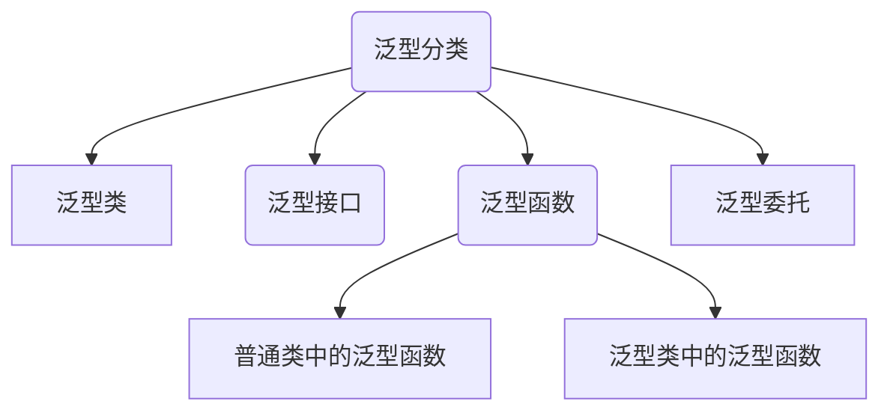
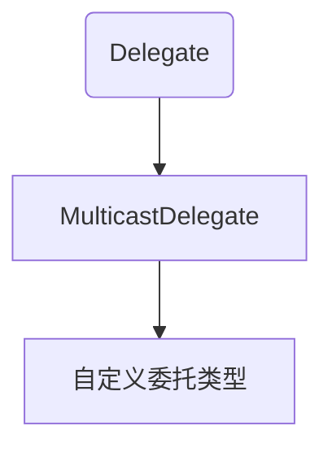

# 简单数据结构类

数组弊端：相同类型数据的集合，类型单一，长度不变。

集合：长度任意改变，类型随便。

## [ArrayList](https://learn.microsoft.com/zh-cn/dotnet/api/system.collections.arraylist?view=net-9.0)集合

`ArrayList`集合本质上是一个`object`数组的封装，二者的区别：

1. 数组是定长的，`ArrayList`是可扩容的；
2. `ArrayList`默认存储的是`Object`类型；
3. `ArrayList`使用时存在拆箱与装箱问题。

### 增

#### Add

```c#
public virtual int Add (object? value);
```

`list.Add(object value)`,添加单个元素，接受一切参数，将子类转化为object类,返回添加元素的索引。

```csharp
    static void Main(string[] args)
    {
        //创建一个集合对象
        ArrayList list = new ArrayList();
        list.Add(1);
        list.Add(true);
        list.Add("str");
        list.Add(123m);
        //添加数组
        list.Add(new int[] { 1, 2, 3, 4, 5 });
        RePerson p = new RePerson();
        //添加对象
        list.Add(p);
        for (int i = 0;i<list.Count; i++)
        {
            Console.WriteLine(list[i]);
            //对于实例会调用ToString()方法打印其命名空间.类名，
            //数组返回System.Int32[]，对象p返回study.RePerson
        }
    }
}
public class RePerson 
{
    public void Print() { Console.WriteLine("人类"); }
}
```

我们将对象输出到控制台，默认调用`ToString()方法`，打印这个对象所在类的命名空间。

使用里氏转换，进行输出。

```csharp
    static void Main(string[] args)
    {
        //创建一个集合对象
        ArrayList list = new ArrayList();
        list.Add(1);
        list.Add(true);
        list.Add("str");
        list.Add(123m);
        //添加数组
        list.Add(new int[] { 1, 2, 3, 4, 5 });
        RePerson p = new RePerson();
        //添加对象
        list.Add(p);
        for (int i = 0;i<list.Count; i++)
        {
            //里氏转换:obj转换为int[]
            if (list[i] is int[])
            {
                int[] arr = (int[])list[i];
                for (int j = 0; j < arr.Length; j++)
                {
                    Console.WriteLine(arr[j]);
                }
            }
            else if (list[i] is RePerson)
            {
                //里式转换 object 转换为RePerson
                ((RePerson)list[i]).Print();
            }
            else 
            {
                Console.WriteLine(list[i]);
            }
        }
    }
}
public class RePerson 
{
    public void Print() { Console.WriteLine("人类"); }
}
```

#### AddRange

```c#
public virtual void AddRange (System.Collections.ICollection c);
```

将集合元素依次添加到`ArrayList`末尾(批量增加)。

```csharp
internal class Program
{
    static void Main(string[] args)
    {
        ArrayList list = new ArrayList();
        list.AddRange(new int[] { 1, 23, 3, 3 });
        list.Add(new RePerson());//study.RePerson
        for (int i = 0; i < list.Count; i++)
        {
            Console.WriteLine(list[i]);
        }
    }
}
public class RePerson 
{
    public void RePrint() { Console.WriteLine('P'); }
}
```

#### 插入

| 方法                                                         | 释义                           |
| ------------------------------------------------------------ | ------------------------------ |
| `void Insert (int index, object? value)`                     | 指定位置插入元素               |
| `void InsertRange (int index, System.Collections.ICollection c)` | 将集合中的元素添加到指定位置处 |

```c#
 ArrayList list = new ArrayList();
 int[] arr = new int[] {1,234,5,67,234 };
 list.AddRange(arr);
 //list.Insert(15, 0);索引超出
 list.Insert(0, 55);
 list.InsertRange(0, arr);
 foreach(int i in list) Console.WriteLine(i);
```

### 删

| 方法                                      | 释义                               |
| ----------------------------------------- | ---------------------------------- |
| `void Remove (object? obj)`               | 移除第一个匹配的元素，从头到尾遍历 |
| `void RemoveAt (int index)`               | 根据索引移除元素                   |
| `void RemoveRange (int index, int count)` | 根据索引移除一定范围的元素         |
| `void Clear ()`                           | 清空所有元素                       |

如果不包含指定的 对象，则`ArrayList`保持不变。 不会引发异常

```c#
ArrayList list = new ArrayList();
int[] arr = new int[] {1,234,5,67 };
list.AddRange(arr);
list.Remove(12);//不会报错
list.RemoveAt(0);
```

### 查

| 方法                               | 释义                                                 |
| ---------------------------------- | ---------------------------------------------------- |
| `list[索引]`                       | 根据索引查找(底层通过索引器实现)                     |
| `bool Contains (object? item)`     | 判断是否包含某元素                                   |
| `int IndexOf (object? value)`      | 正向查找索引，返回第一个匹配元素的索引，找不到返回-1 |
| ` int LastIndexOf (object? value)` | 反向查找索引,返回第一个匹配元素的索引,找不到返回-1   |

### 其他方法

| 方法               | 释义     |
| ------------------ | -------- |
| `void Sort ()`     | 升序排列 |
| ` void Reverse ()` | 反转元素 |

### ArrayList集合长度问题

#### Add( )与AddRange( )长度

`Add`方法是将数组作为一个元素添加，而`AddRange`方法式将数组元素依次加入到`List`对象中

```csharp
static void Main(string[] args)
{
    ArrayList list = new ArrayList();
    list.Add(true);
    Console.WriteLine(list.Count);//1
    list.AddRange(new int[] { 1, 23, 3, 3 });
    Console.WriteLine(list.Count);//5
    list.Add(new int[] { 1, 2 });//6
    Console.WriteLine(list.Count); 
}
```

#### 长度可变原理

每次集合 中实际包含的元素个数（`Count`）超过了可以包含元素的个数（`Capacity`）时，集合就会向内存申请多一倍空间，避免产生过多的垃圾。

### 练习

:one: 创建一个集合，里面添加一些数字，求平均值与和。

```csharp
static void Main(string[] args)
{
    ArrayList list = new ArrayList();
    list.Add(1.0);
    list.AddRange(new int[] {1,23,4,4 });
    double sum = 0;
    for (int i = 0; i < list.Count; i++)
    {
        if (list[i] is int)
        {
            sum += (int)list[i];
            //转化为double类型
            //double类是Object类的子类，强制转换
        }
        else if (list[i] is double)
        {
            //转化为double
            sum += (double)list[i];
        }
    }
    Console.WriteLine(sum);
    Console.WriteLine(sum/list.Count);
}
```

:two: 写一个长度为10的集合，要求在里面存放10个数字（0-9），但是要求所有数字不重复。

```csharp
static void Main(string[] args)
{
    Random r = new Random();
    ArrayList list = new ArrayList();
    for (int i = 0; i < 10; i++)
    {
        int num = r.Next(0,10);//0-9
        if (!list.Contains(num)) 
        {
            list.Add(num);
        }
        else 
        {
            //这里是重复的入口，i-1去除无用的次数
            i--;
        }
    }
}
```

:three::定义一个背包类，用于管理物品，有出售和买入物品功能，且数量与价格会进行变化。

```c#
 //背包类，用于管理物品
 public class Bag
 {
     public Bag(int money)
     {
         //初始化
         items = new ArrayList();
         balance = money;
     }
     private ArrayList items;//物品
     private int balance;//余额

     /// <summary>
     /// 买入
     /// </summary>
     /// <param name="item">物品</param>
     public void BuyItem(Item item)
     {
         //判断金额是否足够
         if(item.Money*item.Num <= balance)
         {
             //减钱
             balance -= item.Money*item.Num;
             Console.WriteLine($"购买{item.Name}花了{item.Money * item.Num}钱");
             //判断背包中是否有重复物品
             for(int i = 0; i < items.Count; i++)
             {
                 if ((items[i] as Item).Id == item.Id )
                 {
                     //叠加数量
                     (items[i] as Item).Num += item.Num;
                     return;//直接退出
                 }
             }
             items.Add(item);//没有则直接添加
             Console.WriteLine($"余额{balance}");
         }
         else Console.WriteLine($"预计花费{item.Money * item.Num},目前余额{balance}不足以购买");
     }
     //出售物品
     public void SellItem(Item item)
     {
         int temp = 0;//出售数量
         for(int i = 0;i < items.Count;i++)
         {
             //不能比较两个对象，应比较ID，名称等
             if ((items[i] as Item).Id == item.Id )
             {
                 //判断数量
                 if ((items[i] as Item).Num > item.Num)
                 {
                     //背包中物品数量大于出售数量
                     temp = item.Num;
                     (items[i] as Item).Num -= temp;//重置背包物品数量
                 }
                 else
                 {//背包中物品数量小于出售数量：全部出售
                     temp = (items[i] as Item).Num;
                     items.RemoveAt(i);//移除
                 }
                 //背包余额
                 balance += temp * item.Money*2;//以两倍卖出
                 return;//后面的元素不必迭代
             }
         }
     }

 }

 public class Item
 {
     public Item(int id,int money,string name,int num) 
     {
         this.Id = id;
         this.Money = money;
         this.Name = name;
         this.Num = num;
     }
     public int Id {  get; set; }//ID
     public int Money { get; set; } //单价
     public string Name { set; get; }//名称
     public int Num {  get; set; }//数量
 }
```

## Stack

> `stack`是一个`c#`为我们封装好的类，本质是`object[]`数组。
>
> `stack`是栈存储容器，一种先进后出的数据结构，先存入的数据后获取，后存入的数据先获取。 
>
> 没有提供索引器，所以不能通过`for`循环遍历，可以将其转换为`object[]`数组，通过`for`循环遍历。


:bookmark:常用方法

| 签名                          | 释义                     |
| ----------------------------- | ------------------------ |
| `void Push (object obj)`      | 压栈，从顶部插入一个对象 |
| `object Pop ()`               | 弹栈，返回并删除顶部对象 |
| `object Peek ()`              | 查看顶部对象             |
| `bool Contains (object obj);` | 判断元素是否在栈中       |
| ` void Clear ()`              | 清空                     |
| `object[] ToArray ()`         | 转换为新数组             |

```c#
Stack s =new Stack();
 //压栈
 s.Push(1);
 s.Push(true);
 //弹栈，遵循先进后出原则
 Object obj = s.Pop();//从容器中移出去
 Console.WriteLine(obj);//true
 //查：无法查看指定内容，只能查看栈顶内容
 Console.WriteLine(s.Peek());//1
 //查看元素是否在容器中
 if(s.Contains(1)) Console.WriteLine("存在");
 //只能压栈与弹栈，没有修改元素的方法，只有清空
 s.Clear();
```

遍历的顺序是从栈顶到栈底。

```c#
Stack s = new Stack();
//压栈
s.Push(1);
s.Push(true);
foreach (Object obj in s)
{
    //打印顺序从栈顶到栈底
    Console.WriteLine(obj);
}
//转换为数组
Object[] objs = s.ToArray();
for (int i = 0; i < objs.Length; i++)
{//打印顺序从栈顶到栈底
    Console.WriteLine(objs[i]);
}
```

循环弹栈：边取边用，知道栈清空。

```c#
Stack s = new Stack();
//压栈
s.Push(1);
s.Push(true);
while (s.Count > 0)
{
    //边取便用，知道栈清空
    Console.WriteLine(s.Pop());
}
```

:page_facing_up:写一个方法将十进制数转换为二进制数，使用栈结构存储，并将其打印出来。

```c#
public static void Change(int num)
{
    //栈结构
    Stack stack = new Stack();
    while(num != 0)
    {
        int remainder = num%2;
        num /= 2;
        stack.Push(remainder);
    }
    foreach(int i in stack) Console.Write(i);
}
```


## Queue

> 队列存储容器，先进先出的数据结构，先存入的数据先获取，后存入的数据后获取。没有提供索引器，所以不能通过`for`循环遍历，可以将其转换为`object[]`数组，通过`for`循环遍历。


| 方法签名                     | 释义               |
| ---------------------------- | ------------------ |
| `void Enqueue (object obj)`  | 添加元素           |
| `object Dequeue ()`          | 移除元素           |
| `object Peek ()`             | 查看队列头部元素   |
| `bool Contains (object obj)` | 判断是否包含某元素 |
| ` void Clear ()`             | 清空               |
| `object[] ToArray ()`        | 转换为新数组       |

```c#
//队列结构
Queue queue = new Queue();
queue.Enqueue(1);//添加
queue.Enqueue("A");
queue.Enqueue(false);
foreach (var item in queue) Console.WriteLine(item);
//不存在删除概念，只有取的概念
Console.WriteLine(queue.Dequeue()); ;//先进先出
```

遍历的顺序是从队列的头部到尾部。

```c#
 //队列结构
 Queue queue = new Queue();
 queue.Enqueue(1);//添加
 queue.Enqueue("A");
 queue.Enqueue(false);
//foreach遍历
 foreach (var item in queue) Console.WriteLine(item);
 //循环出列
 while (queue.Count != 0)
 {
     Object o = queue.Dequeue();
     Console.WriteLine(o.ToString());
 }
```

:bookmark_tabs:使用队列存储消息，一次性存储10条消息，每隔一段时间打印一条消息；且打印消息时要有明显停顿感

```c#
//队列结构
Queue queue = new Queue();
queue.Enqueue("10金币");
queue.Enqueue("100金币");
queue.Enqueue("10个血瓶");
queue.Enqueue("10个蓝瓶");
int count = 1;
while(queue.Count > 0)
{
    //循环出列
    if(count %9999999 == 0)
    {
        Console.WriteLine(queue.Dequeue());
        count = 0;
    }
    count++;
}
```

## Hashtable集合

键值对集合,主要作用时提高数据查询效率，根据键访问集合中的值。键必须唯一，值可以重复。

:bookmark_tabs:常用方法：

| 签名                                  | 释义                                 |
| ------------------------------------- | ------------------------------------ |
| `void Add (object key, object value)` | 添加键值对                           |
| `void Remove (object key)`            | 通过键删除元素，删除不存在的键无反应 |
| `virtual void Clear ()`               | 清空                                 |
| `bool Contains (object key)`          | 查看键是否存在                       |
| `bool ContainsKey (object key)`       | 查看键是否存在                       |
| `bool ContainsValue (object value)`   | 查找值是否存在                       |

:bookmark_tabs: 常用属性

| 属性                                             | 释义                                 |
| ------------------------------------------------ | ------------------------------------ |
| ` object this[object key] { get; set; }`         | 通过键设置或读取值，找不到返回`null` |
| `System.Collections.ICollection Keys { get; }`   | 键集合                               |
| `System.Collections.ICollection Values { get; }` | 值集合                               |

向键值对中添加数据一：

```csharp
static void Main(string[] args)
{
    Hashtable ht = new Hashtable();
    ht.Add(1, 2);
    ht.Add(2, 3);
    ht.Add(false, 3);
    ht.Add("name", "占山");
    foreach (var item in ht.Keys)//键集合
    {
        //非顺序打印
        Console.WriteLine("键是--{0},值是--{1}", item, ht[item]);
    }
}
```

向键值对中添加数据二：

```csharp
Hashtable ht = new Hashtable();
ht.Add("name", "占山");
ht[6] = true;//另一种添加数据方式
ht["name"] = "替换占山";//判断内部如果没有该键，即添加，若有则替换值
```

方法练习

```csharp
Hashtable ht = new Hashtable();
ht.Add(object key , object value);//添加
ht.ContainsKey(object key);//判断是否包含，返回布尔值
ht.Clear();//清空集合所有键值
ht.Remove(object key)//根据键去移除
ht.Add("name", "占山");
ht[6] = true;//另一种添加数据方式
ht[1] = 2;
if (!ht.Contains(1))
{
    ht.Add(1, 3);
}
else 
{
    Console.WriteLine("包含了1键");
}
```

:bookmark_tabs:制作一个怪物管理器，提供创建怪物，移除怪物的方法，每个怪物都有自己的`Id`

```c#
//管理器一般都是唯一的，设置成单例模式
public  class MonsterMgr
{
    //先于构造函数初始化
    private Hashtable _monsters = new Hashtable();
    private MonsterMgr() { }//不允许外界实例化

    //单例
    public static MonsterMgr Instance { get; } = new MonsterMgr();//唯一实例
    private int _id = 1 ;//用于管理怪物ID
    public void AddMonster() 
    {
        Monster m = new Monster(_id);
        _monsters.Add(_id, m);
        _id++;
    }
    public void RemoveMonster(int id)
    {
        if (_monsters.Contains(id)) 
        {
            _monsters.Remove(id);
        }
    }
}
public class Monster 
{
    public Monster(int id) 
    {
        Id = id;
    }
    public int Id { get;}//怪物ID，只读
}
```


## 装箱与拆箱

装箱：将值类型转换为引用类型。

拆箱：将引用类型转换为值类型。

```csharp
static void Main(string[] args)
{
    int num = 10;//值类型
    object obj = num;//装箱，把值类型转换为引用类型
    num = (int)obj;//拆箱
}
```


区别：

```csharp
static void Main(string[] args)
{
    Stopwatch sw = new Stopwatch();
    sw.Start();
    ArrayList list = new ArrayList();
    for (int i = 0; i <= 10000000; i++) 
    {
        list.Add(i);
        //list.Add(object value),存在装箱
    }
    sw.Stop();
    Console.WriteLine(sw.Elapsed);//总时间1.28s
}

static void Main(string[] args)
{
    Stopwatch sw = new Stopwatch();
    sw.Start();
    List <int>  list = new List <int>();
    for (int i = 0; i <= 10000000; i++) 
    {
        list.Add(i);//不存在装箱
    }
    sw.Stop();
    Console.WriteLine(sw.Elapsed);//总时间0.09s
}
```

装箱拆箱会损耗内存，代码中应避免装箱与拆箱。

发生装箱与装箱：看这两种类型是否存在继承关系，没有继承关系，不会有装箱与拆箱操作，有继承关系才有可能发生装箱与拆箱。

```csharp
static void Main(string[] args)
{
    string str = "123";//引用类型
    int num = int.Parse(str);//引用类型转值类型
}
```

# 常用泛型数据结构类

## List

指定类型的ArrayList集合。`List<T> list = new List<T>();`类型固定，长度任意。

```csharp
static void Main(string[] args)
{
    //泛型集合
    List <int> list = new List<int>();
    //方法与ArraryList一致
    list.Add(0);
    list.AddRange(new int[] { 2, 3, 4 });
    list.Insert(0, 10);
    list.InsertRange(1, new int[] { 2, 4 });
    list.RemoveRange(0, 1);
}
```

泛型集合可以转换为数组，数组也可以转换为泛型集合。

```csharp
//泛型集合转数组
List <int> list = new List<int>();
int[] arr = list.ToArray();
//数组转泛型集合
int[] arr = new int[2];
List<int> list = arr.ToList();
```

# 泛型

## 基本使用

泛型相当于类型占位符，使用占位符如`T`来代表某种类型，编译器在编译期间使用特化类型替代类型占位符。通过泛型，可以在同一份代码上操作多种类型。

泛型可以修饰类，接口，函数，委托等。




:one: 泛型类:`class 类名<泛型占位符>`

```c#
public class Store<T>
{
    //存储数据
    private T[] values = new T[100];
    private int i = 0;
    public void Add(T value)
    {
        values[i] = value;
        i++;
    }

    public T getValue(int i)
    {
        return values[i];
    }
}
//Main函数中调用
 public static void Main(string[] args)
 {
     //泛型的特化
    Store<string> store = new Store<string>();
     store.Add("ads");
     store.Add("a");
     store.Add("bc");
     Console.WriteLine(store.getValue(1));
 }
```

也可以使用多个占位符：

```c#
internal class Store<T,K,M>{}
```

:two: 泛型接口:`interface 接口名<泛型占位符>`

```c#
//与泛型类相似
interface IT<T>
{
    T name { get; }
}
//继承时须设置类型
public class Test : IT<string>
{
    public string name => throw new NotImplementedException();
}
```

:three:普通类中的泛型函数：`返回值 函数名<泛型占位符>(参数列表)`

```c#
public void Fun<T>() 
{
    //做一些逻辑处理
    T t = default(T);//获取类型默认值
}
//作为返回值
public T Fun<T>(string value) 
{
    return default(T);
}

//作为参数传递

public void Fun<T>(T value) 
{
    Console.WriteLine(value);
}
//多个参数
public void Fun<T, K, M>(T t, K k, M m) { }
```

:four:泛型类或接口中的泛型方法

```c#
internal class Store<K>
{
    public void Fun<T>(T value) 
    {
    } 
    // 不是泛型方法，使用的是类定义的泛型占位符
    public void ErrorFun(K value)
    {
    }
}
//调用
public static void Main(string[] args)
{
   Store<string> store = new Store<string>();
    store.Fun<int>(1);//int可省略
    store.Fun("");//可根据参数推断出泛型类型

}
```

:book:根据用户输入的内容判断器类型

```c#
public static void GetTypeFun<T>( T value)
{
    if(typeof(T) == typeof(int)) Console.WriteLine("int整型,32字节");
    else if(typeof(T) == typeof(char)) Console.WriteLine("字符");
    else if(typeof(T) == typeof(float)) Console.WriteLine("单精度浮点数");
    else if(typeof(T) == typeof(string)) Console.WriteLine("字符串");
    else Console.WriteLine("其他类型");
}
```

## 泛型约束


> 对泛型类型进行约束，关键字`where`,泛型约束共6种。

| 类型                             | 语法                              |
| -------------------------------- | --------------------------------- |
| 值类型约束                       | `where 泛型字母 :struct`          |
| 引用类型约束                     | `where 泛型字母 :class`           |
| 存在无参的公共构造函数非抽象类型 | `where 泛型字母 : new()`          |
| 某个类类型或其派生类型           | `where 泛型字母 : 类名`           |
| 某个接口类型或其派生类型         | `where 泛型字母 : 接口名`         |
| 另一个泛型类型本身或其派生类     | `where 泛型字母 : 另一个泛型字母` |

:bookmark:值类型约束：

```c#
 public class Demo<T> where T : struct//值类型
 {
     public T age;
     public void Get<M>(M m) where M : struct
     {
         Console.WriteLine(m);
     }
 }
```

:bookmark:存在无参的公共构造函数:

```c#
public class Demo<T> where T : new()
{
    public T value;
}

public class Test1
{
    public Test1() { }
    public Test1(int a) { }
}
public class Test2 { }//存在默认的无参公共构造函数
public class Test3
{//私有的公共构造函数
    private Test3() { }
}
//Main函数种调用
 public static void Main(string[] args)
 {
     Demo<Test1> demo = new Demo<Test1>();
     Demo<Test2> demo1 = new Demo<Test2>();
     Demo<int> demo2 = new Demo<int>();//结构体也存在无参的公共构造函数
     //Demo<Test3> demo3 = new Demo<Test3>(); 私有的无参公共构造函数不能作为泛型参数
 }
```

:bookmark:另一个类型或其派生类

```c#
 public class Demo<T, K> where T : K
 {
     public T Value { get; set; }
 }

 public abstract class Test1 : A
 {
     public Test1() { }
     public Test1(int a) { }
 }
 interface A { }
//Main函数
public static void Main(string[] args)
{
    Demo<A, A> demo = new Demo<A, A>();//类型本身
    Demo<Test1, A> demo1 = new Demo<Test1, A>();//派生类
}
```


:bookmark: 组合使用与多个泛型有约束

```c#
 public class Demo<T,K> where T :class,new() where K:class
 {
 }
```

:one:：用泛型实现一个单例模式

```c#
public class SingleBase<T> where T : new()
{
    //基类种初始化子类
    public static T Instance { get; } = new T();
}
public class Demo:SingleBase<Demo>{}
```

:two:：利用泛型，仿造`ArratList`实现一个任意类型的数组的类，同时有增删改查的方法。​

```c#
public class ArrayList<T>
{
    public ArrayList()
    {
        array = new T[16];//初始化
    }
    //存储数据用
    private T[] array;
    //count为存储的数据个数
    private int _count;

    public int Count
    {
        get { return _count; }
    }
    //Capatity为数组的长度
    public int Capacity
    {
        get { return array.Length; }
    }
    //增
    public void Add(T item)
    {
        //判断容量与count
        if (Count >= Capacity)
        {
            //每次扩容容量扩大2倍
            T[] temp = new T[Capacity * 2];
            for (int i = 0; i < array.Length; i++)
            {
                temp[i] = array[i];
            }
            array = temp;//转移
        }
        //不需要扩容或扩完容增加
        array[_count++] = item;
    }
    //删
    public void Remove(T value) 
    { 
        //判断是否存在,使用Count实际存储的数量长度
        for (int i = 0;i<Count;i++)
        {
            //不能用==，不是所有的类型都重载了==运算符
            if (array[i].Equals(value)) 
            {
               RemoveAt(i);
            }
        }
    }
    public void RemoveAt(int i) 
    {
        //判断索引是否合法
        if(i< 0 || i >Count)
        {
            Console.WriteLine("非法索引");
            return;
        }
        //元素向删除处移动
        for (; i < Count - 1; i++)
        {
            array[i] = array[i + 1];
        }
        array[_count-- - 1] = default(T);//重置为默认值
    }
    //改
    public T this[int index]
    {
        get
        {
            //判断索引是否合法
            if (index < 0 || index > Count)
            {
                Console.WriteLine("非法索引");
                return default(T);
            }
            return array[index];
        }
        set
        {
            if (index < 0 || index > Count)
            {
                Console.WriteLine("非法索引");
                return;
            }
            array[index] = value;
        }
    }
}
```


# 委托

委托_`Delegate`：是一种引用类型变量，可以看作包含有序的方法列表对象。委托管理的方法签名需要和委托一致。

```c#
 //委托类型
 delegate void MyDel(string vlaue);
 public class Program
 {
     private void PrintLow(string value) 
     {
         Console.WriteLine($"Low-{value}");
     }

     private void PrintHeight(string value)
     {
         Console.WriteLine($"Height_{value}");
     }
     public static void Main(string[] args)
     {
         Program program = new Program();
         //随机数对象
         Random random = new Random();
         int num = random.Next(99);
         //初始化委托对象，用来管理方法
         MyDel del = num>50 ? new MyDel(program.PrintHeight):new MyDel(program.PrintLow);
         del(num.ToString());
     }
 }
```

创建委托对象还可以通过 `MyDel del =program.PrintHeight `方式创建，方法和委托类型之间存在类型转换。

在类内部定义委托：

```c#
 class Button
 {
     //声明委托类型
     public delegate void ButtonClick();
     //声明委托类型的变量
     public ButtonClick but = null;

     public void Click() 
     {
         //调用委托管理的方法
        but?.Invoke();//空值运算符
     }

     public void GameStart() 
     {
         Console.WriteLine("游戏开始");
     }
 }
 public class Program
 {
     public static void Main(string[] args)
     {
         Button button = new Button();
         //初始化委托变量，并添加一个方法
         button.but = new Button.ButtonClick(button.GameStart);
         button.Click();//执行委托方法
     }
 }
```

## 多播委托

当一个委托由多个委托对象通过`+`运算符或`+=`运算符创建，则会生成一个全新的委托，其调用列表是`=`右边委托的调用列表的副本组合。

```c#
//定义委托类型
public delegate int CaculateNum(int a,int b);
public static void Main(string[] args)
{
    CaculateNum delA = Add;
    CaculateNum delB = Mutiplay;
    CaculateNum delC = delA + delB;
    Console.WriteLine(delC(1,2));
    //依次执行调用列表中的方法
    //a+b=3
    //a*b=2
    //2，返回值为最后一个方法的返回值
}

public static int Add(int a,int b)
{
    Console.WriteLine($"a+b={a+b}");
    return a + b;
}
public static int Mutiplay(int a,int b)
{
    Console.WriteLine($"a*b={a * b}");
    return a * b;
}
```

:book:通过`+=`运算符创建委托对象

```c#
public static void Main(string[] args)
{
    CaculateNum delA = Add;
    delA += Mutiplay;//创建一个全新的委托对象
    delA += Add;
}
```

委托对象存在不可变性，使用`+=`运算符实际上是在内存上重新开辟空间，将新对象的引用地址赋给变量。

:book:通过`-=`操作符移除调用列表中的方法。

1. 从调用列表最后开始搜索，移除第一个与方法匹配的实例。
2. 调用空委托会抛出异常，若调用列表为空，则委托对象为null。

:book:委托返回值

委托的返回值永远是最后一个方法，通过` Delegate[] GetInvocationList()`方法可获取当前委托中存放的子委托。

```c#
foreach(CaculateNum item in delA.GetInvocationList()) 
{
    //读取相关返回值
}
```

`foreach`语句会将每一个`Degelate`转换为`CaculateNum`类型。以下为委托中的继承关系：



