# 简单数据结构类

数组弊端：相同类型数据的集合，类型单一，长度不变。

集合：长度任意改变，类型随便。

## [ArrayList](https://learn.microsoft.com/zh-cn/dotnet/api/system.collections.arraylist?view=net-9.0)集合

`ArrayList`集合本质上是一个`object`数组的封装，二者的区别：

1. 数组是定长的，`ArrayList`是可扩容的；
2. `ArrayList`默认存储的是`Object`类型；
3. `ArrayList`使用时存在拆箱与装箱问题。

### 增

#### Add

```c#
public virtual int Add (object? value);
```

`list.Add(object value)`,添加单个元素，接受一切参数，将子类转化为object类,返回添加元素的索引。

```csharp
    static void Main(string[] args)
    {
        //创建一个集合对象
        ArrayList list = new ArrayList();
        list.Add(1);
        list.Add(true);
        list.Add("str");
        list.Add(123m);
        //添加数组
        list.Add(new int[] { 1, 2, 3, 4, 5 });
        RePerson p = new RePerson();
        //添加对象
        list.Add(p);
        for (int i = 0;i<list.Count; i++)
        {
            Console.WriteLine(list[i]);
            //对于实例会调用ToString()方法打印其命名空间.类名，
            //数组返回System.Int32[]，对象p返回study.RePerson
        }
    }
}
public class RePerson 
{
    public void Print() { Console.WriteLine("人类"); }
}
```

我们将对象输出到控制台，默认调用`ToString()方法`，打印这个对象所在类的命名空间。

使用里氏转换，进行输出。

```csharp
    static void Main(string[] args)
    {
        //创建一个集合对象
        ArrayList list = new ArrayList();
        list.Add(1);
        list.Add(true);
        list.Add("str");
        list.Add(123m);
        //添加数组
        list.Add(new int[] { 1, 2, 3, 4, 5 });
        RePerson p = new RePerson();
        //添加对象
        list.Add(p);
        for (int i = 0;i<list.Count; i++)
        {
            //里氏转换:obj转换为int[]
            if (list[i] is int[])
            {
                int[] arr = (int[])list[i];
                for (int j = 0; j < arr.Length; j++)
                {
                    Console.WriteLine(arr[j]);
                }
            }
            else if (list[i] is RePerson)
            {
                //里式转换 object 转换为RePerson
                ((RePerson)list[i]).Print();
            }
            else 
            {
                Console.WriteLine(list[i]);
            }
        }
    }
}
public class RePerson 
{
    public void Print() { Console.WriteLine("人类"); }
}
```

#### AddRange

```c#
public virtual void AddRange (System.Collections.ICollection c);
```

将集合元素依次添加到`ArrayList`末尾(批量增加)。

```csharp
internal class Program
{
    static void Main(string[] args)
    {
        ArrayList list = new ArrayList();
        list.AddRange(new int[] { 1, 23, 3, 3 });
        list.Add(new RePerson());//study.RePerson
        for (int i = 0; i < list.Count; i++)
        {
            Console.WriteLine(list[i]);
        }
    }
}
public class RePerson 
{
    public void RePrint() { Console.WriteLine('P'); }
}
```

#### 插入

| 方法                                                         | 释义                           |
| ------------------------------------------------------------ | ------------------------------ |
| `void Insert (int index, object? value)`                     | 指定位置插入元素               |
| `void InsertRange (int index, System.Collections.ICollection c)` | 将集合中的元素添加到指定位置处 |

```c#
 ArrayList list = new ArrayList();
 int[] arr = new int[] {1,234,5,67,234 };
 list.AddRange(arr);
 //list.Insert(15, 0);索引超出
 list.Insert(0, 55);
 list.InsertRange(0, arr);
 foreach(int i in list) Console.WriteLine(i);
```

### 删

| 方法                                      | 释义                               |
| ----------------------------------------- | ---------------------------------- |
| `void Remove (object? obj)`               | 移除第一个匹配的元素，从头到尾遍历 |
| `void RemoveAt (int index)`               | 根据索引移除元素                   |
| `void RemoveRange (int index, int count)` | 根据索引移除一定范围的元素         |
| `void Clear ()`                           | 清空所有元素                       |

如果不包含指定的 对象，则`ArrayList`保持不变。 不会引发异常

```c#
ArrayList list = new ArrayList();
int[] arr = new int[] {1,234,5,67 };
list.AddRange(arr);
list.Remove(12);//不会报错
list.RemoveAt(0);
```

### 查

| 方法                               | 释义                                                 |
| ---------------------------------- | ---------------------------------------------------- |
| `list[索引]`                       | 根据索引查找(底层通过索引器实现)                     |
| `bool Contains (object? item)`     | 判断是否包含某元素                                   |
| `int IndexOf (object? value)`      | 正向查找索引，返回第一个匹配元素的索引，找不到返回-1 |
| ` int LastIndexOf (object? value)` | 反向查找索引,返回第一个匹配元素的索引,找不到返回-1   |

### 其他方法

| 方法               | 释义     |
| ------------------ | -------- |
| `void Sort ()`     | 升序排列 |
| ` void Reverse ()` | 反转元素 |

### ArrayList集合长度问题

#### Add( )与AddRange( )长度

`Add`方法是将数组作为一个元素添加，而`AddRange`方法式将数组元素依次加入到`List`对象中

```csharp
static void Main(string[] args)
{
    ArrayList list = new ArrayList();
    list.Add(true);
    Console.WriteLine(list.Count);//1
    list.AddRange(new int[] { 1, 23, 3, 3 });
    Console.WriteLine(list.Count);//5
    list.Add(new int[] { 1, 2 });//6
    Console.WriteLine(list.Count); 
}
```

#### 长度可变原理

每次集合中实际包含的元素个数（`Count`）超过了可以包含元素的个数（`Capacity`）时，集合就会向内存申请多一倍空间。

### 练习

:one: 创建一个集合，里面添加一些数字，求平均值与和。

```csharp
static void Main(string[] args)
{
    ArrayList list = new ArrayList();
    list.Add(1.0);
    list.AddRange(new int[] {1,23,4,4 });
    double sum = 0;
    for (int i = 0; i < list.Count; i++)
    {
        if (list[i] is int)
        {
            sum += (int)list[i];
            //转化为double类型
            //double类是Object类的子类，强制转换
        }
        else if (list[i] is double)
        {
            //转化为double
            sum += (double)list[i];
        }
    }
    Console.WriteLine(sum);
    Console.WriteLine(sum/list.Count);
}
```

:two: 写一个长度为10的集合，要求在里面存放10个数字（0-9），但是要求所有数字不重复。

```csharp
static void Main(string[] args)
{
    Random r = new Random();
    ArrayList list = new ArrayList();
    for (int i = 0; i < 10; i++)
    {
        int num = r.Next(0,10);//0-9
        if (!list.Contains(num)) 
        {
            list.Add(num);
        }
        else 
        {
            //这里是重复的入口，i-1去除无用的次数
            i--;
        }
    }
}
```

:three::定义一个背包类，用于管理物品，有出售和买入物品功能，且数量与价格会进行变化。

```c#
 //背包类，用于管理物品
 public class Bag
 {
     public Bag(int money)
     {
         //初始化
         items = new ArrayList();
         balance = money;
     }
     private ArrayList items;//物品
     private int balance;//余额

     /// <summary>
     /// 买入
     /// </summary>
     /// <param name="item">物品</param>
     public void BuyItem(Item item)
     {
         //判断金额是否足够
         if(item.Money*item.Num <= balance)
         {
             //减钱
             balance -= item.Money*item.Num;
             Console.WriteLine($"购买{item.Name}花了{item.Money * item.Num}钱");
             //判断背包中是否有重复物品
             for(int i = 0; i < items.Count; i++)
             {
                 if ((items[i] as Item).Id == item.Id )
                 {
                     //叠加数量
                     (items[i] as Item).Num += item.Num;
                     return;//直接退出
                 }
             }
             items.Add(item);//没有则直接添加
             Console.WriteLine($"余额{balance}");
         }
         else Console.WriteLine($"预计花费{item.Money * item.Num},目前余额{balance}不足以购买");
     }
     //出售物品
     public void SellItem(Item item)
     {
         int temp = 0;//出售数量
         for(int i = 0;i < items.Count;i++)
         {
             //不能比较两个对象，应比较ID，名称等
             if ((items[i] as Item).Id == item.Id )
             {
                 //判断数量
                 if ((items[i] as Item).Num > item.Num)
                 {
                     //背包中物品数量大于出售数量
                     temp = item.Num;
                     (items[i] as Item).Num -= temp;//重置背包物品数量
                 }
                 else
                 {//背包中物品数量小于出售数量：全部出售
                     temp = (items[i] as Item).Num;
                     items.RemoveAt(i);//移除
                 }
                 //背包余额
                 balance += temp * item.Money*2;//以两倍卖出
                 return;//后面的元素不必迭代
             }
         }
     }

 }

 public class Item
 {
     public Item(int id,int money,string name,int num) 
     {
         this.Id = id;
         this.Money = money;
         this.Name = name;
         this.Num = num;
     }
     public int Id {  get; set; }//ID
     public int Money { get; set; } //单价
     public string Name { set; get; }//名称
     public int Num {  get; set; }//数量
 }
```

## Stack

> `stack`是一个`c#`为我们封装好的类，本质是`object[]`数组。
>
> `stack`是栈存储容器，一种先进后出的数据结构，先存入的数据后获取，后存入的数据先获取。 
>
> 没有提供索引器，所以不能通过`for`循环遍历，可以将其转换为`object[]`数组，通过`for`循环遍历。

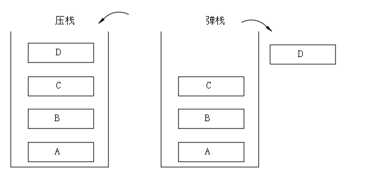

:bookmark:常用方法

| 签名                          | 释义                     |
| ----------------------------- | ------------------------ |
| `void Push (object obj)`      | 压栈，从顶部插入一个对象 |
| `object Pop ()`               | 弹栈，返回并删除顶部对象 |
| `object Peek ()`              | 查看顶部对象             |
| `bool Contains (object obj);` | 判断元素是否在栈中       |
| ` void Clear ()`              | 清空                     |
| `object[] ToArray ()`         | 转换为新数组             |

```c#
Stack s =new Stack();
 //压栈
 s.Push(1);
 s.Push(true);
 //弹栈，遵循先进后出原则
 Object obj = s.Pop();//从容器中移出去
 Console.WriteLine(obj);//true
 //查：无法查看指定内容，只能查看栈顶内容
 Console.WriteLine(s.Peek());//1
 //查看元素是否在容器中
 if(s.Contains(1)) Console.WriteLine("存在");
 //只能压栈与弹栈，没有修改元素的方法，只有清空
 s.Clear();
```

遍历的顺序是从栈顶到栈底。

```c#
Stack s = new Stack();
//压栈
s.Push(1);
s.Push(true);
foreach (Object obj in s)
{
    //打印顺序从栈顶到栈底
    Console.WriteLine(obj);
}
//转换为数组
Object[] objs = s.ToArray();
for (int i = 0; i < objs.Length; i++)
{//打印顺序从栈顶到栈底
    Console.WriteLine(objs[i]);
}
```

循环弹栈：边取边用，直到栈清空。

```c#
Stack s = new Stack();
//压栈
s.Push(1);
s.Push(true);
while (s.Count > 0)
{
    //边取便用，知道栈清空
    Console.WriteLine(s.Pop());
}
```

:page_facing_up:写一个方法将十进制数转换为二进制数，使用栈结构存储，并将其打印出来。

```c#
public static void Change(int num)
{
    //栈结构
    Stack stack = new Stack();
    while(num != 0)
    {
        int remainder = num%2;
        num /= 2;
        stack.Push(remainder);
    }
    foreach(int i in stack) Console.Write(i);
}
```

## Queue

> 队列存储容器，先进先出的数据结构，先存入的数据先获取，后存入的数据后获取。没有提供索引器，所以不能通过`for`循环遍历，可以将其转换为`object[]`数组，通过`for`循环遍历。

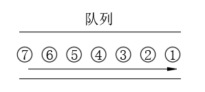

| 方法签名                     | 释义               |
| ---------------------------- | ------------------ |
| `void Enqueue (object obj)`  | 添加元素           |
| `object Dequeue ()`          | 移除元素           |
| `object Peek ()`             | 查看队列头部元素   |
| `bool Contains (object obj)` | 判断是否包含某元素 |
| ` void Clear ()`             | 清空               |
| `object[] ToArray ()`        | 转换为新数组       |

```c#
//队列结构
Queue queue = new Queue();
queue.Enqueue(1);//添加
queue.Enqueue("A");
queue.Enqueue(false);
foreach (var item in queue) Console.WriteLine(item);
//不存在删除概念，只有取的概念
Console.WriteLine(queue.Dequeue()); ;//先进先出
```

遍历的顺序是从队列的头部到尾部。

```c#
 //队列结构
 Queue queue = new Queue();
 queue.Enqueue(1);//添加
 queue.Enqueue("A");
 queue.Enqueue(false);
//foreach遍历
 foreach (var item in queue) Console.WriteLine(item);
 //循环出列
 while (queue.Count != 0)
 {
     Object o = queue.Dequeue();
     Console.WriteLine(o.ToString());
 }
```

:bookmark_tabs:使用队列存储消息，一次性存储10条消息，每隔一段时间打印一条消息；且打印消息时要有明显停顿感

```c#
//队列结构
Queue queue = new Queue();
queue.Enqueue("10金币");
queue.Enqueue("100金币");
queue.Enqueue("10个血瓶");
queue.Enqueue("10个蓝瓶");
int count = 1;
while(queue.Count > 0)
{
    //循环出列
    if(count %9999999 == 0)
    {
        Console.WriteLine(queue.Dequeue());
        count = 0;
    }
    count++;
}
```

## Hashtable集合

键值对集合,主要作用时提高数据查询效率，根据键访问集合中的值。键必须唯一，值可以重复。

:bookmark_tabs:常用方法：

| 签名                                  | 释义                                 |
| ------------------------------------- | ------------------------------------ |
| `void Add (object key, object value)` | 添加键值对                           |
| `void Remove (object key)`            | 通过键删除元素，删除不存在的键无反应 |
| `virtual void Clear ()`               | 清空                                 |
| `bool Contains (object key)`          | 查看键是否存在                       |
| `bool ContainsKey (object key)`       | 查看键是否存在                       |
| `bool ContainsValue (object value)`   | 查找值是否存在                       |

:bookmark_tabs: 常用属性

| 属性                                             | 释义                                                   |
| ------------------------------------------------ | ------------------------------------------------------ |
| ` object this[object key] { get; set; }`         | 通过键设置，替换或读取值，若键不存在，读取时返回`null` |
| `System.Collections.ICollection Keys { get; }`   | 键集合                                                 |
| `System.Collections.ICollection Values { get; }` | 值集合                                                 |

向键值对中添加数据一：

```csharp
static void Main(string[] args)
{
    Hashtable ht = new Hashtable();
    ht.Add(1, 2);
    ht.Add(2, 3);
    ht.Add(false, 3);
    ht.Add("name", "占山");
    foreach (var item in ht.Keys)//键集合
    {
        //非顺序打印
        Console.WriteLine("键是--{0},值是--{1}", item, ht[item]);
    }
}
```

向键值对中添加数据二：

```csharp
Hashtable ht = new Hashtable();
ht.Add("name", "占山");
ht[6] = true;//另一种添加数据方式
ht["name"] = "替换占山";//判断内部如果没有该键，即添加，若有则替换值
```

方法练习

```csharp
Hashtable ht = new Hashtable();
ht.Add(object key , object value);//添加
ht.ContainsKey(object key);//判断是否包含，返回布尔值
ht.Clear();//清空集合所有键值
ht.Remove(object key)//根据键去移除
ht.Add("name", "占山");
ht[6] = true;//另一种添加数据方式
ht[1] = 2;
if (!ht.Contains(1))
{
    ht.Add(1, 3);
}
else 
{
    Console.WriteLine("包含了1键");
}
```

:bookmark_tabs:制作一个怪物管理器，提供创建怪物，移除怪物的方法，每个怪物都有自己的`Id`

```c#
//管理器一般都是唯一的，设置成单例模式
public  class MonsterMgr
{
    //先于构造函数初始化
    private Hashtable _monsters = new Hashtable();
    private MonsterMgr() { }//不允许外界实例化

    //单例
    public static MonsterMgr Instance { get; } = new MonsterMgr();//唯一实例
    private int _id = 1 ;//用于管理怪物ID
    public void AddMonster() 
    {
        Monster m = new Monster(_id);
        _monsters.Add(_id, m);
        _id++;
    }
    public void RemoveMonster(int id)
    {
        if (_monsters.Contains(id)) 
        {
            _monsters.Remove(id);
        }
    }
}
public class Monster 
{
    public Monster(int id) 
    {
        Id = id;
    }
    public int Id { get;}//怪物ID，只读
}
```

# 泛型

## 基本使用

泛型相当于类型占位符，使用占位符如`T`来代表某种类型，编译器在编译期间使用特化类型替代类型占位符。通过泛型，可以在同一份代码上操作多种类型。

泛型可以修饰类，结构，接口，委托，函数，前四个是类型，方法是成员。

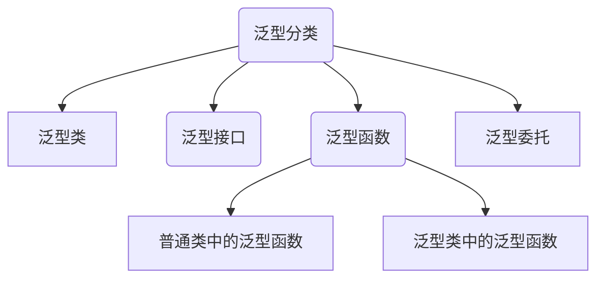


:one: 泛型类:`class 类名<泛型占位符>`

```c#
public class Store<T>
{
    //存储数据
    private T[] values = new T[100];
    private int i = 0;
    public void Add(T value)
    {
        values[i] = value;
        i++;
    }

    public T getValue(int i)
    {
        return values[i];
    }
}
//Main函数中调用
 public static void Main(string[] args)
 {
     //泛型的特化
    Store<string> store = new Store<string>();
     store.Add("ads");
     store.Add("a");
     store.Add("bc");
     Console.WriteLine(store.getValue(1));
 }
```

也可以使用多个占位符,用逗号隔开：

```c#
internal class Store<T,K,M>{}
```

:two: 泛型接口:`interface 接口名<泛型占位符>`

```c#
//与泛型类相似
interface IT<T>
{
    T name { get; }
}
//继承时须设置类型
public class Test : IT<string>
{
    public string name => throw new NotImplementedException();
}

---------------------------------------------------------------------
    //注意类A与B继承的不是同一个泛型接口，仅共享相同的泛型接口名称IStore<>
 public interface IStore<T>  {}

 public  class A :IStore<int>  { }

 public class B : IStore<string> { }
```

:three:普通类中的泛型函数：`返回值 函数名<泛型占位符>(参数列表)`

```c#
public void Fun<T>() 
{
    //做一些逻辑处理
    T t = default(T);//获取类型默认值
}
//作为返回值
public T Fun<T>(string value) 
{
    return default(T);
}

//作为参数传递

public void Fun<T>(T value) 
{
    Console.WriteLine(value);
}
//多个参数
public void Fun<T, K, M>(T t, K k, M m) { }
```

:four:泛型类或接口中的泛型方法

```c#
internal class Store<K>
{
    public void Fun<T>(T value) 
    {
    } 
    // 不是泛型方法，使用的是类定义的泛型占位符
    public void ErrorFun(K value)
    {
    }
}
//调用
public static void Main(string[] args)
{
   Store<string> store = new Store<string>();
    store.Fun<int>(1);//int可省略
    store.Fun("");//可根据参数推断出泛型类型

}
```

:red_circle: 关于泛型`<>`以及其中的内容也属于类型或名称的一部分:

```c#
//二者不构成重载关系
public void Test() { }
public void Test<M>() { }
//二者不是一个类
public class Store { }
public class Store<M> { }
```


:book:根据用户输入的内容判断器类型

```c#
public static void Print<M>(M value)
{
    if(typeof(M) == typeof(int))
    {
        Console.WriteLine($"int类型，{sizeof(int)}字节");
    }
    else if(typeof(M) == typeof(double))
    {
        Console.WriteLine($"double类型，{sizeof(double)}字节");
    }
    else if (typeof(M) == typeof(float))
    {
        Console.WriteLine($"float类型，{sizeof(float)}字节");
    }
    else if( typeof(M) == typeof(char))
    {
        Console.WriteLine($"char类型，{sizeof(char)}字节");
    }
    else if(typeof(M) == typeof(string))
    {
        Console.WriteLine($"string类型，?字节");
    }
}
```

## 泛型约束


> 对泛型类型进行约束，关键字`where`,泛型约束共6种。

| 类型                                         | 语法                              |
| -------------------------------------------- | --------------------------------- |
| 值类型约束                                   | `where 泛型字母 :struct`          |
| 引用类型约束                                 | `where 泛型字母 :class`           |
| 存在无参的公共构造函数非抽象类型             | `where 泛型字母 : new()`          |
| 某个类类型或其派生类型                       | `where 泛型字母 : 类名`           |
| 某个接口类型或其派生接口或派生类             | `where 泛型字母 : 接口名`         |
| 第一个泛型类型是另一个泛型类型本身或其派生类 | `where 泛型字母 : 另一个泛型字母` |

:bookmark:值类型约束：

```c#
 public class Demo<T> where T : struct//值类型约束
 {
     public T age;
     public void Get<M>(M m) where M : struct
     {
         Console.WriteLine(m);
     }
 }
```

:bookmark:引用类型约束

```c#
public class Demo<T> where T : class//引用类型约束
{
    public T sex;
    public void Get<M>(M m) where M : class
    {
        Console.WriteLine(m);
    }
}
```

:bookmark:存在无参的公共构造函数的非抽象类型:

```c#
public class Demo<T> where T : new()
{
    public T value;
    public void Show<K>() where K: new() { }
}

public class Test1
{
    public Test1() { }
    public Test1(int a) { }
}
public class Test2 { }//存在默认的无参公共构造函数
public class Test3
{//私有的公共构造函数
    private Test3() { }
}
//抽象类
public abstract class Test4 {}
//Main函数种调用
 public static void Main(string[] args)
 {
     Demo<Test1> demo = new Demo<Test1>();
     //demo.Show<Test4>() 抽象类不能作为参数
     Demo<Test2> demo1 = new Demo<Test2>();
     Demo<int> demo2 = new Demo<int>();//结构体也存在无参的公共构造函数
     //Demo<Test3> demo3 = new Demo<Test3>(); 私有的无参公共构造函数不能作为泛型参数
 }
```

:bookmark:是另一个泛型类型本身或其派生类

```c#
 public class Demo<T, K> where T : K
 {
     public T Value { get; set; }
 }

 public abstract class Test1 : A
 {
     public Test1() { }
     public Test1(int a) { }
 }
 interface A { }
//Main函数
public static void Main(string[] args)
{
    Demo<A, A> demo = new Demo<A, A>();//类型本身
    Demo<Test1, A> demo1 = new Demo<Test1, A>();//派生类
}
```

:bookmark:约束的组合使用,用逗号间隔

```c#
// T :必须是引用类型且有无参公共构造函数
public class Demo<T> where T : class,new()
{
    public T value;
}
```

:bookmark:多个泛型有约束，用`where`连接

```c#
//where where
public class Demo<T,N> where T : class where N : struct
{
    public T value;
}
```

:bookmark: 组合使用与多个泛型有约束

```c#
// T :必须是引用类型且有无参公共构造函数 
public class Demo<T,K> where T :class,new() where K:class
 {
 }
```

:one:：用泛型实现一个单例模式

```c#
public abstract class SingleBase<T> where T : new()
{
    //基类种初始化子类
    public static T Instance { get; } = new T();
}
public class Demo:SingleBase<Demo>{}
```

:two:：利用泛型，仿造`ArratList`实现一个任意类型的数组的类，同时有增删改查的方法。​

```c#
public class ArrayList<T>
{
    public ArrayList()
    {
        array = new T[16];//初始化
    }
    //存储数据用
    private T[] array;
    //count为存储的数据个数
    private int _count;

    public int Count
    {
        get { return _count; }
    }
    //Capatity为数组的长度
    public int Capacity
    {
        get { return array.Length; }
    }
    //增
    public void Add(T item)
    {
        //判断容量与count
        if (Count >= Capacity)
        {
            //每次扩容容量扩大2倍
            T[] temp = new T[Capacity * 2];
            for (int i = 0; i < array.Length; i++)
            {
                temp[i] = array[i];
            }
            array = temp;//转移
        }
        //不需要扩容或扩完容增加
        array[_count++] = item;
    }
    //删
    public void Remove(T value) 
    { 
        //判断是否存在,使用Count实际存储的数量长度
        for (int i = 0;i<Count;i++)
        {
            //不能用==，不是所有的类型都重载了==运算符
            if (array[i].Equals(value)) 
            {
               RemoveAt(i);
            }
        }
    }
    public void RemoveAt(int i) 
    {
        //判断索引是否合法
        if(i< 0 || i >Count)
        {
            Console.WriteLine("非法索引");
            return;
        }
        //元素向删除处移动
        for (; i < Count - 1; i++)
        {
            array[i] = array[i + 1];
        }
        array[_count-- - 1] = default(T);//重置为默认值
    }
    //改
    public T this[int index]
    {
        get
        {
            //判断索引是否合法
            if (index < 0 || index > Count)
            {
                Console.WriteLine("非法索引");
                return default(T);
            }
            return array[index];
        }
        set
        {
            if (index < 0 || index > Count)
            {
                Console.WriteLine("非法索引");
                return;
            }
            array[index] = value;
        }
    }
}
```

## 协变逆变

> 协变：和谐的变换，自然的变化。根据里氏替换原则，父类可以装载子类，如`string`变`object`，感受是和谐的。
>
> 逆变：逆常规变换，不正常的变化，因为里氏替换原则，父类可以装子类，但子类不能装父类，如`object`变`string`，感受是不和谐的。
>
> 协变`out`和逆变`in`都是用来修饰泛型的，用于再泛型中修饰泛型字母，只有泛型接口和委托能使用。

:one: 仅能作为函数的返回值和参数。

```c#
//out仅能作为返回值
delegate T TestOut<out T>();
//in仅能作为参数
delegate void TestIn<in T>(T value);
```

:two:解决泛型类型在继承过程中出现的安全转换问题。（暂时搁置，没看懂）

如果存在一个泛型接口或委托，那么它的泛型参数子类类型可以安全的转换为泛型参数父类类型，协变。

如果存在一个泛型接口或委托，那么它的泛型参数父类类型可以安全的转换为泛型参数子类类型，逆变

# 常用泛型数据结构类

## List

`List`内部封装的是泛型数组，而`ArrayList`内部封装的是`Object`数组。`List<T> list = new List<T>();`类型固定，长度任意。

```csharp
static void Main(string[] args)
{
    //泛型集合
    List <int> list = new List<int>();
    //方法与ArraryList基本一致
    list.Add(0);
    list.AddRange(new int[] { 2, 3, 4 });
    list.Insert(0, 10);
    list.InsertRange(1, new int[] { 2, 4 });
    list.RemoveRange(0, 1);
}
```

泛型集合可以转换为数组，数组也可以转换为泛型集合。

```csharp
//泛型集合转数组
List <int> list = new List<int>();
int[] arr = list.ToArray();
//数组转泛型集合
int[] arr = new int[2];
List<int> list = arr.ToList();
```

创建一个`Monster`基类，`Boss`类和`GeBuLin`类继承于它。在怪物类的构造函数中，将子类对象存储到怪物的`List`中，遍历列表可以让`Boss`和`GeBuLin`对象产生不同攻击。

```c#
abstract public class Monster
{
    public Monster()
    {
        monsters.Add(this);
    }
    public static List<Monster> monsters = new List<Monster>();

    public abstract void Attack();
}

public class Boss : Monster
{
    public override void Attack()
    {
        Console.WriteLine("Boss在攻击");
    }
}
public class GebuLin : Monster
{
    public override void Attack()
    {
        Console.WriteLine("哥布林在轰击");
    }
}
```

## Dictionary

> 拥有泛型的`HashTable`集合，也是基于键的哈希代码组织起来的键值对，键值对类型从`Object`变为自定义的类型。

:bookmark_tabs:常用方法：

| 签名                           | 释义                                 |
| ------------------------------ | ------------------------------------ |
| `void Add (T key, T value)`    | 添加键值对                           |
| `void Remove (T key)`          | 通过键删除元素，删除不存在的键无反应 |
| `virtual void Clear ()`        | 清空                                 |
| `bool ContainsKey (T key)`     | 查看键是否存在                       |
| `bool ContainsValue (T value)` | 查找值是否存在                       |

:bookmark_tabs: 常用属性

| 属性                                             | 释义                                               |
| ------------------------------------------------ | -------------------------------------------------- |
| ` TValue this[T key] { get; set; }`              | 通过键设置，替换或读取值，若键不存在，读取时会报错 |
| `System.Collections.ICollection Keys { get; }`   | 键集合                                             |
| `System.Collections.ICollection Values { get; }` | 值集合                                             |

## LinkedList

> 可变类型的泛型双向列表，需要掌握两个类，一个是链表类，一个是链表节点类。

### 顺序存储与链式存储

常用数据结构：数组，栈，队列，链表，树，图，堆，散列表。

顺序存储如：数组，`Stack`，`Queue`，`List`，`ArrayList`都是顺序存储，用一组地址连续的存储单元存储各个元素。

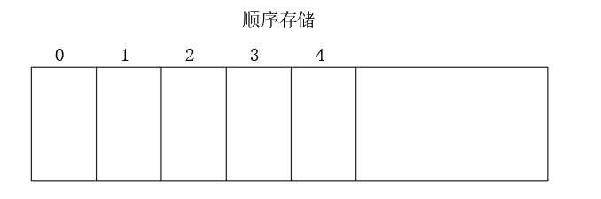

链式存储有单向链表，双向链表，循环链表，用一组任意地址存储单元存储各个元素。

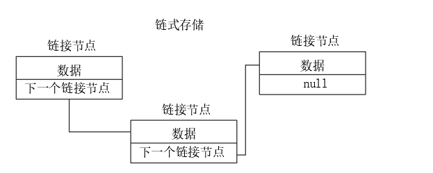

:bookmark:用代码实现单项链式存储：

```c#
using System;
//using System.Collections.Generic;
using System.Linq;
using System.Text;
using System.Threading.Tasks;

namespace study
{
    /// <summary>
    /// 节点类
    /// </summary>
    /// <typeparam name="T">值</typeparam>
    public class LinkNode<T>
    {
        public T value;
        public LinkNode<T> NextNode;
        public LinkNode( T value)
        {
            this.value = value;
        }
    }

    public class LinkList<T>
    {
        /// <summary>
        /// 头部
        /// </summary>
        public LinkNode<T> First;
        /// <summary>
        /// 尾部
        /// </summary>
        public LinkNode<T> Last;

        /// <summary>
        /// 添加节点
        /// </summary>
        /// <param name="item">节点的值</param>
        public void Add(T item)
        {
            LinkNode<T> note = new LinkNode<T>(item);
            if (First == null)
            {
                //不存在节点
                First = note;
                Last = note;
            }
            else
            {
                Last.NextNode = note;
                //重定向
                Last = note;
            }
        }

        public void Remove(T item)
        {
            //头节点为空，没有数据，直接返回
            if (First == null)return;
            //头部节点匹配到数据
            else if(First.value.Equals(item))
            {    
                if(First.NextNode == null)
                {
                    //只有一个节点
                    First = null;
                    Last = null;
                }
                else//存在两个或以上的节点
                {
                    //去除头节点
                    First = First.NextNode;
                }
            }
            //其余节点匹配到数据
            else
            {
                LinkNode<T> node = First;
                while (node.NextNode != null)
                {
                    if (node.NextNode.value.Equals(item))
                    {
                        //匹配成功
                        node.NextNode = node.NextNode.NextNode;
                        //重置尾部节点
                        if (node.NextNode == null)
                        {
                            Last = node;
                        }
                    }
                    else node = node.NextNode;//不匹配移动指针
                }
            }
        }
    }
}

```

:bookmark:双向链式存储：

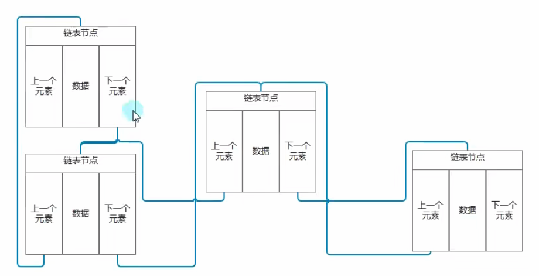

```c#
using System;
using System.Collections.Generic;
using System.Linq;
using System.Text;
using System.Threading.Tasks;

namespace study
{
    /// <summary>
    /// 链表节点
    /// </summary>
    /// <typeparam name="T"></typeparam>
    public class DoubleLinkNode<T>
    {
        /// <summary>
        /// 链表节点中存储的数据
        /// </summary>
        public T Value { get; set; }
        public DoubleLinkNode(T value) 
        {
            Value = value;
        }
        /// <summary>
        /// 下一个节点，默认为Null
        /// </summary>
        public DoubleLinkNode<T> NextNode { get; set; }

        /// <summary>
        /// 上一个节点，默认为Null
        /// </summary>
        public DoubleLinkNode<T> PreNode { get; set; }
    }

    public class DoubleLinkList<T>
    {
        /// <summary>
        /// 计数器
        /// </summary>
        private int count;

        /// <summary>
        /// 记录节点
        /// </summary>
        public int Count
        {
            get { return count; }
        }

        private DoubleLinkNode<T> firstNode;
        /// <summary>
        /// 第一个节点
        /// </summary>
        public DoubleLinkNode<T> FirstNode
        {
            get { return firstNode; }
        }

        private DoubleLinkNode<T> lastNode;
        /// <summary>
        /// 最后一个节点
        /// </summary>
        public DoubleLinkNode<T> LastNode
        {
            get { return lastNode; }
        }

        /// <summary>
        /// 添加节点
        /// </summary>
        /// <param name="value">数据</param>
        public void Add(T value)
        {
           DoubleLinkNode<T> node = new DoubleLinkNode<T>(value);
            //如果首个节点为空，则链表中没有节点
            if(FirstNode == null)
            {
                firstNode = node;
                lastNode  = node;
            }
            else
            {
               lastNode.NextNode = node;
                node.PreNode = lastNode;
                //重置尾节点
                lastNode = node;
            }
            count++;
        }
        /// <summary>
        /// 移除节点
        /// </summary>
        /// <param name="index">索引</param>
        public void Remove(int index)
        {
            //判断索引是否越界
            if(index >= Count || index < 0)
            {
                Console.WriteLine("索引越界");
                return;
            }
            else if(FirstNode == null)
            {
                Console.WriteLine("没有数据可删除");
                return;
            }
            else 
            {
                DoubleLinkNode<T> node = FirstNode;
                int tempIndex = 0;
                while(true)
                {
                    if(tempIndex == index)
                    {
                        //移除头节点
                        if (tempIndex == 0)
                        {
                            firstNode = node.NextNode;
                            //仅有一个节点被移除
                            if (FirstNode == null) lastNode = null;
                            else
                            {
                                //重置上一个节点为null
                                firstNode.PreNode = null;
                            }
                            count--;
                        }
                        else if (tempIndex == Count - 1)//尾节点
                        {
                            lastNode = node.PreNode;
                            //重置下一个节点
                            lastNode.NextNode = null;
                            count--;
                        }
                        else //其余节点
                        {
                            node.PreNode.NextNode = node.NextNode;
                            node.NextNode.PreNode = node.PreNode;
                            count--;
                        }
                        break;
                    }
                    
                    tempIndex++;
                    //进入下一个节点
                    node = node.NextNode;
                }
            }
        }
    }

}

```

> 

### 链表节点常用属性

| 属性                                          | 释义                 |
| --------------------------------------------- | -------------------- |
| `public LinkedListNode<T> Next { get; }`      | 当前节点的下一个节点 |
| `public LinkedListNode<T>? Previous { get; }` | 当前节点的上一个节点 |
| `public T Value { get; set; }`                | 获取节点中包含的值。 |

### 链表的常用属性与方法

:book:常用方法：

| 签名                                                         | 释义                                                         |
| ------------------------------------------------------------ | ------------------------------------------------------------ |
| `public LinkedListNode<T> AddLast (T value)`                 | 向尾部添加一个链表节点，`value`代表其值                      |
| `publicLinkedListNode<T> AddFirst (T value);`                | 向头部添加一个链表节点，`value`代表其值                      |
| `public LinkedListNode<T> AddAfter (LinkedListNode<T> node, T value)` | 向指定节点后面添加新节点                                     |
| `public LinkedListNode<T> AddBefore (LinkedListNode<T> node, T value)` | 向指定节点前面添加新节点                                     |
| `public void RemoveFirst ()`                                 | 移除头部节点,头部节点为空报错                                |
| `public void RemoveLast ()`                                  | 移除尾部节点，尾部节点为空报错                               |
| `public bool Remove (T value)`                               | 移除指定值的第一个匹配项,`true`移除第一个匹配项,`false`未找到匹配项 |
| `public void Clear ()`                                       | 清空，移除所有节点                                           |
| `public LinkedListNode<T>? Find (T value)`                   | 查找包含指定值的第一个节点，没有找到，返回`null`             |
| `public bool Contains (T value)`                             | 判断链表中是否存在指定值                                     |

:book:常用属性：

| 属性                                                         | 释义   |
| ------------------------------------------------------------ | ------ |
| `publicLinkedListNode<T>? First { get; }`                    | 头节点 |
| `publicLinkedListNode<T>? Last { get; }`                     | 尾节点 |
| 改变链表节点的值：需要先获取链表节点对象，对其`Value`属性赋值。 |        |

```c#
list.First.Value= 0
```

:book: 遍历:

```c#
LinkedList<int> list = new LinkedList<int>();
list.AddLast(1);
list.AddLast(2);
list.AddLast(3);
//使用迭代器进行遍历
foreach (var i in list)
{
    //从头到尾打印
    Console.WriteLine(i);
}
//使用节点从头部到尾部进行遍历
LinkedListNode<int> node = list.First;
while (node != null)
{
    Console.WriteLine(node.Value);
    node = node.Next;
}
//也可以使用节点从尾部到头部进行遍历
```

------

向`LinkedList`中添加`10`个随机整型变量，正序倒序输出其值。

```c#
LinkedList<int> list = new LinkedList<int> ();
Random random = new Random ();
for (int i = 0; i < 10; i++)
{
    int num = random.Next(1, 11);
    //不包含则添加
    if (!list.Contains(num))
    {
        list.AddLast(num);
    }
    else i--;
}

LinkedListNode<int> node = list.Last;
while (node != null)
{
    Console.WriteLine(node.Value);
    node = node.Previous;
}
```

## 泛型栈和队列

```c#
Stack<int> stack = new Stack<int>();
Queue<int> queue = new Queue<int>();
```

方法与非泛型类一致。

各个容器之间的区别：

1. 数组：适合固定不变的场景
2. `List`:适合经常插入，查找
3. `LinkedList`:经常插入，但查找不多的场景
4. `Stack`:先进后出，如多个窗口的显示与隐藏
5. `Queue`：先进先出，消息队列
6. `Dictionary`:经常查找，数据有对应关系。


# 委托、事件与`Lambda`表达式

委托是一个类型安全的类，定义了参数类型和返回类型，可以包含对单个方法的引用，也可以包含对多个方法的引用。

## 委托

一切皆地址。

* 变量(数据)是以某个地址为起点的一段内存中存储的值。
* 函数（算法）是以某个地址为起点的一段内存中存储的一组机器语言指令。

函数的调用：

* 直接调用：通过函数名调用，CPU通过函数名获得函数所在地址并执行。
* 间接调用，通过函数指针来调用，CPU通过函数指针存放的值获得函数地址并执行。

委托_`Delegate`：是一种特殊的类，本质是函数指针的升级版，其对象存放函数的引用地址（可将委托理解为存放函数的容器，用来存储以及传递方法）.通过委托调用方法时，实际是通过存储的引用来执行方法。

:small_red_triangle: 委托管理的方法参数(数量和类型)和返回值需要和委托类型相兼容，与参数名无关。

### 基本使用

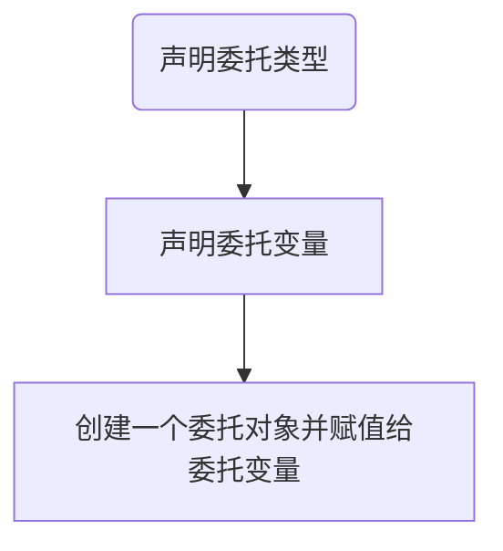


:bookmark:声明委托类型

```c#
访问修饰符 delegate 返回值 委托名(参数列表) 
//可以定义在命名空间和类语句块中，多数声明在命名空间中
```

:bookmark: 委托变量声明与赋值

1. 简单声明

```c#
 // 声明一个可以装载无返回值无参的方法容器
 delegate void MyFun();
 public class Program
 {
     public static void Main(string[] args)
     {
         MyFun fun = new MyFun(TestFun);//传入方法名
         fun.Invoke();//调用内部的方法
         
         //方法与委托之间存在类型转换
         MyFun fu = TestFun;//赋值方法名
         fu();//调用内部的方法
     }
     public static void TestFun() 
     {
         Console.WriteLine("TestFun");
     }
 }
```

把方法名赋值给委托变量，称为委托推断，内部依旧是执行构造函数创建委托实例。

2. 使用随机数声明

```c#
 // 声明一个可以装载无返回值有参的方法容器
delegate void MyFun(string value);
public class Program
{
    public static void Main(string[] args)
    {
        //初始化Program
        Program p = new Program();
        Random rnd = new Random();
        int num = rnd.Next(1, 101);
        //声明委托对象，通过随机数选择装载的方法
        MyFun fun = num >= 50 ? new MyFun(p.PrintHigh) : new MyFun(p.PrintLow);
        fun(num.ToString());
    }
    public void PrintLow(string text)
    {
        Console.WriteLine($"Low-----{text}");
    }

    public void PrintHigh(string text)
    {
        Console.WriteLine($"High-----{text}");
    }
```

创建委托对象还可以通过 ` MyFun fun = num >= 50 ? p.PrintHigh : p.PrintLow; `方式创建，方法和委托类型之间存在隐式类型转换。

:bookmark: 在类内部定义委托（内部类）：

```c#
  public class Program
 {
     static void Main()
     {
         Butoon butoon = new Butoon();
         //butoon.del = butoon.Show;另一种初始化方式
         butoon.del = new Butoon.ButoonDelegate(butoon.Show);
         butoon.Click(); ;
     }
 }

 public class Butoon
 {
     //委托但内部类，通过类名.子类名访问
     public delegate void ButoonDelegate();
     //委托作为成员
     public ButoonDelegate del;
     public void Show()
     {
         Console.WriteLine("Game Start");
     }

     public void Click()
     {
         //使用空值运算符调用
         del?.Invoke();
     }
 }
```

:bookmark:委托作为类成员以及函数的参数

```c#
public delegate void MyFun(int a,int b);
public class Program
{
    //作为类成员
    public MyFun fun;
    public static void Main(string[] args)
    {
        Run(Add);
    }
    public static void Add(int a,int b)
    {
        Console.WriteLine(a+b);
    }
    //函数参数
    public static void Run(MyFun fun)
    {
        //逻辑处理,如计算两个不确定的数
        int a = 2;int b = 2;
        //延迟执行
        fun?.Invoke(a, b);
    }
}
```

:bookmark:自定义泛型委托类型

```c#
public delegate void MyFunc<T>(ref T value); 
```

### 多播委托

当一个委托由多个委托对象通过`+`运算符或`+=`运算符创建，则会生成一个全新的委托，其调用列表是子委托的副本组合。

单播委托结构

```
单播委托实例 (MyDelegate) → 实际是 MulticastDelegate 的实例
├── _target → Object Instance (或 null)
├── _methodPtr → &Method
└── _invocationList → null
```

`_target`字段是方法所属的对象实例，`_methodPtr`是方法指针，委托便是这样找到方法地址然后执行的

多播委托结构：会将委托实例存储在`_invocationList`数组中，依次查找每个委托存储的函数指针。

```
多播委托实例 (MyMulticastDelegate)
├── _target → null (在多播情况下通常为 null)
├── _methodPtr → null (在多播情况下通常为 null)
└── _invocationList → Delegate[] (包含实际要调用的委托)
    │
    ├── 元素 0: 单播委托实例 A
    │   ├── _target → Object Instance (或 null)
    │   ├── _methodPtr → &MethodA
    │   └── _invocationList → null
    │
    ├── 元素 1: 单播委托实例 B
    │   ├── _target → Object Instance (或 null)
    │   ├── _methodPtr → &MethodB
    │   └── _invocationList → null
    │
    └── 元素 2: 单播委托实例 C
        ├── _target → Object Instance (或 null)
        ├── _methodPtr → &MethodC
        └── _invocationList → null
```


```c#
/// <summary>
/// 自定义委托类型，无返回值
/// </summary>
/// <param name="a">操作数1</param>
/// <param name="b">操作数2</param>
public delegate void CaculateNum(int a, int b);
public class Program
{
    static void Main()
    {
        CaculateNum delA = new CaculateNum(Add);
        CaculateNum delB = Multiply;
        //运算符已重载，返回新的委托
        CaculateNum delC = delA + delB;
        delC(1,2);
        //依次执行调用列表中的方法
    	//a+b=3
    	//a*b=2
    	//2，返回值为最后一个方法的返回值
    }
    public static void Add(int a,int b)
    {
        Console.WriteLine(a+b);
    }
    public static void Multiply(int a, int b)
    {
        Console.WriteLine(a* b);
    }
}
```

```tex
多播委托实例 (delC)
│
└── 调用列表 (InvocationList - Delegate[] 数组)
     │
     ├── 委托实例 A (delA)
     │    ├── 目标对象 (Target) → 方法所属实例
     │    └── 方法指针 (Method) → 实际方法 (Add)
     │
     └── 委托实例 B (delB)
          ├── 目标对象 (Target) → 方法所属实例
          └── 方法指针 (Method) → 实际方法 (Multiply)
```

:bookmark: 多播委托本质上是一个包含调用列表的委托实例，调用列表中存放的便是子委托。

:red_circle: 带参数委托调用时，其参数默认为值参数。

```c#
//泛型委托
public delegate void CaculateNum<T>(T[] values);
public class Program
{
   static void Main()
	{
    CaculateNum<int> delA = Add;
    CaculateNum<int> delB = Multiply;
    CaculateNum<int> delC = delA + delB;
    int[] arrs = { 1, 2 };
    delC(arrs);//4
	}
    public static void Add(int[] arrs)
    {
        arrs[0] += 1;
        Console.WriteLine($"a+b={arrs[0] + arrs[1]}");
    }
    public static void Mutiplay(int[] arrs)
    {
        Console.WriteLine($"a*b={arrs[0] * arrs[1]}");
    }
}
```

:red_circle: ​调用带引用参数的委托（值类型在某方法内改变，会影响下一个方法）

```c#
public delegate void CaculateNum<T>( ref T a,ref T b);
public static void Main(string[] args)
{
    CaculateNum<int> delA = Add;
	CaculateNum<int> delB = Mutiplay;
	CaculateNum<int> delC = delA + delB;
    int a = 1; int b = 3;
    delC(ref a, ref b);
    //a = 2,b = 4
    //a = 3,b = 5

}
public static void Add( ref int a, ref int b)
{
    a++;
    b++;
    Console.WriteLine($"a = {a},b = {b}");
}
public static void Mutiplay(ref int a, ref int b)
{
    a++;
    b++;
    Console.WriteLine($"a = {a},b = {b}");
}
```

:book:通过`+=`运算符创建委托对象

```c#
public static void Main(string[] args)
{
    CaculateNum delA = Add;
    delA += Mutiplay;//创建一个全新的委托对象
    delA += Add;
}
```

委托对象存在不可变性，使用`+=`运算符实际上是在内存上重新开辟空间，将新对象的引用地址赋给变量。

:book:通过`-=`操作符移除调用列表中的方法（清空直接赋值`null`）。

1. 从调用列表最后开始搜索，移除第一个与方法匹配的实例。
2. 试图删除不存在的方法不会报错,即使委托对象为`null`。
3. 若调用列表为空，则委托对象为null，**调用空委托**会抛出异常。

:book:委托返回值

委托的返回值永远是最后一个方法的返回值，通过` Delegate[] GetInvocationList()`方法可获取当前委托中存放的子委托。

```c#
foreach(CaculateNum item in delA.GetInvocationList()) 
{
    //读取相关返回值
}
```

`foreach`语句会将每一个`Degelate`转换为`CaculateNum`自定义类型。以下为委托中的继承关系：

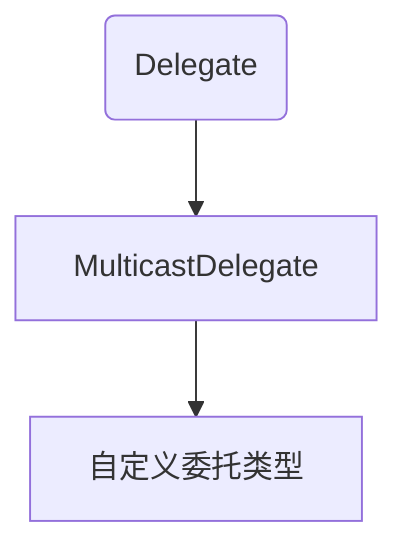

:red_circle:我们自定的委托隐式继承`MulticastDelegate`le类。

### 系统自定义的委托类型

:bookmark:记忆`Action`是无返回值委托，`Func`有返回值委托。

```c#
//无参无返回值委托
public delegate void Action();
//无返回值的泛型委托，共1-16个参数
public delegate void Action<in T1, in T2...>(T1 arg1, T2 arg2...);
//有返回值的泛型委托,0-16个参数
public delegate TResult Func<in T1, in T2,.... out TResult>(T1 arg1, T2 arg2.........);
	Func<string,int....> func = null;//声明
```

------

:bookmark:一家三口，妈妈做饭，饭熟后，一家三口要吃饭，用委托模拟该过程。

```c#
public class Program
{
    static void Main()
    {
        Father father = new Father();
        Son son = new Son();
        Monther m = new Monther(son, father);
    }
}
public abstract class Person
{
    public abstract void EatFood();
}

public class Father : Person
{
    public override void EatFood()
    {
        Console.WriteLine("爸爸吃饭");
    }
}
public class Monther : Person
{
    Action Action;
    public Monther(Person son, Person father)
    {
        Console.WriteLine("妈妈做好了饭");
        Action = this.EatFood;
        Action += son.EatFood;
        Action += father.EatFood;
        Action();
    }
    public override void EatFood()
    {
        Console.WriteLine("妈妈吃饭");
    }
}
public class Son : Person
{
    public override void EatFood()
    {
        Console.WriteLine("儿子吃饭");
    }
}
```

:bookmark:怪物死亡后，玩家金钱加100.

```c#
public class Program
{
    static void Main()
    {
        Monster m = new Monster();
        Player player = new Player();
        m.action = player.Show;
        m.Dead();
    }
}

public class Monster
{
    public int price = 100;
    /// <summary>
    /// 委托类型变量，Monster参数，无返回值
    /// </summary>
    public Action<Monster> action;
    public void Dead()
    {
        Console.WriteLine("怪物死亡");
        if (action != null)
        {
            action.Invoke(this);
            //清除方法列表
            action = null;
        }
    }
}

public class Player
{
    private int money = 100;
    public void Show(Monster m)
    {
        money += m.price;
        Console.WriteLine($"余额{money},增加了{m.price}");
    }
}
```

## 事件

> 一个对象在完成某个工作后或者发生了某种操作后，需要通知其他对象，从而做出反应，发出去的**通知**就是事件。
>
> `C#`事件是基于委托的存在，对委托进行封装，防止外部随意置空委托，防止在外部随意调用委托。

### 模拟事件

声明一个玩家类，释放`AOE`技能时，对范围内的怪物造成伤害，且怪物会有反伤，对玩家造成伤害(怪物伤害-玩家防御)，同时`AOE`技能会有中毒等附加`buff`,用代码实现，要求低耦合。

```c#
/// <summary>
/// 事件参数集合类
/// </summary>
public class EventArguments
{
    public bool dizziness;//眩晕
    public bool poison;//中毒
}
public class Player
{
    /// <summary>
    /// object 事件发出者，EventArguments事件参数类
    /// </summary>
    //事件防止外部调用
    public event Action<object,EventArguments> action;
    public int attack = 10;//攻击
    public int defense = 2;//防御
    public void AOE()
    {
        EventArguments args = new EventArguments();
        args.poison = true;//技能携带中毒buff
        args.dizziness = true;//技能携带眩晕buff
        action?.Invoke(this,args);
    }
}
public class Monster
{
    public int defAttack = 5;
    public void ReduceBoold(Object p, EventArguments args)
    {
        if(p is Player)
        {
            Console.WriteLine($"玩家释放AOE技能，怪兽减血{(p as Player).attack}滴");
            Console.WriteLine($"怪兽有反伤，对玩家造成{defAttack - (p as Player).defense}点伤害");
            if (args.poison) Console.WriteLine("怪兽中毒了");
            if (args.dizziness) Console.WriteLine("怪兽眩晕了");
        }
    }
}
```

### 事件定义

语法：

```c#
访问修饰符 event 委托类型 事件名
```

事件的使用

1. 作为成员变量存在于类，结构体，接口中，不能作为函数中的局部变量
2. 与委托使用方法一致

与委托的区别

1. 不能在类外部使用`=`赋值符号，只能使用`+=`,`-=`
2. 不能在类外部调用
3. `+=`在首次使用时**隐含`new`操作**，后续使用则为追加到调用列表里面。

```c#
public class Program
{
    static void Main()
    {
        MyEvent myEvent = new MyEvent();
        myEvent.action += myEvent.Show;//可使用+=
        //myEvent.action();不能在外部直接调用
    }
}

public class MyEvent
{
    //事件成员变量，用于存储函数引用
    public event Action action;
    public MyEvent()
    {
        action = Show;
        action();//调用事件
    }
    public void Show() { Console.WriteLine("事件执行"); }
}
```

### 事件专用委托

> `public delegate void EventHandler(object sender, EventArgs e);`
>
> 泛型事件委托(重点)：`public delegate void EventHandler<TEventArgs>(object sender, TEventArgs e);`
>

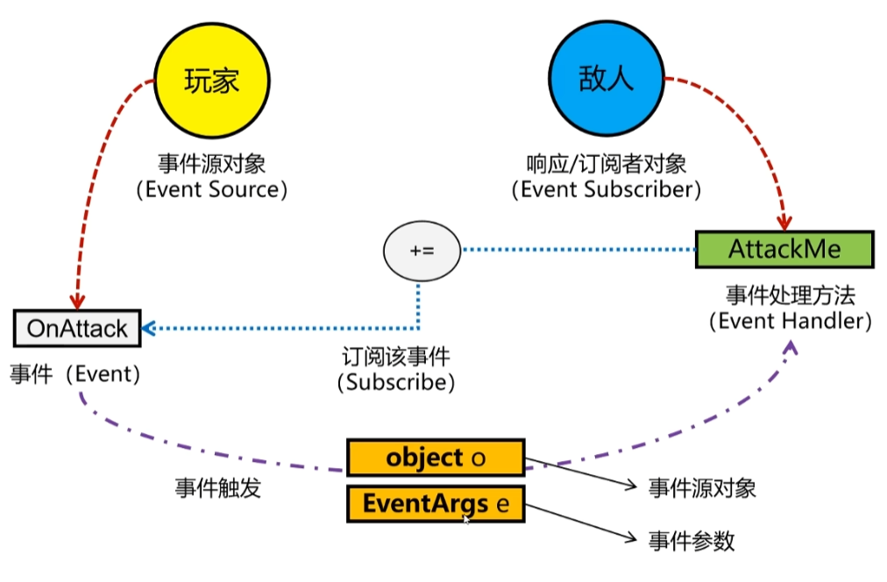

:bookmark:`EventArg`类成员

```c#
public class EventArgs
{
    //静态实例
    public static readonly EventArgs Empty = new EventArgs();
    //构造函数
    public EventArgs()
    {
    }
}
```

:bookmark:使用泛型实现事件：玩家释放`AOE`，怪物减血，中毒，眩晕。

```c#
/// <summary>
/// 事件参数包
/// </summary>
public class MyArgs : EventArgs
{
    //中毒
    public bool poison;
    //眩晕
    public bool dizziness;
}
public class Player
{
    //定义事件
    public event EventHandler<MyArgs> OnAttack;
    public int attack = 5;

    public void AOE()
    {
        MyArgs args = new MyArgs();
        args.poison = true;//技能有中毒buff
        args.dizziness = true;
        //发布事件：传入当前对象，传入事件参数
        OnAttack?.Invoke(this, args);
        //根据条件判断是否直接清空，此处直接清空
        OnAttack = null;//清空
    }
}
public class Monster
{
    public void AttackMe(Object o, MyArgs args)
    {
        if (o is Player)
        {
            Console.WriteLine($"受攻击，减5{(o as Player).attack}滴血");
            if (args.poison) Console.WriteLine("中毒");
            if (args.dizziness) Console.WriteLine("眩晕");
        }
    }
}
```

## 匿名函数

> 没有名字的函数，主要配合委托和事件进行使用，用于传递或存储，脱离委托和事件是不能使用匿名函数。

:bookmark:基本语法：

```c#
//无返回 
delegate (参数列表)
 {
     Console.WriteLine("匿名函数");
 };//因其作为语句存在，要加分号
//有返回值
delegate (参数列表)
 {
     return ....;
 };
```

:bookmark: 声明

```c#
 // 1.无参无返回
 //声明匿名函数，此时还未调用
 Action a = delegate ()
  {
      Console.WriteLine("匿名函数");
  };
 //2.有参无返回
 Action<int> b = delegate (int a) { };
 //3.无参有返回
 Func<int> fun1 = delegate () { return 0; };
 //4.有参有返回
 Func<int, int> fun2 = delegate (int a) { return a; };
```

:bookmark:匿名函数一般作为函数参数传递或函数返回值。

```c#
public class Program
{
    static void Main()
    {
        //作为参数传递
        Show(delegate ()
        { 
            Console.WriteLine("作为参数传递"); 
        });

        Test()();//注意双括弧
    }
    public static void Show(Action a)
    {
        a();
    }

    public static Action Test()
    {
        return delegate () 
        {
            Console.WriteLine("作为返回值");
        };
    }
```

:red_circle:匿名函数添加到委托后无法单独删除。

```c#
static void Main()
{
    Action action = delegate () { Console.WriteLine("匿名一"); };
    action += delegate () { Console.WriteLine("匿名二"); };
    action -= delegate () { Console.WriteLine("匿名二"); };//无效,不是一个引用地址
    action();
}
```

只能置空，但会影响其他子委托。存在多个子委托的情况下不要使用。

------

定义一个含参的函数，并且返回一个函数；调用返回的函数并传入一个参数，返回参数相乘的结果。

```c#
public static Func<int,int> Multiply(int i) 
{
    //通过闭包，延长i的声明周期
    return delegate (int num)
    {
        return num * i;
    };
}
```

## Lambda表达式

> 可以将`Lambda`表示式理解为匿名函数的简写，除了写法和匿名函数不同，使用上一模一样，都是和委托或事件配合使用。

:bookmark:语法

```c#
(参数列表) =>
{
    //函数体
};
```

:bookmark:使用

```c#
 //无参无返回值
Action a = () => 
{
    Console.WriteLine("无参无返回值的lambda表达式");
};
 //有参无返回值
 Action<int> b = (int value) =>
 {
     Console.WriteLine(value);
 };
 //省略参数类型，因为委托已确定参数类型
 b = (value) =>
 {
     Console.WriteLine(value);
 };
 //有返回值有参有返回值
 Func<string, int> c = (value) => 
 {
     return 0;
 };
```

## 闭包

> 内层函数可以引用外层函数中定义的局部变量或参数，即使外层函数的执行已经终止。
>

```c#
public Program()
{
    int value = 10;
    //这里形成了闭包,value被捕获
    //value的声明周期被延长
    OnAction = () =>
    {
        Console.WriteLine(value);
    };
}
event Action OnAction;
static void Main()
{
    Program p = new Program();
    p.OnAction();
}
```

原理解析：

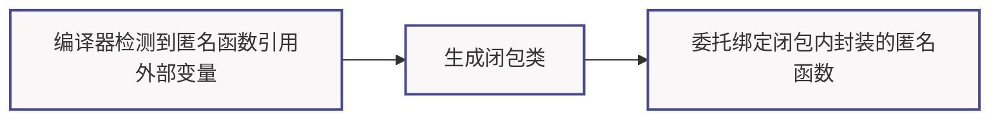

:one::编译器检测到匿名函数引用外部变量

:two::生成闭包类:捕获变量转换为闭包类的字段的（堆分配），匿名函数编译为闭包的实例方法

:three::委托绑定:委托指向闭包类的方法，变量声明周期延长至闭包对象被GC回收

```c#
 //模拟系统生成的闭包类
 public class ClosureClass
 {
     //捕获的变量提升为字段
     int value = 10;
     //封装了一个匿名函数
     public void Func()
     {
         Console.WriteLine(value);
     }
 }
//之后委托绑定到封装的方法上
 ClosureClass closure = new ClosureClass();
 closure.value = 10;//被捕获的变量提升为字段
 OnAction = closure.Func;
```

:red_circle: 闭包的陷阱

```c#
public Program()
{
    //i只声明一次，每次迭代旧值替换新值
    for (int i = 0; i < 10; i++)
    {
        //添加方法，此时尚未执行
        OnAction += () =>
        {
            Console.WriteLine(i);
        };
    }
}
event Action OnAction;
static void Main()
{
    Program p = new Program();
    p.OnAction();//全部为10
}
```

:bookmark:解决方案

```c#
public Program()
 {
     for (int i = 0; i < 10; i++)
     { //每次迭代结束,index变量被提升为闭包类的字段，生命周期延长
         //实际上是生成10个闭包实例，并将其方法添加到委托中
         int index = i;
         ////每个闭包封装的匿名方法引用隐式传递给委托
         OnAction += () =>
         {
             Console.WriteLine(index);
         };
     }
 }
 event Action OnAction;
 static void Main()
 {
     Program p = new Program();
     
     p.OnAction();//1~9
 }
```

:bookmark: 结构体闭包

```c#
static void Main()
{
    int value = 3;
    //定义一个局部函数
    void Func() { Console.WriteLine(value); }
    //直接运行
    Func();
}
```

内部会生成结构体闭包，最终调用的是结构体中的方法。

```c#
// 编译器生成代码（简化）
struct <>c__DisplayClass0_0
{
    public int value;  // 捕获变量存储于结构体字段
    internal void Main$Func() => Console.WriteLine(value);
}

static void Main()
{
    var closure = new <>c__DisplayClass0_0(); // 栈上分配结构体
    closure.value = 3;
    closure.Main$Func();  // 直接调用结构体方法（无委托）
}
```

# 多线程

进程：打开一个应用程序就是在操作系统上开启一个进程，进程之间可以相互独立运行，也可以互相访问。

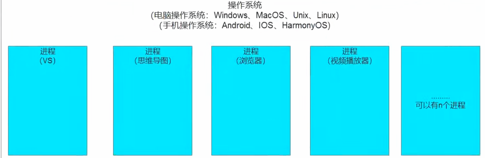

操作系统中的进程：

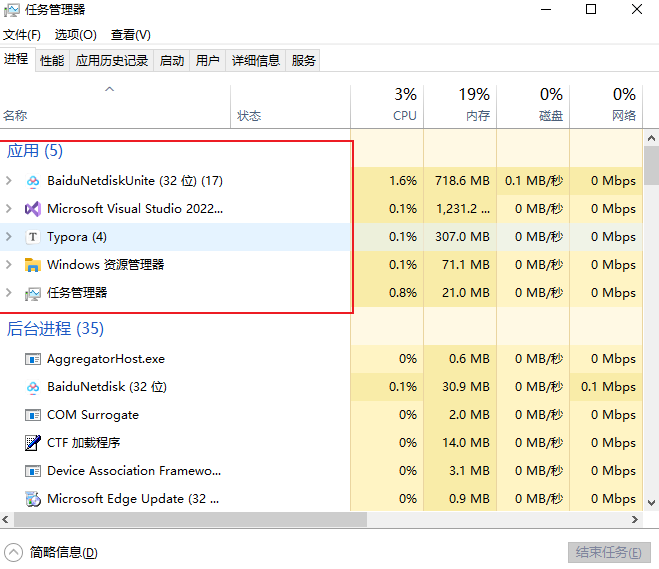

线程是操作系统能够进行运算调度的最小单位，包含在进程之中，是进程的实际运作单位。一条线程指的是进程中一个单一顺序的控制流，一个进程可以并发多个线程。目前写的程序都是在主线程之中。

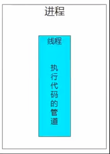

多线程：通过代码开启新的线程，同时运行代码的多条`"管道"`就叫多线程。

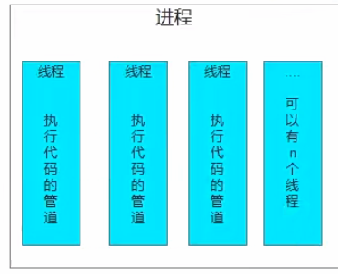

:bookmark:创建线程基本流程

```c#
public class Program
{
    static bool isRun = true;
    static void Main()
    {
        //创建一个线程，需要传入一个委托
        //public delegate void ThreadStart();
        Thread thread = new Thread(Print);
        thread.Start();//启动线程
        //设置为后台线程
        thread.IsBackground = true;
        Console.ReadKey();
        //关闭释放一个线程
        isRun = false;
        thread = null;
    }
    public static void Print() 
    {
        while (isRun) Console.WriteLine("附线程");
    }
}
```

:red_circle:设置为后台线程。

​	当前主线程结束时，整个进程也就结束了，即使还有后台线程在运行；如果不设置为后台线程，可能导致进程无法正常关闭。

:red_circle:关闭释放一个线程。

如果开启的线程不是死循环，是能够结束逻辑，不必可以关闭它；如果是死循环，想要终止这个线程可使用bool标识，或者使用线程提供的方法(注意在`.Net core` 版本中无法终止，会报错)。

```c#
thread.Abort();//关闭线程
```

线程休眠：暂停该线程多少毫秒，在哪个线程中使用，暂停哪个线程

```c#
Thread.Sleep(1000);//1000毫秒
```

:bookmark:`Lock`锁

当我们在多线程中想要访问同样的东西进行逻辑处理时，为了避免不必要的逻辑顺序执行出错，使用`Lock(引用类型对象)`

```c#
public class Program
{
    /// <summary>
    /// 私有只读的lock锁对象，防止外部修改
    /// </summary>
    static readonly object lockObj = new object();
    static void Main()
    {
        //创建一个线程，需要传入一个委托
        //public delegate void ThreadStart();
        Thread thread = new Thread(Print);
        Console.CursorVisible = false;
        thread.Start();//启动线程
        //设置为后台线程
        thread.IsBackground = true;
        while (true)
        {
            lock (lockObj) 
            {
                Console.SetCursorPosition(0, 0);
                Console.ForegroundColor = ConsoleColor.Green;
                Console.Write("★");
            }
        }
    }
    public static void Print() 
    {
        while (true)
        {
            lock (lockObj)
            {
                Console.SetCursorPosition(10, 5);
                Console.ForegroundColor = ConsoleColor.Red;
                Console.Write("★");
            }
        }
    }
}
```

原理：同一时刻只有一个线程持有对象的锁

------

控制台有一个`■`，如贪吃蛇一样自动移动，请开启一个线程来检测输入，控制它的转向。

```c#
public class Program
{
    public static readonly object obj = new object();
    static void Main()
    {
        Console.CursorVisible = false;
        Block b = new Block(10, 5, Dir.Right);
        //声明线程对象
        Thread thread = new Thread(b.Control);
        //启动线程
        thread.Start();

        while (true)
        {
            lock (obj)
            {
                b.Clear();
                b.move();
                b.Draw();
                Thread.Sleep(300);
            }
        }
    }

}

public enum Dir { Right, Left, Top, Bottom }
public class Block
{
    public int x;
    public int y;
    public string icon = "■";
    public Dir dir;
    public Block(int x, int y, Dir dir)
    {
        this.x = x;
        this.y = y;
        this.dir = dir;
    }
    //移动
    public void move()
    {
        switch (dir)
        {
            case Dir.Right:
                x += 2;
                break;
            case Dir.Left:
                x -= 2;
                break;
            case Dir.Top:
                y--;
                break;
            case Dir.Bottom:
                y++;
                break;
        }
    }
    //绘制
    public void Draw()
    {
        Console.SetCursorPosition(x, y);
        Console.Write(icon);
    }
    //清空
    public void Clear()
    {
        Console.SetCursorPosition(x, y);
        Console.Write("  ");
    }

    public void Control()
    {
        while (true)
        {
            if (Console.KeyAvailable)
            {
                //用户不输入，则不进入，否则会导致线程阻塞
                lock (Program.obj)
                {
                    switch (Console.ReadKey(true).Key)
                    {
                        case ConsoleKey.W:
                            dir = Dir.Top;
                            break;
                        case ConsoleKey.S:
                            dir = Dir.Bottom;
                            break;
                        case ConsoleKey.D:
                            dir = Dir.Right;
                            break;
                        case ConsoleKey.A:
                            dir = Dir.Left;
                            break;
                        case ConsoleKey.Enter:
                            return;//立即返回
                    }
                }
            }
        }
    }
}
```

# 预处理器指令

> 编译器是一种翻译程序，用于将源语言程序翻译为目标语言程序。
>
> 源语言程序:某种程序设计语言写成的，比如`C#`,`Java`等语言写的程序。
>
> 目标语言程序：二进制数表示的伪机器代码写的程序。
>
> 预处理指令直到编译器在实际编译之前对信息进行预处理，以`#`开始，注意它不是语句，不以分号结束，目前我们用到的代码折叠块就是预处理器指令。

:bookmark:常见的预处理指令

:one:

```c#
#define 定义一个符号，类似一个没有值的变量
#undef 取消define定义的符号，让其失效
两者都写在脚本文件的最前面，一般配合if指令使用或配合特性
//写在最前面的
#define cad2018
# define cad2014
#undef cad2012//取消定义
using System;
...
```

# `LINQ`

> `LINQ`是一种允许你使用类似`SQL`的语法查询数据源，如集合，方便开发者进行数据查询操作。
>
> 不会对原集合产生结构性影响，仅用于迭代或产生新的集合
>
> `LINQ`查询通常是延迟执行的，只有在迭代结果时才会真正执行查询
>
> 对于需要重复使用的查询结果，可以使用`ToList()`或`ToArray()`强制查询立即执行，将结果物化为一个具体的集合：.

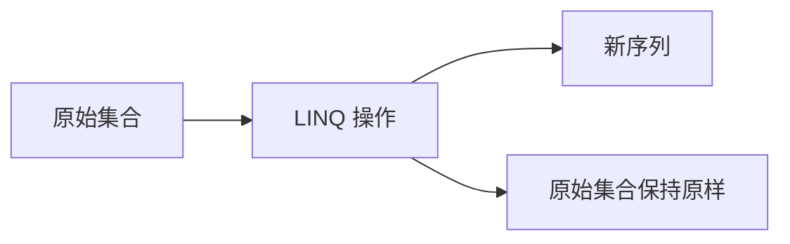


```c#
//示例
List<int> lists = new List<int>() { 1,2,3,45,6,67,81,13,4};
//查询偶数并打印
//使用查询语法
var res = from item in lists
          where item % 2 ==0//筛选条件
          select item;//选择结果
//res是一个迭代器
foreach ( var item in res ) Console.Write(item + " ");
Console.WriteLine("___________________________________");
//使用链式调用
var nums = lists.Where(i => i % 2 == 0);
foreach (var item in nums) Console.WriteLine(item);
```

## 查询表达式

• 查询表达式必须以 `from` 子句开头（指定数据源及范围变量）

• 查询表达式可包含多个 `from` 子句

• 查询表达式必须以 `select` 子句或 `group` 子句结尾

• `where` 关键字后跟布尔表达式,表示条件筛选

• 排序使用 `orderby` 关键字（默认升序 `ascending`，降序用 `descending`）

• 分组使用 `group by`，若需操作分组后元素，需用 `into` 关键字重定义变量

以下为测试用数据源

```c#
public class Program
{
    static void Main()
    {
    }
    public static List<Category> GetCategories()
    {
        List<Category> categories = new List<Category>()
        {
            new Category(){ CategoryId = 1, CategoryName = "服装" },
            new Category(){ CategoryId = 3, CategoryName = "办公" },
            new Category(){ CategoryId = 2, CategoryName = "食品" },
        };
        return categories;
    }
    public static List<Product> GetProducts()
    {
        List<Product> products = new List<Product>()
        {
            new Product(){ProductId =1,ProductName = "雪中飞羽绒服",Price = 998,Storage = 1500,CategoryId = 1},
            new Product(){ProductId =2,ProductName = "安踏运动鞋",Price = 198,Storage = 500,CategoryId = 1},
            new Product(){ProductId =3,ProductName = "361°T恤",Price = 95,Storage = 120,CategoryId = 1},
            new Product(){ProductId =4,ProductName = "旺旺雪饼",Price = 16.5,Storage = 200,CategoryId = 2},
            new Product(){ProductId =5,ProductName = "汇源果汁",Price = 6,Storage = 2000,CategoryId = 2},
            new Product(){ProductId =6,ProductName = "英雄钢笔",Price = 12.5,Storage = 10,CategoryId = 3},
        };
        return products;
    }
}

/// <summary>
/// 商品分类
/// </summary>
public class Category
{
    public int CategoryId { get; set; }

    public string CategoryName { get; set; }
}

public class Product
{
    public int ProductId { get; set; }
    public string ProductName { get; set; }
    /// <summary>
    /// 商品价格
    /// </summary>
    public double Price { get; set; }
    /// <summary>
    /// 库存数量
    /// </summary>
    public int Storage {  get; set; }

    public int CategoryId { get; set; }

}
```

### 基本语法

:one:条件筛选

```c#
static void Main()
{
   List<Product> products  = GetProducts();
   var pro = from product in products//检索数据
             where product.Price>=100//条件过滤，筛选价格>100的
             select product;//保存变量到pro集合中
    foreach (var product in pro) Console.WriteLine($"{product.ProductId}-{product.ProductName}-{product.Price}-{product.Storage}-{product.CategoryId}");
}
```

:two:排序

```c#
List<Product> products  = GetProducts();
var pro = from product in products//检索数据
          orderby product.Price descending//降序
          select product;//保存变量到pro集合中
```

:three:分组

```c#
List<Product> products = GetProducts();
var pro = from product in products
    
          group product by product.CategoryId;
//pro中装的是组的集合
foreach (var item in pro)
{
    Console.WriteLine(item.Key);//key属性是分组的依据
    foreach (var i in item) Console.WriteLine($"  {i.ProductName}");

}
```

:bookmark:**`IGrouping<TKey, TElement>` 类型本质：**

1. 一个公开的、只读的 `TKey Key { get; }` 属性，用于获取分组的分类依据值。
2. 继承自 `IEnumerable<TElement>`，这意味着它内部包含了一个**迭代器**，允许你直接遍历（`foreach`）属于该分组的所有项。

**根据组的数量排序**

> `into作用`：
>
> * 在` LINQ `查询语法中，用于承接前一个查询操作的结果，并引入一个新的范围变量来表示该结果，使得查询可以继续下去
>
> - **Why**：因为 `group` 和 `join` 等子句会完全改变查询结果的“形状”，后续子句需要基于这个新形状操作，必须有一个新变量来代表它;同时也结束了前一个范围变量（如例子中的 `product`）的作用域。

```c#
List<Product> products = GetProducts();
var pro = from product in products
          group product by product.CategoryId into groupData
         //group by 操作实际上将结果存储在 IEnumerable<IGrouping<int, Product>>类型中
         //groupData为IGrouping<int, Product>类型就是为了方便后续直接引用和操作每个分组
          orderby groupData.Count()//根据组的数量进行排序
          select groupData;
```

:four:`select投射`:决定了你的查询最终要输出什么样子或返回什么数据

将名称投影到集合内

```c#
List<Product> products = GetProducts();
var lists = from p in products
            select p.ProductName;
//IEnumerable<string>
```

创建匿名对象

```c#
List<Product> products = GetProducts();
var lists = from p in products
            select new { Name = p.ProductName,p.Price };
//IEnumerable<匿名类型>，Name属性和Price属性
```

LINQ操作符执行行为汇总表

| 特性       | 流式操作符 (Streaming / Lazy)                               | 阻塞式操作符 (Blocking / Greedy)                             |
| :--------- | :---------------------------------------------------------- | :----------------------------------------------------------- |
| 特点       | 处理一个，输出一个                                          | 必须处理完整个输入序列，才能输出第一个结果。                 |
| 执行时机   | 在迭代过程中**逐个元素**执行。                              | 在迭代开始时**整体**执行，将结果存入内存缓冲区。             |
| 内存使用   | 内存效率高，通常只缓存当前元素。                            | 内存效率较低，需要将整个操作结果或中间集合加载到内存。       |
| 常见操作符 | `Select`, `Where`, `Take`, `Skip`, `TakeWhile`, `SkipWhile` | `OrderBy`, `OrderByDescending`, `GroupBy`, `Join`, `GroupJoin`, `Distinct`, `ToLookup` |
| 示例       | `source.Where(x => x > 5).Select(x => x * 2)`               | `source.OrderBy(x => x.Name).GroupBy(x => x.Category)`       |


操作符组合执行规则表

| 组合顺序      | 执行规则                                                     | 示例                                                         |
| :------------ | :----------------------------------------------------------- | :----------------------------------------------------------- |
| 流式 → 流式   | **管道式处理**：数据像在管道中流动一样，逐个元素地经过每个操作符。 | `items.Where(i => i.IsValid).Select(i => i.Value).Take(10)`  |
| 流式 → 阻塞式 | **收集后处理**：前面的流式操作符会先流式处理完**所有**元素，将结果收集到一个中间集合中，然后阻塞式操作符再对这个集合进行操作。 | `items.Where(i => i.IsValid).OrderBy(i => i.Price)` *(1) `Where`收集所有有效项 → (2) `OrderBy`对收集结果排序)* |
| 阻塞式 → 任意 | **完全阻塞**：**必须等待**前面的阻塞式操作符完全执行完毕，将结果完整放入内存缓冲区后，下一个操作符才能开始工作。 | `items.OrderBy(i => i.Price).Select(i => i.Name)` *(1) 全部排序 → (2) 从排序好的缓冲区逐个Select)* |

### `let`

> `let`用户定义临时变量，某些情况下编译器会对其进行优化,创建临时对象

```c#
 var products = from pro in GetProducts()
               let num = pro.Price * pro.Storage
               orderby num
               select new { pro.ProductName, Num = num };
foreach (var item in products)
{
    Console.WriteLine($"{item.ProductName}--{item.Num}");
}
```

内部执行（编译器优化的结果）

```c#
var products = GetProducts()
    .Select(pro => new { pro, num = pro.Price * pro.Storage }) // 中间投影，创建临时对象
    .OrderBy(temp => temp.num)
    .Select(temp => new { temp.pro.ProductName, Num = temp.num });

```


### `多个from子句`

当使用多个 `from` 子句且没有明确的关联条件时，:small_red_triangle: `LINQ `会执行嵌套循环，第一个集合中的每个元素都要与第二个集合中的每个元素进行匹配,可能存在性能问题。)


多个`from`子句适合处理单一的嵌套集合。

## 方法语法

:one:`where`从数据源中过滤数据

```c#
List<Product> products = GetProducts();
var data = products.Where(pro => pro.Storage >= 500);//从商品类中过滤库存>=500的商品
foreach (var item in data)
{
    Console.WriteLine($"{item.ProductName}-库存{item.Storage}");
}
```

:two:`Count`:返回集合中元素的个数

| 签名                                                         | 释义               |
| ------------------------------------------------------------ | ------------------ |
| `public static int Count<TSource> (this IEnumerable<TSource> source);` | 集合中元素的个数   |
| `public static int Count<TSource> (this IEnumerable<TSource> source, Func<TSource,bool> predicate);` | 满足条件的元素个数 |

```c#
static void Main()
{
    List<Product> products = GetProducts();
    var count = products.Count(pro => pro.Price >= 500);//价格大于500
    Console.WriteLine(count);
}
```

:three:`Select`从目标元素中提取属性或匿名类到一个集合中

:four:`OrderBy`升序排序

:five:`OrderByDescending`降序排序

```c#
static void Main()
{
    List<Product> products = GetProducts();
    var pros = products.Select(item => new { item.ProductName, 			          item.ProductId,item.Price}).OrderByDescending(a => a.ProductId);
    foreach (var product in pros) Console.WriteLine($"名称-{product.ProductName},
                                                    ID-{product.ProductId},价格-{product.Price}");
}
```

:six:`First`与`Last`

| 签名                                                         | 释义                                             |
| ------------------------------------------------------------ | ------------------------------------------------ |
| `public static TSource First<TSource> (this IEnumerable<TSource> source);` | 返回集合的第一个元素                             |
| `public static TSource First<TSource> (this IEnumerable<TSource> source, Func<TSource,bool> predicate);` | 返回集合中第一个满足条件的元素，找不到报错       |
| `public static TSource FirstOrDefault<TSource> (this IEnumerable<TSource> source, Func<TSource,bool> predicate);` | 返回集合中第一个满足条件的元素，找不到返回默认值 |
| `Last`与之一致，此处不做解释。                               |                                                  |

```c#
static void Main()
{
    List<Product> products = GetProducts();
    var pro = products.First(item => item.Price >100);
    Console.WriteLine(pro.ProductName);
}
```

:six:`Range`:生成指定长度的连续整数序列

```c#
public static IEnumerable<int> Range (int start, int count);
```

```c#
public class Student
{
    public Student(int id, int score)
    {
        this.id = id;
        this.score = score;
    }
    public int id;
    public int score;
}
static void Main()
    {
       Random r = new Random();
	   var a = Enumerable.Range(1, 600).Select(ele => new Student(ele, r.Next(1, 101)))
               .Where(ele => ele.score >= 95).OrderByDescending(ele => ele.score).Take(3);//前3
       foreach (var i in a) Console.WriteLine($"{i.id}-{i.score}");
    }
```


# 迭代器

> 迭代器（又称光标）是提供顺序访问聚合对象元素的软件设计模式，无需暴露内部实现细节,为容器对象（如链表/数组）提供统一遍历接口，使用者无需关心内存分配等底层实现,所有能用foreach遍历的类都必须实现迭代器模式。

## 标准迭代器

核心接口：

1. IEnumerator：定义遍历所需方法以及成员（MoveNext/Reset/Current）

2. IEnumerable：声明获取迭代器的方法（GetEnumerator），只要实现该方法，也可以不继承该接口。

`foreach`原理：

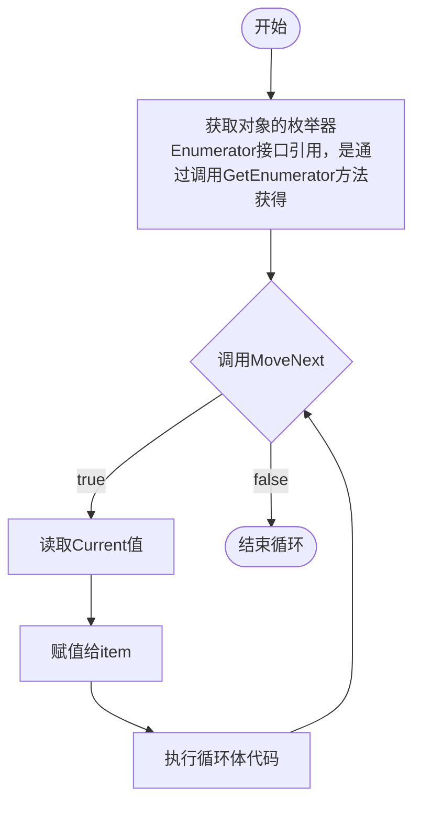

```c#
public class MyList:IEnumerable,IEnumerator
{
    int[] list;
    //光标从-1开始
    private int position = -1;
    public MyList()
    {
        list = new int[10] { 2,3,4,5,65,6,76,7,87,8};
    }
    /// <summary>
    /// 当前光标对应的值,Object
    /// </summary>
    public object Current 
    {
        get { return list[position]; }
    }

    public IEnumerator GetEnumerator()
    {
        Reset();//重置光标
        return this;
    }

    public bool MoveNext()
    {
        //移动光标
        position++;
        //判断是否溢出，溢出就结束
        return position < list.Length;
    }

    public void Reset()
    {
        position = -1;
    }
}
```

## yield return

> 实现了 `IEnumerable` 或 `IEnumerable<T>` 接口都可以进行迭代。

```c#
public class MyList : IEnumerable
{
    int[] list;
    public MyList()
    {
        list = new int[10] { 2, 3, 4, 5, 65, 6, 76, 7, 87, 8 };
    }
    /// <summary>
    /// 当前光标对应的值
    /// </summary>

    public IEnumerator GetEnumerator()
    {
        for (int i = 0; i < list.Length; i++)
        {
            //语法糖，编译后还是会生成MoveNext,Current等方法。
            yield return list[i];
        }
    }
}

//泛型
public class MyList<T> : IEnumerable
{
    T[] list;
    public MyList(T[] arr)
    {
        list = arr;
    }
    /// <summary>
    /// 当前光标对应的值
    /// </summary>

    public IEnumerator GetEnumerator()
    {
        for (int i = 0; i < list.Length; i++)
        {
            //语法糖，编译后还是会生成MoveNext,Current等方法。
            yield return list[i];
        }
    }
}
```

# 反射

:bookmark:程序集

程序集是由编译器编译得到的，供进一步编译执行的哪个中间产物。在`windows`系统中，一般表现为后缀`.dll`库文件或`.exe`可执行文件的格式。

程序集就是我们写的一个代码集合，我们现在写的代码最终会被编译器翻译为一个程序集共别人使用，比如一个代码库文件或者一个可执行文件。

:bookmark:元数据

有关程序以及类型的数据叫做元数据，比如程序集中的类，类中的函数，字段都属于元数据。

:bookmark:反射

程序运行时查看自身或其他程序集元数据的行为称为反射。

- 操作范围：通过反射可以获取程序集代码的各种信息（类、函数、变量等），并能实例化、执行和操作这些对象。

- 实时性：反射发生在程序运行时而非编译时，这是其动态特性的关键。

  反射的作用：在程序编译后仍能获得信息，提高程序灵活性。

- 运行时获取所有元数据及其特性
- 运行时实例化并操作对象
- 运行时创建新对象并执行任务

## Type类

> `Type`是类的信息类，通过Type成员可以获取类型声明的信息，包括构造函数、方法、字段、属性和类的事件等

:one:获取`Type`

```c#
 int a = 2;
 //使用object中的GetType方法获得类型
 Type type = a.GetType();//System.Int32 命名空间+类名
 //通过typeof关键字传入类型，获得类型
 Type type1 = typeof(RTest);//study.RTest 命名空间+类名
 //通过Type的GetType方法，传入类名获得Type，注意必须包含命名空间，否则找不到
 Type type2 = Type.GetType("study.Bag");//study.Bag
```

注意每个类型的Type只有一份信息，不管怎么获得，都指向同一个堆地址。

:two:得到类的程序集信息

```c#
Console.WriteLine(type.Assembly);//mscorlib, Version=4.0.0.0, Culture=neutral
```

:three:获取类中的所有公共成员

```c#
Type type = typeof(RTest);
 //获取所有公共类型信息
 MemberInfo[] members = type.GetMembers();
 foreach (var item in members)
 {
     Console.WriteLine(item);
 }
```

:four:获取所有的公共构造函数并调用

获取某个构造函数需要传入`Type`数组，数组内容按顺序是参数类型,无参传入空数组`new Type[0]`

执行构造函数传入`object`数组，数组内容按顺序是传入的参数，无参传入`null`

```c#
Type type = typeof(RTest);
//获取所有公共构造函数信息
ConstructorInfo[] constructor = type.GetConstructors();
foreach (var item in constructor)
{
    Console.WriteLine(item);
}
//获取无参构造函数信息
ConstructorInfo ctor = type.GetConstructor(new Type[0]);
//执行无参构造
RTest obj = info.Invoke(null) as RTest;//里氏转换
Console.WriteLine(obj.num);//读取成员变量
//获取有参构造函数信息
ctor = type.GetConstructor(new Type[] { typeof(int)});
ctor.Invoke(new object[] { 45});//执行构造函数，未接收返回值
```

:five:获取公共成员变量

```c#
//获取所有公共成员变量信息
Type type = typeof(RTest);
FieldInfo[] infos = type.GetFields();//反射成员信息集合
foreach (FieldInfo info in infos) Console.WriteLine(info);
```

获取或设置对象的某个变量成员的值。

```c#
FieldInfo info = type.GetField("num");//获取num成员信息
RTest rTest = new RTest();
//同过反射获取num的成员值
Console.WriteLine(info.GetValue(rTest));//0
//通过反射设置num的成员值
info.SetValue(rTest, 200);
Console.WriteLine(info.GetValue(rTest));//200
```

:six:获取类的公共成员方法

```c#
//获取string类信息
Type type = typeof(string);
//string类型所有的方法信息
MethodInfo[] infos = type.GetMethods();
foreach (MethodInfo info in infos) Console.WriteLine(info);

//string类型substring信息,第一个参数方法名称，若重载需要指定参数类型
MethodInfo info = type.GetMethod("Substring",new Type[] { typeof(int),typeof(int)});
string str = "艳艳随波千万里";
//执行方法，第一个相当于指定对象调用substring方法
string s = info.Invoke(str, new object[] {1,3 }) as string;
Console.WriteLine(s);
```

若是静态方法，第一个参数传入`null`即可。

## Assembly与Activator

> `Activator`用于快速实例化对象的类

```c#
Type type = typeof(RTest);
//无参构造
RTest t = Activator.CreateInstance(type) as RTest;
Console.WriteLine(t.num);
//有参参数：类的反射信息,构造参数需要的参数
RTest test = Activator.CreateInstance(type,10) as RTest;
```

:bookmark:`Assembly`

程序集类，主要用来加载其他程序集，加载后才能使用`Type`来使用其他程序集中的信息，如果不使用自己程序集中的内容，首先加载程序集（如dll文件，可以把库文件堪称一种代码仓库，它提供给使用者一些可以直接拿来用的变量，函数或类）

两种加载方式

```c#
Assembly ase = Assembly.Load("程序集名称")//加载同一文件下的其他程序集
Assembly ase = Assembly.LoadFrom("完整路径")//加载不同文件下的其他程序集
```


# 排序

## List排序

### Sort

```c#
public void Sort ();//升序排列
    List<int> lis = new List<int>();
    lis.Add(1);
    lis.Add(5);
    lis.Add(3);
    lis.Add(2);
    foreach (int i in lis) Console.WriteLine(i);
    //1532
    lis.Sort();
    //1235
    foreach (int i in lis) Console.WriteLine(i);
}
```

### 自定义类排序

> 使用`public void Sort(IComparer<T> comparer)`方法进行比较时，会先将集合内的元素转换为`IComparable`引用，再调用`CompareTo`方法，该方法定义了当前对象与传入对象的位置关系。

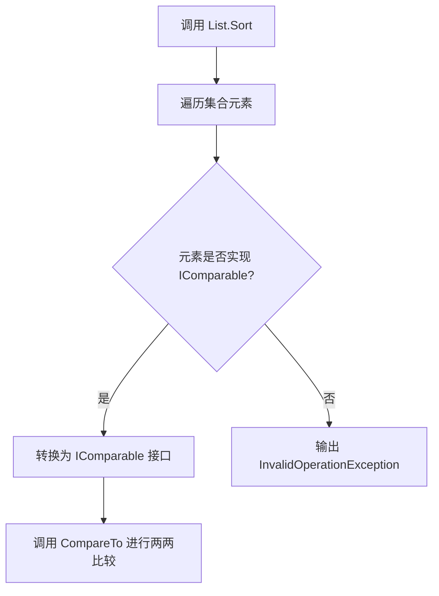


内部实现复杂，但最终实现的效果等同于多轮筛选，符合用户定义的排序规则。

```c#
public class Program
{
    static void Main()
    {
        List<BagId> bags = new List<BagId>();
        bags.Add(new BagId(20));
        bags.Add(new BagId(10));
        bags.Add(new BagId(50));
        bags.Add(new BagId(2));
        bags.Add(new BagId(20));
        bags.Sort();
        foreach (BagId bagId in bags) Console.WriteLine(bagId.id);
    }
}

public class BagId :IComparable<BagId>
{
    public BagId( int id)
    {
        this.id = id;
    }
    public int id;

    public int CompareTo(BagId other)
    {
        //两个值去比较，>0,排后
        //<0，排前
        // =0，不交换位置
        if(id < other.id) return -1;
		else if(id == other.id) return 0;
		else return 1;
    }
}
```

### 使用委托排序

```c#
public void Sort(Comparison<T> comparison)
    //传入一个方法
public delegate int Comparison<in T>(T x, T y)//委托类型
//返回值含义：x>y,返回值要>0;x<y,返回值要<0;相等返回0
```

```c#
public class Program
{
    static void Main()
    {
       List<ShopItem> list = new List<ShopItem>();
        list.Add(new ShopItem(20));
        list.Add(new ShopItem(15));
        list.Add(new ShopItem(10));
        list.Add(new ShopItem(30));
        list.Add(new ShopItem(25));
        list.Add(new ShopItem(20));
        list.Sort((a, b) =>
        {
            //倒序
            if (a.id > b.id) return -1;
            else if (a.id < b.id) return 1;
            else return 0;
        });
        foreach (ShopItem item in list) Console.WriteLine(item.id);
    }
   
}
public class ShopItem
{
    public int id;
    public ShopItem(int id)
    {
        this.id = id;
    }
}
```

------

:one: 写一个怪物类，创建10个怪物添加到`List`中，根据用户输入的数字进行排序：

* 1.攻击排序
* 2.防御排序
* 3.血量排序
* 4.反转

```c#
public class Program
{
    static void Main()
    {
        List<Monster> monsters = new List<Monster>();
        Random random = new Random();
        for (int i = 0; i < 10; i++)
        {
            //使用随机数创建10个对象
            monsters.Add(new Monster(random.Next(1, 101), random.Next(1, 101), random.Next(1, 101)));
        }
        Console.WriteLine("请输入数字进行排序");
        Console.WriteLine("1.攻击排序");
        Console.WriteLine("2.防御排序");
        Console.WriteLine("3.血量排序");
        Console.WriteLine("4.反转");
        switch(Console.ReadLine().ToString())
        {
            case "1":
                monsters.Sort((a,b) => { return a.attack > b.attack ? 1 : -1; });
            break;
            case "2":
                monsters.Sort((a, b) => { return a.defense > b.defense ? 1 : -1; });
                break;
            case "3":
                monsters.Sort((a, b) => { return a.blood > b.blood ? 1 : -1; });
                break;
            case "4":
                monsters.Reverse(); break;
            default:
                Console.WriteLine("无此字符");
                break;
        }
        foreach (Monster monster in monsters) Console.WriteLine($"攻击力:{monster.attack},防御力:{monster.defense},血量：{monster.blood}");
    }

}
//怪物类
public class Monster
{
    public Monster(int atk, int def, int blood)
    {
        this.attack = atk;
        this.defense = def;
        this.blood = blood;
    }
    /// <summary>
    /// 攻击力
    /// </summary>
    public int attack;
    /// <summary>
    /// 防御力
    /// </summary>
    public int defense;
    /// <summary>
    /// 血量
    /// </summary>
    public int blood;
}
```

:two:多条件排序：写一个物品类(类型，名称，品质)，创建10个物品，添加到`list`中，同时使用类型，品质，名称长度进行比较，排序的权重时：类型>品质>名字长度。

```c#
 public class Program
 {
     static void Main()
     {
         List<Goods> goods = new List<Goods>();
         Random r= new Random();
         for(int i = 0; i < 10; i++)
         {
             goods.Add(new Goods(r.Next(1, 6), r.Next(1, 6), "good"+r.Next(1, 201)));
         }
         goods.Sort((a,b)=>
         {
             //多条件排序
             //第一优先级
             if(a.id != b.id)
             {
                 return a.id > b.id ? -1 : 1;
             }
             //第二优先级
             else if(a.quality != b.quality)
             {
                 return a.quality>b.quality ? -1 : 1;
             }
             else
             {
                 return a.name.Length > b.name.Length ? -1 : 1;
             }
         }
         );
         foreach(Goods good in goods) Console.WriteLine(good);
     }

 }

 public class Goods
 {
     public int id;
     public int quality;
     public string name;
     public Goods(int id,int quality,string name)
     {
         this.id = id;
         this.quality = quality;
         this.name = name;
     }
     public override string ToString()
     {
         return $"物品编号{id},物品品质{quality}★，物品名称{name}";
     }
 }
```

:three:迭代字典：学完迭代器再来写。


