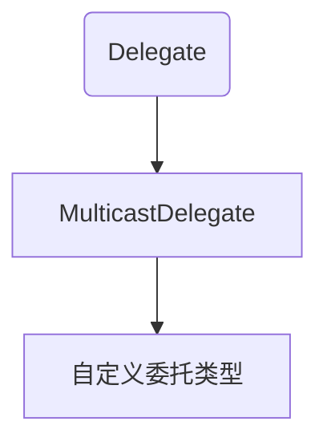

# 泛型

使用占位符如`T`来代表某种类型，编译器在编译期间使用特化类型替代类型占位符。通过泛型，可以在同一份代码上操作多种类型。

泛型可以修饰类，方法，委托等。

:one: 修饰类

```c#
internal class Store<T>
{
    //同于存储
    private T[] arrs = new T[100];

    public void Put(int index, T value) 
    {
        arrs[index] = value;
    }
}
//Main函数中调用
public static void Main(string[] args)
{
    //泛型的特化
    Store<string> store = new Store<string>();
    store.Put(0, "zero");
}
```

:two: 修饰方法

```c
```

# 委托

委托_`Delegate`：是一种引用类型变量，可以看作包含有序的方法列表对象。委托管理的方法签名需要和委托一致。

```c#
 //委托类型
 delegate void MyDel(string vlaue);
 public class Program
 {
     private void PrintLow(string value) 
     {
         Console.WriteLine($"Low-{value}");
     }

     private void PrintHeight(string value)
     {
         Console.WriteLine($"Height_{value}");
     }
     public static void Main(string[] args)
     {
         Program program = new Program();
         //随机数对象
         Random random = new Random();
         int num = random.Next(99);
         //初始化委托对象，用来管理方法
         MyDel del = num>50 ? new MyDel(program.PrintHeight):new MyDel(program.PrintLow);
         del(num.ToString());
     }
 }
```

创建委托对象还可以通过 `MyDel del =program.PrintHeight `方式创建，方法和委托类型之间存在类型转换。

在类内部定义委托：

```c#
 class Button
 {
     //声明委托类型
     public delegate void ButtonClick();
     //声明委托类型的变量
     public ButtonClick but = null;

     public void Click() 
     {
         //调用委托管理的方法
        but?.Invoke();//空值运算符
     }

     public void GameStart() 
     {
         Console.WriteLine("游戏开始");
     }
 }
 public class Program
 {
     public static void Main(string[] args)
     {
         Button button = new Button();
         //初始化委托变量，并添加一个方法
         button.but = new Button.ButtonClick(button.GameStart);
         button.Click();//执行委托方法
     }
 }
```

## 多播委托

当一个委托由多个委托对象通过`+`运算符或`+=`运算符创建，则会生成一个全新的委托，其调用列表是`=`右边委托的调用列表的副本组合。

```c#
//定义委托类型
public delegate int CaculateNum(int a,int b);
public static void Main(string[] args)
{
    CaculateNum delA = Add;
    CaculateNum delB = Mutiplay;
    CaculateNum delC = delA + delB;
    Console.WriteLine(delC(1,2));
    //依次执行调用列表中的方法
    //a+b=3
    //a*b=2
    //2，返回值为最后一个方法的返回值
}

public static int Add(int a,int b)
{
    Console.WriteLine($"a+b={a+b}");
    return a + b;
}
public static int Mutiplay(int a,int b)
{
    Console.WriteLine($"a*b={a * b}");
    return a * b;
}
```

:book:通过`+=`运算符创建委托对象

```c#
public static void Main(string[] args)
{
    CaculateNum delA = Add;
    delA += Mutiplay;//创建一个全新的委托对象
    delA += Add;
}
```

委托对象存在不可变性，使用`+=`运算符实际上是在内存上重新开辟空间，将新对象的引用地址赋给变量。

:book:通过`-=`操作符移除调用列表中的方法。

1. 从调用列表最后开始搜索，移除第一个与方法匹配的实例。
2. 调用空委托会抛出异常，若调用列表为空，则委托对象为null。

:book:委托返回值

委托的返回值永远是最后一个方法，通过` Delegate[] GetInvocationList()`方法可获取当前委托中存放的子委托。

```c#
foreach(CaculateNum item in delA.GetInvocationList()) 
{
    //读取相关返回值
}
```

`foreach`语句会将每一个`Degelate`转换为`CaculateNum`类型。以下为委托中的继承关系：



